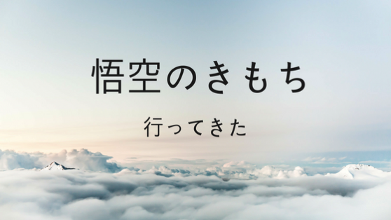

---
categories:
- ブログ
date: Mon, 17 Jul 2017 12:00:00 +0000
slug: post-10854
tags:
- 悟空のきもち
title: 予約とれたので悟空のきもち行ってきたけどぼくの求めたそれとは違ってた
---

先日奇跡的に予約がとれていってきました「<strong>悟空のきもち</strong>」　巷で超話題の頭専門の揉みほぐしリラクゼーション店です。一年以上前から毎月予約を取ろうと頑張ってきましたが、いつも1分で埋まってしまい取ることができませんでした。そんな中奇跡的に取ることができたので、有給取っていってきました！本日はその感想のご紹介です。<!--more-->
<h2>悟空のきもちとは？</h2>
<blockquote>日本初のヘッドマッサージ・頭のほぐし専門店として2008年京都に開店。
ドライヘッドスパの最高技術、ヘッドマイスター店舗として大阪心斎橋、東京表参道、銀座に展開。
薄い頭筋膜をとらえる無水ヘッドスパとして、年々改良をつづける「21の手技」をはじめ、「大人を
眠らせる技術」・通常の安堵型睡眠と違い、快感の絶頂で眠りに落とす「絶頂睡眠」が評価を頂き、
クチコミで人気が拡大。</blockquote>
引用：「悟空のきもち」<a href="http://goku-nokimochi.com/">http://goku-nokimochi.com/</a>

全店舗むこう３ヶ月予約上限MAXで予約が入っているため、予約を取れたら奇跡です。こちらについては後述いたします。

<iframe style="border: 0;" src="https://www.google.com/maps/embed?pb=!1m18!1m12!1m3!1d3241.4804580688146!2d139.71072325072302!3d35.66516998010088!2m3!1f0!2f0!3f0!3m2!1i1024!2i768!4f13.1!3m3!1m2!1s0x60188be5db4bffff%3A0x5069fd212a23f9e0!2z5oKf56m644Gu44GN44KC44GhIOadseS6rOihqOWPgumBk-W6lw!5e0!3m2!1sja!2sjp!4v1500321946706" width="800" height="600" frameborder="0" allowfullscreen="allowfullscreen"></iframe>
<h3>システム</h3>
ぼくが行ったのは表参道店ですが予約可能なコースは3つ
<ul>
 	<li>1番人気スタンダードコース60分　6,690円</li>
 	<li>スタンダードコース90分　9,770円</li>
 	<li>スタンダードコース120分　12,850円</li>
</ul>
だいたい普通の揉みほぐし店と同じくらいの10分1000円単価です。

予約を入れた時間に店舗に行くと、部屋に通されて終わったらお茶をいっぱい飲んで身支度して出て行くという流れです。前金制です。
表参道店はクレジットカードが使えました。

店内はカーテンというか布で間仕切りされており、隣の話し声やおそらくいびきとかも聞こえてしまうくらいと思われます。
スタッフの方もかなり小声で喋っておられ、いかに眠りに誘うかを重視しているように感じれました。

また、施術を始める前に各部位の揉み方についてのチューニングがありました。頭頂部を押してこれくらいでいいですか？こめかみを押してこれくらいでいいですか？という感じで何段階かに分けて確認をしてくれます。

こういった対応はかなりきめ細やかでスタッフの方もとてもいい方でした。
<h3>予約の取り方</h3>
さて、いよいよ重要な予約の取り方です。以前はLINE＠のアカウントをフォローして、そこから届くメッセージに記載されている予約用URLから予約ページにいって予約するという流れでした。
いま見たらホームページからでも取れるみたいでした。

また、LINE＠に登録していると予約キャンセル分の予約開始時間も教えてくれます。

ただし、それでも平均1分程度で予約枠が終了します。だいたい、アクセス集中でほぼページを見ることすらできません。それくらい人気です。

フォローの上、根気強く取れるのを待つしかありません。
<h3>ぼくはこうして予約を取った</h3>
本当にたまたまでした。
PCでLINEを開いていたら、たまたま予約開始のメッセージを受信。
そのままPCから予約ページに進み必要情報を入力して予約完了。

いつ届くか多分きまっていないと思いますのでこれは奇跡だったなーと思います。
スマホですとやはりページを開いて、入力するというだけでかなり時間をロスしてしまします。その点PCですと、ぱぱっと入力することができます。

予約はPCで取ることをおすすめします。いつもだいたい夜にメッセージがきます。曜日もまちまちっぽいです。時間は21時以降が多いです。
<h3>リピーターになれば簡単に予約取れるらしい</h3>
これはびっくりだったんですが、一度予約してお店にいくと次回以降はリピーターとして優先的に予約をとってもらえるリピート会員となれるみたいです。

専用のログインパスワードをもらいました。ただし、だからといっても空きはすぐに埋まっちゃうらしいのであまり意味がないかも。

電話でも取ってくれるそうですので、空きがない場合は電話した方がいいかも
<h2>感想は？</h2>
思ってたのと違ったわ・・・

ぼくが思っていたのって、雲の上にいるような気持ちで、「あ、あ、あ、あいっくーーー」っすーーーっと気持ちよさの頂点に達しながら意識が薄れて、いつのまにか眠りにつく

みたいのを想像してたんですけど、ぜんぜん違ってた。

揉まれ出して、意識はなんとなくあった気がしたんだけど、ブツブツ途切れるというか意識が多分なくなってたんだと思う。どちらかというと失神という感じじゃなかろうか。
絶頂というか、失神ですわ。

もう、気持ちいとかそういうのを感じる間も無くまばたきをするかしないかくらい一瞬で施術終了しました。
え、もう終わり？っていう感覚。今まで受けてきたマッサージとか揉みほぐしの中で一番短く感じました。

頭皮が結構硬いとのことで、シャンプーの時とか頭揉んでくださいと言われました。

正直、気持ちいいのかよくわからなかった。なので有給とってまでいった価値があったのかは正直わからん。

別に休まなくてもよかったかなという感じです。無理していかなくてもいいんじゃね？というのが正直な印象。

いや、わからんけどね。疲れすぎててそういう感じになった（失神）とも言えるし、もう一回行って見たらまた違うように感じるかもしれないし。
<h2>しんぺーはこう思った。</h2>
どんなもんかと思っていましたが、まぁそんな感じです。
とりあえず、頭皮が硬いというはなんかあれです。とても気になったので、なるべく柔らかくするようにセルフでもマッサージしたいと思います。

と言ったところで本日は以上になります。
おやすみなさい。
そして、また明日。