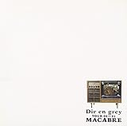
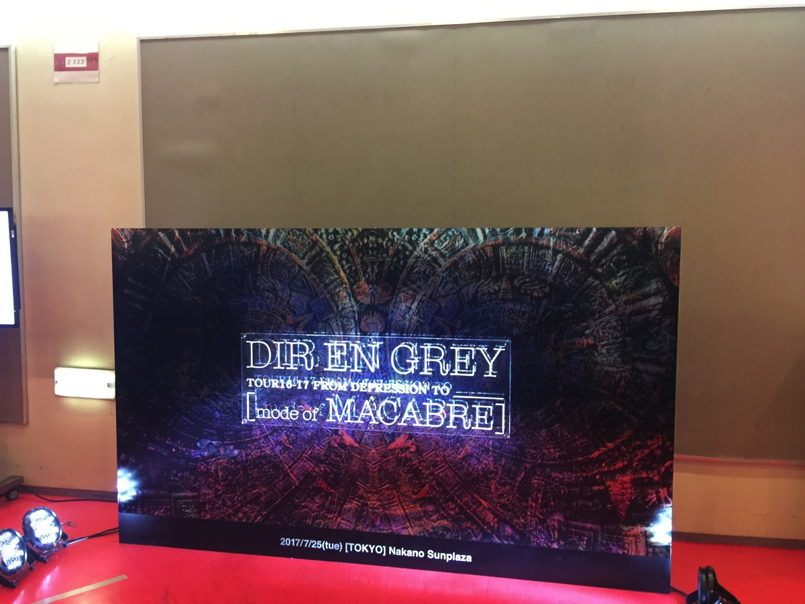
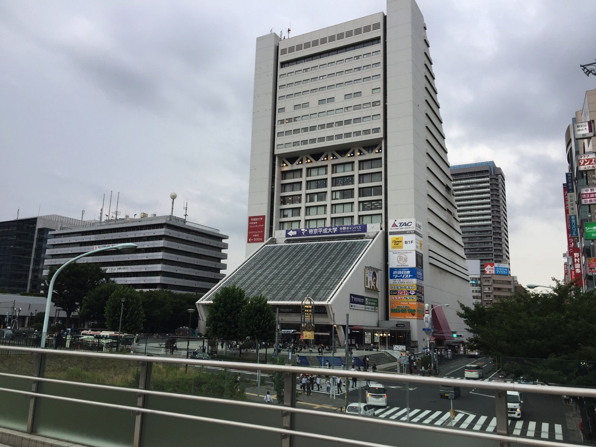
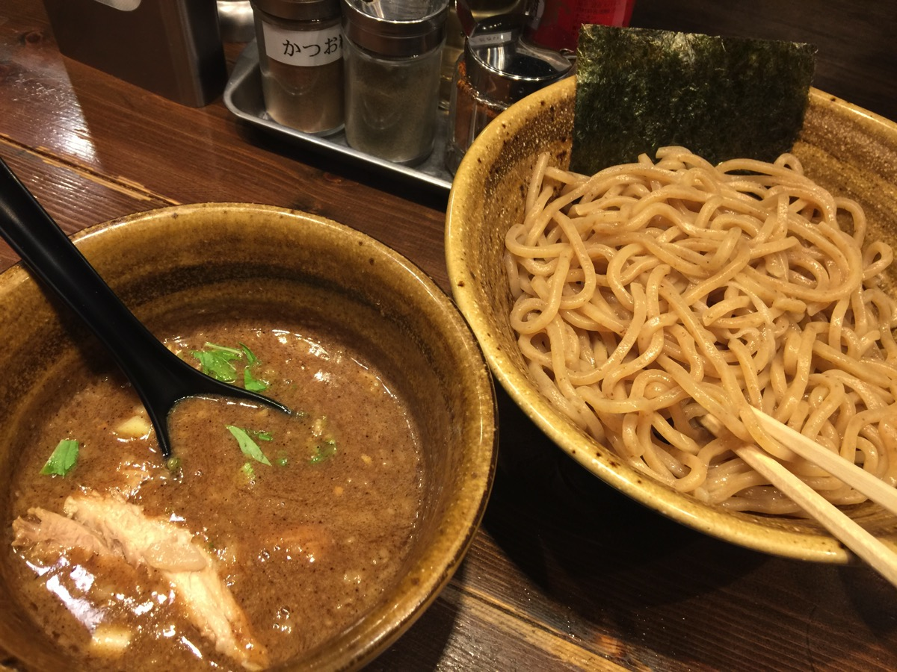

---
categories:
- DIR EN GREYのLIVEレポ
- TOUR16-17 [mode of MACABRE]
date: Tue, 25 Jul 2017 16:50:45 +0000
slug: post-10872
tags:
- DIR EN GREY
- LIVEレポ
title: 【ライブレポ】DIR EN GREY TOUR16-17 FROM DEPRESSION TO ________ [mode of MACABRE]2017_7_25@中野サンプラザ
---

いつまでLIVEに通うのか。。。昔と違って他人から見てももう大人にわけで、そこにしか自分の価値がないなんて今さら言わない。だからふとLIVE中に頭をよぎることもある。

毎回ここに来る価値があるのか、それを確認しにきてみて終わってみればそんな思考は微塵も消え去っている。結局は自分だけの都合で生きてなくなった自分が、少しだけ自分の時間を作って、楽しむことへの罪悪感にも似た何かなのかを感じているだけなのかもしれない。

今日も一瞬その罪悪感がよぎった。ただ、そんなもの無価値でしかないと断言できるLIVEだった。

そして、今日はDIR EN GREYのLIVEで初めて疎外感を覚えた。

GAUZEの時は言ってもスタンディングだったし、本人たちも久しぶりでお祭り的なノリだった。だからGAUZEを体験したことがないぼくもノリとして、その世界観に入れた。あまり乗れなかった気がするけど。

ただ、今日は違った。完全にMACABREの世界観だった。当時ピエラーだったぼくはフールズメイトでライブレポを読むくらいだったので、当然MACABREも借りてMDに録音しただけ。しかもだいぶあとになってから。

ノリもわからなきゃフリもわからん。本人たちと知ってるファンたちだけの空間だった。。。ように感じた。

けど、そんなこともなく、やっぱりDIR EN GREYはDIR EN GREYだった。一曲一曲がとてつもなく重厚で、sukekiyoとかDUMの様な息もできない圧倒感があった。

来週の追加公演はスタンディングなので耐えられるかどうか…ということで本日のLIVEレポです。<!--more--><h2>MACABREとは？</h2>

当時の文献は持っていないので<a href="https://ja.wikipedia.org/wiki/MACABRE">wikipedia</a>と曖昧な記憶から

GAUZEと違ってセルフプロデュースで、ジャケットなどにも徹底したこだわりをもって制作されたフルアルバム。このアルバムからレコード会社との契約はソニーが流通のみを扱うようになった模様。おそらくトミー社長の方針でインディーズ＝大手レコード会社と契約しない状態に戻ったものと思われます。

それと当時は確かアルバム発売前にツアーが開始し、初日に京が突発性難聴を発症し一部公演が中止に。その後復活するわけだけど、そこから京は刺青と口ピを施し、それまでの割と綺麗目な印象だったDIR EN GREYが現在の破壊的なビジュアルや音楽性に至る発端となった。

確かこの頃、耳の治療のためにホルモン剤を投与されていた京は副作用から色々な症状がでていたらしい。そして事務所もこの時は相当ダメージを受けたみたい。塞ぐ京の元に何かに理由をつけて各メンバー（確かやもさん以外）が毎日現れたり、ずっとそばにいたのがガラと大佑だったとか。もう一度断っておきますが曖昧なぼくの記憶で書いてますので。

参考：<a href="http://direngrey.co.jp/bio/158/">http://direngrey.co.jp/bio/158/</a>

当時のナマナマしい様子は確かこのDVDに収録されてるはず。ぼくビデオしか持ってませんので買っておこうかな。

<a href="http://www.amazon.co.jp/exec/obidos/ASIN/B00005LPD0/warawareotoko-22/" target="_blank" rel="noopener noreferrer">TOUR 00>>01 MACABRE [DVD]</a>
posted with <a href="http://kaereba.com" rel="nofollow noopener noreferrer" target="_blank">カエレバ</a>

Dir en grey フリーウィル 2001-08-22    

<a href="http://www.amazon.co.jp/gp/search?keywords=TOUR%2000&__mk_ja_JP=%E3%82%AB%E3%82%BF%E3%82%AB%E3%83%8A&tag=warawareotoko-22" target="_blank" rel="noopener noreferrer">Amazon</a>

<a href="https://hb.afl.rakuten.co.jp/hgc/0f6e221b.2eb9748a.0f6e221c.35cc1e84/?pc=http%3A%2F%2Fsearch.rakuten.co.jp%2Fsearch%2Fmall%2FTOUR%252000%2F-%2Ff.1-p.1-s.1-sf.0-st.A-v.2%3Fx%3D0%26scid%3Daf_ich_link_urltxt%26m%3Dhttp%3A%2F%2Fm.rakuten.co.jp%2F" target="_blank" rel="noopener noreferrer">楽天市場</a>

<a href="//ck.jp.ap.valuecommerce.com/servlet/referral?sid=3041033&pid=882528283&vc_url=http%3A%2F%2Fsearch.shopping.yahoo.co.jp%2Fsearch%3Fp%3DTOUR%252000&vcptn=kaereba" target="_blank" rel="noopener noreferrer">Yahooショッピング</a>

<h2>セトリ</h2>

Deity
MACABRE -揚羽ノ羽ノ夢ハ蛹-
aubrey
egnirys cimredopyh +) an injection
Chainrepulsion
蛍火
ain't afraid to die
HYDRA-666-
Children(Six Ugly ver)
脈
Berry
理由
ザクロ

太陽の碧
【KR】cube
Sustain the Untruth
詩踏み
羅刹国

一曲一曲が大作という感じで、息が詰まるほど圧倒された。ホールならではの緊張感があって、追加公演のスタンディングでぼく自身耐えられるか今から心配になってきた。

冒頭から紗幕が降りていて、「MACABRE -揚羽ノ羽ノ夢ハ蛹-」の曲中に京が蛹から羽化する虫の様に蠢いたり、舞う蝶のように羽ばたりしたのちに、紗幕があがっていくんだけど、その瞬間がすごい鳥肌がたった。今思えば新し目の曲がほぼ無くて、今までの過去ツアー中もっとも過去ツアーしている感じがした。

「Chainrepulsion」では、やっぱり会場が一気に上がってる感じがした。

「ain't afraid to die」は普段は特別な曲でめったにLIVEでやらず、いざやるとなると会場全体からすすり泣きが聞こえてくるような曲のはずだけど今回は、そうでもなく、全体の中の一つという印象で、溜めも短く余韻もほぼなしだった。ただし、終わったらやっぱり周りから鼻水をすする音は聞こえました。あと、曲中の映像がチベット？の映像で、クリスマスソング的な印象がある「ain't afraid to die」とは一見すると似つかわしくないのではと思った。

ちょっと調べてみたけど映像はやっぱりチベットみたい。中国との衝突により多くの犠牲者が出た問題についての実際の映像を使っているようです。確かチベット問題についてはブラピ主演のセブンイヤーズインチベットという映画に描かれているらしい。これを機に見てみようかな。今日の映像ではよくわからなかったけど、他の会場ではもっと直接的な表現の映像だったらしい。

あと印象的だったのはザクロ。確か当時もミラーボールでの演出をしていた。当時は血糊や卵なんかでぐっちゃぐちゃになりながら歌っていた。その写真を雑誌で見て当時ピエラーだった自分は初めてDir en greyというものが今こうなってるんだというのを認識した。めちゃくちゃかっこええええと思った記憶がある。そして今日のザクロも血糊なんかはもちろんなかったけど、狂気がすごかった。降りた紗幕の中、京のかすれる声と笑い声にも似た叫び声、そして沈黙。マイクがステージに落ちる音で本編が終了。

アンコールでは、今回のツアーから取り入れられた「何度も言わせんじゃねえ！！」「態度で示せ！！」「中野さん！！」とひたすらコールアンドレスポンス。いつもの3倍くらいか

それと上手側の前方にてDieを生かしたいないいないばあと、背中合わせなどのイチャコラがございましたのでご報告いたします。

<h2>メンバー衣装とステージセット</h2>

京は噂に聞いてた緑髪にジャケット？をはおり、黒いスキニーパンツ。途中でジャケットを脱ぐと中は襟がフリフリした長袖のシャツ（多分）グローブしてたかどうかは覚えてない。アンコではピンクヒョウ柄シャツにサスペンダー

Toshiyaはチョッキに白シャツに黒ネクタイでいつもの正装。髪型がちょっと昔の髪型になってるきがする。

<blockquote class="twitter-tweet" data-lang="ja">
期間限定ショップ2日目ご来店頂きました皆様誠にありがとうございました！ 本日は閉店後にTOSHIYAが来店しました。 店舗でパシャリ&#x1f4f7;&#x2728; <a href="https://t.co/94RAfqsXTA">pic.twitter.com/94RAfqsXTA</a>
&mdash; DIRT_official (@dirt_jp) <a href="https://twitter.com/dirt_jp/status/889443949667954688">2017年7月24日</a></blockquote>

アンコはこれ

<blockquote class="twitter-tweet" data-lang="ja">
中野サンプラザ、1日目はこの場所に帰って来れた幸せと、楽しい時間をありがとう。  Toshiya<a href="https://twitter.com/hashtag/DIRENGREY?src=hash">#DIRENGREY</a> <a href="https://twitter.com/hashtag/modeofMACABRE?src=hash">#modeofMACABRE</a>  <a href="https://t.co/Andnqsnov2">https://t.co/Andnqsnov2</a> <a href="https://t.co/EoGAqPiMqZ">pic.twitter.com/EoGAqPiMqZ</a>
&mdash; DIR EN GREY (@DIRENGREY_JP) <a href="https://twitter.com/DIRENGREY_JP/status/889856532283707392">2017年7月25日</a></blockquote>

薫はこれまた噂に聞いていた金髪。アップはどんな感じなのか。。。きになる。
ノースリーブなのか肩出しなのか。そしてワンピース状なのかスカートなのか、とにかくロングスカートの様な感じでした。下はタイツ？？アンコもあまりかわらず。肩はしまっておりました。冷えたか？あと度々演奏中に袖に引っ込むことがありました。ぼくは今日二階席だったので気になったのですが、指のテープが外れたのかなんなのか。

Dieはフワッフワの髪型に噂の御御足は遠目にはわかりませんでした。アンコでは猫Tシャツ来てた。

やもさん白かったです。アンコは猫Tシャツ

<h2>中野サンプラザ周辺情報</h2>

もう取り壊されるのかと思って、次は建て替えられた後だろうと思ってたんですけどまだまだ先みたいですね。2020年から2024年くらいらしい。建て替え後はオフィス、ホテル、マンションにさらに1万人規模のアリーナが入った複合施設になるそうな。へー

ということで、まだまだ先なので近くで今日時間潰したお店と帰りに寄ったラーメン屋をご紹介

スタバです。1階と2階に席があります。意外と座れるかも。

<iframe src="https://www.google.com/maps/embed?pb=!1m18!1m12!1m3!1d3239.785856264327!2d139.6632443152596!3d35.706886980188315!2m3!1f0!2f0!3f0!3m2!1i1024!2i768!4f13.1!3m3!1m2!1s0x6018f291325e78bd%3A0x46413e4e9b556d0!2z44K544K_44O844OQ44OD44Kv44K544Kz44O844OS44O8IOS4remHjumAmuOCiuW6lw!5e0!3m2!1sja!2sjp!4v1501518549710" width="600" height="450" frameborder="0" style="border:0" allowfullscreen></iframe>

吉祥寺にあるつけ麺屋「えん寺」の2号店。吉祥寺よりもつけ汁が煮干しが強い。ぼくは吉祥寺の方が好きかな。

<iframe src="https://www.google.com/maps/embed?pb=!1m18!1m12!1m3!1d3239.795000680645!2d139.66403531529483!3d35.70666198018843!2m3!1f0!2f0!3f0!3m2!1i1024!2i768!4f13.1!3m3!1m2!1s0x6018f296b7f6ad33%3A0x855c35e657627189!2z5LqM5Luj55uu44GI44KT5a-6!5e0!3m2!1sja!2sjp!4v1501000935720" width="600" height="450" frameborder="0" style="border:0" allowfullscreen></iframe>

<h2>しんぺーはこう思った。</h2>

ホールツアーだからこそ演出を堪能することができました。それにしても、もんなにも一曲一曲濃厚なアルバムだったとは思いませんでした。ぼくは次回は追加公演のZeppTokyoです。今日はグッズを見る余裕がありませんでしたので、次回はしっかりと見たいと思います。噂のビックリマンシールとか。それにしてもちゃんとした普通のTシャツを出してほしい。普段着で来てるんでそろそろ出してもらわないと全部ボロくなってきちゃったし。買ったDIRTはなんだか女性向けのシルエットなので男が着ると似合わない人は似合わない。。。似合いませんでした。ドルマンはきれないしな。。。

次回スタンディングのMACABRE楽しみ！！

と言ったところで本日は以上になります。 
おやすみなさい。 