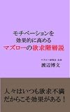

---
categories:
- youtube
date: Sun, 30 Jul 2017 02:10:51 +0000
slug: post-10878
tags:
- youtube
title: 【ヒカキン募金動画】マズローの欲求を全アンロックしついに社会貢献を開始【ノブリスオブリージュ】
---

数年前から事あるごとに募金関連はやってたと思いますが、今回は何かが違うと思って書きました。

<h2>ヒカキンの募金動画</h2>

先日、Youtuberのヒカキンが九州北部豪雨の募金呼びかけに関しての動画をあげました。ぼく個人的には、この動画に対して唐突かつ時間もたっているのに何故？という印象をいだきました。が、タイミングと準備が整うのを待ってたのかなと思います。

<iframe width="560" height="315" src="https://www.youtube.com/embed/mXxAHMdLuos" frameborder="0" allowfullscreen></iframe><!--more--><h2>前日のプレゼント企画からの募金動画でリーチ最大化</h2>

タイミングというのは次の２点。1つ目が<strong>Youtubeの視聴回数が上昇すると言われる夏休み期間が来るのをまっていた</strong>ということ。Youtubeのメインユーザーは子どもや学生です。彼が夏休みである7月下旬から8月中にどれだけ見られる動画を上げられるか、この期間にどれだけチャンネル登録者を獲得できるが年間の収益を左右すると言っても過言ではありません。

そして2つ目がその<strong>前日にあげたニンテンドースイッチ10台プレゼント企画の準備が整うのを待っていた</strong>のではないでしょうか。そしてこのプレゼント企画こそが、募金告知効果を最大化するための布石だったのではないでしょうか。と言いますのも、このプレゼント企画の応募条件が「チャンネル登録」「グッドボタン」<strong>「通知機能の有効化</strong>」でした。

このプレゼント企画の動画を上げた日のチャンネル登録者数の増加は<strong>173,897人</strong>（<a href="https://socialblade.com/youtube/user/hikakintv">SOCIALBLADE</a>）、<strong>通常はデイリー平均で4,000人</strong>の増加のようなのでかなりの効果があったと言えます。

こういったプレゼント企画でチャンネル登録する人は、アクティブユーザーではなく、プレゼント目当てのため次の日以降動画を見ることがないというのは想像に難くありません。そういった人たちにも募金動画の通知が届くようにしたのではないでしょうか。さらには今までの登録者に対しても通知をオンにさせることでリーチを最大化しています。

<iframe width="560" height="315" src="https://www.youtube.com/embed/UQgPv5C2_Oo" frameborder="0" allowfullscreen></iframe>

<h2>マズローの欲求全アンロックしたヒカキン</h2>

最近の彼は神がかっていると個人的に思っています。名実ともにナンバー１です。
単独のチャンネル登録者数こそ、<a href="https://www.youtube.com/user/0214mex">はじめしゃちょー</a>に抜かれていますが、そんなもの関係なく彼がナンバー１だと思います。

そもそも、彼はずっと日本のユーチューバーのナンバー１でした。

しかし、これが３、4年前だと状況は違っていました。スターダムを駆け上っていく彼の姿はどことなく<strong>金の亡者という印象</strong>があり、何もしていないのに悪い印象を視聴者に与えていた気がします。

<iframe width="560" height="315" src="https://www.youtube.com/embed/MzZVbCbdrPk" frameborder="0" allowfullscreen></iframe>

ぼくもチャンネル登録を解除した記憶があります。

ただ、<strong>当時の動画の質は今に比べれば低く</strong>、また映る彼の顔もどこか毒気を感じずにはいられません。それがここ１、２年くらいガラっと印象がかわりました。さらにいうとここ数ヶ月でそれに磨きがかかった感じがします。（ぼく個人の印象です）

<iframe width="560" height="315" src="https://www.youtube.com/embed/tns05nLr_FQ" frameborder="0" allowfullscreen></iframe>

ところで、人間の欲求には5段階あるという「マズローの欲求」をご存知でしょうか？生理的欲求、安全欲求、社会的欲求、尊厳欲求、自己実現欲求です。低次元の欲求を満たすと次のレベルにある欲求を満たすために人間は行動するそうです。

ヒカキンは、Youtubeだけで生活生活できるようになり、豪華なマンションへと引っ越します。そしてUUUMという事務所に所属し、そこで最高顧問となります。そして彼がHIKAKIN TV最初の動画であげた理念を達成したのでしょう。このマズローの欲求を全てアンロックし、富と名声と仲間の全てが手にはいったヒカキン、彼が次に目指すものは「社会貢献」なのではないでしょうか。持つものとして、持たざる者を支援・援助すべく行動した結果が今回の動画なのではないでしょうか。

これこそが真のインフルエンサーなのではないかと強く感じました。

<h2>それでもヒカキンはきっと変わらない</h2>

彼の本質は進化してきました。

とは言え、それでも彼の動画スタイルが根本的に変わるとは思っていません。きっとこれからも毎日楽しい動画をあげてくれるのではないかと思います。

<strong>ヒカキンの一番の強みはトレンドを取り入れる柔軟さ</strong>です。

最近のトレンドでいうと、ヒカル・ラファエルあたりがよくやる手法で「大金をはたいて高級なものを大量に買う系動画」があります。

そのトレンドをうまく取り入れて、ルイヴィトンコラボショップで爆買い・・・総額1500万円使ったらしい・・・
<iframe width="560" height="315" src="https://www.youtube.com/embed/cQ9kGR8Mq0M" frameborder="0" allowfullscreen></iframe>

はたまた、Youtuberの原点に立ち返ったようなこんな動画もあげています。

<iframe width="560" height="315" src="https://www.youtube.com/embed/sgvXsIgBA0A" frameborder="0" allowfullscreen></iframe>

<strong>人にできないことや人がやりもしないことを平気でやってのける存在、それがYoutuberなのだ</strong>ということを体現しているような気がします。

<h2>しんぺーはこう思った。</h2>

今回のヒカキンの動画を見て、<strong>「原点にして頂点」</strong>という言葉がぴったりだと強く感じました。

<strong>おそらく今後数年は誰もヒカキンを超えることはできない</strong>

絶対倒すなんて言ってたやつもいたけど、根本から存在として変容した彼をもう誰も止められないと思います。

と言ったところで本日は以上になります。 
おやすみなさい。 

<a href="http://www.amazon.co.jp/exec/obidos/ASIN/B00H7199SY/warawareotoko-22/" target="_blank" >マズローの欲求階層説</a>
posted with <a href="http://kaereba.com" rel="nofollow" target="_blank">カエレバ</a>

渡辺博文  2013-12-08    

<a href="http://www.amazon.co.jp/gp/search?keywords=%E3%83%9E%E3%82%BA%E3%83%AD%E3%83%BC&__mk_ja_JP=%E3%82%AB%E3%82%BF%E3%82%AB%E3%83%8A&tag=warawareotoko-22" target="_blank" >Amazon</a>

<a href="https://hb.afl.rakuten.co.jp/hgc/0f6e221b.2eb9748a.0f6e221c.35cc1e84/?pc=http%3A%2F%2Fsearch.rakuten.co.jp%2Fsearch%2Fmall%2F%25E3%2583%259E%25E3%2582%25BA%25E3%2583%25AD%25E3%2583%25BC%2F-%2Ff.1-p.1-s.1-sf.0-st.A-v.2%3Fx%3D0%26scid%3Daf_ich_link_urltxt%26m%3Dhttp%3A%2F%2Fm.rakuten.co.jp%2F" target="_blank" >楽天市場</a>

<a href="//ck.jp.ap.valuecommerce.com/servlet/referral?sid=3041033&pid=882528283&vc_url=http%3A%2F%2Fsearch.shopping.yahoo.co.jp%2Fsearch%3Fp%3D%25E3%2583%259E%25E3%2582%25BA%25E3%2583%25AD%25E3%2583%25BC&vcptn=kaereba" target="_blank" >Yahooショッピング</a>

