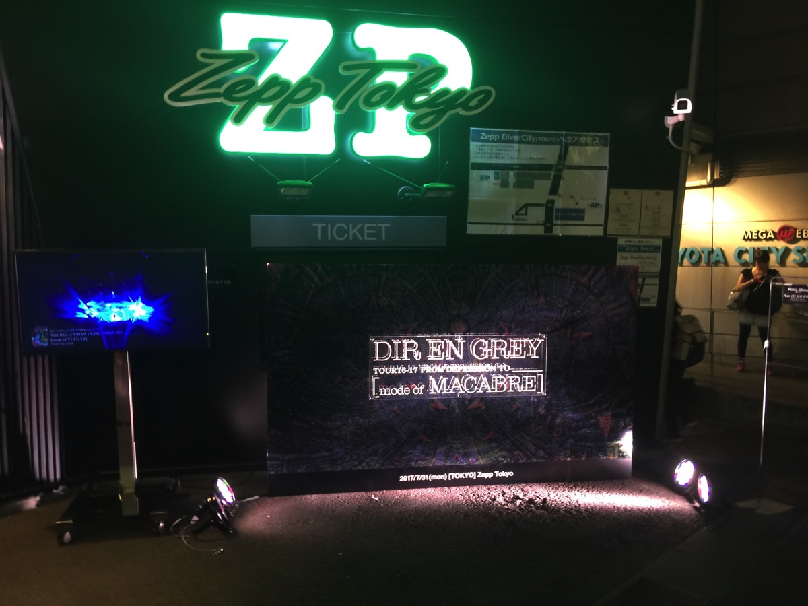

---
categories:
- DIR EN GREYのLIVEレポ
- TOUR16-17 [mode of MACABRE]
date: Mon, 31 Jul 2017 16:46:40 +0000
slug: post-10897
tags:
- DIR EN GREY
- LIVEレポ
title: 【ライブレポ】DIR EN GREY TOUR16-17 FROM DEPRESSION TO ________ [mode of MACABRE]2017_7_31@ZeppTokyo
---

急遽発表されて先着順だった追加公演のチケットが取れてましたので、ぼくにとってのマカブラツアー2回目にしてラストに行ってきました。そして今日が夏休み最終日でした。LIVE以外特に外出しておりません。昨日、TTTがBarBooで食事してた多摩ダイナーに車で行ってみたんですが車で行くような場所じゃなかった。駐車場なんかないし、道がめちゃくちゃ入り組んでて狭くて電車じゃないといけませんわあれ。薫が遅れてきてマネージャーのトールさんは車置きに行ってるから先に来たみたいなこと言ってたのもうなづけるわ。さて、それでは追加公演のZeppTokyoでのLIVEレポです。<!--more--><h2>Zepp Tokyo周辺情報~お台場の現状~</h2>

なんだか久しぶりに来た気がしてたら、それもそのはず。前回DIR EN GREYがZepp TokyoでLIVEをやったのが昨年の[mode of VULGAR]の追加公演でした。その時はスタバで時間をつぶしていた記憶があります。ご飯はサンドイッチかなんかをコンビニで買いました。

今日もLIVE前にかなりお腹が減っていたのでコンビニに立ち寄るとタイミングが悪かったのか食べられそうなものが何もなし！急いでビーナスフォートの中に入ると海外の観光客と夏休みということもあってか、フードコートも満席。

そしてびっくりしたのが、どこも物価がめちゃくちゃ高くなっているということ。昔から観光地ではあったけど、なんか完全にアジアからの観光客向けの場所になっちゃったお台場。

特にビーナスフォート周辺はそんな感じで、物価が高い上に食料がないという震災の時にコンビニを思い出すレベルで何もなかった。ゾンビアポカリプス起きてもショッピングモールとか行っちゃダメだな、食料とか絶対すぐに底つくわ。

で、東京テレポート駅まで戻って駅のニューデイズでようやく食べられるものを買ってしのぎました。

いやーほんとにびっくりしました。これなら新木場の方がよっぽどマシ！ってかぼくは個人的に新木場が一番好きだけど！次回は是非Zepp Tokyo Divercityの方でお願いします。

<h2>ステージセットとメンバー衣装</h2>

<a href="https://www.warawareotoko.com/2017/07/26/post-10872/">前回の中野</a>が2階席でけっこう遠かったのですが今回は500番台で下手前方でがっつり直視できました。

スタンディングということもあってか紗幕は無しでスタート。またステージ上にはアンプなどの機材はほぼなく、照明機材がメインでした。両サイドになぞの球体が1つずつ設置されていたので、なんだろうと思っていたらザクロの時に使うミラーボールでした。新木場だったら中央にすでにミラーボールがあるからそれを使うんでしょうけど、こういう演出の仕方もあるんですな。

メンバー衣装は、京は中野初日と一緒。緑の髪の毛に真っ赤な口紅。ただし、ざわと雑に塗ったかのようなはみ出し具合。バットマンのジョーカーのような感じ。ただし衣装込みだとサーカスのピエロっぽいなと思いました。

あと右の上唇というか鼻の右下あたりとアゴにピアスしてました。

薫は、ロングの真っ黒いワンピースに、首にはいつものメイク。今日は顔の様なものでした。

Shinyaは相変わらず真っ白。登場の時しか見えませんでした。

Dieは見れなかった！

そして、、、、Toshiya

今日改めて、、、というか、、、たぶん心のそこから本当に本当に魂レベルでかっこいいいいいいと感じた。そんなことわかっているわやとか思われる話であることは重々わかっております。

でも、ぼくのゴーストがそう囁くんです。

なにあの長身（いまさら！？
Toshiyaってあんなに身長高いんだね！何あの腕の長さ！！長いベースの竿がちょうどいい感じやんけ！なんなら腕余ってるし

そして脚ほっそほっそ、、、バランスいいいい

ベースを弾くために神がこさえたパーフェクトボディToshiya

とにかくかっこよかった。途中で張られた紗幕の後ろで微動だにしないToshiya
かっこよすぎた

<blockquote class="twitter-tweet" data-lang="ja">
追加公演のZepp Tokyo、凄い熱量でした…ありがとう、東京。  Toshiya<a href="https://twitter.com/hashtag/DIRENGREY?src=hash">#DIRENGREY</a><a href="https://twitter.com/hashtag/modeofMACABRE?src=hash">#modeofMACABRE</a><a href="https://t.co/bTyGTfHrgW">https://t.co/bTyGTfHrgW</a> <a href="https://t.co/UXVP3ebzeU">pic.twitter.com/UXVP3ebzeU</a>
&mdash; DIR EN GREY (@DIRENGREY_JP) <a href="https://twitter.com/DIRENGREY_JP/status/892021923508387840">2017年7月31日</a></blockquote>

<h2>セトリ</h2>

冒頭の映像は中野もあれだったっけ？？今日の方がなんだかしっかりと見れたきがする。
のに、内容が全く頭に残っていない。。

脈
egnirys cimredopyh +) an injection
Audrey
Chainrepulsion
蛍火
ain't afraid to die
Deity
MACABRE -揚羽ノ羽ノ夢ハ蛹-
HYDRA-666-
Children(Six Ugly ver)
Berry
理由
ザクロ

太陽の碧
【KR】cube
Un deux
羅刹国
詩踏み

特に印象に残ったのは「ain't afraid to die」です。前回の中野で初めて見た時は予備知識が全くなかったので何が何やらでした。なんとなく実際の映像っぽいものを使っているなくらいでした。

でも今日は色々調べてみたので、わかった上であれをちゃんと見ることができました。

参考：<a href="https://ja.wikipedia.org/wiki/%E3%83%81%E3%83%99%E3%83%83%E3%83%88%E5%95%8F%E9%A1%8C">wikipedia</a>

中国によるチベットの人々の虐殺に関する映像です。詳細は上にリンクから読んでいただければと思います。LIVE帰りに電車の中でずっと読んでたんですが、虐殺された人数がすごいです。

たまにLIVEで「ain't afraid to die」が演奏されると会場中から咽びなく声がもれて、きっと特別な思い入れがあるんだろうなって思っていました。というのも、ぼくはこの曲発売当初は全くDir en greyを追っていませんでしたので、これがどういった思いで作られた曲なのかを知りませんでした。

その上で、今日の動画を見ていて、感動というか心が震えました。

自らの身を焼いて抗議した僧侶は、何を思ったのか。今すぐに何かが変わるわけではないけど、きっと誰かにその思いが届くようにと願ったんじゃないでしょうか。慮ることしかできませんが、きっとそうだとして、それがDIR EN GREYを通じて、何も知らなかった人たちに伝えられたのなら今日の映像を「ain't afraid to die」で流したことは価値があることなんじゃないかと思います。

「ain't afraid to die」という曲自体がもつ意味が記号化されて、このツアーでは表現された結果なんだと思いました。

ain'tが終わると紗幕が降りてきて、MACABRE終わりまでそのままだったきがします。HYDRAからChildren、Berryの楽しいノリがアップダウン激しすぎて記憶が曖昧

最後ザクロで手首を見つめながら泣き叫ぶ姿だけ鮮明に覚えている。

アンコもその流れでかなり激しく、Zepp Tokyo特有の前方での左右に引き戻したり押したりする流れ（伝わります？？柵があるから前方が左右に流れができる感じ）で、激しい感じでした。

ツアーファイナル感あるけど、まだ2公演。参戦されるかたどうかご武運を

<h2>しんぺーはこう思った。</h2>

ぼくの夏はこれで終わりました。

次回は秋、とはいえ暑そうな気がしますが。

それまで充電です。

と言ったところで本日は以上になります。 
おやすみなさい。 
そして、また明日。