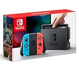

---
categories:
- youtube
date: Sat, 05 Aug 2017 12:53:06 +0000
slug: post-10901
tags:
- youtube
title: 【どれくらい見られるか】「ニンテンドースイッチプレゼント企画」ってタイトルつけてアップしたら【Youtube】
---

先日のヒカキンの募金動画ですが、めちゃくちゃバズってるんだろうなーって思ったんですよ。そしたらぜんっぜんそんなことなくて、むしろ翌日にあげた兄のセイキンへの誕生日プレゼント動画の方が再生数多かったという結果に。<!--more--><h2>ヒカキン募金動画が全然再生されなかった件</h2>

多分、プレゼント動画じゃなかったからなんじゃね？って思いました。

ヒカキンのチャンネル登録者数は480万人

それに対して募金動画の再生回数が110万回

翌日にあげた兄のセイキンへの誕生日プレゼント動画は160万回

<iframe width="560" height="315" src="https://www.youtube.com/embed/oVTPOS0PyVc" frameborder="0" allowfullscreen></iframe>

さらにいうとその次の動画は200万回

FLASH動画が320万回（数字は全部記事執筆時点のもの）

つまり、ここ最近で一番再生回数が少ない動画が募金動画ということになってしまいました！！

どうなってるんだ！？前日のスイッチプレゼント動画で通知をオンにしてからの募金告知で最大リーチだったんじゃないのか？

誰もが多分そう思ってた。ぼくもそう思ってた。

これに習ってヒカルも募金動画をアップしてました。すぐに削除されたため再生回数は不明です。

で、ふと思ったんですが<strong>もしかして「プレゼント」っていうキーワードはYoutube上で割と検索されるキーワード</strong>なんじゃないかってこと。

さらにいうと<strong>一定数がニンテンドースイッチプレゼント企画を狙って毎日検索してる</strong>んじゃなかろうか

<h2>どうでもいい動画に「ニンテンドースイッチプレゼント企画」ってつけてアップしたらどれくらい見られるか検証してみた</h2>

実際どうなのか見てみるために動画作ってアップしてみました。
登録者も10人ちょっとしかいないアカウントです。

結果、<strong>2日で再生数が200回を超えました</strong>。もちろんプレゼント企画ではないので低評価もたくさんついてましたけどw

<a href="https://youtu.be/Fr8s_sxR2uc">https://youtu.be/Fr8s_sxR2uc</a>

無音もアレなんでBGMつけとこうと思ったら想像以上にイラつく感じになっちゃいました。

<h2>実際プレゼント企画というタイトルが効果的なのかについて</h2>

検証結果から、多分検索キーワードとしては強いんだろうなってのが、なんとなくわかりました。

ただし、再生回数の比較からもわかるとおり、動画単体の再生回数に意味はあっても、他の動画の再生回数にはあまりつながらなさそうです。

人気チャンネルのプレゼント動画とそれ以外の動画の再生回数を比較してみました。

ヒカルのスイッチプレゼント動画　<strong>120万回</strong>

<iframe width="560" height="315" src="https://www.youtube.com/embed/97yoLJ-pkls" frameborder="0" allowfullscreen></iframe>

<strong>通常の動画がだいたい150万回以上再生されている</strong>これに関してはプレゼント動画自体があまり見られていないようです。この人の場合、プレゼント企画出しすぎて食傷気味なのかも。ただし、後述の登録者数の方には効果ありでした。

禁断ボーイズのスイッチプレゼント動画　<strong>150万回</strong>

<iframe width="560" height="315" src="https://www.youtube.com/embed/z6j2gcQObhM" frameborder="0" allowfullscreen></iframe>

普段の動画再生回数がけっこう変動があって100万回以下からいって200万回くらいという感じです。効果ありといえそうです。

ざくっとしか見てませんが、単体の動画の再生回数は100万回を超えているため、プレゼント動画単体だけでみるとなんとなく効果ありという感じです。ただし、やはりそれ以外への波及効果は薄そうです。

ただし、チャンネル登録者数についてはあからさまに効果がありました。

ヒカルのデイリーの登録者数は平均8000人程度、プレゼント企画の日の登録者数80000人。
ということで<strong>10倍になっています。</strong>

禁断ボーイズはデイリー6000人、プレゼント企画の日は88000人。<strong>10倍以上です。</strong>

（<a href="https://socialblade.com/">https://socialblade.com/</a>で調べました）

ということで、プレゼント企画で獲得したユーザーはやはり継続的な再生数には結びつかなさそうです。<strong>詳細に細かく検証したわけじゃないのでかなり適当です。</strong>

<h2>しんぺーはこう思った。</h2>

あんまり検証らしい検証じゃなかったけど、適当な動画あげたら再生数伸びたし、なぜかチャンネル登録者増えたwww

20人くらいになりましたw

これが10倍くらいになったら、ぼくもプレゼント企画やろうかなwwww

と言ったところで本日は以上になります。 
おやすみなさい。 
そして、また明日。

<a href="http://www.amazon.co.jp/exec/obidos/ASIN/B01NCXFWIZ/warawareotoko-22/" target="_blank" >Nintendo Switch Joy-Con (L) ネオンブルー/ (R) ネオンレッド</a>
posted with <a href="http://kaereba.com" rel="nofollow" target="_blank">カエレバ</a>

 任天堂 2017-03-03    

<a href="http://www.amazon.co.jp/gp/search?keywords=%E3%82%B9%E3%82%A4%E3%83%83%E3%83%81&__mk_ja_JP=%E3%82%AB%E3%82%BF%E3%82%AB%E3%83%8A&tag=warawareotoko-22" target="_blank" >Amazon</a>

<a href="https://hb.afl.rakuten.co.jp/hgc/0f6e221b.2eb9748a.0f6e221c.35cc1e84/?pc=http%3A%2F%2Fsearch.rakuten.co.jp%2Fsearch%2Fmall%2F%25E3%2582%25B9%25E3%2582%25A4%25E3%2583%2583%25E3%2583%2581%2F-%2Ff.1-p.1-s.1-sf.0-st.A-v.2%3Fx%3D0%26scid%3Daf_ich_link_urltxt%26m%3Dhttp%3A%2F%2Fm.rakuten.co.jp%2F" target="_blank" >楽天市場</a>

<a href="//ck.jp.ap.valuecommerce.com/servlet/referral?sid=3041033&pid=882528283&vc_url=http%3A%2F%2Fsearch.shopping.yahoo.co.jp%2Fsearch%3Fp%3D%25E3%2582%25B9%25E3%2582%25A4%25E3%2583%2583%25E3%2583%2581&vcptn=kaereba" target="_blank" >Yahooショッピング</a>

