---
categories:
- ポケモン
date: Sat, 12 Aug 2017 21:20:43 +0000
slug: post-10915
tags:
- ポケモンGO
title: 横浜のポケモンGOパーク行ってきた！人がいない休憩スポット情報あり
---

行ってきました、横浜で行われているポケモンGOのイベントに。今回はそのレポートです。3連休の最後に行かれる方の参考にどうぞ。<!--more--><h2>ピカチュウ大量発生チュウ!イベントとは</h2>

今回のイベントはここ数年横浜で開催されているピカチュウが街をジャックする形の大規模イベントです。

横浜の駅から様々な商業施設で体調のピカチュウの展示や着ぐるみによるパレードが行われています。

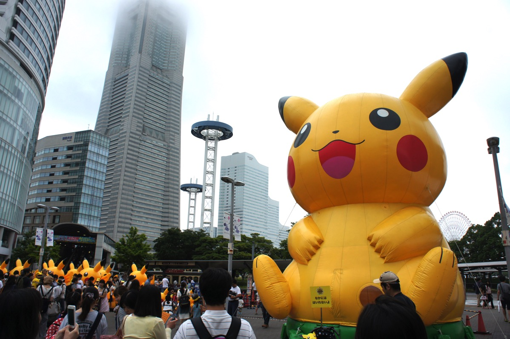

見所としてはピカチュウ・カーニバル・パレードや飛行船、船やずぶ濡れスプラッシュショーなどがあり、大人から子どもまで楽しめるイベントになっています。

現地は夏休み中の子ども連れも多くたいへんな盛り上がりでした。

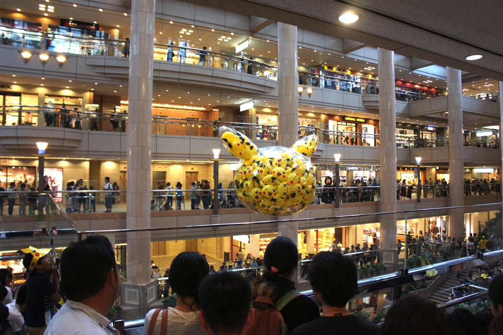

あと、駅も街もピカチュウ仕様になっており、いたるところで記念撮影をする人がいました。

これ水陸両用のバスらしい。このまま海入って船になるそうです。
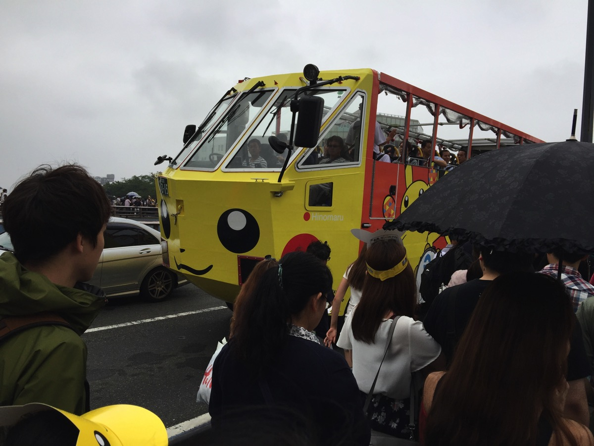

<h2>ポケモンGOパーク</h2>

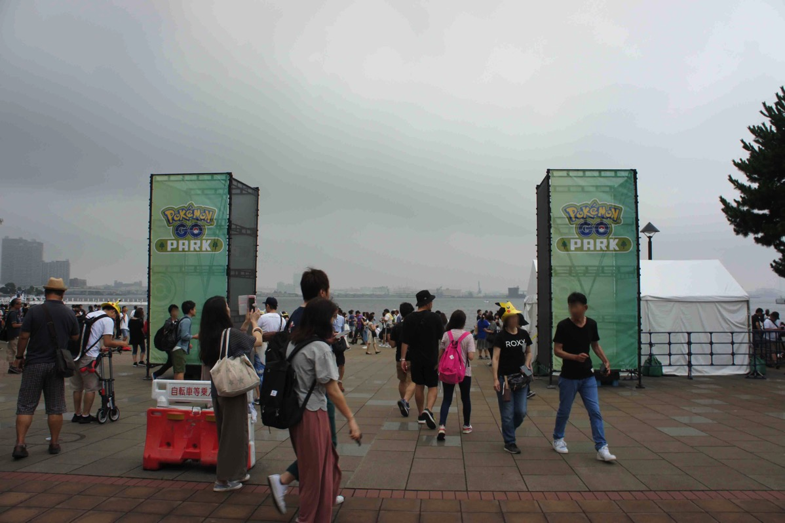

で、それに加えて今年はポケモンGOのイベントも同時開催されており、横浜についた瞬間からレアポケモンが湧きまくりでした。

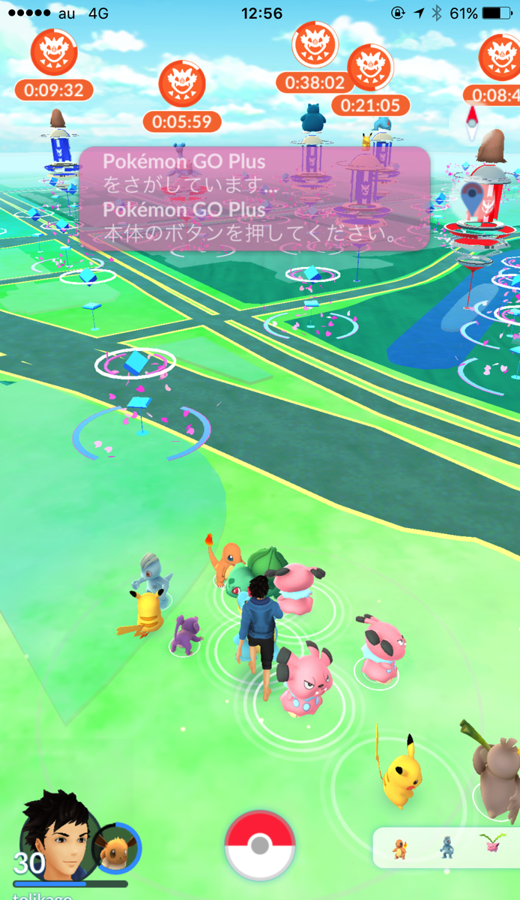

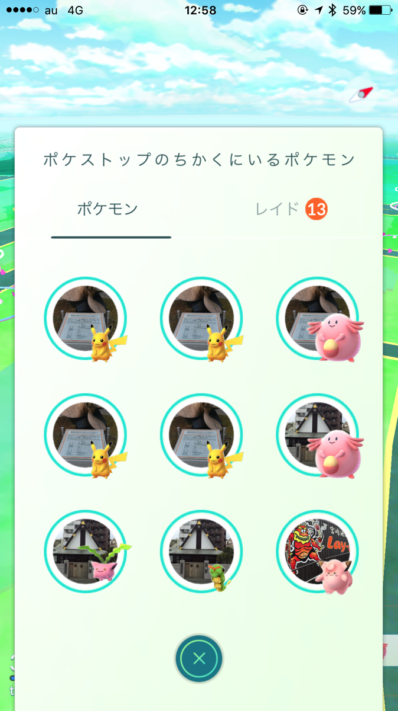

具体的に湧くレアなポケモンは
初代御三家、金銀御三家、ワンリキー、ラッキー、メリープ、ヨーギラス、ブルーノ、エアームド、アンノーン、バリヤードなどなど

あとは、色違いピカチュウやポケストップからでる卵がヨーギラスだったり

とにかくお祭り騒ぎというのにふさわしい状態。

<h3>現地の様子</h3>
とにかく人が多い。おおすぎる。

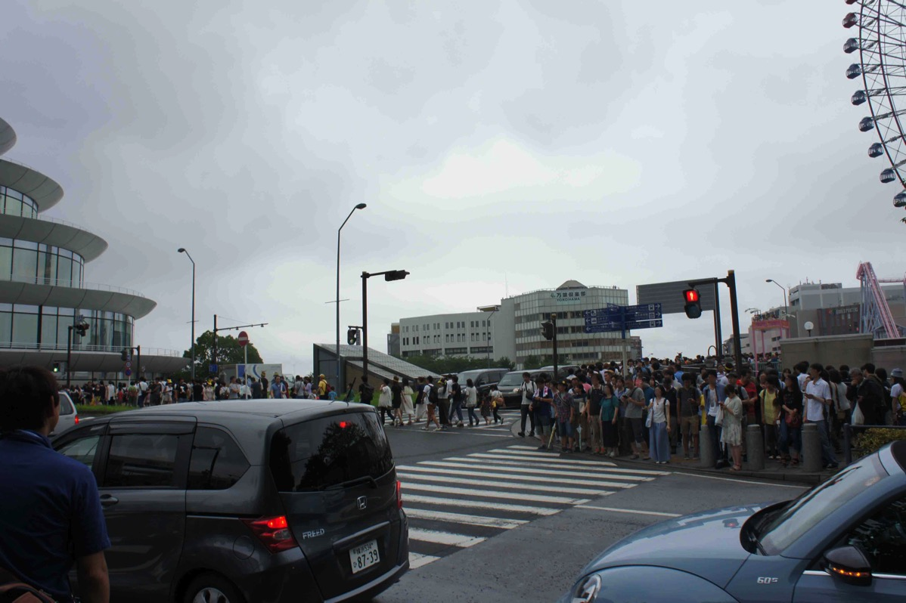

リリース当時を思い出す！！

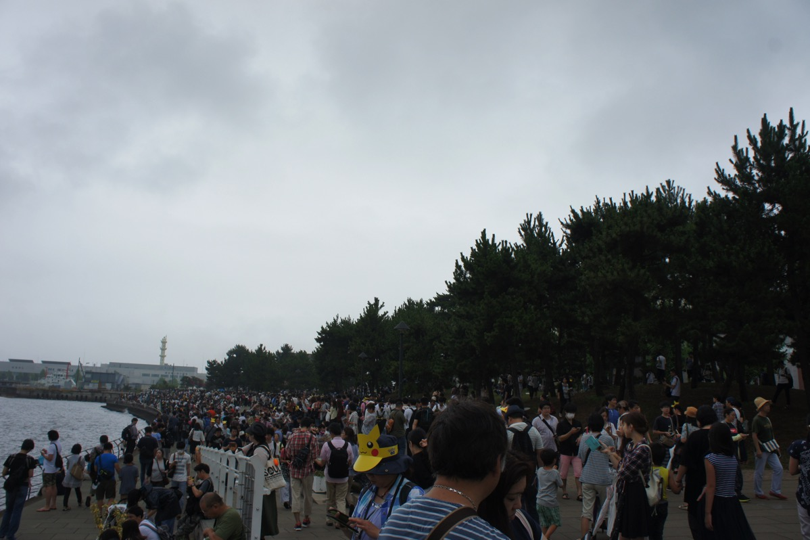

赤れんが倉庫の方にはいかなかったんですが、カップヌードルミュージアムまでの橋がかなりぎゅうぎゅうになってて危なかったですので気をつけて。

夏休み期間中のためパシフィコ横浜でも恐竜博やらトミカ博やらやっていてとにかく子どもも大人も多い。それに加えてポケモンGOやっている人が多いのでかなりカオスになっています。

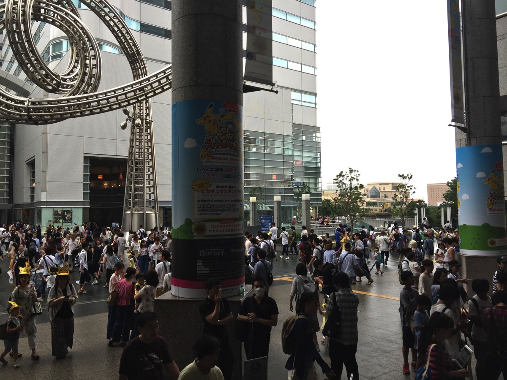

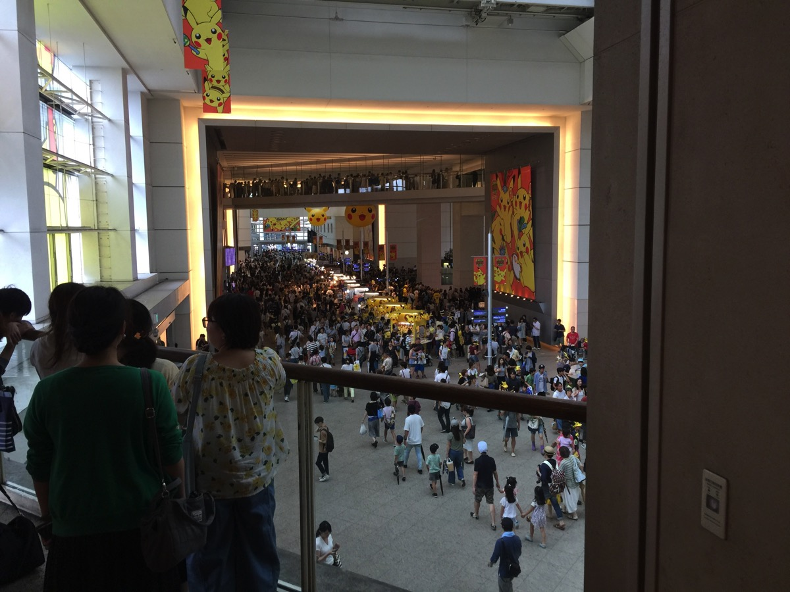

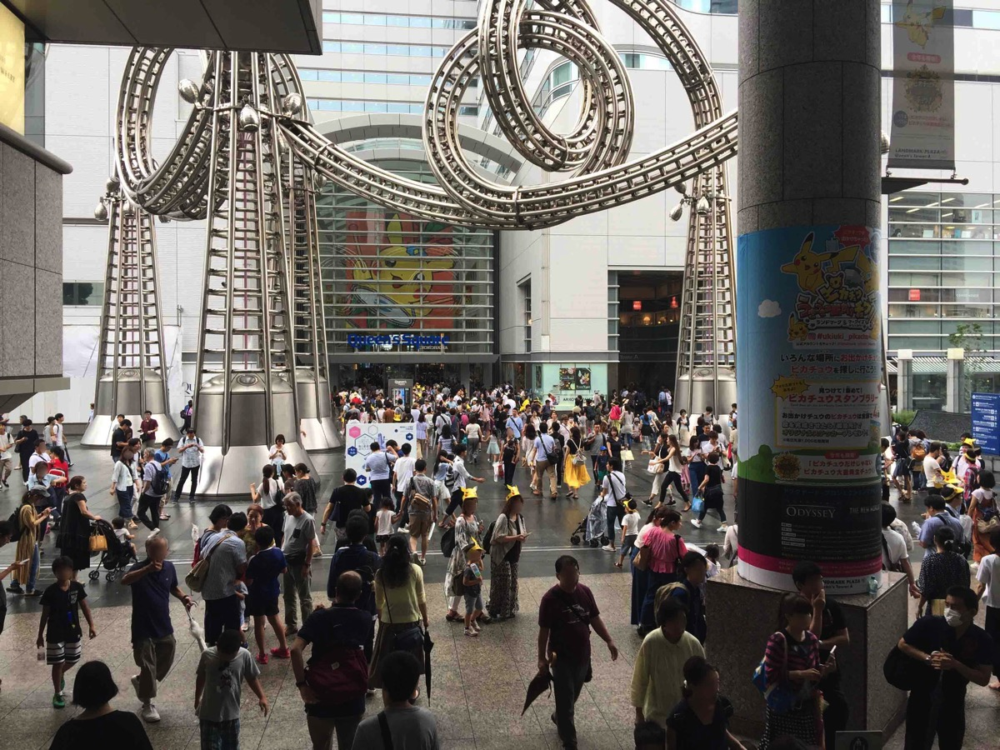

飲食店に入るのはほぼ不可。食料水分を確保すること能わず。
加えて、日差しを遮るものがない海沿いのためかなりかなり体力を奪われます。

さらに、人が多すぎるため通信自体も途切れることがありLINEもつながらなくなったりしました。また、心配されていたポケモンGOアプリへのログインエラーも頻発し、数分に一回はアプリがクラッシュしました。

車でいくのは不可能なので絶対やめましょう

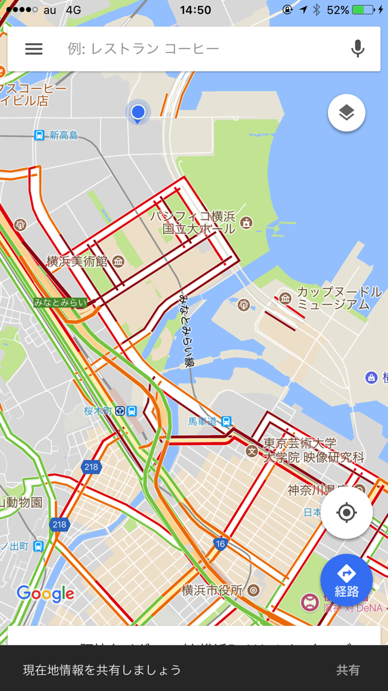

<h3>食事と休憩ができ、さらに物資調達もできる穴場</h3>

どこもはいれない！！スタバもサブウェイもなんもかんも行列！！！レストランもはいれない！！

しかもオフィス街なのか住宅街なのかわからないけど周囲は高層ビルで休日はやってなかったりするし、とくかくなんもないに等しい！！！
そんな中で穴場を発見！！！ここすばらしい！！

<iframe src="https://www.google.com/maps/embed?pb=!1m18!1m12!1m3!1d5612.664889603227!2d139.6295000726542!3d35.45966272855256!2m3!1f0!2f0!3f0!3m2!1i1024!2i768!4f13.1!3m3!1m2!1s0x60185c5b04d5a6ad%3A0x7bbc2bd41d36a821!2z44Kq44O844Kx44O8IOOBv-OBquOBqOOBv-OCieOBhA!5e0!3m2!1sja!2sjp!4v1502572413029" width="600" height="450" frameborder="0" style="border:0" allowfullscreen></iframe>

オーケーマートです。中で食料や水分を確保できますし、さらには焼肉屋（かなりやすい）と食堂もあるので休憩もできます！！

あと、USBケーブルとかが売ってるPCショップなんかも入ってますんでトラブルの際にはここで物資調達もできます！！！

カップヌードルミュージアムのエリアより少し離れた位置にあるので人も少なく一息つけます！！！

ぜったいにおすすめ！！！

<h2>今回の戦果</h2>

メリープ！！！ようやくメリープ捕まえた！時間の関係でモココまでにしかできませんでしたが、粘ればデンリュウいけた！

あと、ヨーギラス2体ほどゲット！バンギラスはレイドで捕まえられるので、不思議なあめつかってサナギラスまでにすればOK。ちなみに卵も複数ゲット

アンノーン！！YOKOHAMAの文字が出現してるらしいけど1種類のみ！でも図鑑埋まったからいいかな！

かんじんのバリヤード！！！でなかった！！！まったく！！！影すらなし！！！絶対にエラー
別の日に行った人は出まくりだったらしい

ということでぼくの図鑑はあとサナギラス、バンギラス、デンリュウ、バリヤード（あとルギア）

<h2>しんぺーはこう思った。</h2>

もし迷ってるのなら絶対にいくべきです！！レイドなんかやってる暇なんてないくらいレアなのが湧きます。ボールが足りなくなるレベル。

ぼくはバリヤードを捕獲するためにもう一度いかなければ。。。

横浜遠いんだな・・・

ちなみに14日にスタジアムにて事前抽選のイベントが開催されます。ぼくは外れてしまったみたいなのではいれませんが、どんなイベントになるのか！

と言ったところで本日は以上になります。 
おやすみなさい。 
そして、また明日。

<a href="http://www.amazon.co.jp/exec/obidos/ASIN/B071WPGJJ7/warawareotoko-22/" target="_blank" rel="noopener">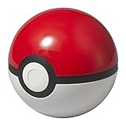</a>

<a href="http://www.amazon.co.jp/exec/obidos/ASIN/B071WPGJJ7/warawareotoko-22/" target="_blank" rel="noopener">ポケモンセンターオリジナル モンスターボール モバイルバッテリー Anker 10000mAh</a>
posted with <a href="http://kaereba.com" rel="nofollow noopener" target="_blank">カエレバ</a>

 ポケモン 2017-06-10    

<a href="http://www.amazon.co.jp/gp/search?keywords=%E3%83%90%E3%83%83%E3%83%86%E3%83%AA%E3%83%BC%E3%80%80%E3%83%A2%E3%83%B3%E3%82%B9%E3%82%BF%E3%83%BC&__mk_ja_JP=%E3%82%AB%E3%82%BF%E3%82%AB%E3%83%8A&tag=warawareotoko-22" target="_blank" rel="noopener">Amazon</a>

<a href="https://hb.afl.rakuten.co.jp/hgc/0f6e221b.2eb9748a.0f6e221c.35cc1e84/?pc=http%3A%2F%2Fsearch.rakuten.co.jp%2Fsearch%2Fmall%2F%25E3%2583%2590%25E3%2583%2583%25E3%2583%2586%25E3%2583%25AA%25E3%2583%25BC%25E3%2580%2580%25E3%2583%25A2%25E3%2583%25B3%25E3%2582%25B9%25E3%2582%25BF%25E3%2583%25BC%2F-%2Ff.1-p.1-s.1-sf.0-st.A-v.2%3Fx%3D0%26scid%3Daf_ich_link_urltxt%26m%3Dhttp%3A%2F%2Fm.rakuten.co.jp%2F" target="_blank" rel="noopener">楽天市場</a>

<a href="//ck.jp.ap.valuecommerce.com/servlet/referral?sid=3041033&pid=882528283&vc_url=http%3A%2F%2Fsearch.shopping.yahoo.co.jp%2Fsearch%3Fp%3D%25E3%2583%2590%25E3%2583%2583%25E3%2583%2586%25E3%2583%25AA%25E3%2583%25BC%25E3%2580%2580%25E3%2583%25A2%25E3%2583%25B3%25E3%2582%25B9%25E3%2582%25BF%25E3%2583%25BC&vcptn=kaereba" target="_blank" rel="noopener">Yahooショッピング</a>

