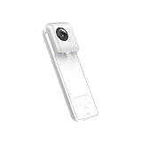
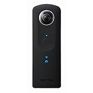
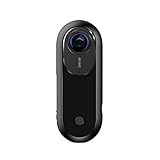

---
categories:
- レビュー
date: Tue, 29 Aug 2017 15:37:48 +0000
slug: post-10947
tags:
- ガジェット
title: 非常にきになる！insta360 oneという360度カメラが4kもとれるし良さげ
---

insta360 oneという全天球カメラが発売になりました。全天球といえば、ぼくも愛用しておりますリコーのthetaが有名ですが、こちらはこちらでいい所があって非常にきになるので軽く調べてみました。本日はそのご紹介です。<!--more--><h2>insta360 oneのここがすごい</h2>

そもそもぼくが全天球カメラthetaを購入しようと思った時に、対抗馬として検討したのがinsta360 nanoという機種です。

<a href="http://www.amazon.co.jp/exec/obidos/ASIN/B01FY8CHIA/warawareotoko-22/" target="_blank" >【日本正規代理店品】Insta360 Nano 360°全方位パノラマ式カメラ iPhone専用全天球カメラ 360°写真や動画を撮影/編集/シェア/VR体験 INSTA360 NANO</a>
posted with <a href="http://kaereba.com" rel="nofollow" target="_blank">カエレバ</a>

 Insta360 2016-12-26    

<a href="http://www.amazon.co.jp/gp/search?keywords=insta360&__mk_ja_JP=%E3%82%AB%E3%82%BF%E3%82%AB%E3%83%8A&tag=warawareotoko-22" target="_blank" >Amazon</a>

<a href="https://hb.afl.rakuten.co.jp/hgc/0f6e221b.2eb9748a.0f6e221c.35cc1e84/?pc=http%3A%2F%2Fsearch.rakuten.co.jp%2Fsearch%2Fmall%2Finsta360%2F-%2Ff.1-p.1-s.1-sf.0-st.A-v.2%3Fx%3D0%26scid%3Daf_ich_link_urltxt%26m%3Dhttp%3A%2F%2Fm.rakuten.co.jp%2F" target="_blank" >楽天市場</a>

<a href="//ck.jp.ap.valuecommerce.com/servlet/referral?sid=3041033&pid=882528283&vc_url=http%3A%2F%2Fsearch.shopping.yahoo.co.jp%2Fsearch%3Fp%3Dinsta360&vcptn=kaereba" target="_blank" >Yahooショッピング</a>

名前からも分かる通り、insta360のシリーズの一つです。

insta360にはpro、one、nano、airという4モデルがあります。（一応4kというモデルもありますが今回は割愛）

それぞれ性能と価格が異なりますが一般ユーザー向けはoneとnano、airでしょう。3つともiphoneと接続し、モニターとして利用ができます。

それぞれ値段も安く必要な性能のものを購入できるようなラインナップといえます。
今回発売したoneは、その中でも最も上位の性能をもった機種です。4kでの撮影が可能で、現行のthetaに比べるとかなり綺麗な画質で動画撮影ができるようです。

サンプル動画を見ましたが本当に綺麗でした。

<iframe width="560" height="315" src="https://www.youtube.com/embed/GrOmKKSRu8c" frameborder="0" allowfullscreen></iframe>

また、特徴的なのはブレットタイムという撮影ができる点だと思います。

これです。
<iframe width="560" height="315" src="https://www.youtube.com/embed/I4qsUHSAWvU" frameborder="0" allowfullscreen></iframe>

1、2年くらい前だと思いますが、スキーヤーがアクションカムに紐をつけて振り回しながら滑るという動画でバズってましたが、それにインスパイアされた機能らしいです。ちなみにこれです。

<iframe width="560" height="315" src="https://www.youtube.com/embed/aqncOP7OzMg" frameborder="0" allowfullscreen></iframe>

備え付けtの紐や、専用の自撮り棒を利用して振り回しながら撮影すると、紐や専用自撮り棒をいい感じに決してくれるらしいです。また、手ブレ補正もかなり優れているようで、これだけ振り回してもそのおかげでまともな動画が残せるようです。（この辺りは実際に使ってみないとなんともいえませんが）

<h2>insta360 oneは買いなのか</h2>

価格は42999円です。微妙なラインです。

theta s360が36,600円です。

<a href="http://www.amazon.co.jp/exec/obidos/ASIN/B014US3FQI/warawareotoko-22/" target="_blank" >RICOH THETA S 360度 全天球カメラ 910720</a>
posted with <a href="http://kaereba.com" rel="nofollow" target="_blank">カエレバ</a>

 リコー 2015-10-23    

<a href="http://www.amazon.co.jp/gp/search?keywords=theta&__mk_ja_JP=%E3%82%AB%E3%82%BF%E3%82%AB%E3%83%8A&tag=warawareotoko-22" target="_blank" >Amazon</a>

<a href="https://hb.afl.rakuten.co.jp/hgc/0f6e221b.2eb9748a.0f6e221c.35cc1e84/?pc=http%3A%2F%2Fsearch.rakuten.co.jp%2Fsearch%2Fmall%2Ftheta%2F-%2Ff.1-p.1-s.1-sf.0-st.A-v.2%3Fx%3D0%26scid%3Daf_ich_link_urltxt%26m%3Dhttp%3A%2F%2Fm.rakuten.co.jp%2F" target="_blank" >楽天市場</a>

<a href="//ck.jp.ap.valuecommerce.com/servlet/referral?sid=3041033&pid=882528283&vc_url=http%3A%2F%2Fsearch.shopping.yahoo.co.jp%2Fsearch%3Fp%3Dtheta&vcptn=kaereba" target="_blank" >Yahooショッピング</a>

静止画は気にならないくらいには撮れます。
ただ、動画がかなり汚いです。本当に汚いです。

でも、だからと言ってすぐにinsta360 oneに飛びついていいものかというとそうではありません。

実はthetaの次世代モデルが今年中に発売されると発表されています。
当然のごとく4k対応で、音声もかなり良好に録音してくれるらしいです。

こちらにサンプル動画があります。
<a href="https://theta360.com/m/3X3RZpsig3JZ1r4hYmvpZJvQS">https://theta360.com/m/3X3RZpsig3JZ1r4hYmvpZJvQS</a>

この製品の価格がどれくらいになるかにもよりますが、これを待ってみてinsta360 oneと比較して見てからでも購入はいいんじゃないでしょうか。

ぼくはそうしようと思います！！

<h2>しんぺーはこう思った。</h2>

ブレットタイムはかなりかっこいいです。thetaだと結構大きいのでああいった動きは難しいんじゃないかと思います。かなり気になる製品です。

だからこそ、はやくtheta発表こい！

と言ったところで本日は以上になります。 
おやすみなさい。 
そして、また明日。

<a href="http://www.amazon.co.jp/exec/obidos/ASIN/B074VW233J/warawareotoko-22/" target="_blank" >Insta360 ONE 360度カメラ、７K写真、４Kビデオ、iPhone 7シリーズ, iPhone 6シリーズ</a>
posted with <a href="http://kaereba.com" rel="nofollow" target="_blank">カエレバ</a>

 insta360     

<a href="http://www.amazon.co.jp/gp/search?keywords=insta360%20one&__mk_ja_JP=%E3%82%AB%E3%82%BF%E3%82%AB%E3%83%8A&tag=warawareotoko-22" target="_blank" >Amazon</a>

<a href="https://hb.afl.rakuten.co.jp/hgc/0f6e221b.2eb9748a.0f6e221c.35cc1e84/?pc=http%3A%2F%2Fsearch.rakuten.co.jp%2Fsearch%2Fmall%2Finsta360%2520one%2F-%2Ff.1-p.1-s.1-sf.0-st.A-v.2%3Fx%3D0%26scid%3Daf_ich_link_urltxt%26m%3Dhttp%3A%2F%2Fm.rakuten.co.jp%2F" target="_blank" >楽天市場</a>

<a href="//ck.jp.ap.valuecommerce.com/servlet/referral?sid=3041033&pid=882528283&vc_url=http%3A%2F%2Fsearch.shopping.yahoo.co.jp%2Fsearch%3Fp%3Dinsta360%2520one&vcptn=kaereba" target="_blank" >Yahooショッピング</a>

