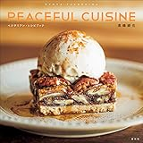

---
categories:
- ブログ
date: Wed, 13 Sep 2017 05:00:00 +0000
slug: post-10964
tags:
- おすすめ
- ブログ
title: 普段着ライブTシャツのぼくがオシャレれだと思うクリエーターを紹介
---

自分にはオシャレさがまったくない。いつもライブＴシャツ着てるしズボンも１つか２つしかもってない。靴もブーツともう一足しかないし、ベルトなんて一本しかない。服装とかにステータス振りをしなくなってからだいぶ経つ。あと表現するものもオシャレさとか清潔感とかなくて、どこかクセがある。そんなぼくが憧れるおしゃれだなぁぁぁああ！！！と思うクリエーターを本日はご紹介いたします。<!--more--><h2>料理系Youtuberの中でもひときわオシャレ「Peaceful Cuisine」</h2>

ビーガンってご存知でしょうか？単なるベジタリアンではなく、衣食住において極力動物性の使用を避ける完全なるベジタリアンのことです。

以下のサイトに詳細が載っていますので興味ある方はどうぞ
http://veganic.co.jp/veganism/

で、この「Peaceful Cuisine」というチャンネルをやっているタカシマリョウヤさんは有名なビーガンの料理人です。

基本的にはレシピ系の動画でオシャレな音楽と撮影で、見ているだけでも楽しめて癒しになるような動画ばかりです。

<iframe width="560" height="315" src="https://www.youtube.com/embed/NSKcuOwgRKY" frameborder="0" allowfullscreen></iframe>

<iframe width="560" height="315" src="https://www.youtube.com/embed/UVArzD88hmw" frameborder="0" allowfullscreen></iframe>

<iframe width="560" height="315" src="https://www.youtube.com/embed/_MFMOaaY89M" frameborder="0" allowfullscreen></iframe>

あとはDIY系も見てて楽しい。ってか手際がいい。そして、撮影しているキッチン自体が手作りという・・・オシャレ！！！

<iframe width="560" height="315" src="https://www.youtube.com/embed/AHJR62zmRPc" frameborder="0" allowfullscreen></iframe>

<iframe width="560" height="315" src="https://www.youtube.com/embed/mWP7cG8-nPA" frameborder="0" allowfullscreen></iframe>

<iframe width="560" height="315" src="https://www.youtube.com/embed/Az1hATb5JTs" frameborder="0" allowfullscreen></iframe>

旅動画ももうオシャレ！！

<iframe width="560" height="315" src="https://www.youtube.com/embed/zJRE01UFu6k" frameborder="0" allowfullscreen></iframe>

<iframe width="560" height="315" src="https://www.youtube.com/embed/t8dLyQl6cnk" frameborder="0" allowfullscreen></iframe>

最近レシピ本出したらしい。オシャレ！！

<a href="http://www.amazon.co.jp/exec/obidos/ASIN/4768308880/warawareotoko-22/" target="_blank" >高嶋綾也 PEACEFUL CUISINE ベジタリアン・レシピブック</a>
posted with <a href="http://kaereba.com" rel="nofollow" target="_blank">カエレバ</a>

高嶋 綾也 玄光社 2017-09-11    

<a href="http://www.amazon.co.jp/gp/search?keywords=peaceful&__mk_ja_JP=%E3%82%AB%E3%82%BF%E3%82%AB%E3%83%8A&tag=warawareotoko-22" target="_blank" >Amazon</a>

<a href="https://hb.afl.rakuten.co.jp/hgc/0f6e221b.2eb9748a.0f6e221c.35cc1e84/?pc=http%3A%2F%2Fsearch.rakuten.co.jp%2Fsearch%2Fmall%2Fpeaceful%2F-%2Ff.1-p.1-s.1-sf.0-st.A-v.2%3Fx%3D0%26scid%3Daf_ich_link_urltxt%26m%3Dhttp%3A%2F%2Fm.rakuten.co.jp%2F" target="_blank" >楽天市場</a>

<a href="//ck.jp.ap.valuecommerce.com/servlet/referral?sid=3041033&pid=882528283&vc_url=http%3A%2F%2Fsearch.shopping.yahoo.co.jp%2Fsearch%3Fp%3Dpeaceful&vcptn=kaereba" target="_blank" >Yahooショッピング</a>

<h2>monograph</h2>

ブロガーの堀口英剛さんのブログ

このブログはぼくがブログ始めるかどうかってあたりからずーーーっと見てます。以前はnumber333という名前だったのですが、そこから進化して今の形になっています。と、いっても当時からもおうずーーーーーっっとオシャレでオシャレで、一時期は同じブログテーマの「STINGER」というのを使っていた様ですが、もう原型がないくらいのオシャレカスタマイズをされていましたよ。

ぼくとはもうDNAからしてデキが違ってる。最近は会社立ち上げて独立したっぽいし。

オシャレがとどまるところを知らない。

<a href="https://number333.org/">https://number333.org/</a>

オシャレな人はインスタグラムもオシャレ

<blockquote class="instagram-media" data-instgrm-captioned data-instgrm-version="7" style=" background:#FFF; border:0; border-radius:3px; box-shadow:0 0 1px 0 rgba(0,0,0,0.5),0 1px 10px 0 rgba(0,0,0,0.15); margin: 1px; max-width:658px; padding:0; width:99.375%; width:-webkit-calc(100% - 2px); width:calc(100% - 2px);">
 
 

 
 <a href="https://www.instagram.com/p/BYVh7ytjpUB/" style=" color:#000; font-family:Arial,sans-serif; font-size:14px; font-style:normal; font-weight:normal; line-height:17px; text-decoration:none; word-wrap:break-word;" target="_blank">夏が終わる前に花火を上げないと。 #花火 #hanabi #fireworks #夏の終わり</a>
 
Hidetaka Horiguchiさん(@hidetaka_horiguchi)がシェアした投稿 - <time style=" font-family:Arial,sans-serif; font-size:14px; line-height:17px;" datetime="2017-08-28T11:50:17+00:00">2017  8月 28 4:50午前 PDT</time>

</blockquote>

monograph関連ですが「DRESSCODE」というブログもオシャレでした。

堀口英剛さん界隈の方でお友達？がやってるブログっぽい。普段は全くみないですが、この記事書くにあたって色々見てたら発見した。確かだいぶ前に見た時はPV低めという気がしてましたが、一貫したテーマでやってて、今はもう人気ブログのひたつになってた＿|￣|○

何より記事のサムネイルを雑誌の表紙みたいにしてるのとか、ほんっとにオシャレ

<a href="http://www.fukulow.info/">http://www.fukulow.info/</a>

<h2>そもそも服装に気を使わなくなったのはなぜか</h2>

で、ですね、ぼくがなんでオシャレじゃないかというとですね。優劣がでるからですわ。

人と同じような格好、大学くらいの時にいわゆる大学生っぽい格好がすごい嫌で、好きなブランドのお店にいって気に入ったものばかり買ってたんですが、そうすると割りとクセがでて、一般的じゃない、<strong>なんとなくへんな格好</strong>になっちゃったんですよね。

服にお金をかけてるわりにへんな格好という、もう、なんていうか意味がないことに気がついたんですわ。

ファッションって自分の感覚

VS

流行という目に見えない誰かが作ったようなもの

じゃないですか

<strong>自分と他人の感覚の折衷で服装を選ばなければいけない</strong>

もうそれがとてつもなく窮屈に感じた。

だったら自分が信じられる人や権威が作った自分にとって間違いないものを着た方がいいと思い、ライブTシャツを普段着にしようと考えたわけです。

あとはスティーブ・ジョブズとかも服いっつもいっしょじゃないですか。そういうのを考えるところにパワーを割きたくないなってぼくも思ったわけです。

あと、ライブTシャツは自分の所属を自ずと表明してくれる機能もあるので、そこも気に入ってます。

<h3>最近のDIR EN  GREYのツアーTシャツ普段着で着れない問題</h3>

しかしながら、最近のDIR EN GREYのライブTシャツには容認できない部分がある。それはデザイナーを入れて、本格的にアパレル化してしまったため、売れる商品への注力がすごいのである。つまり女性向けのTシャツが増えてしまい、男が普段着で着られる様な一般的なTシャツがないのた。ドルマンTシャツってやんだよ！きれねーよ！そんなの！そりゃグッズ買う人の10％くらいしか男っていないだろうけどさ！

だから最近はライブTシャツを買っておりません。

そろそろ、ボロボロになってきたので新しいのを買わないといけません。
どうしましょう。

<h2>しんぺーはこう思った。</h2>

って、なんやかんや言ってきましたが、結論です。

ぼくはオシャレじゃない。。。だから！！！オシャレな人が羨ましい！！！

というお話でした。

と言ったところで本日は以上になります。 
おやすみなさい。 
そして、また明日。