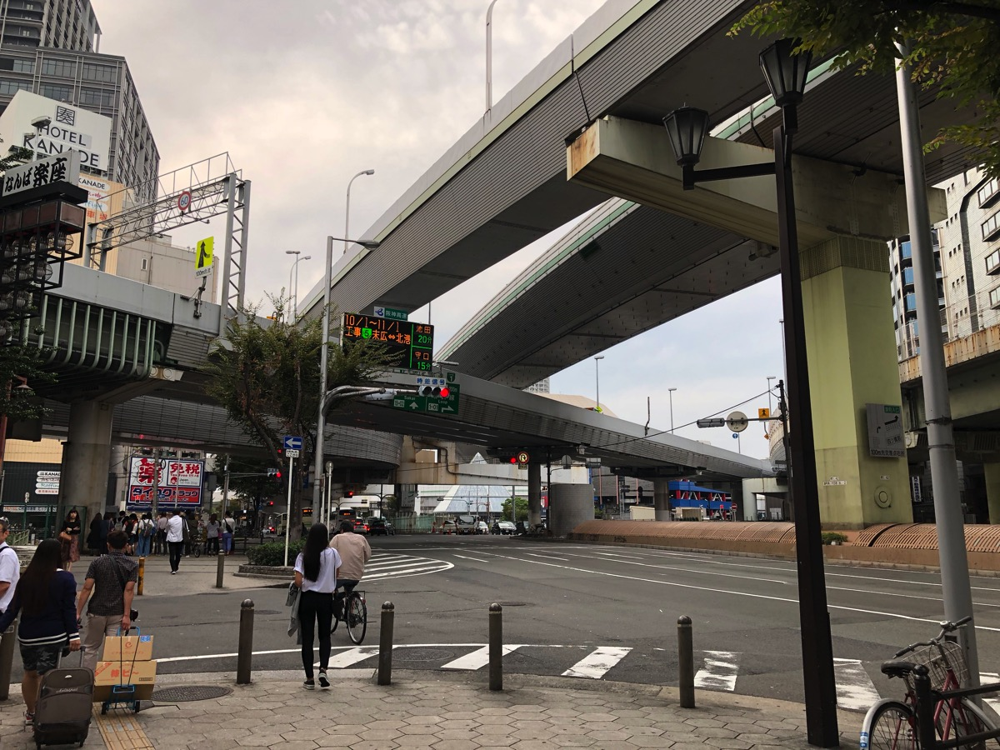
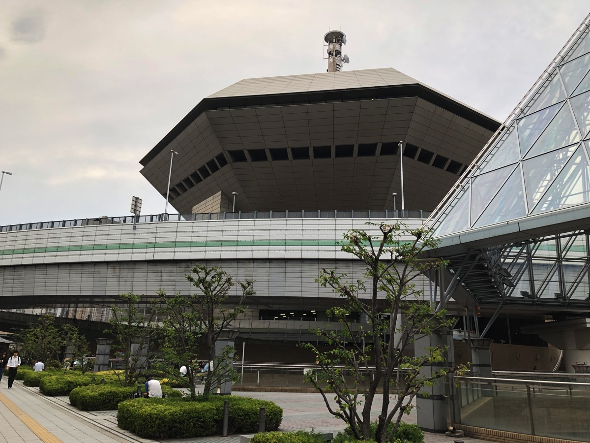
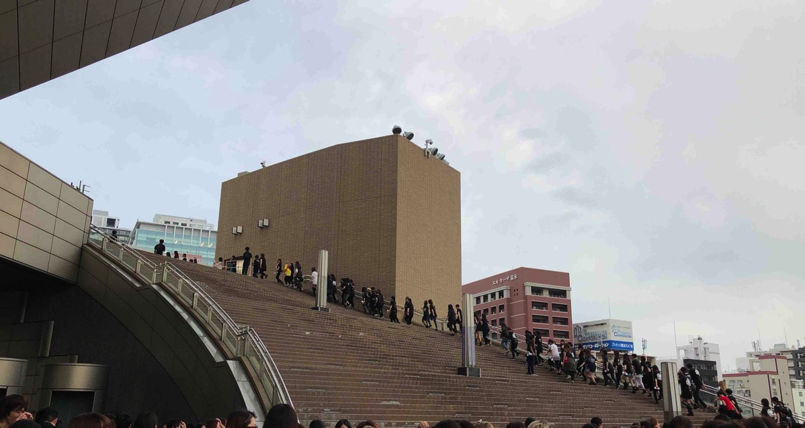
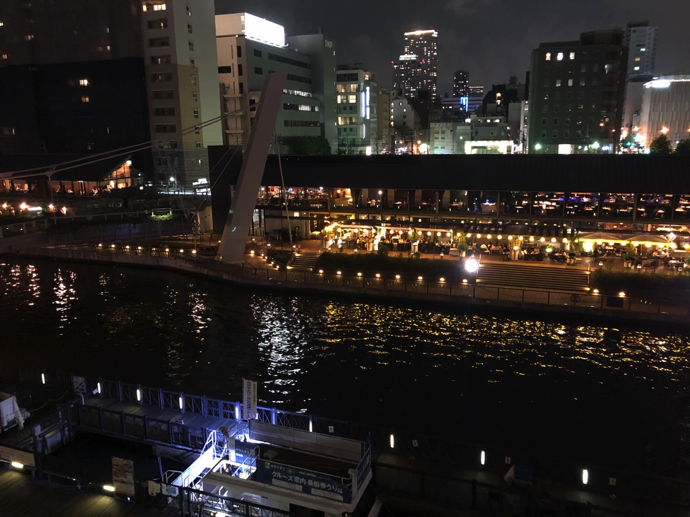
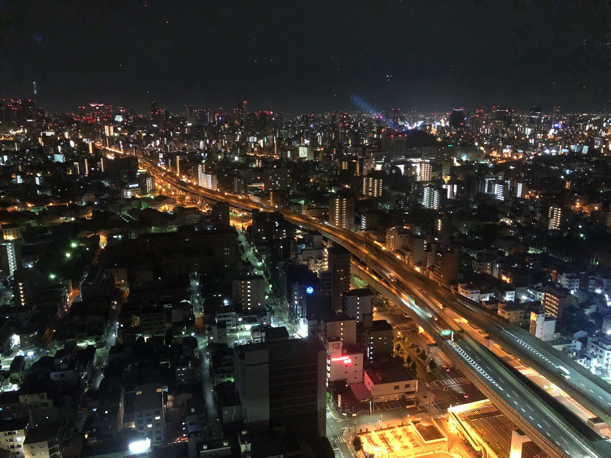
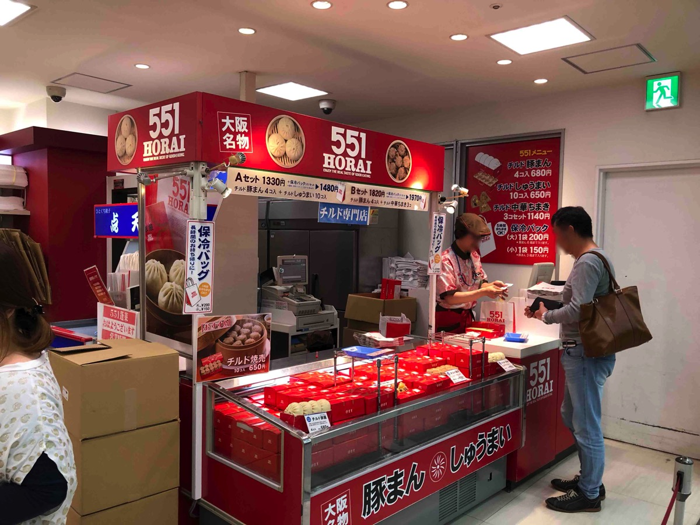

---
categories:
- DIR EN GREYのLIVEレポ
- TOUR16-17 [mode of Withering to death.]
date: Sat, 23 Sep 2017 16:30:45 +0000
slug: post-10984
tags:
- DIR EN GREY
- LIVEレポ
title: 【ライブレポ】DIR EN GREY TOUR16-17 FROM DEPRESSION TO ________ [mode of Withering
  to death.]2017_9_23@なんばHatch
---

DIR EN GREYのホームグラウンドと呼んで差し支えない「東のコースト、西のハッチ」ですが、ぼくなんばHatchには行ったことがありませんでした。そこで、今回ぼくの中でもっとも思い入れがある「Withering to death.」ということで、意を決して遠征いたしました。ということで、本日はなんばHatch初日のLIVEレポです。<!--more--><h2>大阪ってこんな場所だったんですね</h2>

運転マナー悪すぎてびびった。横断歩道渡るときに2人死にかけてたで。その直後、赤信号突っ込んできたタクシーに急ブレーキかけられたしwww　大阪怖すぎ！！
<h2>なんばHacthってこんなとこ</h2>

ライブハウスというよりも複合施設って感じでした。しかも作り自体はスタジオコーストなんかに比べると全然大きくて、どちらかというとZepp Tokyoとかに近い感じがしました。ただ施設自体は新しそうで、地下からそのままあがれたり、コンビニもあるし、周囲も繁華街で立地としてはパーフェクトぽい気がします。

入場は大きな階段で上がったところからでした。

あとツアーのデカい看板見つけられず

会場周辺の雰囲気がよい
<h2>LIVEレポ</h2>
会場内の作りもどんな具合かわからず、とりあえず下手後方から入っていって、下手前方にいったんですが、始まる前からぎゅうぎゅうでした。開演前恒例の謎押し発生後に、スタッフからさらに奥につめるように言われ圧縮圧縮。下手Toshiya前当たりまできてしまったものの、押しは激しくなく圧迫感はそこまでありませんでした。
<h3>メンバー衣装</h3>
メンバーの衣装はあまり記憶にありませんが、噂に聞いてた京のピンク三つ編みは見れませんでした。

ピンクのオールバックに左の分け目あたりから一筋だけ前髪を斜めに垂らしていました。あとはおそらく赤い口紅をジョーカーのごとく塗り散らしていました。途中まで黒いジャケットを着ていたような気がします。下はいつものスキニーの黒いパンツ。

途中下手になってきたDieのオミアシは、前回ツアーに引き続き片方だけあみタイツとセクシーな切り抜きがされたパンツでした。

Toshiyaはテッカテカのエナメル？パンツでした。

薫とShinyaの記憶があまりないです。薫は肩出しだった気がする。
<h3>セトリ</h3>
悲劇は目蓋を下ろした優しき鬱
Merciless Cult
GARBAGE
Machiavellism
愛しさは腐敗につき
懐春
禍夜想
孤独に死す、故に孤独
dead tree
鼓動
Jesus Christ R’n R
Beautiful Dirt
Spilled Milk
THE FINAL

EN.
G.D.S
朔
C
鱗
Un deux
詩踏み

ほぼ記憶なし。意識飛びかけてヤバいかなと思ったところで「愛しさは腐敗につき」がきて助かった。この流れの中で聴く「回春」「禍夜想」はすごいあってた。

メンバーの動きとかほぼ記憶なしだけど、「THE FINAL」のラストはかなり長かった。

そして、アンコールは「G.D.S」はじまりだったけど、周りの人あまり「気合い」コールしてなかった。

前のツアーの時から思ってたけどアンコールがめちゃくちゃ長く感じる。次ラストか？と思ったらまだ続くみたいな。
<h2>私のカワイイトラとウマ</h2>
ぼく自身1番好きな曲「鼓動」を久しぶりに聴けた。

「withering to death. 」はたぶん人生で1番つらかった時期に聴いていたアルバム。寝てないのに、それでも眠れなくて眠くなくて、暗くした部屋で親に聞こえないように声を殺して泣き叫んでた。その後に聞こえるのは、耳の奥に感じる血の流れだけ。

そして、青くひかるカーテンに無為に流れた時間を思う。

まさに「鼓動」はその時感じていたことそのものだった。

ライブ始まってからずっとそうだったけど、どれも泣きながら聴いた。
喉が潰れるほど叫んだ。過去の苦しむ自分に何か届けるように叫んだ。
結局今を生きるってことは過去を葬ることじゃなくて一緒にいきることなんだと思った。

そして、はじめて傷も何もかも一緒に抱えて、それを愛おしく思えた。過去に感じた「独り」という感覚すらかわいく思えた。

たぶん、これがぼくがこのブログを「私のカワイイトラとウマ」って変えた理由

過去と今がLIVEで繋がった感覚。この悟りの感覚を得るためにLIVEに通っている。

今日のLIVEはそういうLIVEだった。

<h2><a href="https://twitter.com/s_s_p_y">しんぺー</a>はこう思った。</h2>
大阪とても楽しかった。街の雰囲気とかもなんとなくよかった。エリアによって違うのかもしれないけど。難波のあたりはなんとなくよかったきがする。別に店とか入ってないけど。

あと、泊まったホテル周辺とにかく暴走族がひどかったー
夜中5分に一回は来てたぞ。マジで。

（攻殻機動隊感ある）

それと、大阪は土産が安いきがする！！色々探してたら「これはもしや！？」という店を発見。その昔、キリトの初ソロツアーでキリトが寄っていた肉まん屋ではと思い買いました！！

さて、次のぼくの次の予定は新規2daysと追加公演です！！！最後の過去ツアー！！悔いを残さないように頑張ります！

と言ったところで本日は以上になります。
おやすみなさい。
そして、また明日。