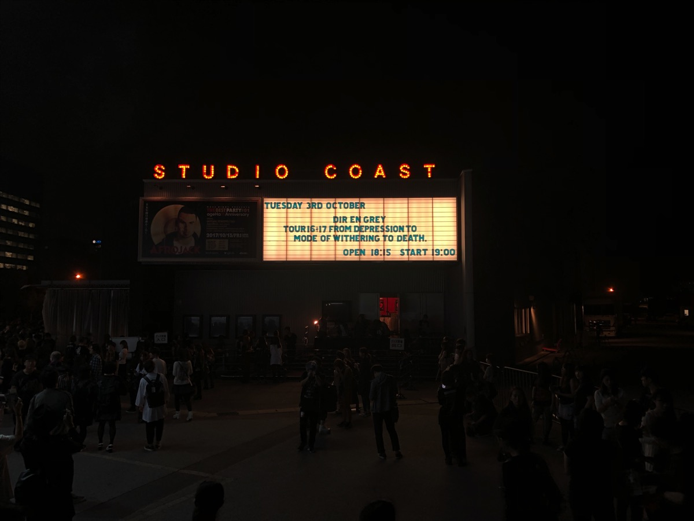
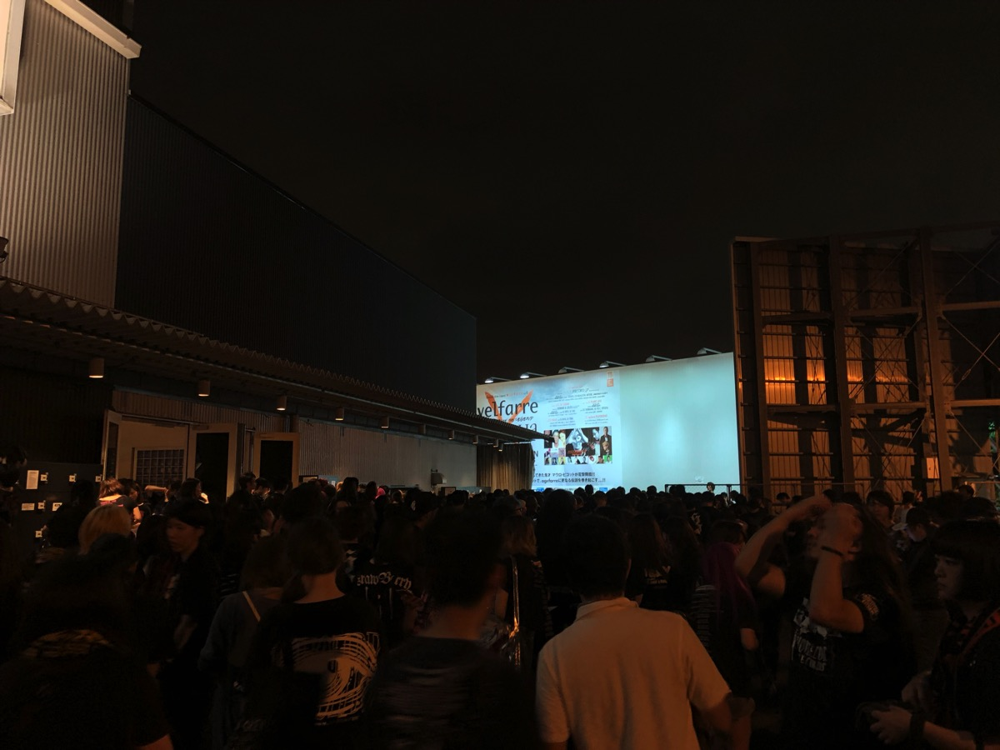
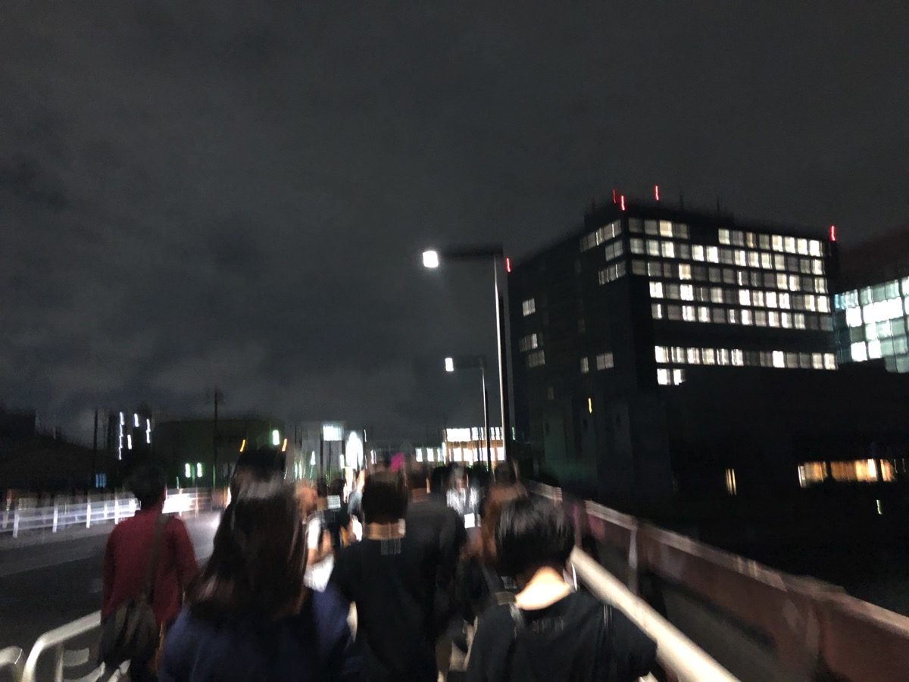
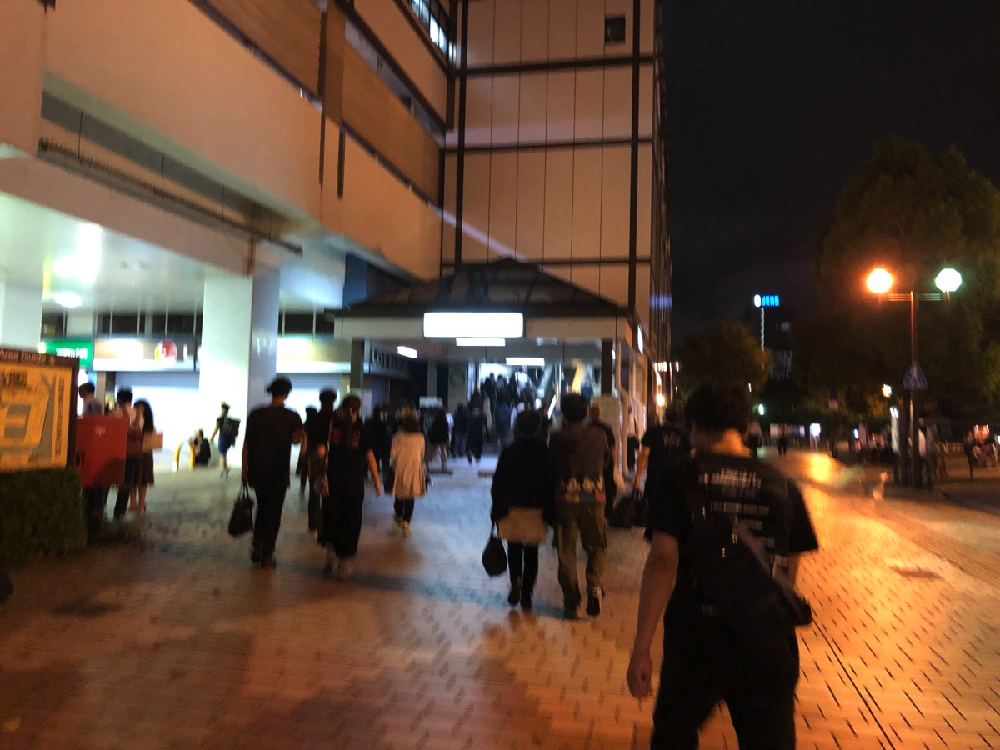
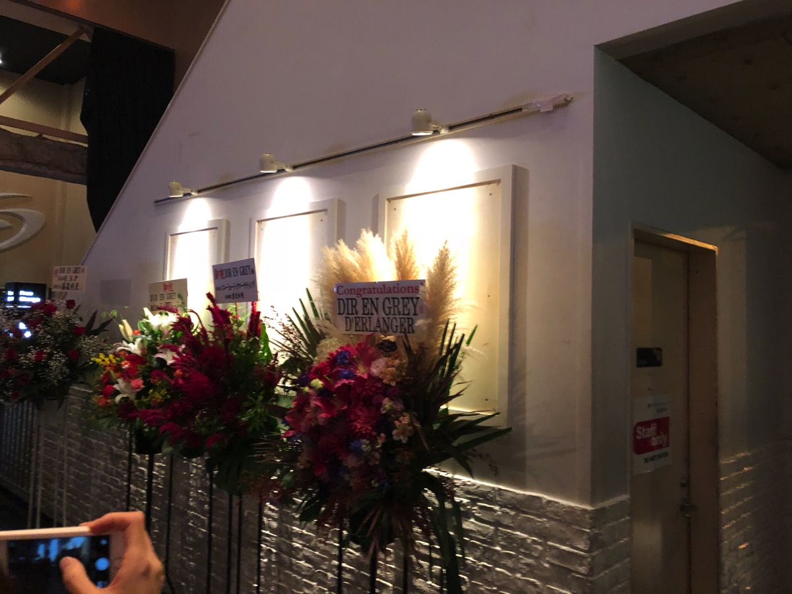

---
categories:
- DIR EN GREYのLIVEレポ
- TOUR16-17 [mode of Withering to death.]
date: Wed, 04 Oct 2017 11:14:00 +0000
slug: post-11107
tags:
- DIR EN GREY
- LIVEレポ
title: 【ライブレポ】DIR EN GREY TOUR16-17 FROM DEPRESSION TO ________ [mode of Withering
  to death.]2017_10_3@新木場スタジオコースト
---

涙で滲むことはなかった。ふと一瞬「Un duex」で泣きそうになったけど。

開演前の押しが発生するまでは、それなりにスペースもあった。1700番台で入場したので、柵より後ろで待機。開演前の謎押しは一度だけ、見えないところから聞こえてくるどよめく声と足音。とっさに流れに任せて、前に駆けると偶然柵の切れ目から柵前に侵入できた。近くもないけど遠くもない場所で、男の頭２つの間からステージをのぞく。

暗転すると映像が流れ、メンバーが登場

ここからはほぼ記憶がない。。。思い返せば、2日目よりも1日目の方が息苦しく、体力的にもつらかったのです。<!--more-->
<h2>セトリ</h2>
ぼくのwitherはハッチで終わってたのかも。ただ、それは過去のという意味合いに落ちて。
だから、どちらかというとぼくの中で今日のLIVEは新しいwitherツアーだった。だから、ハッチの時の様に涙がでなかったんだと思う。

Merciless Cult
朔
Machiavellism
Jesus Christ R’n R
愛しさは腐敗につき
悲劇は目蓋を下ろした優しき鬱
禍夜想
孤独に死す、故に孤独
deadtree
鼓動
Spilled Milk
Beautiful Dirt
Revelation of mankind
inferno

G.D.S
GARBAGE
C
THE FINAL
Sustain the Untruth
詩踏み

演出的なところでいうと今日新たに気がついたのは次の通り

禍夜想かな？スターウォーズ的な映、あと多分鼓動かReverationは新しい映像が混じってた気がしなくもない。違うかも。

（思い出してきた）

あと愛しさ〜腐敗の流れが神がかってた。
喜怒哀楽の感情の哀楽の間は、境界がなく悲しさの究極の表現は笑いなのかもしれないと感じさせられた。

「inferno」が全くなんの曲かわからず、ひたすら頭ふるようなことをしてた気がする。
終わってみて茫然自失で、すぐにアンコールを始めて、気がつけば終わってたという感じでした。

大阪のLIVEはアンコがめちゃくちゃ長く感じたけど、あっという間に終わった。
何回かぶったおれるんじゃないかというタイミングがありましたが、なんとか持ちこたえた。
<h2>新木場のジントニックはうまい</h2>
ところで、ぼくは居酒屋のジントニックじゃないジントニックが好きです。

特に新木場に行ったら必ず飲むようにしてます。LIVE終わりにそれを一気に飲み干して軽くなった足取りで駅までいくのが好き。ハツラツとした黒い後ろ姿を見ながら、駆け出しのバンドマンが配るビラをもらったりして。

この日はTheta忘れちゃったり、色々と準備が悪くなってしまった。着替えも忘れたし。
なので、次の日はしっかりと準備していこうと思いました。

そろそろ涼しい季節になってきたので、羽織るものと着替えは必須ですな。とはいえ、年内DIRのLIVEはないとのことなので、次は正月以降の真冬かしら。真冬のスタンディングのLIVEが一番持ち物に困る。

（D'ERLANGERからお花きてた）

とにかく楽しいLIVEでした！
<h2><a href="https://twitter.com/s_s_p_y">しんぺー</a>はこう思った。</h2>
本当に最近記憶できないくらい激しいLIVEばかりです。たまには後ろのほうでしっかりと見たいとは思いつつ、スタンディグだと前の方に突っ込んでしまう。

遠征するならホールのところをあえて狙っていくのもいいかも。そうしないと全体像見えないので。

ということで残りのLIVEも全力で頑張ります。

と言ったところで本日は以上になります。
おやすみなさい。
そして、また明日。