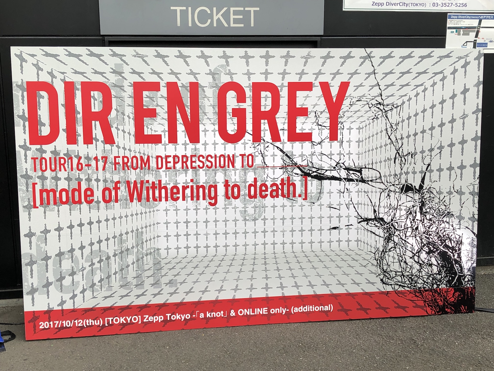

---
categories:
- DIR EN GREYのLIVEレポ
- TOUR16-17 [mode of Withering to death.]
date: Thu, 12 Oct 2017 21:09:11 +0000
slug: post-11143
tags:
- DIR EN GREY
- LIVEレポ
title: 【ライブレポ】DIR EN GREY TOUR16-17 FROM DEPRESSION TO ________ [mode of Withering
  to death.] a knot&OLonly2017_10_12@Zepp Tokyo
---

ついにDIR EN GREYの2年に及ぶ過去ツアー「mode of」シリーズが終了いたしました。発表された時は7つもあんのかよとか思ってましたが、終わって見ると本当に一瞬で終わりました。信じられない。この間に自分の時間も2年間経ってたのかと思うと重ねて信じられません。本日は10月12日のファンクラブ「a knot」とOL会員（オンラインw）限定の追加公演のLIVEレポとなります。<!--more-->前日に突然詳細発表されたベストアルバム「VESTIGE OF SCRATHES」ですが、それにより今日のLIVE終わりにベストアルバムツアーや日本武道館の発表があるんじゃないかとか勘ぐってました。

が、フタを開けてみるとLIVE終わりには何の告知もなし。本当にしばらく予定なしの充電期間のようです。

代わりに動きがあったのはsukekiyoのLIVE日程と虎の穴くらいで、みなさんほんとにしばらくお休みみたいです。
<h2>セトリとLIVEレポ</h2>

セットや衣装は大体今まで通りでした。

メンバーの登場はいつもの映像とともに始まりました。
朔、鼓動、Revelation of mankindの続き？一部改変？の映像で、今回初めて後方で落ち着いて全体感見たのでようやく把握しました。

時系列的には、主人公の男性(五十嵐優次郎)が腕から顔くらいまでトライバルのタトゥーを施し、黒髪だったことから、恐らくRevelationの後なのではないかと思われます。

「Where does our fortunate future come?」という朔の歌詩で締めくくられました。

いつもにも増して、感情的だった「悲劇〜」からの流れ。繰り返しマイクを落としこする音に、スイッチが入ったかのように涙がでました。そして、「孤独〜」にて、ついに京の自傷が発生。口に指を突っ込み、搔きむしり、頰を叩き汚れる口元。

ぼくにとって「wither〜」は最も思い入れがあるアルバムです。だから今回のツアー初参戦のハッチでは泣かずにはいられませんでした。
そしてそのあとに参戦した新木場2daysでは涙がでませんでした。それは自分の過去を過去として捉えることができたからです。

でも、この自傷を見て、泣かずにはいられませんでした。そこで確信したのは、傷は結局傷でしたかない。傷は消えないし痛みも消えない、そこに有る。そしてそれの意味づけが変わっただけ。痛いままそこにある。けどそれを愛おしく思えるかどうかになっただけ。

本編はinferno終わりかと思いきや、The FINAL
ラスト「さーーーーかせ」のあたりからマイクはずして叫んでた。最近見てて思うけどここのタイミングがドンピシャってのが最近ない気が・・・

最近のアンコールは本編くらい長く感じてましたが、もう終わりか！ってくらいあっという間に終了
京はソッコーではけて、他のメンバーが各自餌撒き

いつも通りすんなり終了と、Toshiyaもいつも通りお立ち台にあがって・・・と思ったら嫌に立ち位置を確認。
そうそう、ファイナルですからしっかりとインスタ映えを。。。っていきなりのバク宙wwwちょwおまwww村田さんちの長男かwww
※説明しよう、村田さんちの長男とはPIERROTボーカルキリトのことであり、彼はとあるLIVEにてバク転を披露。リハからずっと披露。アンコもバク転で登場。

いや、あんた、いくらファイナルだからって怪我したらどうすんのよwwwえ！？美しいお顔がぶつかったらどうするの！と思ったら着地失敗してた模様。笑ってた。
Dieはなぜかカープのユニホームに、キャップ、タオル。ジャイアンツファンじゃなかったっけ？ユニホームはOGATA？って書いてあった。野球はわからないので多分！

で、メンバーも颯爽とはけて、2年にわたる「TOUR16-17 FROM DEPRESSION TO ________ 」もついに終了！さて、ここから暗転して正月からのツアーの日程発表って思ったら何もなし！！！ダブルアンコが頭をよぎったけど、いつかのいきなりの追加公演でもやらなかったからな。と思って出口に向かうと「アンコール」の声が。こりゃしゃーない！駄目元！と思って戻ってアンコール

しばらくするとShinyaから登場。そして私服に着替えたっぽい京が「うっせーな」と言いながら登場、「うふっ」みたいな声出して笑ってた。

そしてダブルアンコは「Un duex」
映像はなし、合唱多め。やっぱり、カラオケ演出の歌詩表示なんかいらない。歌いたい時は歌う。

ひたすらいいLIVEでした。締めくくりにふさわしい本当にいいLIVEだった。

最後、京

「あー、しばらく空くと思うけど・・・」会場からはえーという声
「お前らのこと別に好きじゃねーから」

からの水が入った黒バケツを2つぶちまけてはけていきました。

Merciless Cult
朔
Machiavellism
愛しさは腐敗につき
悲劇は目蓋を下ろした優しき鬱
禍夜想
孤独に死す、故に孤独
deadtree
鼓動
Spilled Milk
Beautiful Dirt
Revelation of mankind
inferno
THE FINAL

EN.1
G.D.S
GARBAGE
C
Jesus Christ R’n R
Sustain the Untruth
詩踏み

EN.2
Un deux
<h2>次回予定告知なし！！！</h2>
そう、ツアーは本当になしwww

正月のベストアルバムくらいでDIR EN GREYとしては充電期間に入る模様

<blockquote class="instagram-media" style="background: #FFF; border: 0; border-radius: 3px; box-shadow: 0 0 1px 0 rgba(0,0,0,0.5),0 1px 10px 0 rgba(0,0,0,0.15); margin: 1px; max-width: 658px; padding: 0; width: calc(100% - 2px);" data-instgrm-captioned="" data-instgrm-version="7">

<a style="color: #000; font-family: Arial,sans-serif; font-size: 14px; font-style: normal; font-weight: normal; line-height: 17px; text-decoration: none; word-wrap: break-word;" href="https://www.instagram.com/p/BaJ5q1pFGNN/" target="_blank" rel="noopener noreferrer">[mode of]シリーズ最後のliveがついに終わってしまいました。このシリーズに参加してくれた全ての皆、本当にありがとう。そして俺等を支えてくれたツアースタッフの皆も本当にありがとう。また来年、逢いましょう。ありがとうZepp Tokyo。 Toshiya #DIRENGREY #modeofWitheringtodeath</a>

DIR EN GREYさん(@direngrey_official)がシェアした投稿 - <time style="font-family: Arial,sans-serif; font-size: 14px; line-height: 17px;" datetime="2017-10-12T16:29:35+00:00">2017 10月 12 9:29午前 PDT</time>

</blockquote>

<blockquote class="instagram-media" data-instgrm-captioned data-instgrm-version="7" style=" background:#FFF; border:0; border-radius:3px; box-shadow:0 0 1px 0 rgba(0,0,0,0.5),0 1px 10px 0 rgba(0,0,0,0.15); margin: 1px; max-width:658px; padding:0; width:99.375%; width:-webkit-calc(100% - 2px); width:calc(100% - 2px);">
 
 

 
 <a href="https://www.instagram.com/p/BaJpzRQg8cj/" style=" color:#000; font-family:Arial,sans-serif; font-size:14px; font-style:normal; font-weight:normal; line-height:17px; text-decoration:none; word-wrap:break-word;" target="_blank" rel="noopener noreferrer">ツアーファイナルZepp Tokyoお疲れ様でした！ 明日からDIRはしばらく充電期間に入るので、みんなも次に会う時までグッズのモバイルバッテリーで充電しといてね！ それではよいお年を！ #DIRENGREY#WitheringToDeath</a>
 
Shinya/DIR EN GREY/SERAPHさん(@shinya_official)がシェアした投稿 - <time style=" font-family:Arial,sans-serif; font-size:14px; line-height:17px;" datetime="2017-10-12T14:10:55+00:00">2017 10月 12 7:10午前 PDT</time>

</blockquote> 

代わりに複数の告知が！！

薫の虎の穴第3弾！！！！いやったー！！！
<blockquote class="twitter-tweet" data-lang="ja">

いやったーーー！！！！ <a href="https://t.co/C9457S14EU">pic.twitter.com/C9457S14EU</a>

— しんぺー@ (@s_s_p_y) <a href="https://twitter.com/s_s_p_y/status/918449885329833985?ref_src=twsrc%5Etfw">2017年10月12日</a></blockquote>

課題が残った今回の物販！！ってか最近の物販で問題が起こってるのは割とクオリティが上がってきた証拠なんじゃとか思ったり！
で、大人気のてるてるTシャツ黒バージョン！！！売るんかいwww買うわ！
<blockquote class="twitter-tweet" data-lang="ja">

てるてる黒出るんかいw w w w w <a href="https://t.co/CogPS7kYrB">pic.twitter.com/CogPS7kYrB</a>

— しんぺー@ (@s_s_p_y) <a href="https://twitter.com/s_s_p_y/status/918449847471968257?ref_src=twsrc%5Etfw">2017年10月12日</a></blockquote>

あとは京の個展とsukekiyoツアー

ちなみにですが、京がアンコの時にきてたTシャツはこちら

<a href="http://www.amazon.co.jp/exec/obidos/ASIN/B07516VN1K/warawareotoko-22/" target="_blank" rel="noopener noreferrer">ADICTS アディクツ - MONKEY / Tシャツ / メンズ 【公式 / オフィシャル】</a>

posted with <a href="http://kaereba.com" target="_blank" rel="nofollow noopener noreferrer">カエレバ</a>

<a href="http://www.amazon.co.jp/gp/search?keywords=ADICTS%20%E3%82%A2%E3%83%87%E3%82%A3%E3%82%AF%E3%83%84&amp;__mk_ja_JP=%E3%82%AB%E3%82%BF%E3%82%AB%E3%83%8A&amp;tag=warawareotoko-22" target="_blank" rel="noopener noreferrer">Amazon</a>

<a href="https://hb.afl.rakuten.co.jp/hgc/0f6e221b.2eb9748a.0f6e221c.35cc1e84/?pc=http%3A%2F%2Fsearch.rakuten.co.jp%2Fsearch%2Fmall%2FADICTS%2520%25E3%2582%25A2%25E3%2583%2587%25E3%2582%25A3%25E3%2582%25AF%25E3%2583%2584%2F-%2Ff.1-p.1-s.1-sf.0-st.A-v.2%3Fx%3D0%26scid%3Daf_ich_link_urltxt%26m%3Dhttp%3A%2F%2Fm.rakuten.co.jp%2F" target="_blank" rel="noopener noreferrer">楽天市場</a>

<a href="//ck.jp.ap.valuecommerce.com/servlet/referral?sid=3041033&amp;pid=882528283&amp;vc_url=http%3A%2F%2Fsearch.shopping.yahoo.co.jp%2Fsearch%3Fp%3DADICTS%2520%25E3%2582%25A2%25E3%2583%2587%25E3%2582%25A3%25E3%2582%25AF%25E3%2583%2584&amp;vcptn=kaereba" target="_blank" rel="noopener noreferrer">Yahooショッピング</a>

<h2>mode ofツアー参戦履歴</h2>
全15回、思ったよりも短いツアーで関東公演のみとかだと下手すると1日だけとかになりそうだったのもあってか今年は遠征頑張ったみたいです。
初めて沖縄にいったり、人生で数回目くらいの新幹線で大阪行ったり。楽しかったです。

過去の楽曲だけに思い入れが個人個人で違いします。そのためアレンジが入ってたりするとややこしくなるわけですが、ラジオかなんかで京が言ってましが「怒る人がいる」から。と言っても後半の方は御構い無しに歌詩変えやってた気がします。あと後半になればなるほどステージ上のセットがシンプルになっていきました。witherでは照明セットもほぼありませんでした。

また、最初の方は次のアルバムに入れるであろう新曲を2つくらいやってた記憶があります。それぞれのツアーに少しづつ投入して反応をみながら、変えていく的な。途中から一切やらなくなったなw

2016/7/2 TOUR16-17 FROM DEPRESSION TO ______ [mode of VULGAR]@新木場スタジオコースト
2016/7/4 TOUR16-17 FROM DEPRESSION TO ______ [mode of VULGAR]FINAL@Zepp Tokyo

2016/9/20 TOUR16-17 FROM DEPRESSION TO ________ [mode of DUM SPIRO SPERO]@中野サンプラザ
2016/9/21 TOUR16-17 FROM DEPRESSION TO ________ [mode of DUM SPIRO SPERO]@9/21中野サンプラザ

2016/11/8 TOUR16-17 FROM DEPRESSION TO ________ [mode of 鬼葬]a knot 男限定LIVE＠CLUB CITTA'
2016/12/6 TOUR16-17 FROM DEPRESSION TO ________ [mode of 鬼葬]＠新木場スタジオコースト

2017/2/9 TOUR16-17 FROM DEPRESSION TO ________ [mode of UROBOROS] ファイナル@国際フォーラムホールA

2017/4/22 TOUR16-17 FROM DEPRESSION TO ________ [mode of THE MARROW OF A BONE]@新木場スタジオコースト
2017/4/29 TOUR16-17 FROM DEPRESSION TO ________ [mode of THE MARROW OF A BONE]ファイナル@沖縄ミュージックタウン音市場
2017/7/25 TOUR16-17 FROM DEPRESSION TO ________ [mode of MACABRE]@中野サンプラザ

2017/7/31 TOUR16-17 FROM DEPRESSION TO ________ [mode of MACABRE]@ZeppTokyo

2017/9/23 TOUR16-17 FROM DEPRESSION TO ________ [mode of Withering to death.]@なんばHatch
2017/10/3 TOUR16-17 FROM DEPRESSION TO ________ [mode of Withering to death.]@新木場スタジオコースト
2017/10/4 TOUR16-17 FROM DEPRESSION TO ________ [mode of Withering to death.]@新木場スタジオコースト
2017/10/12 TOUR16-17 FROM DEPRESSION TO ________ [mode of Withering to death.]@Zepp Tokyo
<h2><a href="https://twitter.com/s_s_p_y">しんぺー</a>はこう思った。</h2>
ツアーが終わりましたが、色々と入金の締め切りや申し込みはあるので忘れない様にしないと！！
過去ツアーとかいいつつ懐かしさよりも、何か他のものがあった気がする。
また、新しいDIR EN GREYにあえるその日まで！貯金します！

思い出したくも戻りたくもない過去を思い出し、そして新たに意味付けることができた。これを成長と呼ぶなら、ぼくはこのツアーで成長できた気がします。
<blockquote class="twitter-tweet" data-lang="ja">

When next can I see you?

Who knows?

京

— DIR EN GREY (@DIRENGREY_JP) <a href="https://twitter.com/DIRENGREY_JP/status/918525689107660800?ref_src=twsrc%5Etfw">2017年10月12日</a></blockquote>

と言ったところで本日は以上になります。
おやすみなさい。
そして、また明日。

<a href="http://www.amazon.co.jp/exec/obidos/ASIN/B076D8HHKG/warawareotoko-22/" target="_blank" rel="noopener noreferrer">【Amazon.co.jp限定】VESTIGE OF SCRATCHES(初回生産限定盤)(Blu-ray Disc付)(Amazon.co.jp限定:ポストカード+早期予約特典:スタッフパスレプリカステッカー付)</a>
posted with <a href="http://kaereba.com" rel="nofollow noopener noreferrer" target="_blank">カエレバ</a>

DIR EN GREY SMM itaku (music) 2018-01-02    

<a href="http://www.amazon.co.jp/gp/search?keywords=vestige%20of%20&__mk_ja_JP=%E3%82%AB%E3%82%BF%E3%82%AB%E3%83%8A&tag=warawareotoko-22" target="_blank" rel="noopener noreferrer">Amazon</a>

<a href="https://hb.afl.rakuten.co.jp/hgc/0f6e221b.2eb9748a.0f6e221c.35cc1e84/?pc=http%3A%2F%2Fsearch.rakuten.co.jp%2Fsearch%2Fmall%2Fvestige%2520of%2520%2F-%2Ff.1-p.1-s.1-sf.0-st.A-v.2%3Fx%3D0%26scid%3Daf_ich_link_urltxt%26m%3Dhttp%3A%2F%2Fm.rakuten.co.jp%2F" target="_blank" rel="noopener noreferrer">楽天市場</a>

<a href="//ck.jp.ap.valuecommerce.com/servlet/referral?sid=3041033&pid=882528283&vc_url=http%3A%2F%2Fsearch.shopping.yahoo.co.jp%2Fsearch%3Fp%3Dvestige%2520of%2520&vcptn=kaereba" target="_blank" rel="noopener noreferrer">Yahooショッピング</a>

