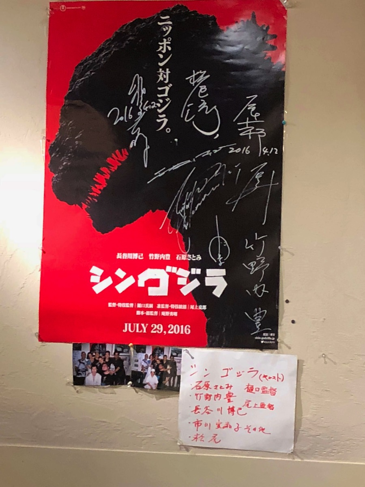

---
categories:
- グルメ
date: Wed, 01 Nov 2017 16:33:38 +0000
slug: post-11198
tags:
- グルメ
title: 東京駅〜神田周辺のおすすめランチ（2017.11.02更新）
---

随時更新する予定の記事です。とりあえず50~100店舗くらいまで書き溜めてそのあとで整理していこうと思います！それにしても東京駅周辺ってのは飲食店が多い！さすが種軍様のお膝元と呼ばれて400年以上、渋谷新宿なんていう田舎とはわけが違いますね。老舗や新規店が軒を連ねて、毎日嬉しすぎて発狂しそうな気持ちを抑えるのに必死です。ではとりあえず行った順にご紹介します！<!--more--><h2>肉「肉友」</h2>

吉祥寺にある予約が3ヶ月先まで取れない肉の聖地「肉山」プロデュース店です。

参考：<a href="https://www.warawareotoko.com/2014/06/25/post-5779/">完全予約制の高級焼肉屋吉祥寺「肉山」サッパリとしたお肉がこれからの季節にピッタリ</a>

厳かな路地裏にひっそりとありました。ってかひっそりしすぎてて、３周くらいしてやっとみつけました。

ビル自体はどう考えても高級な感じ

思わず、ランチでほぼお客さんいないのに「予約してないんですけど入れますか？」とか聞いちゃいました。

こいつがランチの定食です。日替わりです。サラダとご飯がお代わりし放題で1000円です。

はい、アップ

夜は高級な感じですので
<iframe src="https://www.google.com/maps/embed?pb=!1m18!1m12!1m3!1d3240.5732146340306!2d139.76855031529453!3d35.68750938019276!2m3!1f0!2f0!3f0!3m2!1i1024!2i768!4f13.1!3m3!1m2!1s0x60188bff843e85dd%3A0x800dd6e7b8f3407b!2z5pel5pys5qmLIOiCieWPiw!5e0!3m2!1sja!2sjp!4v1509552260650" width="600" height="450" frameborder="0" style="border:0" allowfullscreen></iframe>

<h2>つけ麺「めん徳二代目つじ田 日本橋八重洲店」</h2>

東京三代つけ麺の一角「つじ田」です。魚介の感じが結構つよかった。魚介の香りにゆずが際立つ感じでした。ぼくは魚介系あんまり好きではないので、そこまでという印象でした。

明らかに行列ができるようで、店の前にレーンがありました。夕方の16時くらいにいったのでほぼお客さんゼロ人でした。

<iframe style="border: 0;" src="https://www.google.com/maps/embed?pb=!1m18!1m12!1m3!1d3240.777709664725!2d139.76953691525875!3d35.68247508019401!2m3!1f0!2f0!3f0!3m2!1i1024!2i768!4f13.1!3m3!1m2!1s0x60188bfdeaae4297%3A0x3dc00b75ddc95be!2z44KB44KT5b6z5LqM5Luj55uu44Gk44GY55SwIOaXpeacrOapi-WFq-mHjea0suW6lw!5e0!3m2!1sja!2sjp!4v1509236797846" width="600" height="450" frameborder="0" allowfullscreen="allowfullscreen"></iframe>

<h2>つけ麺「なな蓮」</h2>

魚介系だけどお酢がほんのりきいています。が、ちょっと微妙かな。うまい！ってほどではなかった。チャーシューを食べるまでは・・・

チャーシューがうまかった。さかな？？？ってくらいの歯ごたえの柔らかさ！おいしかった

<iframe src="https://www.google.com/maps/embed?pb=!1m18!1m12!1m3!1d3240.693490460105!2d139.7736897152589!3d35.68454848019348!2m3!1f0!2f0!3f0!3m2!1i1024!2i768!4f13.1!3m3!1m2!1s0x601889568ed72e91%3A0xe571502fbf1682b5!2z44Gq44Gq6JOu!5e0!3m2!1sja!2sjp!4v1509551056532" width="600" height="450" frameborder="0" style="border:0" allowfullscreen></iframe>

<h2>つめ麺「六厘舎」</h2>

いい意味でも一般化されたつけ麺ですね。有名店です。今やロードサイドにドライブスルーもあるような感じです。魚介の感じはなな蓮の方が強かったかな。まぁ、うまいというか普通かな。東京駅のラーメンストリート内にありますので結構並びます。

<iframe src="https://www.google.com/maps/embed?pb=!1m18!1m12!1m3!1d3240.8755430578867!2d139.7656193508603!3d35.68006638009743!2m3!1f0!2f0!3f0!3m2!1i1024!2i768!4f13.1!3m3!1m2!1s0x60188bfeba8313b7%3A0x9a9993c592e5429c!2z5YWt5Y6Y6IiN!5e0!3m2!1sja!2sjp!4v1509551085360" width="600" height="450" frameborder="0" style="border:0" allowfullscreen></iframe>

<h2>肉「とよだ」</h2>
1620円のステーキ定食200g

ランチでもちゃんとした値段で出す格式高いお店です。おじさん〜おじいさんくらいの人が多かった。カキフライがたぶん売りの店なんだろうな。にもかかわらずステーキを注文しました。

赤い色は新鮮な証拠

はい、アップ。うまし

<iframe src="https://www.google.com/maps/embed?pb=!1m18!1m12!1m3!1d3240.8235706715163!2d139.76818895086026!3d35.68134598009712!2m3!1f0!2f0!3f0!3m2!1i1024!2i768!4f13.1!3m3!1m2!1s0x60188bfdad43e1f5%3A0xa10d867737a473b9!2z44Go44KI44Gg!5e0!3m2!1sja!2sjp!4v1509551746753" width="600" height="450" frameborder="0" style="border:0" allowfullscreen></iframe>

<h2>寿司「創作鮨処タキモト」</h2>

こちらも東京駅地下から大丸？の方にいったらありました。これで1680円。でかいし、うまい

はい、アップ。書いててお腹減ってきた。。。うまかったです。

<iframe src="https://www.google.com/maps/embed?pb=!1m18!1m12!1m3!1d3240.8284731061744!2d139.76641725086034!3d35.68122528009708!2m3!1f0!2f0!3f0!3m2!1i1024!2i768!4f13.1!3m3!1m2!1s0x60188bfc14952231%3A0x52557072bbd6be8d!2z44K_44Kt44Oi44OI!5e0!3m2!1sja!2sjp!4v1509551845058" width="600" height="450" frameborder="0" style="border:0" allowfullscreen></iframe>

<h2>カレー「らいん」</h2>

860円の辛口ビーフカレー。さっぱりとしててそれほど辛くはなかった。さくっと入ってさくっと食べられる。老舗という感じで素朴さがいいのかもしれない。個人的には少しピンとこなかったかな。

<iframe src="https://www.google.com/maps/embed?pb=!1m18!1m12!1m3!1d51847.37115893634!2d139.7326801504045!3d35.69027908873832!2m3!1f0!2f0!3f0!3m2!1i1024!2i768!4f13.1!3m3!1m2!1s0x60188955d227f47d%3A0x8914c97e7d032dc3!2z44KJ44GE44KT!5e0!3m2!1sja!2sjp!4v1509551674708" width="600" height="450" frameborder="0" style="border:0" allowfullscreen></iframe>

<h2>カレー「GROW」</h2>

カレー縛りで歩いてて、ふと目について入りました。オシャンティな店でした。夜はきっと女性や合コンの人たちが多いんでしょうね

で、出てきたカレーがこちら、一見量が少ないかなと思いましたが、コクがあってしっかりとしたカレーでした。A5ランクの牛肉を使っているらしいです。850円。

どうでしょう、おしゃれな雰囲気でしょ

<iframe src="https://www.google.com/maps/embed?pb=!1m18!1m12!1m3!1d51847.364566575394!2d139.73285184789015!3d35.690289230688805!2m3!1f0!2f0!3f0!3m2!1i1024!2i768!4f13.1!3m3!1m2!1s0x0%3A0x42c93a6499e77f0e!2z54S86IKJ44OA44Kk44OL44Oz44KwR1JPVw!5e0!3m2!1sja!2sjp!4v1509551636504" width="600" height="450" frameborder="0" style="border:0" allowfullscreen></iframe>

<h2>パスタ「五右衛門」</h2>

どこにでもあるパスタ屋です。意外とこの周辺パスタ屋が少ない気がしなくもない。ちょっと高級な感じのイタリアンはあるんですけど、探せてないだけかな。カルボナーラです。

<iframe src="https://www.google.com/maps/embed?pb=!1m18!1m12!1m3!1d12961.840262309159!2d139.75922384854738!3d35.690294641901666!2m3!1f0!2f0!3f0!3m2!1i1024!2i768!4f13.1!3m3!1m2!1s0x0%3A0xc35a31a181902d72!2z5rSL6bq65bGLIOS6lOWPs-ihm-mWgA!5e0!3m2!1sja!2sjp!4v1509551607756" width="600" height="450" frameborder="0" style="border:0" allowfullscreen></iframe>

<h2>鯨「くじらのお宿一乃谷」</h2>

ぼく一番好きな食べ物って鯨の刺身なんです。

で、ここ美味しすぎて3日連続で行きました。

鯨の刺身

はい、アップ。今の人ってきっと鯨とか食べたことないんでしょう？？

これ焼いてある鯨。つまりステーキ

はい、アップ。鯨は油が少ないのでカロリーも低くて他のお肉よりも体にいいらしい。これ食べた日は雨でお客が誰もいなかったので、大将が資料引っ張り出してぼくにプレゼンをし出しましたw

竜田揚げ

はい、アップ。かりっかり

ちなみに著名人もよく来る店らしい。シンゴジラの監督やら著名な作家とかも来るらしい。

ということでランチ全部980円。やっすううううう！！！！

<iframe src="https://www.google.com/maps/embed?pb=!1m18!1m12!1m3!1d3240.4600518379925!2d139.7658167508607!3d35.69029498009489!2m3!1f0!2f0!3f0!3m2!1i1024!2i768!4f13.1!3m3!1m2!1s0x60188c01497fec6b%3A0xd1fadef01a78d43a!2z44GP44GY44KJ44Gu44GK5a6_IOS4gOS5g-iwtw!5e0!3m2!1sja!2sjp!4v1509551568807" width="600" height="450" frameborder="0" style="border:0" allowfullscreen></iframe>

<h2>うなぎ「日本橋いづもや」</h2>

ちゃんとした、もうそれはちゃんとした鰻屋さんです。国産のうなぎを使ってて、タレで味をごまかしたりはしていません。薄味で素材の味で勝負してます。ただ、値段はうなぎにしては良心的で1836円

<iframe src="https://www.google.com/maps/embed?pb=!1m18!1m12!1m3!1d3240.5653094115764!2d139.76878331529446!3d35.6877039801928!2m3!1f0!2f0!3f0!3m2!1i1024!2i768!4f13.1!3m3!1m2!1s0x60188bff88a6ee41%3A0x23f36945d54631ea!2z44GE44Gl44KC44KE5pys5bqX5pys6aSo!5e0!3m2!1sja!2sjp!4v1509553524015" width="600" height="450" frameborder="0" style="border:0" allowfullscreen></iframe>

<h2><a href="https://twitter.com/s_s_p_y">しんぺー</a>はこう思った。</h2>

随時更新していきますんで！！！毎月頭に更新します！

あーもう美味しいお店が多すぎて発狂しそう！！

ランチ食べに会社行ってます！

と言ったところで本日は以上になります。 
おやすみなさい。 
そして、また明日。