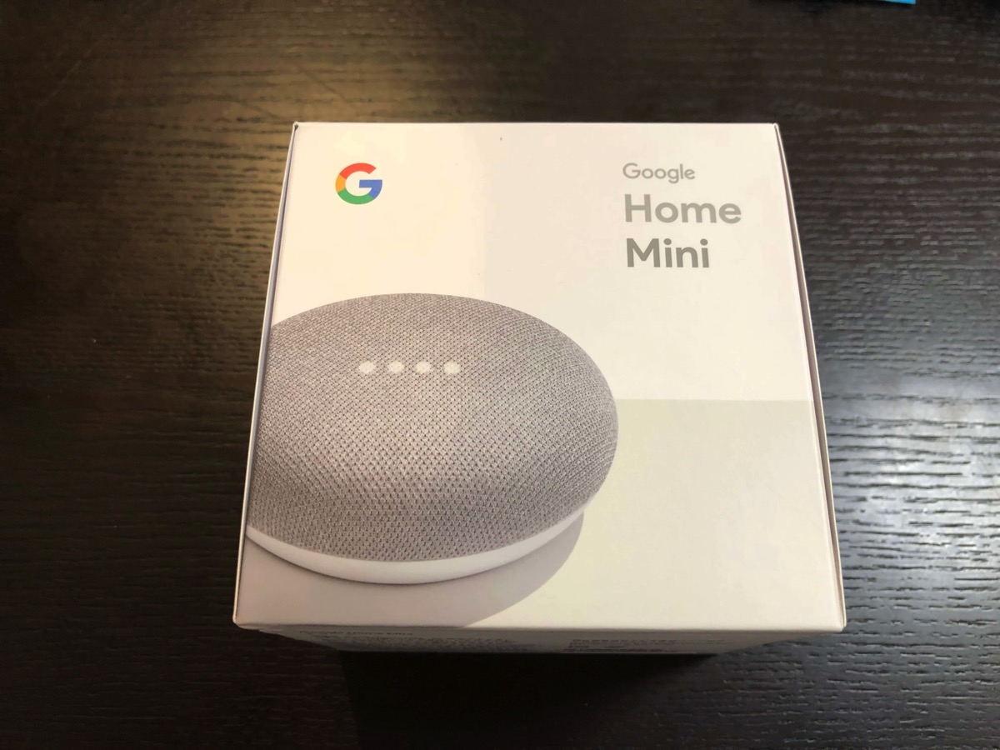
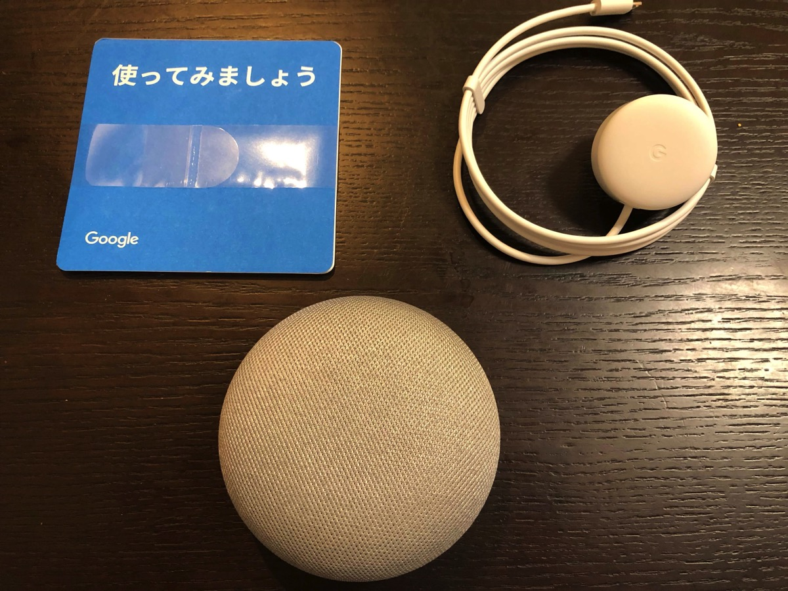
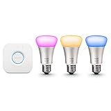
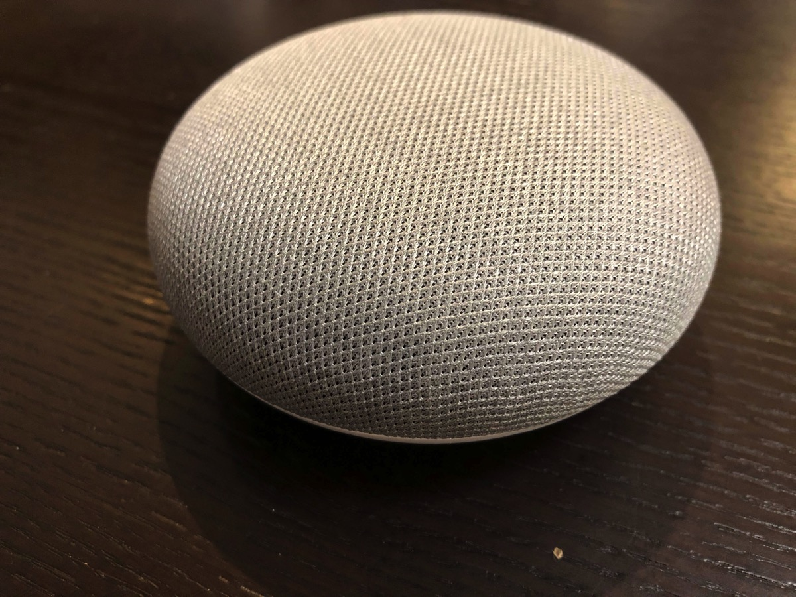

---
categories:
- レビュー
date: Mon, 30 Oct 2017 15:51:48 +0000
slug: post-11255
tags:
- Google Home
title: 【レビュー】Google Homeは生活に音楽を思い出させてくれるガジェット
---

グーグルホームミニというガジェットを購入しました。最近話題のスマートスピーカーというやつです。買ってみて意外にも日々の生活が少しいい感じになった気がするので、今日はそのご紹介です。<!--more--><h2>Google Homeとは？</h2>

Google HomeとはGoogleから発売されたスマートスピーカーです。音声で操作し、単独であらゆる指示に対し応えてくれます。質問をすると調べてくれたり、音楽やradiko、最新の天気予報やニュースを流してくれたりします。また、対応機器が家の中にあると電気を点けたり消したり、エアコンのスイッチを点けたり消したりなんかもしてくれます。

<h3>今のところ使っている機能</h3>

連携できるスマート家電を持っていません。

例えばchromecastなんかをテレビに接続していれば、音声一発で好きな動画を再生できたりするようです。

また、スマートライトなんかをつけていれば「OK Google　電気消して」とかで消灯したりつけたりできるみたいです。

<a href="http://www.amazon.co.jp/exec/obidos/ASIN/B01C6S7DDU/warawareotoko-22/" target="_blank" >Philips Hue(ヒュー) スターターセット v2   929001156101</a>
posted with <a href="http://kaereba.com" rel="nofollow" target="_blank">カエレバ</a>

 Philips(フィリップス) 2016-04-06    

<a href="http://www.amazon.co.jp/gp/search?keywords=Philips%20Hue%28%E3%83%92%E3%83%A5%E3%83%BC%29%20%E3%82%B9%E3%82%BF%E3%83%BC%E3%82%BF%E3%83%BC%E3%82%BB%E3%83%83%E3%83%88&__mk_ja_JP=%E3%82%AB%E3%82%BF%E3%82%AB%E3%83%8A&tag=warawareotoko-22" target="_blank" >Amazon</a>

<a href="https://hb.afl.rakuten.co.jp/hgc/0f6e221b.2eb9748a.0f6e221c.35cc1e84/?pc=http%3A%2F%2Fsearch.rakuten.co.jp%2Fsearch%2Fmall%2FPhilips%2520Hue%2528%25E3%2583%2592%25E3%2583%25A5%25E3%2583%25BC%2529%2520%25E3%2582%25B9%25E3%2582%25BF%25E3%2583%25BC%25E3%2582%25BF%25E3%2583%25BC%25E3%2582%25BB%25E3%2583%2583%25E3%2583%2588%2F-%2Ff.1-p.1-s.1-sf.0-st.A-v.2%3Fx%3D0%26scid%3Daf_ich_link_urltxt%26m%3Dhttp%3A%2F%2Fm.rakuten.co.jp%2F" target="_blank" >楽天市場</a>

<a href="//ck.jp.ap.valuecommerce.com/servlet/referral?sid=3041033&pid=882528283&vc_url=http%3A%2F%2Fsearch.shopping.yahoo.co.jp%2Fsearch%3Fp%3DPhilips%2520Hue%2528%25E3%2583%2592%25E3%2583%25A5%25E3%2583%25BC%2529%2520%25E3%2582%25B9%25E3%2582%25BF%25E3%2583%25BC%25E3%2582%25BF%25E3%2583%25BC%25E3%2582%25BB%25E3%2583%2583%25E3%2583%2588&vcptn=kaereba" target="_blank" >Yahooショッピング</a>

あと、ちょっと工夫すればエアコンのスイッチもつけたりけしたりなんてこともできそうです。

が、今のところそういった類のものをもっていないので、もっぱら「OK Google　今日の天気は？」ってのと無駄に「OK　Google　にゃんにゃん」くらいです。

にゃんにゃんっていうとネコの鳴き声をしてくれます。

スマート家電どれも高価だからなかなか買えない。

<h2>Google Homeは生活に音楽を思い出させてくれた</h2>

<blockquote class="twitter-video" data-lang="ja">
ok google DIR EN GREYのこの胸の中で絡みついた灼熱の闇を流して <a href="https://t.co/loRgKIsQhp">pic.twitter.com/loRgKIsQhp</a>
&mdash; しんぺー (@s_s_p_y) <a href="https://twitter.com/s_s_p_y/status/923202232564162566?ref_src=twsrc%5Etfw">2017年10月25日</a></blockquote>

で、なんだかんだですっごい重宝しているのがこれ「OK Google 音楽を流して」

ぼくは普段Google Play Musicで音楽を聴いています。有料課金して、持っている音源を全てクラウドにアップして、ストリーミングで聴いています。Google HomeもPlay Musicに連携させているんですが、普段のぼくの趣味嗜好を学習してくれているのか、ぼくの気にいるような曲しか流してくれません。

が、それが微妙に普段会社の行き帰りとかだけじゃ聴かないような曲ばかりなんです。普段はDIR EN GREYかsukekiyoしか聴きません。クラウドにアップしてから全く聴かなくなった曲や、下手したらレンタルしてきてPCに取り込んでそのまま聴いたことがないような曲だってあるでしょう。

そういった曲たちを普段の生活の中に染み渡らせてくれる、Google Homeはそんな存在でした。

<h3>音質はどうなのか</h3>

Google Homeには今のところ2種類のモデルが発売されています。

Google HomeとGoogle Home miniです。違いはスピーカーの大きさとタッチの時の操作性のみです。ぶっちゃけ、ぼくはあまり音質とかこだわらないタイプなんですが、だからそこまで気になりません。というか、がっつり音楽を聴くという用途で使っているわけではないので、小さなスピーカーで十分でしょう。

<strong>結論、気にならない</strong>

<h2><a href="https://twitter.com/s_s_p_y">しんぺー</a>はこう思った。</h2>

実はぼく、Google Homeが先に出たのでこっちを買いましたが、本当に欲しいのはAmazonのスマートスピーカー「Amazon Echo」です。基本機能はGoogle Homeとかわりありませんが、EchoはAmazonでのお買い物もできちゃうのです。

そこがいい。音声一発で注文できるというのはなんとも便利ではありませんか。

あと、テレビにFire Stickを装着しているので、そこの連携もしたいのです。

でも、まあだからといってEchoを買ってもGoogle Homeは手放さずに寝室専用とかもしくは、同じ部屋で併用するかもしれません。Play Music専用機としてもいいかも。

少しでも興味がある人は買って損がない製品だと思います。おすすめです。

と言ったところで本日は以上になります。 
おやすみなさい。 
そして、また明日。

<a href="https://hb.afl.rakuten.co.jp/hgc/121ed5e1.954a9ce3.121ed5e2.9fc704ba/?pc=https%3A%2F%2Fitem.rakuten.co.jp%2Fbook%2F15182442%2F" target="_blank" >Google Home Mini チョーク（グーグル ホーム ミニ チョーク）</a>
posted with <a href="http://kaereba.com" rel="nofollow" target="_blank">カエレバ</a>

<a href="https://hb.afl.rakuten.co.jp/hgc/0f6e221b.2eb9748a.0f6e221c.35cc1e84/?pc=http%3A%2F%2Fsearch.rakuten.co.jp%2Fsearch%2Fmall%2Fgoogle%2520home%2F-%2Ff.1-p.1-s.1-sf.0-st.A-v.2%3Fx%3D0%26scid%3Daf_ich_link_urltxt%26m%3Dhttp%3A%2F%2Fm.rakuten.co.jp%2F" target="_blank" >楽天市場</a>

<a href="//ck.jp.ap.valuecommerce.com/servlet/referral?sid=3041033&pid=882528283&vc_url=http%3A%2F%2Fsearch.shopping.yahoo.co.jp%2Fsearch%3Fp%3Dgoogle%2520home&vcptn=kaereba" target="_blank" >Yahooショッピング</a>

<a href="http://kakaku.com/search_results/google%20home/" target="_blank" >価格.com</a>

