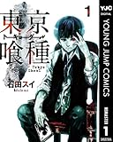

---
categories:
- ブログ
date: Thu, 02 Nov 2017 15:16:09 +0000
slug: post-11275
tags:
- ブログ
title: 大人になるってことは想像力をつけるってことなのかも
---

大人になることって、もしかして想像力をつけるってことなのかもと思った。相手の立場や知り得ない情報に想いを巡らして想像すること、それが大人になるってことなのかと思った。<!--more-->例えば明らかに理不尽な仕事とを依頼されて、突き返したり断ったりしたとして、でとそれは相手の後ろにお客さんがいて無理難題を言っていたり•••

その人自身に何度言っても同じような事でミスしたり、直らなかったり。それってもしかしてそういう障害が何かしらあるんじゃなかろうか。人間には得手不得手とあって、出来ることと出来ないことがあるんじゃないのか•••

最近ふとそう思う瞬間があった。

大人になるって他人に寛容になるってことなのかもとか思ってたけど、そうではないかも。
丸くなったとかって別に苛立ちとか血の気がなくなるようなことじゃなくて、爆発する回数が減るってことなのかもしれない。見えてない部分に想像を巡らせるようになったってのが正しい表現かも。

あまりに頭ごなしに相手に不満を述べたり怒りをぶつけても何も変わらない。だったら、何か変えられない力が働いていてそうなってるのかもとか想像して、見えない部分の絵を描くようにしたら、なんとなく大人になるってこいう想像力を持つことなのかなとなんとなく思いました。

ただ、だからと言ってそれを忖度するかどうかは別かなとも思うけどね。

人間は経験の生き物だと思う。とくに愚者は経験に学ぶじゃないけど、賢者じゃなければなおさら。
自分の経験と照らし合わせて、見えてない部分を補う。それでもって、もっと大局観でじゃあ自分はどうしてくれようかとか、先立って行動起こしておいたりとか、それくらいまでできればもっといいのかな。

ここまで考えて初めてあの言葉の真意もなんとなくわかってきたかも。
「他人は変えられないけど自分は変えられる」的なあれ。

まぁふとそんなことを思ったのでした。
<h2><a href="https://twitter.com/s_s_p_y">しんぺー</a>はこう思った。</h2>
でも、あんまりこの言葉好きじゃない。同じような意味合いだとあれの方が好き。東京喰種の「君の未熟さも想定済みさ」みたないやつ

と言ったところで本日は以上になります。
おやすみなさい。
そして、また明日。

<a href="http://www.amazon.co.jp/exec/obidos/ASIN/B00E5T9RLU/warawareotoko-22/" target="_blank" rel="noopener">東京喰種トーキョーグール リマスター版 1 (ヤングジャンプコミックスDIGITAL)</a>

posted with <a href="http://kaereba.com" target="_blank" rel="nofollow noopener">カエレバ</a>

石田スイ 集英社 2013-08-02

<a href="http://www.amazon.co.jp/gp/search?keywords=%E6%9D%B1%E4%BA%AC%E5%96%B0%E7%A8%AE&amp;__mk_ja_JP=%E3%82%AB%E3%82%BF%E3%82%AB%E3%83%8A&amp;tag=warawareotoko-22" target="_blank" rel="noopener">Amazon</a>

<a href="https://hb.afl.rakuten.co.jp/hgc/0f6e221b.2eb9748a.0f6e221c.35cc1e84/?pc=http%3A%2F%2Fsearch.rakuten.co.jp%2Fsearch%2Fmall%2F%25E6%259D%25B1%25E4%25BA%25AC%25E5%2596%25B0%25E7%25A8%25AE%2F-%2Ff.1-p.1-s.1-sf.0-st.A-v.2%3Fx%3D0%26scid%3Daf_ich_link_urltxt%26m%3Dhttp%3A%2F%2Fm.rakuten.co.jp%2F" target="_blank" rel="noopener">楽天市場</a>

<a href="//ck.jp.ap.valuecommerce.com/servlet/referral?sid=3041033&amp;pid=882528283&amp;vc_url=http%3A%2F%2Fsearch.shopping.yahoo.co.jp%2Fsearch%3Fp%3D%25E6%259D%25B1%25E4%25BA%25AC%25E5%2596%25B0%25E7%25A8%25AE&amp;vcptn=kaereba" target="_blank" rel="noopener">Yahooショッピング</a>

