---
categories:
- レビュー
date: Mon, 20 Nov 2017 11:00:00 +0000
slug: post-11293
tags:
- Anker
- eufy
- 掃除機
title: 【ロボット掃除機】eufyのRoboVac11レビュー
---

<a href="https://www.warawareotoko.com/2016/06/14/post-9152/">以前購入したANKERのロボット掃除機「Anker RoboVac 10」</a>の調子が悪くなってきたので、セールだったeufyのrobovac11を購入しました。本日はそのレビューです。<!--more-->「Anker RoboVac 10」は、ブランド名こそ違うものの、どちらもANKER製品です。ちなみにこの機会はILIFEという中国企業からOEM提供を受けている製品なので、実はILIFEでもほぼ同じ製品が販売されています。値段もそっちの方が若干安かったりする場合もありますので、比較されるのがよろしいかと。
<h2>eufy「RoboVac11」レビュー</h2>
では、以下「RoboVac 10」旧モデルとの比較です。

箱はこんな感じです。
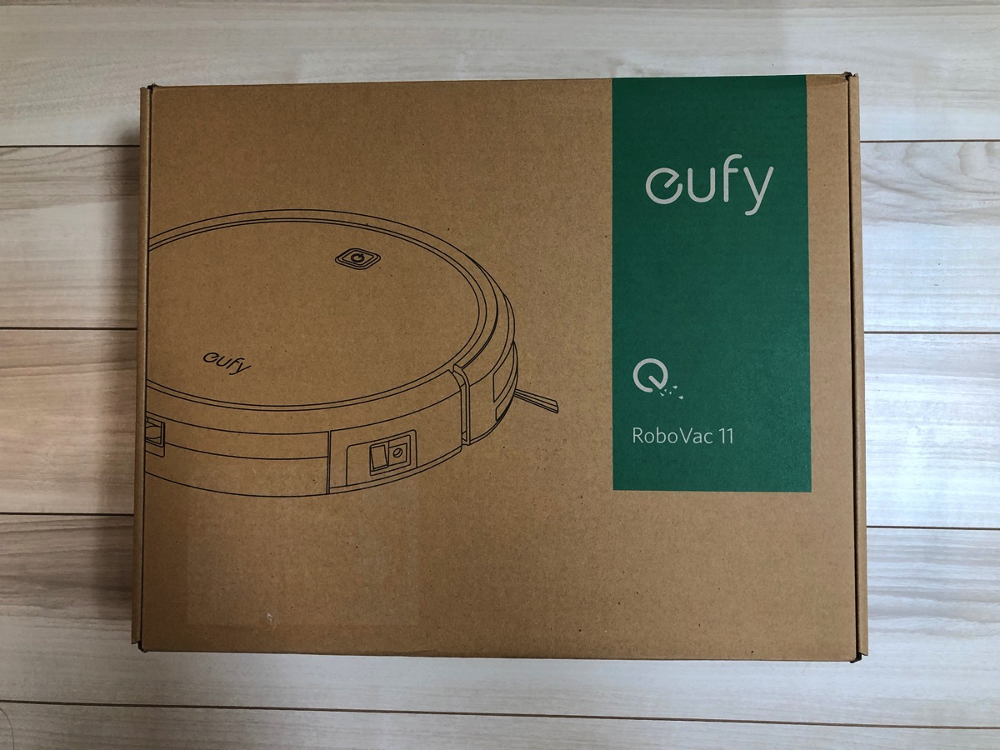

左が旧モデル、右の白いのが今回購入した「RoboVac 11」です。若干気持ちゴツくなった気がします。
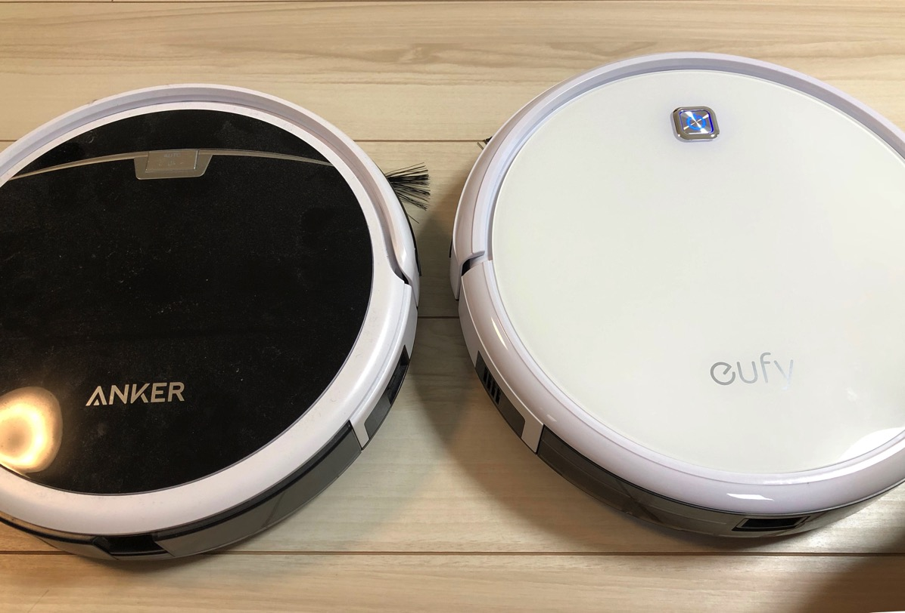

裏側です。旧モデルはブラシをつけたままです。裏側は違いがあまり感じられませんが、吸い込みのブラシ部分の構造が若干変わっているきがします。（旧モデルのブラシは交換済みのもの）
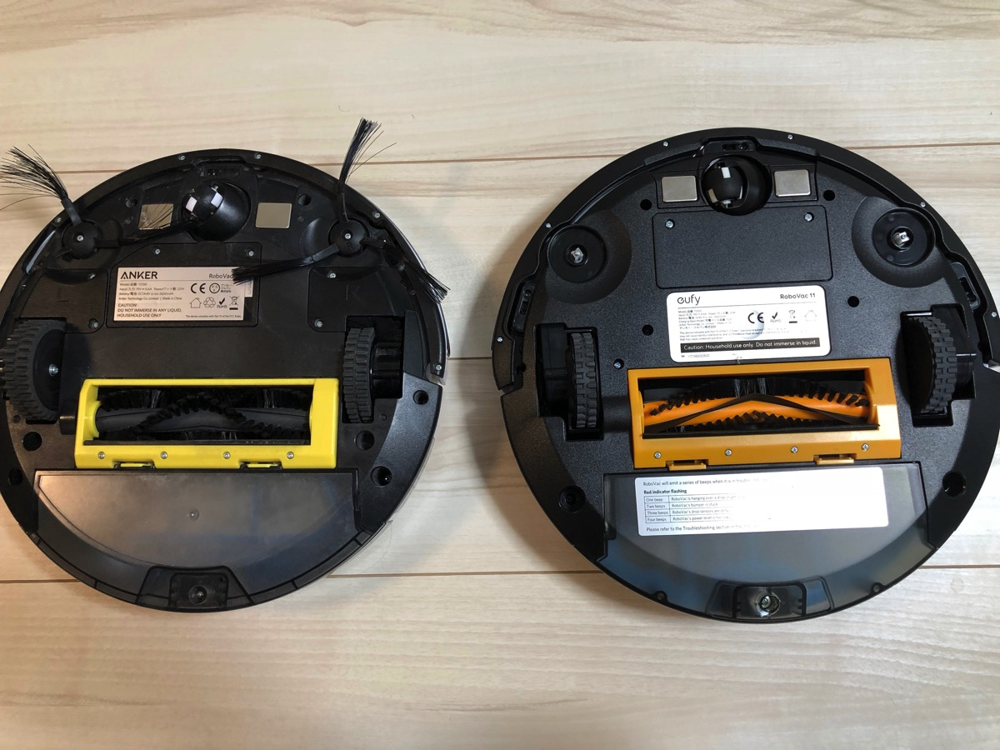

一番大きな違いは、このゴミをかき集める前面ブラシの取り付け方法です。旧モデルはネジを外して、取り付け、ネジを締める形で装着していました。「RoboVac 11」はなんとネジの開け閉めなしでそのままつけられます。
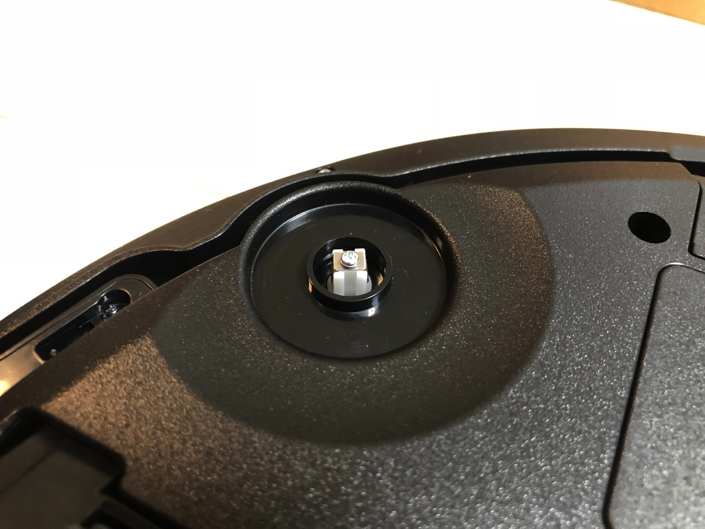

強めに押しこむだけ。取り外しも簡単でした。
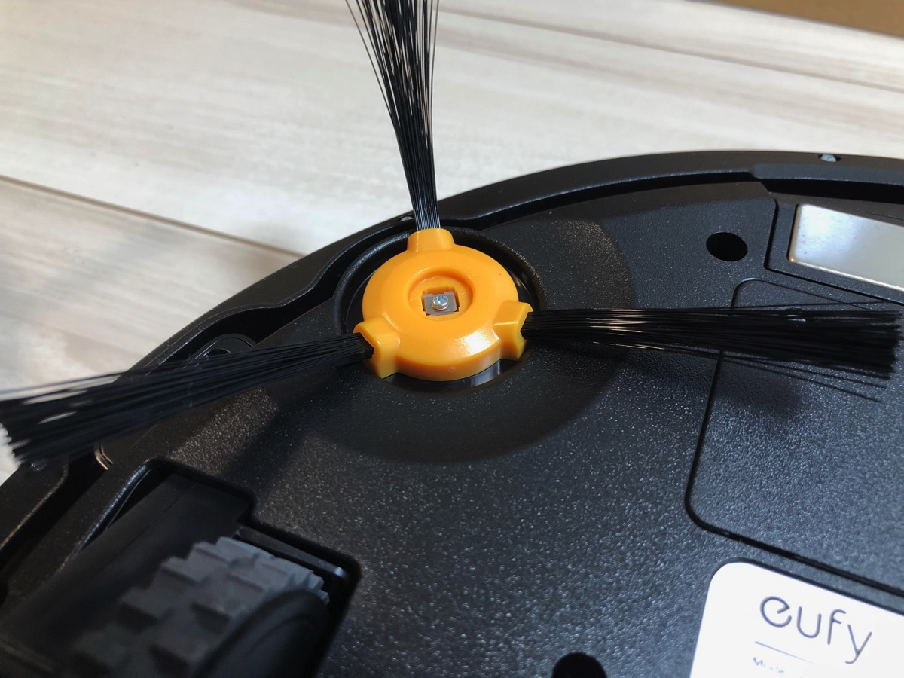

こちら充電ステーションです。旧モデルの方が若干背が高い。
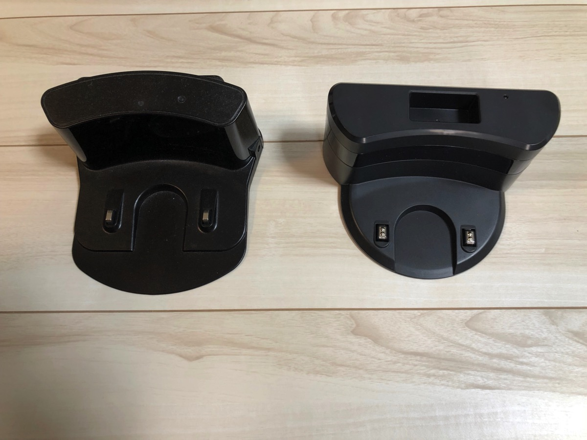

電源アダプターも形状が変更しました。旧モデルの細長いタイプの方が場所を取らずにすんでいたのですが、、、
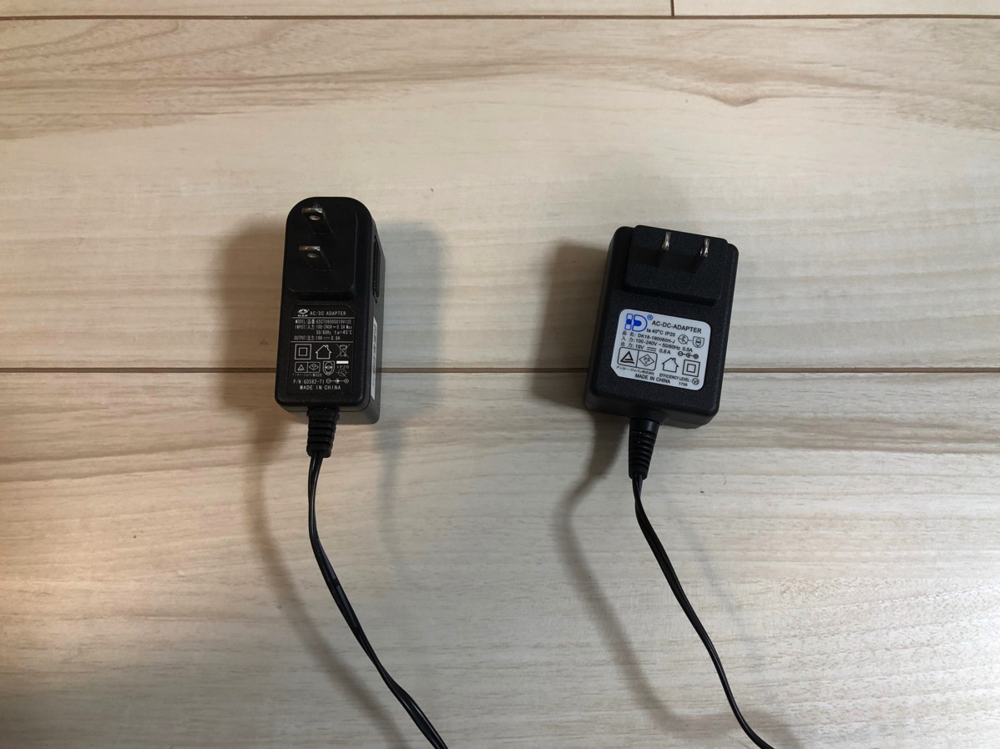

リモコンです。旧モデルはボタンを押すと掃除機本体がいちいち音を出していました。しかし、その反応はなく方向転換などでは特に音がしなくなりました。また、ボタンの押し込みもスムーズで心なしか電波の受信もすごく素早くスムーズになった気がします。基本、タイマー設定で寝ている間に掃除をしてくれるようにスケジューリングしていますので、リモコンをいじる機会はあまりありません。
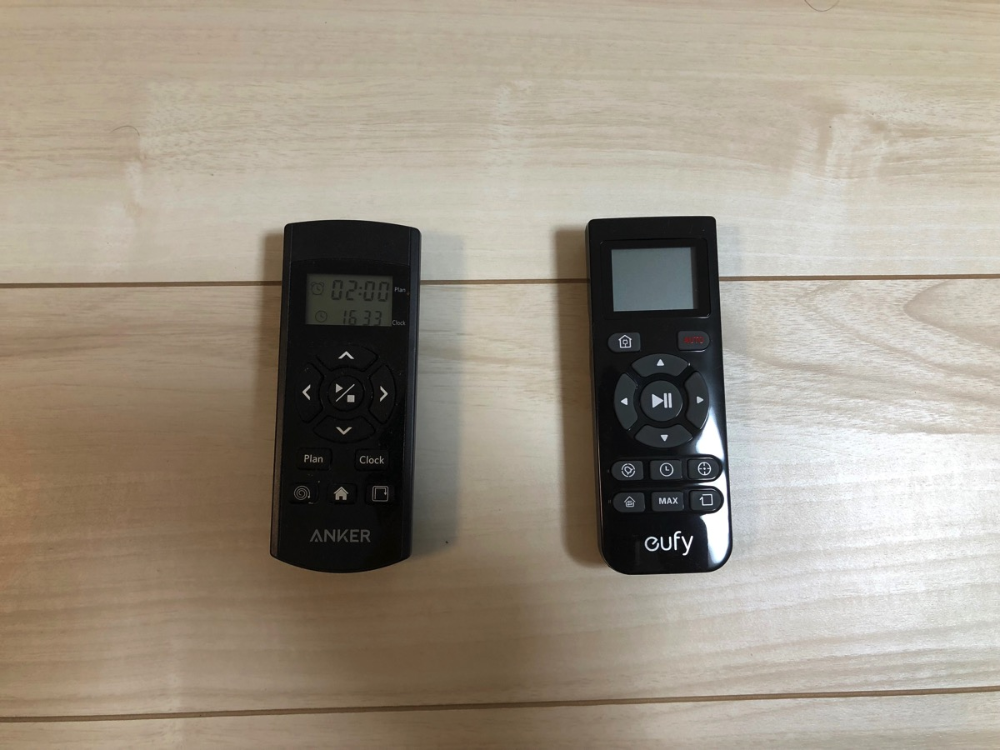

こちら掃除用のブラシです。地味に嬉しい。ブラシに髪の毛がひかかったりすると取れなくなってしまっていましたが、それを切るように小さい歯がついています。メンテナンスしやすそうです。
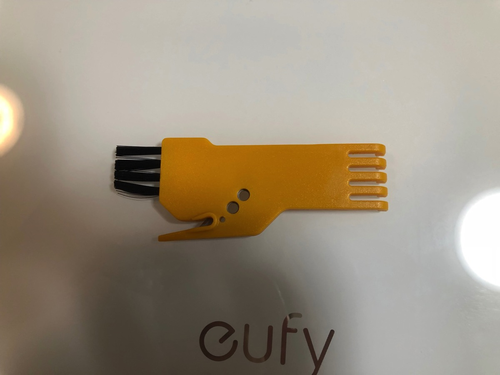

横から見た図です。旧モデルよりも若干分厚くなりました。
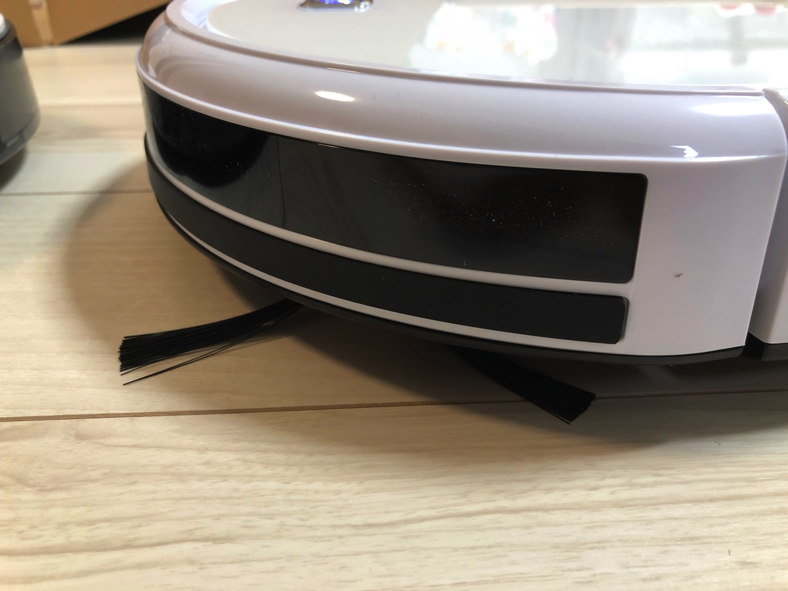

また、大きくことなっているのが、空気を排出する機構になっているという点。旧モデルは推進力とブラシでゴミを集めていたようですが、今回はちゃんと吸い込みもしてくれているようです。（この辺り未確認）そのためか、ゴミの取りこぼしが少なくなり、より部屋が綺麗になったきがします。
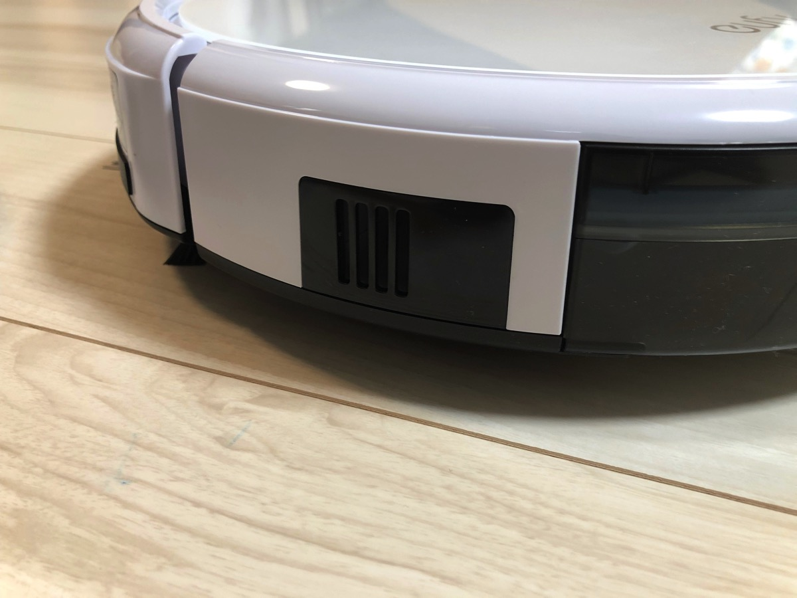
<h2>こんな人におすすめ</h2>
普段家にあまりいなくて掃除機をかける時間がない人

休日もわざわざ掃除機かけて掃除したくない人

とりあえずソファとかがあって洗濯物とか全部その上に退避させることができる人www
<h2><a href="https://twitter.com/s_s_p_y">しんぺー</a>はこう思った。</h2>
家事にかかる時間は少しでも短縮したいところ。なので寝ている間に掃除をしてくれるロボット掃除機はマジで重宝しております。ただ、その分床の上に物を置かないとか、ケーブル類を片付けておかないといけないとかありますが。ただ、そのおかげで整理はできているようになったので（全部ソファの上に避難w）

と言ったところで本日は以上になります。
おやすみなさい。
そして、また明日。

<a href="http://www.amazon.co.jp/exec/obidos/ASIN/B01M3PV96T/warawareotoko-22/" target="_blank" >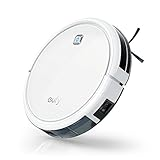</a>

<a href="http://www.amazon.co.jp/exec/obidos/ASIN/B01M3PV96T/warawareotoko-22/" target="_blank" >eufy RoboVac 11 (ロボット掃除機)【静音&強力吸引 / 3つの清掃モード / 自動充電 / リモコン & 充電ステーション付属】（ホワイト）</a>
posted with <a href="http://kaereba.com" rel="nofollow" target="_blank">カエレバ</a>

 Anker     

<a href="http://www.amazon.co.jp/gp/search?keywords=eufy%20RoboVac%2011&__mk_ja_JP=%E3%82%AB%E3%82%BF%E3%82%AB%E3%83%8A&tag=warawareotoko-22" target="_blank" >Amazon</a>

<a href="https://hb.afl.rakuten.co.jp/hgc/121ed5e1.954a9ce3.121ed5e2.9fc704ba/?pc=http%3A%2F%2Fsearch.rakuten.co.jp%2Fsearch%2Fmall%2Feufy%2520RoboVac%252011%2F-%2Ff.1-p.1-s.1-sf.0-st.A-v.2%3Fx%3D0%26scid%3Daf_ich_link_urltxt%26m%3Dhttp%3A%2F%2Fm.rakuten.co.jp%2F" target="_blank" >楽天市場</a>

<a href="//ck.jp.ap.valuecommerce.com/servlet/referral?sid=3041033&pid=882528283&vc_url=http%3A%2F%2Fsearch.shopping.yahoo.co.jp%2Fsearch%3Fp%3Deufy%2520RoboVac%252011&vcptn=kaereba" target="_blank" >Yahooショッピング</a>

