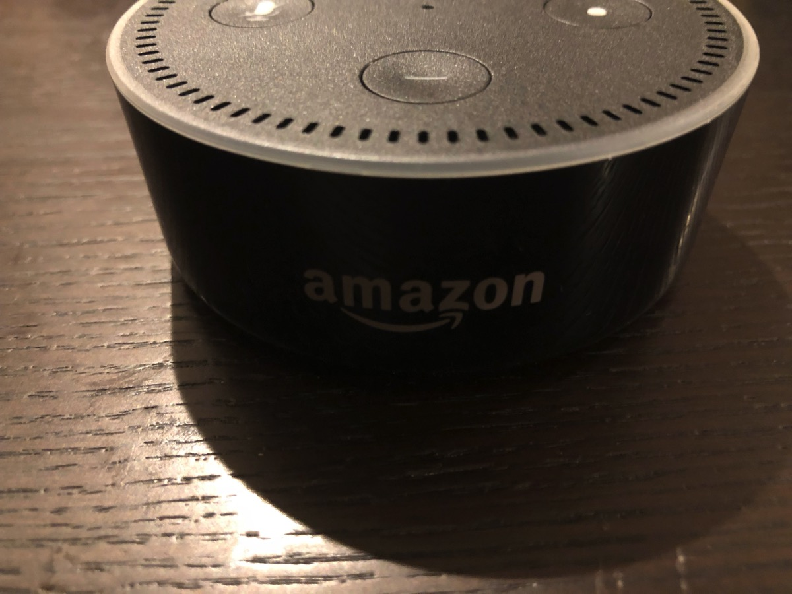

---
categories:
- レビュー
date: Sun, 19 Nov 2017 00:44:28 +0000
slug: post-11317
tags:
- amazon echo
- Google Home
title: Amazon Echo dotレビュー。Google Homeと比較もしてみた！どっち買ったらいいのか？
---

発売翌日に配送されていたんですが、途中でコンビニ受け取りに変更した関係で翌日到着になってしまいました！そんでもってようやく受け取って色々とやってみたので、現時点の印象とGoogle Homeと比べた感想をご紹介したいと思います。<!--more-->
<h2>Amazon Echoとは？</h2>
Amazonの販売するスマートスピーカーです。Amazonの人工知能「Alexa」を搭載し、ユーザーの声による指示で様々なスキルを用いて情報の検索や操作、その他の挙動を行います。

例えば部屋の電気を消したり、音楽を流したり、タイマーを設定したり、<strong>Amazonで注文したり</strong>などです。

そして今回日本で発売されたラインナップは次の3つです。
<ul>
 	<li>最も安価でコンパクトなエントリーモデル「Echo Dot」</li>
 	<li>標準モデルで高品質なスピーカーを搭載している「Echo」</li>
 	<li>スマートホームのハブとなる機能を搭載している３モデル中最上位の「Echo Plus」</li>
</ul>
ちなみに海外では、画面付きのEcho Spotや、その上位モデルのEcho Showというものが発売されています。

<h2>Amazon Echo Dotレビュー</h2>
今回、ぼくが購入したのは「Echo Dot」です。

小さいなコンパクトな外装。Google Homeの立方体のりっぱな箱とは違いかなり簡易な印象です。そのうちコンビニで売り出すんじゃねってくらい小さいです。

開封してみると中身もこれまた簡易的。ブラックなのが印象的です。

取り出してみると中身はこんな感じ。本体の他にUSBケーブルとアダプター、説明書二つ

<h2>第一印象　いかにもAIという機械感</h2>
かなりコンパクトです。ただ安っぽさは微塵もなく、想像以上にずっしりとしており、外装もつるつるで部屋に置いておいても浮くことがなくカッコいい

amazonのロゴが入っています。

電源を入れると青く光り出します。スマホにダウンロードしたAlexaアプリと連携して設定をしていきます。

<h3>スキルについて</h3>
Alexaのスキルはとにかく多いです。しかもそれぞれのスキルはアプリの方で有効化しないと起動しません。このあたりが複雑で、ユーザー側にそれなりのリテラシーが求められます。音声だから簡単に誰でも操作できるというわけではなさそうです。

また、実用性があるスキルは現時点ではあまり多くありません。銀行の預金残高を聞けるみたいですがどうなのって思うw
その他にもAmazonで音声で注文なんかもできます。これ便利そうだなーと期待してたんですが、普通にちゃんとサイトみて値段みて、他と比較して注文した方がいいわ。
<h3>Echoの音声について</h3>
声がかなり機械っぽい。いわゆるAIっぽい感じで聞き取りずらい。
あと、命令はちゃんと言わないと正確に聞いてくれない。

また、感じの読み違いをする。高尾山をたかおやまって言ったりして、その辺弱いのかも。
そのためこちらもちゃんと考えて、こいつ今なんて言ってる？ってのを意識しないとダメです。

その辺、喋ってて億劫になりそうです。
<h3>音楽について</h3>
音楽はEchoの発表と同時に発表があった、Amazon Music Unlimitedなどからストリーミングするみたいですが、ぼくが聞くような曲がラインナップにありませんでした。

自分のitunesに入っている曲を流せるわけではないので使いにくい。というかUnlimitedに加入してなくてAmazonの音楽を使ってなければ、音楽を流すという用途では使い物にならない。
<h3>ほかのデバイスとの連携について</h3>
ぼくはテレビにfire tv stickを刺しているのですが、それと連携して音声でYoutubeを操作しようなんて期待しておりました。しかし、どうやら旧モデルのfire tv stickじゃダメみたいでした。

あと、現時点でスマートホーム家電はどれも高価です。電球一個が数千円するし、一部屋分揃えようと思うと色々と揃えると考えると1万円はこえるでしょう。ということで実質スマートホームも現実的ではありません。

そんな時に使えそうなのがこれ。

<a href="http://www.amazon.co.jp/exec/obidos/ASIN/B076YF19G9/warawareotoko-22/" target="_blank" rel="noopener">リンクジャパン 〔iOS／Androidアプリ〕　eRemote mini イーリモートミニ　MINI</a>

posted with <a href="http://kaereba.com" target="_blank" rel="nofollow noopener">カエレバ</a>

リンクジャパン

<a href="http://www.amazon.co.jp/gp/search?keywords=eremote&amp;__mk_ja_JP=%E3%82%AB%E3%82%BF%E3%82%AB%E3%83%8A&amp;tag=warawareotoko-22" target="_blank" rel="noopener">Amazon</a>

<a href="https://hb.afl.rakuten.co.jp/hgc/121ed5e1.954a9ce3.121ed5e2.9fc704ba/?pc=http%3A%2F%2Fsearch.rakuten.co.jp%2Fsearch%2Fmall%2Feremote%2F-%2Ff.1-p.1-s.1-sf.0-st.A-v.2%3Fx%3D0%26scid%3Daf_ich_link_urltxt%26m%3Dhttp%3A%2F%2Fm.rakuten.co.jp%2F" target="_blank" rel="noopener">楽天市場</a>

<a href="//ck.jp.ap.valuecommerce.com/servlet/referral?sid=3041033&amp;pid=882528283&amp;vc_url=http%3A%2F%2Fsearch.shopping.yahoo.co.jp%2Fsearch%3Fp%3Deremote&amp;vcptn=kaereba" target="_blank" rel="noopener">Yahooショッピング</a>

赤外線リモコンを連携させてスマホで操作できるようにするガジェットです。
<h2>Google homeとの比較</h2>
Google Homeとの比較ですが、現時点では<strong>Google Homeの方が使い勝手がいい</strong>と個人的には思いました。

その理由は次の通り。
<ul>
 	<li>日本語が流暢</li>
 	<li>複雑な設定が不要</li>
 	<li>見た目がカワイイ</li>
</ul>
あと一番大きいのは<strong>Google Play Musicにアップロードしている自分のitunesの曲を流せる点</strong>です。（ただし、これ使うには月額費用はらって全曲クラウドにアップする必要あり。Amazonにはこの機能はないっぽいです。）

ただ、Amazon Echoの方が聞き取りからの起動がめちゃくちゃ早い。これは体感すればわかると思いますが、Googleを圧倒しています。多少小さい声でもきいてくれます。

ということでAmazon Echoは今後のアップデートに期待。<strong>今買うならGoogle Homeがオススメです。</strong>
<h2><a href="https://twitter.com/s_s_p_y">しんぺー</a>はこう思った。</h2>
とりあえずChromecastかfire tv stickを最新モデルにしたいと思います。

言いたい！言いたい！「けっつん中級兵の動画ながして」って言いたい！

あと、こんなもんいらねって思ってる人もいるかもしれません。
今やっていることを音声入力でできるって考えるとそうかもしれません。自分で操作すればえーやんって。でも、本質はそこじゃない気がします。

今やってないことをプラスオンで何かしてくれるガジェットだと思います。ぼくは音楽を聴く習慣が新たに生活にプラスされました。天気のチェックなんかもテレビとかアプリでもやってましたけど、自然とこれで確認もするようになりました。

そんな感じです。少しでも興味があるなら触ってみてもいいんじゃないかと思いますよ。安いし。

と言ったところで本日は以上になります。
おやすみなさい。
そして、また明日。

<a href="http://www.amazon.co.jp/exec/obidos/ASIN/B072B5BTLK/warawareotoko-22/" target="_blank" rel="noopener">Amazon Echo Dot (Newモデル)、ブラック</a>

posted with <a href="http://kaereba.com" target="_blank" rel="nofollow noopener">カエレバ</a>

Amazon 2017-11-15

<a href="http://www.amazon.co.jp/gp/search?keywords=google%20home&amp;__mk_ja_JP=%E3%82%AB%E3%82%BF%E3%82%AB%E3%83%8A&amp;tag=warawareotoko-22" target="_blank" rel="noopener">Amazon</a>

<a href="https://hb.afl.rakuten.co.jp/hgc/121ed5e1.954a9ce3.121ed5e2.9fc704ba/?pc=http%3A%2F%2Fsearch.rakuten.co.jp%2Fsearch%2Fmall%2Fgoogle%2520home%2F-%2Ff.1-p.1-s.1-sf.0-st.A-v.2%3Fx%3D0%26scid%3Daf_ich_link_urltxt%26m%3Dhttp%3A%2F%2Fm.rakuten.co.jp%2F" target="_blank" rel="noopener">楽天市場</a>

<a href="//ck.jp.ap.valuecommerce.com/servlet/referral?sid=3041033&amp;pid=882528283&amp;vc_url=http%3A%2F%2Fsearch.shopping.yahoo.co.jp%2Fsearch%3Fp%3Dgoogle%2520home&amp;vcptn=kaereba" target="_blank" rel="noopener">Yahooショッピング</a>

<a href="https://hb.afl.rakuten.co.jp/hgc/g00q0724.aa53o477.g00q0724.aa53p383/?pc=https%3A%2F%2Fitem.rakuten.co.jp%2Fbook%2F15182442%2F&amp;m=http%3A%2F%2Fm.rakuten.co.jp%2Fbook%2Fi%2F18832250%2F" target="_blank" rel="noopener">Google Home Mini チョーク（グーグル ホーム ミニ チョーク）</a>

posted with <a href="http://kaereba.com" target="_blank" rel="nofollow noopener">カエレバ</a>

<a href="https://hb.afl.rakuten.co.jp/hgc/121ed5e1.954a9ce3.121ed5e2.9fc704ba/?pc=http%3A%2F%2Fsearch.rakuten.co.jp%2Fsearch%2Fmall%2Fgoogle%2520home%2F-%2Ff.1-p.1-s.1-sf.0-st.A-v.2%3Fx%3D0%26scid%3Daf_ich_link_urltxt%26m%3Dhttp%3A%2F%2Fm.rakuten.co.jp%2F" target="_blank" rel="noopener">楽天市場</a>

<a href="http://www.amazon.co.jp/gp/search?keywords=google%20home&amp;__mk_ja_JP=%E3%82%AB%E3%82%BF%E3%82%AB%E3%83%8A&amp;tag=warawareotoko-22" target="_blank" rel="noopener">Amazon</a>

<a href="//ck.jp.ap.valuecommerce.com/servlet/referral?sid=3041033&amp;pid=882528283&amp;vc_url=http%3A%2F%2Fsearch.shopping.yahoo.co.jp%2Fsearch%3Fp%3Dgoogle%2520home&amp;vcptn=kaereba" target="_blank" rel="noopener">Yahooショッピング</a>

