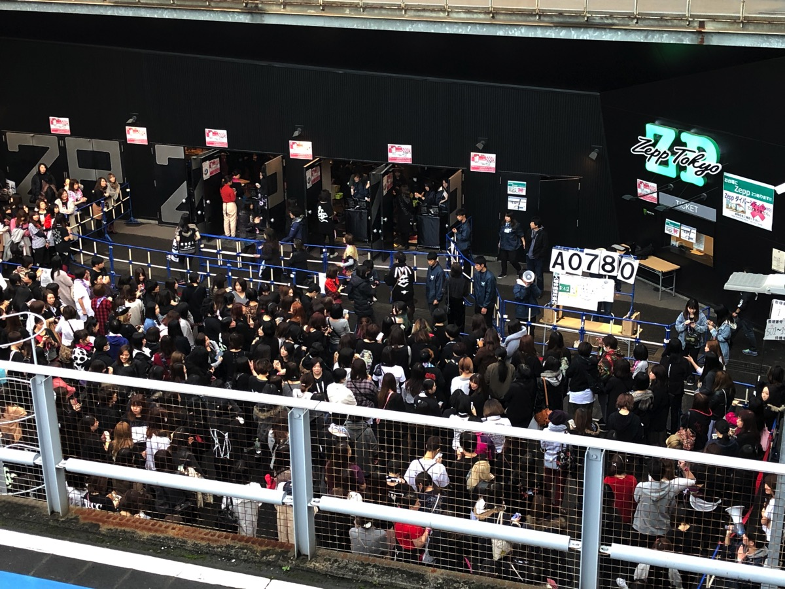
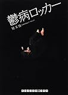
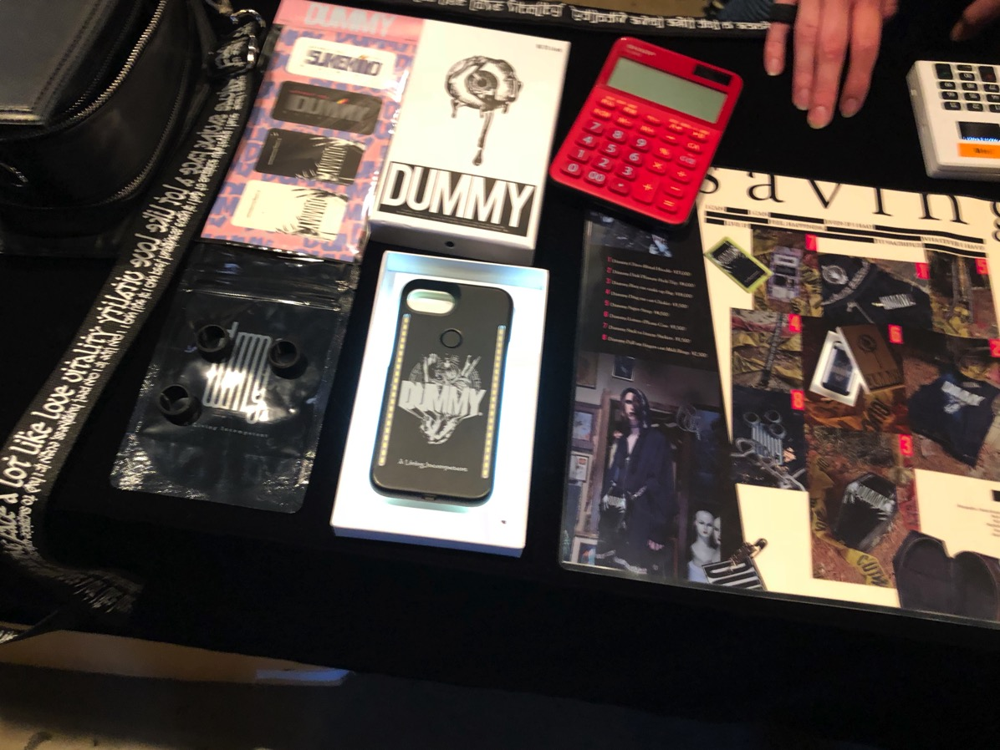

---
categories:
- sukekiyoのLIVEレポ
date: Sun, 26 Nov 2017 00:04:34 +0000
slug: post-11372
tags:
- LIVEレポ
- sukekiyo
title: 【ライブレポ】PARTY ZOO 2017 DAY2 2017_11_23@Zepp Tokyo【sukekiyo】
---

久しぶりのsukekiyoのLIVEが観れるってのと、活動休止前のムックを同時に観れるチャンスということでPARTY ZOO行ってきました。本日はそのLIVEレポです。<!--more-->

<h2>A9（アリスナイン）</h2>

完全初見でした。ビジュアルだけはずっと知ってたけど、一応予習という感じでYoutubeで少し見てったけど。確か全員少女漫画かって感じの美形というイメージで曲はキラキラで、ネオビジュアル系で、虜くらいの年代の人からすると若手も若手っていう印象だと思う。でも、もう若手じゃなくて中堅くらいになるのでしょうか。

で、LIVE始まってびっくり。いやマジでびっくり。まずファンの方々も手にキラッキラするやつつけてた。で咲きというかネオビジュアル世代特有のオープンな咲きが見れました。そこからの八の字ヘドバン。sukekiyo見にきた側から言わせると元気いいな！！おい！！って感じ。

そりゃもう全体的にとにかくキラッキラしてました。ダークな音楽に慣れてると耳には突き刺さるような曲ばかり。

あと、虎様って一番好みの顔してた記憶があったんだが、別人のように。。

<h3>セトリ</h3>

the beautiful name
RAINBOWS
PENDULUM
造花の代償
L'Arc〜en〜Cielメドレー
UNDEAD PARTY(with Ken)
MEMENTO

最新の音源がこちら
<iframe width="560" height="315" src="https://www.youtube.com/embed/1vwu7p6axZc" frameborder="0" allowfullscreen></iframe>

Amazonミュージックで聴く
<iframe id='AmazonMusicEmbedB0761S49WH' src='https://music.amazon.co.jp/embed/B0761S49WH/?id=YMtoArS48n&marketplaceId=A1VC38T7YXB528&musicTerritory=JP' width='100%' height='550px' style='border:1px solid rgba(0, 0, 0, 0.12);max-width:'></iframe>

<a href="https://play.google.com/music/m/Bpq2o3jpstcnqdf2zeihkze2h7a?t=PENDULUM_-_A9">Google Play Musicでも聴ける</a>

<a href="https://geo.itunes.apple.com/jp/artist/a9/279901958?app=itunes">itunesでも聴ける</a>

あと、1月にKenプロデュースでニューシングルが出るらしい。

1月17日発売「F＋IX＝YOU」

<h3>ところでA9ファンの年齢層って</h3>

わたしが発明しましたファンの年齢をざっくりと算出する超絶適当式がございます。

現在　-　デビュー年　＋　12　±　5

これでいけるはず。デビュー年わからなかったので結成年ぽい2004年を起点にします。で、計算してみますと

2017年 -　2004年　＋ 12 ±　5

つまり<strong>20歳〜30歳くらい</strong>という結果です。ザックリすぎだろw　まあでもDIRとかに比べると1世代も2世代も若いバンドということになりますね。

そんな方々の中にはラルクメドレーされてもピンとこない人たちもいたのでは。ラルクメドレーで演奏された曲って20年くらい前のでしょう。。。うそ・・・そんなに前なの、、、信じられない。。。

まぁどちらにしろ若い、キラキラしたバンドでした！新鮮でした！じゅるり

参考：<a href="https://www.warawareotoko.com/2016/09/05/post-9265/">ヴィジュアルジャパンサミット参戦バンドのファンの年齢層を調べてみた
</a>

<h2>baroque</h2>

続いてbaroque。どうやら各バンド転換含めて1時間が持ち時間ぽいです。開演からきっかり1時間でスタート

個人的には少しこのバンドに思い入れがあって、「我伐道」ていうメジャーデビューシングルを昔聴いてました。ヴィジュアル系界にオサレ系という流れを作った元祖のバンドです。メンバーが驚くほど若かったことと、当時としては突き抜けた曲調を取り入れてかなり斬新だった記憶があります。

しかし、突如として活動休止。理由はボーカルの素行不良。確か当時、突如として活動休止のお知らせがサイトに出てた記憶がある。未成年にもかかわらず飲酒喫煙をし、再三の注意も聞き入れなかったためらしい。社長直々に決断したってのをどっかで見た気がする。

それからもメンバーの突然の脱退やら失踪やらと色々とあったバンドだったから、こうして生で見ることができて少しじんわりした。

あとsukekiyoのベースYuchiともkanibalismというバンドをやっていたこともある。
この日の前日はそれで演奏もしたらしいし。

久しぶりに聴いたbaroqueは昔の感じは一切なくて、キラキラした感じとも違って、独自の雰囲気を出してた。

あと少し調べたらボーカル怜の本を見つけた。内容がちょっとディープそうなのでポチってみました。ファンの方のブログとかも読んだけど、当時のYuchiを慮る内容で、なるほど人に歴史ありという感じでした。

<a href="http://www.amazon.co.jp/exec/obidos/ASIN/427010435X/warawareotoko-22/" target="_blank" >鬱病ロッカー (RHブックス・プラス)</a>
posted with <a href="http://kaereba.com" rel="nofollow" target="_blank">カエレバ</a>

兒玉 怜 武田ランダムハウスジャパン 2012-11-10    

<a href="http://www.amazon.co.jp/gp/search?keywords=%E9%AC%B1%E7%97%85%E3%83%AD%E3%83%83%E3%82%AB%E3%83%BC&__mk_ja_JP=%E3%82%AB%E3%82%BF%E3%82%AB%E3%83%8A&tag=warawareotoko-22" target="_blank" >Amazon</a>

<a href="https://hb.afl.rakuten.co.jp/hgc/121ed5e1.954a9ce3.121ed5e2.9fc704ba/?pc=http%3A%2F%2Fsearch.rakuten.co.jp%2Fsearch%2Fmall%2F%25E9%25AC%25B1%25E7%2597%2585%25E3%2583%25AD%25E3%2583%2583%25E3%2582%25AB%25E3%2583%25BC%2F-%2Ff.1-p.1-s.1-sf.0-st.A-v.2%3Fx%3D0%26scid%3Daf_ich_link_urltxt%26m%3Dhttp%3A%2F%2Fm.rakuten.co.jp%2F" target="_blank" >楽天市場</a>

<a href="//ck.jp.ap.valuecommerce.com/servlet/referral?sid=3041033&pid=882528283&vc_url=http%3A%2F%2Fsearch.shopping.yahoo.co.jp%2Fsearch%3Fp%3D%25E9%25AC%25B1%25E7%2597%2585%25E3%2583%25AD%25E3%2583%2583%25E3%2582%25AB%25E3%2583%25BC&vcptn=kaereba" target="_blank" >Yahooショッピング</a>

<h3>セトリ</h3>

どれもこれも浮遊感とも違うフワフワ感とそれでいてキラキラしていて、夜空を漂う感じの曲が多かった。ぼくが抱いていた尖った、勢いのある印象とは全く違って、すっかり大人の雰囲気でした。

SKY FITS HEAVEN
DREAMSCAPE
何千何万何億の君への想い
MEMENTO
YOU
PLANETARY LIGHT
GIRL

itunesでいくつか聴けます。

<h2>Ken with Naughty stars</h2>

次ムックきて、sukekiyoきて、最後にこのバンドで来るかと思ってました。だからムック終わったらトイレ行こうとか思ってたんですよ。そしたら違ってた！最後までトイレ我慢したわ。

ってかラルクメンバーを多分生で初めて見たんだけど、Kenってこんな感じの人だったんですね。タバコくわえてギター弾いてるイメージしかなかったから、こんなふざけた人だと思わなかったw

もっと厳しい人なのかと思ってた。

で、このバンドのメンバーは
Vo. & Gt. Ken
Gt.虎(A9)
Ba.沙我(A9)
Dr.Nao(A9)
Key.匠(sukekiyo)

途中、MCで排卵の話になり、そこから精子をどれくらい貯めるかの話に。下手からメンバー一人一人にどれくらい貯めるのかを聞いてまわるKen氏。

虎「5時間」
沙我「2日」Ken「リアルーw」
Nao「貯めるのが好きなんで」

で、トリというかオチに我らが匠
Ken「匠くんはまだ出会って、そんなに経ってないけどきいちゃおうかな」
匠「ぼくも貯めるのいい。貯めた方がいい演奏ができるんで」的なこと言ってましたw
それに対してKenが「あの、本当にごめんなさいね。リハーサル見させてもらったんだけど、悪いことしたなーって。ちゃんと気分転換してストレスとか発散してからsukekiyoやってください」

あ、その後Ken「貯めすぎるとたまに突き破って匂ってくることあるよね？？」
虎「確かに」

面白かったwww

<h3>セトリ</h3>

二億四千万の瞳（郷ひろみ）
LOVE FLIES（L'Arc〜en〜Ciel）
Clocks（Coldplay）
You Keep Me Hangin'On（The Supremes）

<h2>ムック</h2>

続いてムック。久しぶりにムックみた。何年ぶりだろう。多分2009年とか2010年とかに武道館で見たのが最後だった気がする。

出てきた瞬間会場の熱気が一気に上がった。やっぱりムックすげーなーって感じでした。
ってか、以前見た時よりもアクロバティック感ましてましたw
逹瑯はあんまり飛び跳ねてなかったけど、両サイドの2人が得物ぶん回しまくってた。

<h3>セトリ</h3>

正直「蘭鋳」以外全部知りませんでした。割と古めの曲しか知らないので、次回の武道館までに予習をする必要がありそう。

あと想像してたようなサークルはできておらず、見える範囲ではダイブもなかったかも。
今回PA卓のあたりで見てたので前方がどうなってるのかわからなかったですが、柵があったのかも。

どの曲も一時期のクラブサウンドっぽい感じとダークアンドヘビネスさをミックスしたような感じでした、重厚さと軽快さがありました。

睡蓮
絶体絶命
秘密
勿忘草(with Ken)
ハイデ
ENDER ENDER
蘭鋳
Tonight(with Ken)

この日のほとんどの曲が「脈拍」というアルバムからだったみたいです。
<a href="https://geo.itunes.apple.com/jp/album/%E8%84%88%E6%8B%8D/1196212562?app=itunes">itunesで聴けます。</a>

随所で次のsukekiyoを絡めた煽りをしておりました。
「sukekiyoは喋っちゃだめなんだよ、動いちゃいけないんだよ、だったらいつ暴れるの？」

本当にわかる曲が蘭鋳しかなかった！今のムックってこんな感じなのね！

<h2>sukekiyo</h2>

いつも通り。もう本当にそれに尽きる。
真っ暗で、ひたすら点滅していて詳細まで見えませんでした。おそらくsukekiyo初見の人にとっては、全く分からないステージだったのではないでしょうか。

<h3>メンバー衣装</h3>

DUMMY推し

京はおそらくこの画像のままの姿でした。髪の毛は遠目にはくすんだピンクか紫っぽく見えました。

<blockquote class="twitter-tweet" data-lang="ja">
♯1 Collection DMY 2017 Dummy Dark Pleasure Feelz Top Dummy Drag me out choker  Model by <a href="https://twitter.com/kyo_official?ref_src=twsrc%5Etfw">@kyo_official</a> <a href="https://t.co/uKnY6tIrfM">pic.twitter.com/uKnY6tIrfM</a>
&mdash; DUMMY (@dummycollection) <a href="https://twitter.com/dummycollection/status/933678259388104705?ref_src=twsrc%5Etfw">2017年11月23日</a></blockquote>

Yuchiはバンダナ？におそらくこれもDUMMYのシャツを着ていました。

匠、未架、UTAは多分DUMMYではなかったかな。ちゃんと見えませんでした。ただセッションの時の未架さんはマツコデラックスかってくらい真っ黒で無地の衣装でした。髪の毛もそのまま結ばず。

いつも通りのブザーでスタート。この時少しざわめきが起こるものの、その後誰1人咳払いすらしない、呼吸すらままならない世界に。
真っ暗すぎてPA卓のスタッフの方も開いてる？ってきいていました。

leather fieldで始まり、幕が開くとすでに京が踊っていて、怪しげにはじまりました。
イベントだからとかもう関係がなく、半分くらい後ろ向きで演奏してた印象w

意識が吸い込まれて飛びそうになるのが何回かありました。

<h3>ステージ演出</h3>

ステージ上にはブラウン管テレビが4台。おそらくこのツイートのもの？？

<blockquote class="twitter-tweet" data-lang="ja">
打ち合わせ前にふらっと。  わかりにくかったから3枚まとめて上げ直す。 YUCHIが写ってるからこれも上げとく☆  京 <a href="https://t.co/jcbHTfs8Sh">pic.twitter.com/jcbHTfs8Sh</a>
&mdash; 京 (@kyo_official) <a href="https://twitter.com/kyo_official/status/930368418603196417?ref_src=twsrc%5Etfw">2017年11月14日</a></blockquote>

1つか2つには後ろ姿ので演奏する京の顔が写ってたっぽいです。それ以外はまた別のものが写っていました。

イベントのため色々とセッティングに無理があったみたいです。
下手からUTA、Yuchi、未架、匠という並びでしたが、匠とYuchiが離れてしまったために、途中匠がYuchi側に京の前を走っていって、ちゃかちゃかっと演奏して、これまたささっと自分の位置に戻るということをしていました。点滅してたし、暗かったからわかりにくかったけど

最後はいつも通りの「おやすみ」
animaが流れる中、誰1人声をあげることなく拍手で終了

<h3>セトリ</h3>

leather field
死霊のアリアナ
されど道連れ
艶
耳ゾゾ
黝いヒステリア
mama
anima
嬲り

<h3>グッズ</h3>

そういえばsukekiyoの次のツアー「嬲り地獄」で販売されるであろうDUMMYグッズの先行販売ありました。こんな感じ

Dummy Chaos Ritual Hoodie 25000円
Dummy Dark Pleasure Feels Top 8000円
Dummy Bury me make up Gag 18000円
Dummy Drag me out Choker 3500円
Dummy Super Strap 4500円
Dummy Lumee iPhone Case 5500円
Dummy Stick to breeze Stickers 1500円
Dummy Pull my fingers out Midi Rings 2500円

<h2>PARTY ZOO セッション</h2>

セッションのMCはバロック怜とムック逹瑯
逹瑯「（客席に向かって）みんな大丈夫？地獄をみたいな気分になってんじゃないの？この後ちゃんとパーティする気になってる？」

確かに、本当にいつも通りのsukekiyoすぎて本当にいつも通りの疲労感で意識も何回かぶっ飛びかけたので、地獄見た気分でした。

その後、各メンバーがぞろぞろ出てきて、おそらく京以外は全員出てきて、飛び入り誰か1人いたっぽいけど誰か分からず。

sukekiyoメンバーは相変わらず後ろの方に行こう行こうとしてて、逹瑯から「殿がきてないんだから」と注意をされておりました。それを受けて匠とYuchiだけ微妙に前に出てきたり、Yuchiが残り2人を前の方につれてこようとしておりました。ちなみにYuchiの片手にはスーパードライの500ml缶が。しかし、中身はもう入ってなさそうでした。飲み干した後か。。。酒飲んで現れたのYuchiだけじゃね?wwww

そのあとも未架さんとUTA氏はひったすら後ろの方にいて所在無さげで苦笑いwwwわかる、その気持ち。ぼくも体育の時そういう感じだったもん←

で、ふとKenと逹瑯ほかみんながわちゃわちゃやってる時、ステージを横切る小柄なハット姿の男。なんとそれ京でしたw

ベージュのハットに、丸メガネ、緑っぽいチェックシャツで逹瑯をツンッ！！とつつくと下手から上手へと歩いていきました。途中気がついた逹瑯が捕まえようと追いますが、京は全力逃走。バックスバニーのロードランナーが逃げる時の音が脳内再生されましたwww

結局捕まえられなかったのか逹瑯すごすごと戻ってきましたw　その後もステージ上の人たちも下手をちらちら気にしてましたが、結局それ以降京は戻ってこずwww

でも、いいもん見せてもらいました。ありがとうPARTY ZOO

<h2><a href="https://twitter.com/s_s_p_y">しんぺー</a>はこう思った。</h2>

すごい楽しかったです。それにしても、これによくsukekiyo呼んだよなw
最後の京と逹瑯の絡み（絡んでないけど）は最高だった。

あと、ムック絶対予習していかないとダメだこれwまったくわからんw
聞かなくなってからの数年分のアルバムを手に入れなくては。

ちなみに「TRIBUTE OF MUCC -縁 [en]-」買いました。どの曲もやばいです。どれもこれもいいです。

まだ聴いていない方は是非。

<blockquote class="twitter-tweet" data-lang="ja">
てかプラトゥリの流星めっちゃあってるな、これこれこれー！感すごい
&mdash; しんぺー (@s_s_p_y) <a href="https://twitter.com/s_s_p_y/status/933584240616267776?ref_src=twsrc%5Etfw">2017年11月23日</a></blockquote>

sukekiyoのガーベラのやりすぎ感。もはやアルバムに入っていてもおかしくないレベルで、言われなくちゃガーベラとわからない。ってか言われても分からない。ほぼ原型なし。

どの曲もカッコよくアレンジされてて、聴いててハッとしてiPhoneの画面見てアーティスト名確認して「えー」ってなる次第。flowもプラトゥリも、シドもいい。POLYSICSというバンド見た目しか知らなかったけど、いいわぁ。。

シークレットのアーティストも最初誰か全く分からなかったしググっても出てこなかったけど、なるほど彼らですかって感じです。

<blockquote class="twitter-tweet" data-lang="ja">
他人のふんどしで最高のアルバムに仕上がりました！ そんな中ディスク1の最後に収録されてるアーティストだけは自分達から是非参加させてくれと言ってきてくれました。 絶対入ってて欲しかったバンドなので最高に嬉しかったー。  ムックの20年を最高のアーティスト達の演奏で楽しんでちょうだい♪
&mdash; 逹瑯 24歳 男性 (@mucc_tatsuro) <a href="https://twitter.com/mucc_tatsuro/status/934079732915716096?ref_src=twsrc%5Etfw">2017年11月24日</a></blockquote>

これはマジでおすすめです。

と言ったところで本日は以上になります。 
おやすみなさい。 
そして、また明日。

<a href="http://www.amazon.co.jp/exec/obidos/ASIN/B0763XMS97/warawareotoko-22/" target="_blank" >TRIBUTE OF MUCC -縁[en]-</a>
posted with <a href="http://kaereba.com" rel="nofollow" target="_blank">カエレバ</a>

V.A. 朱 2017-11-22    

<a href="http://www.amazon.co.jp/gp/search?keywords=TRIBUTE%20OF%20MUCC&__mk_ja_JP=%E3%82%AB%E3%82%BF%E3%82%AB%E3%83%8A&tag=warawareotoko-22" target="_blank" >Amazon</a>

<a href="https://hb.afl.rakuten.co.jp/hgc/121ed5e1.954a9ce3.121ed5e2.9fc704ba/?pc=http%3A%2F%2Fsearch.rakuten.co.jp%2Fsearch%2Fmall%2FTRIBUTE%2520OF%2520MUCC%2F-%2Ff.1-p.1-s.1-sf.0-st.A-v.2%3Fx%3D0%26scid%3Daf_ich_link_urltxt%26m%3Dhttp%3A%2F%2Fm.rakuten.co.jp%2F" target="_blank" >楽天市場</a>

<a href="//ck.jp.ap.valuecommerce.com/servlet/referral?sid=3041033&pid=882528283&vc_url=http%3A%2F%2Fsearch.shopping.yahoo.co.jp%2Fsearch%3Fp%3DTRIBUTE%2520OF%2520MUCC&vcptn=kaereba" target="_blank" >Yahooショッピング</a>

