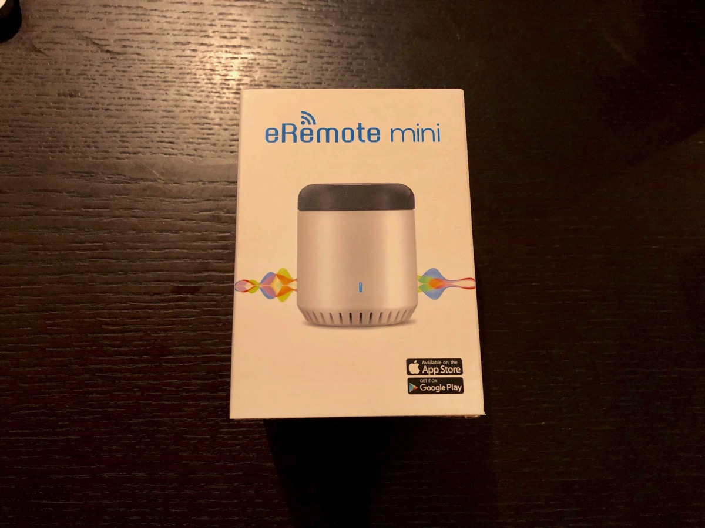
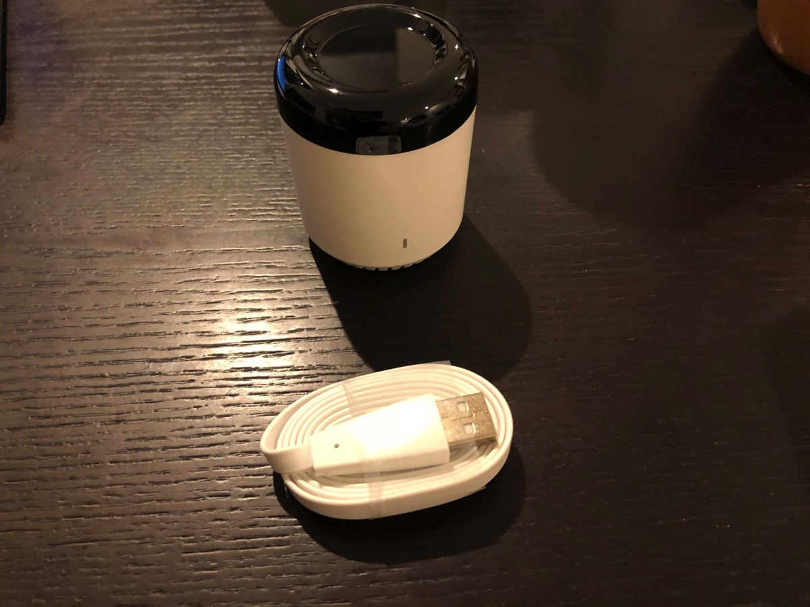
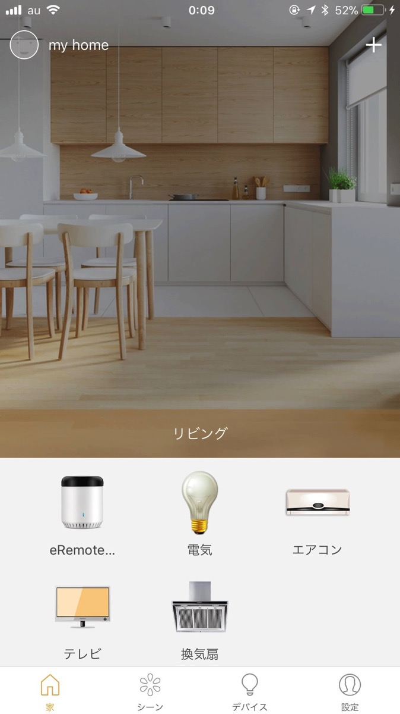
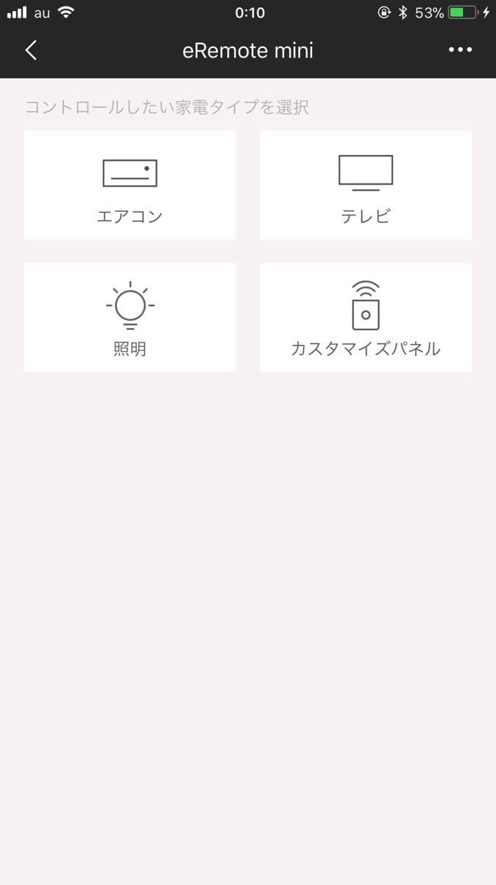
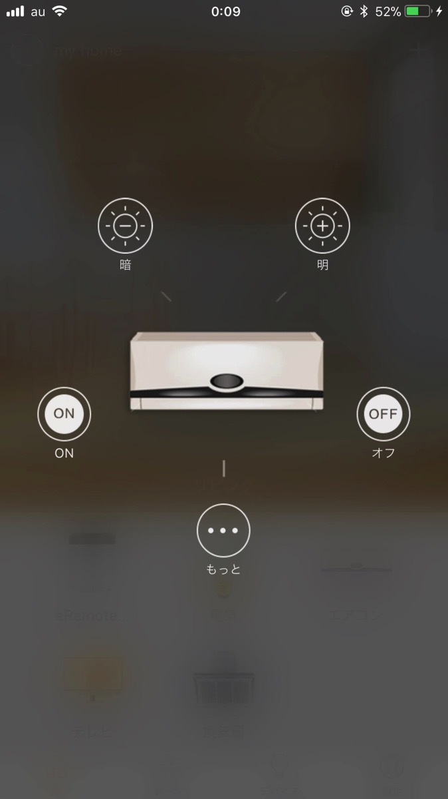
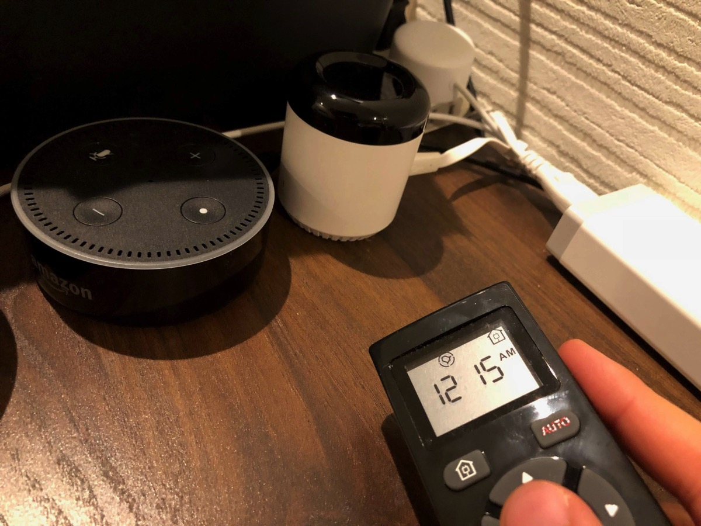
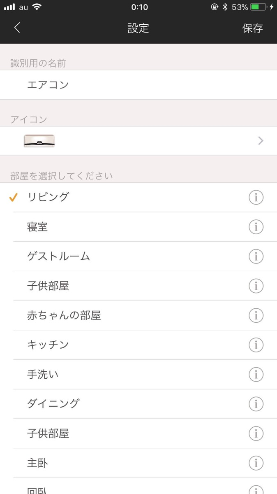
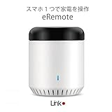

---
categories:
- レビュー
date: Mon, 27 Nov 2017 15:41:27 +0000
slug: post-11394
tags:
- amazon echo
title: Amazon echo買ったけど使えないと思ってる人、これを買え！やりたいことできるぞ！
---

あれだけ招待メールを待ったAmazon echoを買ったのはいいけれども、使って見たら正直イマイチって人、意外と多いんじゃないでしょうか？天気を確認するためだけに使ってませんか？そろそろメルカリで売っちゃおうかなとか思ってませんか？

ぼくもそうでした。でもこれを買って一変。本当にやりたかったことができるようになりました。本日はそんなAmazon echoにつなげると幸せになれるガジェットをご紹介いたします。<!--more-->
<h2>Amazon echoは単体では真価を発揮できない</h2>
ぼくはAmazon echoとGoogle homeを併用しています。両方使って見てわかったのは、Google homeが圧勝でした。ぼくの用途では。

<strong>その理由は、ふだん「Google Play Music」を使って音楽を聴いているから。</strong>

iTunesの曲を全てGoogle Play Musicにアップして、そこからストリーミングで音楽を聴いています。Google homeで音楽を流す際も、Play Musicのライブラリから再生されます。そのためランダム再生する時なんか、勝手に好みの曲を選んで流してくれます。さらには、ライブラリに入っていない関連アーティストの曲も拾ってきて流してくれるので、聴いたことがなかった曲と出会うことができます。

そして、wifi接続できる電球とかのいわゆるスマート家電を持ってないので、Google homeの圧勝という結論にいたりました。

参考：<a href="https://www.warawareotoko.com/2017/11/19/post-11317/">Amazon Echo dotレビュー。Google Homeと比較もしてみた！どっち買ったらいいのか？</a>
<h2>赤外線を記憶させるガジェット「e-remote」</h2>
しかし、このガジェットの存在を知り実際に連携させることでAmazon echoの真価を目の当たりにしました。それがこちら「e-remote」です。

本体とUSBケーブルと説明書だけ

まずはアプリをダウンロード。説明書に書かれているアプリが何やら前のバージョンらしく、最新のものをダウンロードした方がいいっぽい。（旧バージョンだとアレクサに対応していない模様）

<a href="https://itunes.apple.com/jp/app/ehome/id1297834697?mt=8&amp;uo=4&amp;at=11ld5P" target="_blank" rel="noopener">eHome</a> (無料)

<a href="https://itunes.apple.com/jp/developer/linkjapan-inc/id1297834695?uo=4&amp;at=11ld5P" target="_blank" rel="noopener">LinkJapan Inc.</a> <a style="width: 100px; color: #ffffff; background: -webkit-gradient(linear, 100% 0%, 100% 100%, from(rgba(85,182,237,0.5)), to(rgba(41,140,218,1))); font-size: 10px; font-weight: bold; text-align: center; display: inline; text-decoration: none; border: 0px; padding: 5px; border-radius: 10px; white-space: nowrap;" href="https://itunes.apple.com/jp/app/ehome/id1297834697?mt=8&amp;uo=4&amp;at=11ld5P" target="_blank" rel="noopener">iTunes で見る</a>

(2017.11.28時点)

posted with <a href="http://pochireba.com" target="_blank" rel="nofollow noopener">ポチレバ</a>

こいつをダウンロードして設定していきます。エアコン、照明、ロボット掃除機などなど赤外線のリモコンを使って操作するものなら登録できます。

設定画面で本体に向けて対応するボタンを記憶させます。

<h3>注意点</h3>
これに記憶させて、アレクサ側にLink Japanのスキルをオンにして連携させれば音声操作が可能になります。が、一個だけ注意点。

音声で操作できるのが<strong>「照明」のみ</strong>で、なおかつ<strong>「〜つけて」「〜けして」しかできません。</strong>

ただし、こちら回避方法があります。
それは、照明以外を照明として登録することです。登録した後で名称を変更すれば、それを音声判断します。

こちらエアコンという名称で登録しておりますが、照明です。

また、<strong>オンオフ操作に別の挙動を設定することも可能</strong>です。
このあたりもう少し賢くなってくれたら完璧なのに。

でも、まぁこれでやっとアレクサの真価が発揮できるわけです。
<h2><a href="https://twitter.com/s_s_p_y">しんぺー</a>はこう思った。</h2>
音声でやっと操作できる！！！アレクサ、君はこのために生まれてきたんだね！！！

アレクサ！！掃除機つけて！！！アレクサ！！換気扇消して！！！アレクサ！！！テレビつけてえええええ！！！

ちなみに、色々と調べましたがGoogle Homeでもこういったことできなくもなさそうなんですが、プログラミングが必要だったり他のツールをさらに経由させなければいけないっぽかったりで、素人向けではないっぽかったです。なので、ぼくは同室併用で行きたいとおもいます！

アレクサつかえねーなーとか思っている人は、これを使ってみるといいと思います！！！

と言ったところで本日は以上になります。
おやすみなさい。
そして、また明日。

<a href="http://www.amazon.co.jp/exec/obidos/ASIN/B01MA4W1YD/warawareotoko-22/" target="_blank" rel="noopener">LinkJapan eRemote mini (イーリモートミニ) スマホ 家電操作 MINI 【AmazonAlexa対応製品】</a>

posted with <a href="http://kaereba.com" target="_blank" rel="nofollow noopener">カエレバ</a>

LinkJapan

<a href="http://www.amazon.co.jp/gp/search?keywords=LinkJapan%20eRemote%20mini&amp;__mk_ja_JP=%E3%82%AB%E3%82%BF%E3%82%AB%E3%83%8A&amp;tag=warawareotoko-22" target="_blank" rel="noopener">Amazon</a>

<a href="https://hb.afl.rakuten.co.jp/hgc/121ed5e1.954a9ce3.121ed5e2.9fc704ba/?pc=http%3A%2F%2Fsearch.rakuten.co.jp%2Fsearch%2Fmall%2FLinkJapan%2520eRemote%2520mini%2F-%2Ff.1-p.1-s.1-sf.0-st.A-v.2%3Fx%3D0%26scid%3Daf_ich_link_urltxt%26m%3Dhttp%3A%2F%2Fm.rakuten.co.jp%2F" target="_blank" rel="noopener">楽天市場</a>

<a href="//ck.jp.ap.valuecommerce.com/servlet/referral?sid=3041033&amp;pid=882528283&amp;vc_url=http%3A%2F%2Fsearch.shopping.yahoo.co.jp%2Fsearch%3Fp%3DLinkJapan%2520eRemote%2520mini&amp;vcptn=kaereba" target="_blank" rel="noopener">Yahooショッピング</a>

