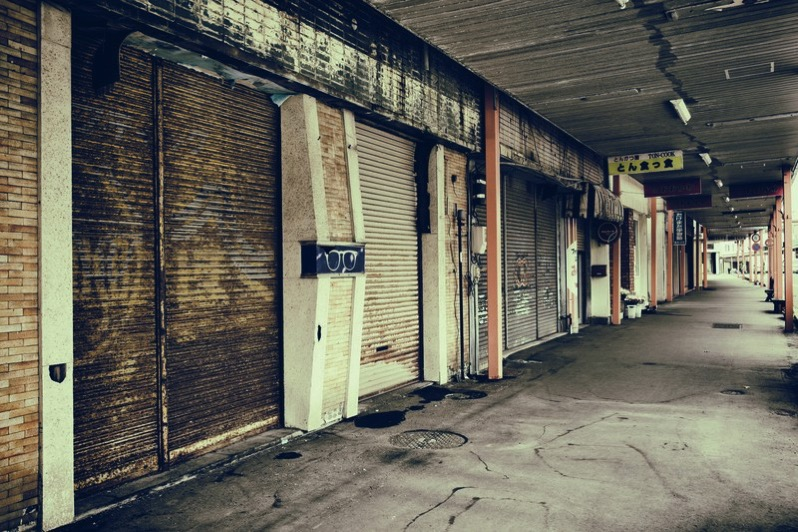
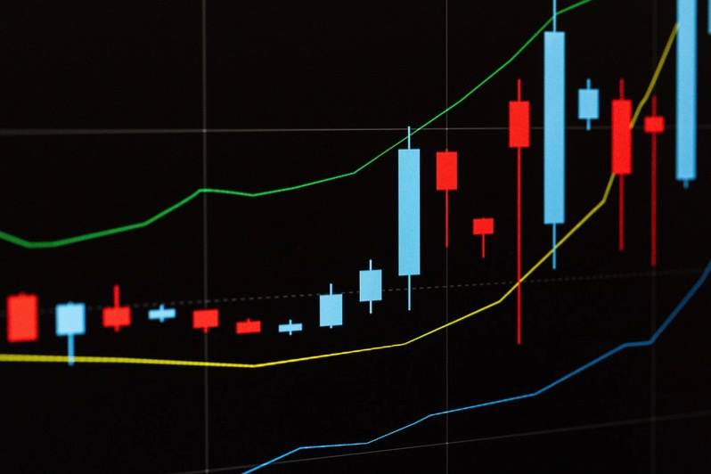

---
categories:
- トラウマ
date: Tue, 28 Nov 2017 16:26:45 +0000
slug: post-11401
tags:
- ブログ
title: 衰退国家日本の未来を思って漠然とした不安に襲われた話
---

ぼくは金がない、スキルもない、未来を生き抜く力もない。日曜の夜から漠然とした不安に襲われた。何か自分の力で抗えないものに、押しつぶされそうな感覚。何かを決断しなければいけない感覚。その手前でずっと時間がとまって、逃げだせたらいいのにという感覚。

何に対しての不安かというと、この国が衰退しているということ。10年20年後がどうなってるのかすらわからない。ただし、今より衰退していくことは間違いない。確信が持てる。今当然できていることが、いつのまにかできなくなっていて、しかもそれは突然無くなるのではなくて、きっといつのまにか無いことがあたり前になっていく。そんな気がする。<!--more-->
<h2>やがて来る荒廃の時代</h2>

荒廃した世界観は嫌いじゃない。好きなゲームの「THE LAST OF US」もゾンビアポカリプスを描いている。つまりは「ウォーキング・デッド」みたいな感じ。そういう誰もいないっていう世界観は正直好きでワクワクする。

でも、そこまではいかないだろうけど、衰退は絶対にする。それが不安でしようがなかった。

童話は色々なことを過去に語り継いでくれる。キリギリスは何故死に絶え、アリは何故生きながらえたのか。冬が来るのがわかっているなら、備えをしておけばいい。
<h2>無駄使いは未来の自分の命を食べてるのと同じ</h2>
ぼくは、無駄遣いをする。初めてのボーナスで買ったのはサンドバッグだった。サンドなしの。つまり土が入ってなかったからただの布のふくろ。よっぽど小学校の肯定に砂を盗みに入ろうかと思ったわ。

違う年は、経営破綻だかなんかの株を買ってみた。翌週さらに下がり初めて数万円が消えた。

さらにまた違う年のボーナスではアップルの株を買ってみた。iPhone好きだし。間違って中古車販売のアップルインターナショナルの株を買ってたみたい。株主総会の案内が来て初めて気がついたよ。

それ以外にも使わないだろうってものを山ほど買ったし、買ったものはどこへ消えたの？って感じ。今思うと仕事のストレスをネットでの買い物で発散してたのかもしれない。

ただ、<strong>無駄づかいって未来の自分が使うべき金、つまり命を食べてるってこと</strong>なんだと思った。

でも、だからと言って、今爪に火を灯して何かを我慢しまくるって気にもなれない。毎日自炊して弁当持って会社に行きますか？水道水を水筒に入れて飲みかすか？否。

何より弁当が嫌いだし、ランチで満足度が低いと風邪をひいたり具合が悪くなったりするのjは検証済み。ペットボトルはあまり飲んでないけど、紅茶やお茶は飲んでる。格安SIMで節約するかっていうと、通信クオリティが下がるし上位プランだと料金はキャリアのプランと実は変わらないし。

じゃ、稼ぐ額をあげるしかないわけで。副業したり投資したりして稼ぐ額を増やしていくしかない。会社の給料なんて期待できない。だから、それ以外で稼がなきゃいけない。

それこそが生きるための唯一の手段になる。

<h2>会社以外での収入を増やしていくしか生き残る方法はない</h2>

だからぼくはもっと頑張らなければと思った。貯金して、あまったお金を投資にまわして増やしていく。

欲しかったはずのもは、我慢してみると必要さがわからなくなってくる。とりあえず少し我慢してみる。すると少し未来が見えてくる。それを投資にまわせばいい。

冬のボーナスはたまっているクレジットカードの支払いを生清算する。それができれば、ぼくはちゃんと貯金をするんだ。（という死亡フラグ。。。）

そして、体を鍛えて、災害対策の備蓄をして、外国語やプログラミングを勉強して、好きなことを好きなように我慢しないでできるようになるんだ。

<h2><a href="https://twitter.com/s_s_p_y">しんぺー</a>はこう思った。</h2>
という感じでふと不安になって、twitterでツイートしてたらいつのまにか、色々と思考が整理されて漠とした不安は霧散しました。

ぼくは生まれ変わって頑張るんです。生き残るために。

と言ったところで本日は以上になります。
おやすみなさい。
そして、また明日。