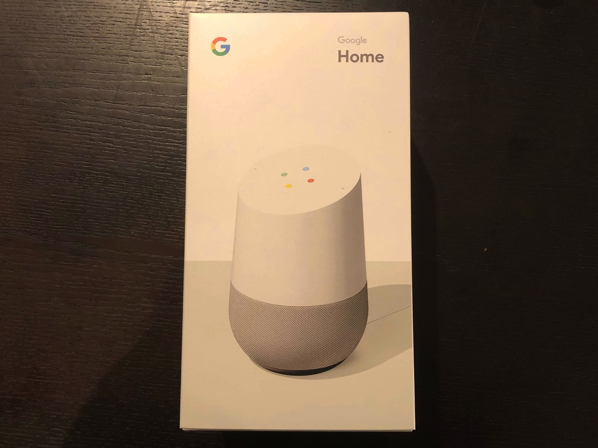
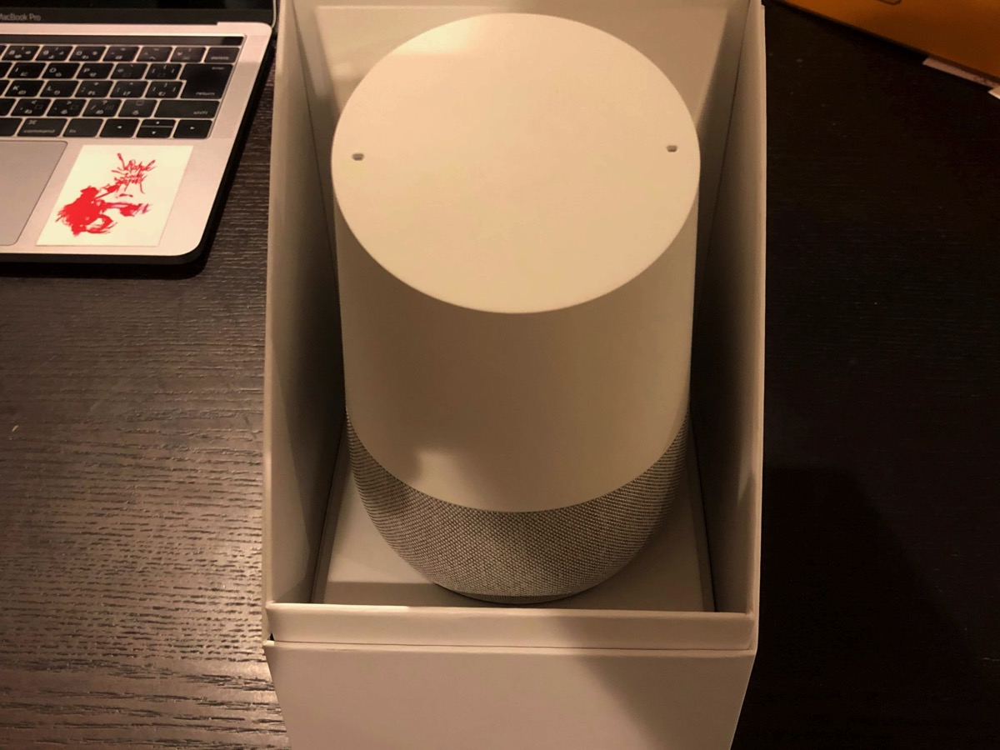
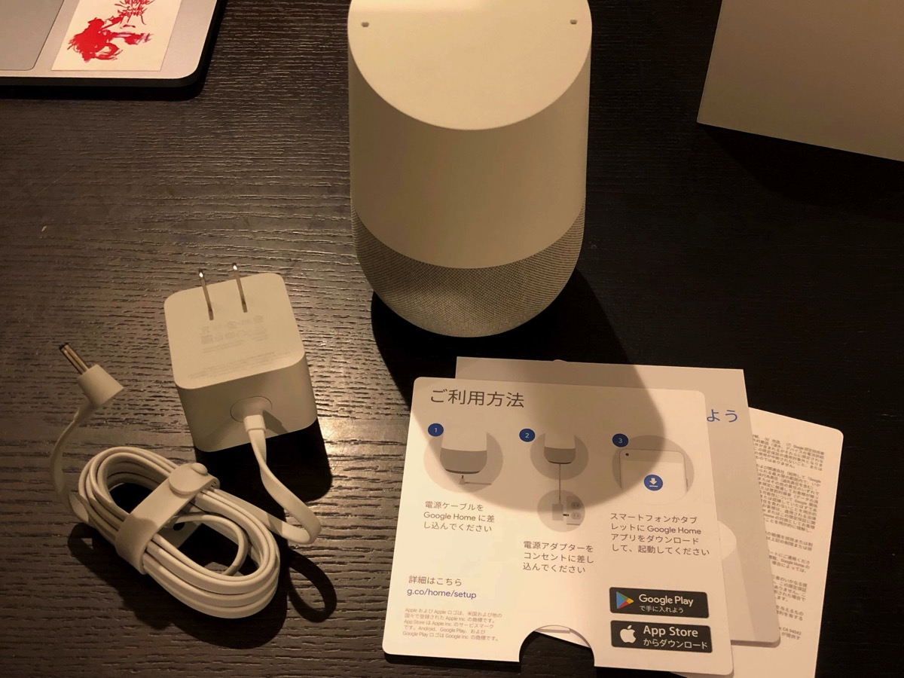
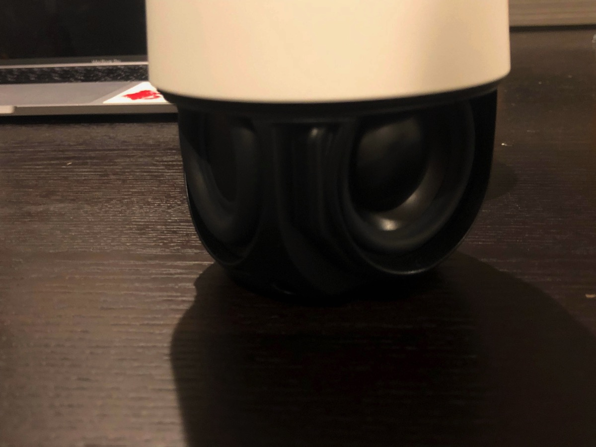
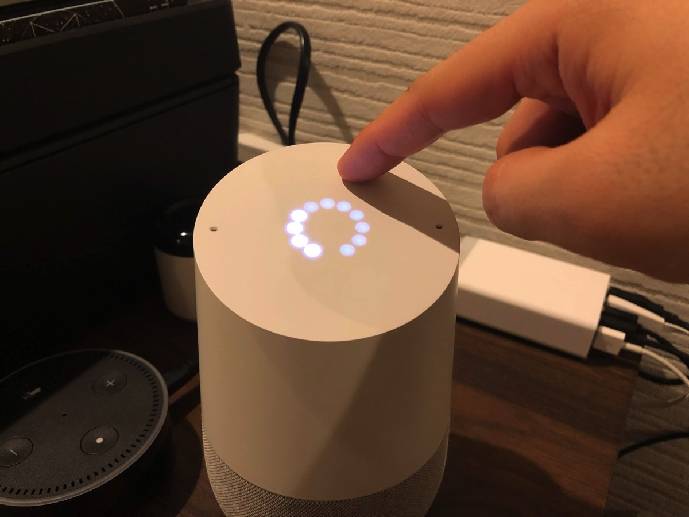
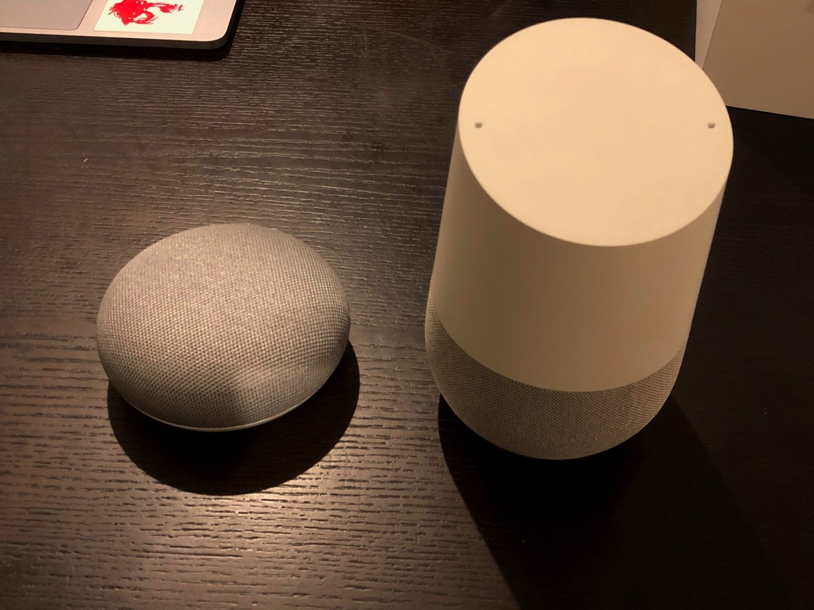
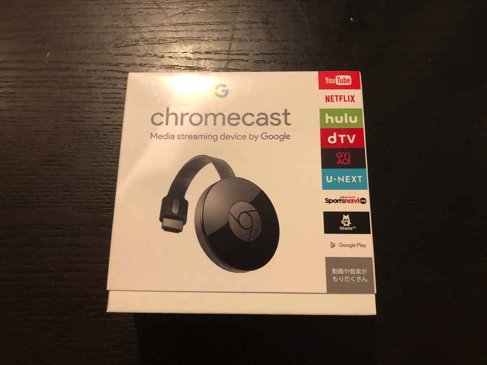
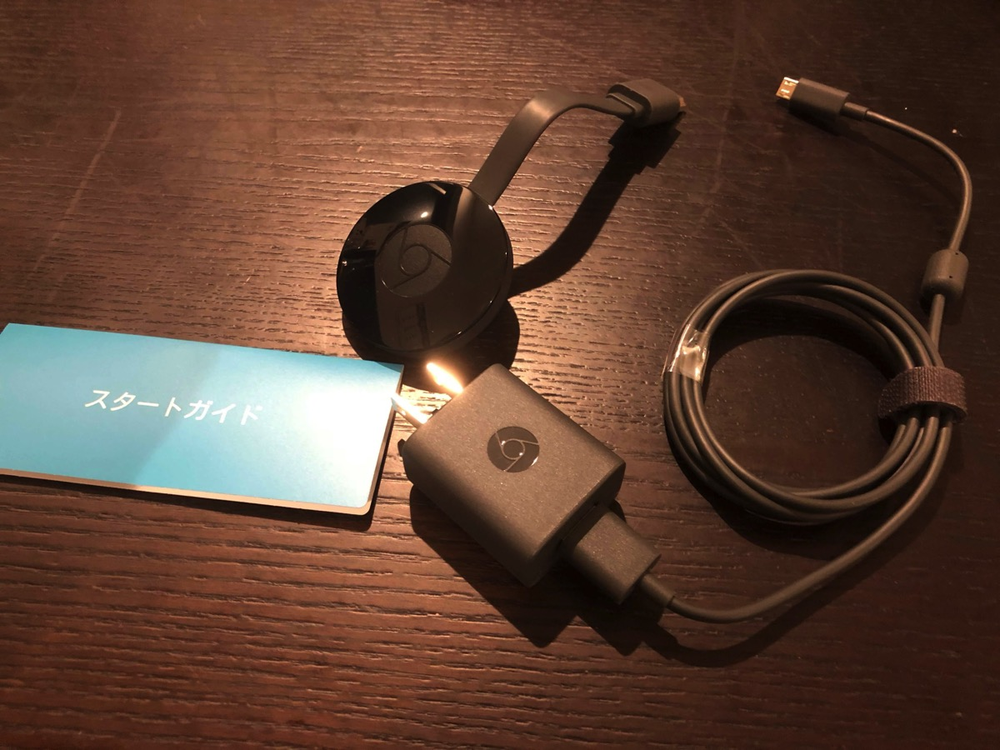
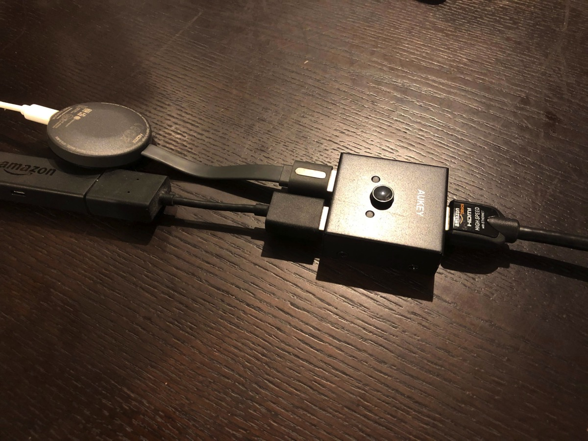

---
categories:
- レビュー
date: Mon, 11 Dec 2017 03:00:00 +0000
slug: post-11414
tags:
- ガジェット
title: Google homeとminiの比較。Chromecastも買った方がぜったいいい！
---

ぼくはGoogle home miniを主に音楽を聴くために使用しています。がっつりと曲を聴くというよりも、なんとなーく流してBGMのようにしています。そんな中、年末のセールでGoogle homeが半額の7000円で投げ売りされていたので、この際どうせならきれいな音で音楽を聴きたいと思い、miniから上位モデルへと乗り換えをすることにしました。

ということで、本日はGoogle homeのレビュー及びminiとの比較です。<!--more--><h2>Google homeとは？</h2>

Google homeとはGoogleが出しているスマートスピーカーです。GoogleアシスタントというAIを搭載しており、音声入力により様々なことをしてくれます。

たとえば、「今日の天気」を聞いたり、わからないことを聞けばwikipediaからひっぱってきて読み上げてくれたりします。また、対応しているスマート家電を操作することもでき、例えばライトをつけたり消したりなんてこともできます。

現在、日本ではGoogle homeとGoogle home miniの2種類が販売されています。
海外だと最上位モデルのGoogle home MAXというのも販売されているようです。

<h3>Google homeレビュー</h3>

箱のサイズはそれなりに大きく、またminiと比べると高級感があります。

スピーカーは背面の方向以外の3方面を向いて配置されています。miniはこのスピーカーが一個ついてるくらいの大きさです。

低音がかなりいい感じに出て、音に奥行きが出た感じがします。ただ、通常のスマートスピーカーとしてだと音質には意味があまりありません。
あくまで音楽を聴くときにその真価が発揮されます。

なお、miniにはついていない、音楽のストップ&再生昨日がついています。あたまをちょんとさわればスタートストップができます。音量はあたまをくるくるとさわるとできます。

<h3>miniとの比較</h3>

Google homeとminiの違いは大きさ。Google homeは大きい分、3方向にスピーカーを配置しておりいい音質を流すことができます。
miniでは感じられなかった低音をかなり感じることができます。

比較してみるとminiはスマホで音楽を再生するのに近しい音質で、低音がほとんど聞こえません。
それに対しGoogle homeは低音がかなりしっかりと聞こえて、太い音質を体感できます。

<h2>どっちがオススメ</h2>

miniを買って、スピーカーをつなげればいいじゃなんと思うかもしれません。
ぼくもそう思いました。しかし、安いスピーカーを繋げて見るとホワイトノイズがすごく気になります。

というのも、Google homeが起動していない時もスピーカーは常に電源がついているため、「シーーーー」という音がなり出つづけることになります。
また、しばらく使わないとスリープ状態に入るタイプのスピーカーもあるかと思いますが、その際Google home起動でスピーカーも起動するかわかりません。たぶん、都度スピーカーの電源を入れないといけないんじゃないでしょうか。

なので、音楽を聴きたい人はGoogle homeを購入がおすすめです。
スマートスピーカーとしての機能を使いたいだけならminiで十分です。

<h2>Chormecastとの連携が最強</h2>

Chromecastとは、テレビにYoutubeを流したりできるガジェットです。スマホやPCのChromeで開いているyoutubeなどをテレビに直接わたして流すこともできます。

Google homeをこのChromecastと連携させるとほんっとうにYoutubeの視聴が楽に便利になります。

たとえば、「猫の動画を流して」と指示すれば、勝手に動画を探して来てテレビに流してくれるのです。本当にこれが便利です。

ちなみに、ぼくはAmazonのfire tvを使っていたのですが、chromecastと併用するためにhdmiを分岐させて使うことにしました。

<h2><a href="https://twitter.com/s_s_p_y">しんぺー</a>はこう思った。</h2>

いやー最初からこっち買っておいてもよかった！！
本当にYoutube視聴がめちゃくちゃはかどる！！！音楽もすごく綺麗に聴けますし。

本当におすすめです。

と言ったところで本日は以上になります。 
おやすみなさい。 
そして、また明日。

<a href="https://hb.afl.rakuten.co.jp/hgc/g00q0725.6s4bsd8a.g00q0725.6s4btbc5/?pc=https%3A%2F%2Fitem.rakuten.co.jp%2Fbook%2F15142695%2F&m=http%3A%2F%2Fm.rakuten.co.jp%2Fbook%2Fi%2F18832252%2F" target="_blank" >Google Home（グーグル ホーム）</a>
posted with <a href="http://kaereba.com" rel="nofollow" target="_blank">カエレバ</a>

<a href="https://hb.afl.rakuten.co.jp/hgc/121ed5e1.954a9ce3.121ed5e2.9fc704ba/?pc=http%3A%2F%2Fsearch.rakuten.co.jp%2Fsearch%2Fmall%2Fgoogle%2520home%2F-%2Ff.1-p.1-s.1-sf.0-st.A-v.2%3Fx%3D0%26scid%3Daf_ich_link_urltxt%26m%3Dhttp%3A%2F%2Fm.rakuten.co.jp%2F" target="_blank" >楽天市場</a>

<a href="http://www.amazon.co.jp/gp/search?keywords=google%20home&__mk_ja_JP=%E3%82%AB%E3%82%BF%E3%82%AB%E3%83%8A&tag=warawareotoko-22" target="_blank" >Amazon</a>

<a href="//ck.jp.ap.valuecommerce.com/servlet/referral?sid=3041033&pid=882528283&vc_url=http%3A%2F%2Fsearch.shopping.yahoo.co.jp%2Fsearch%3Fp%3Dgoogle%2520home&vcptn=kaereba" target="_blank" >Yahooショッピング</a>

