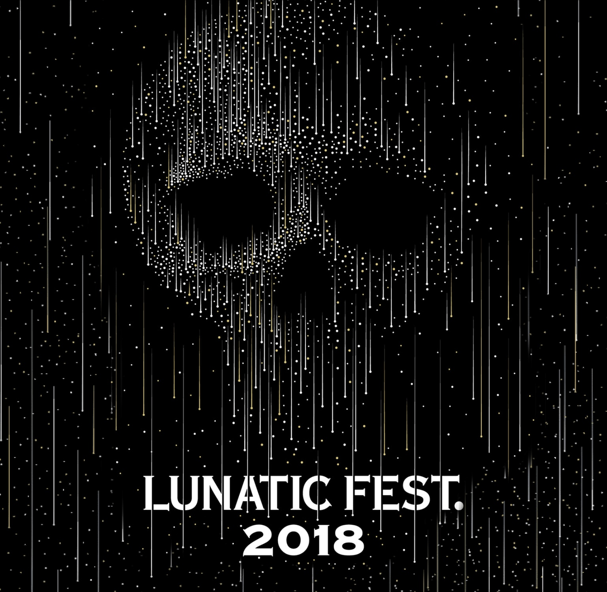
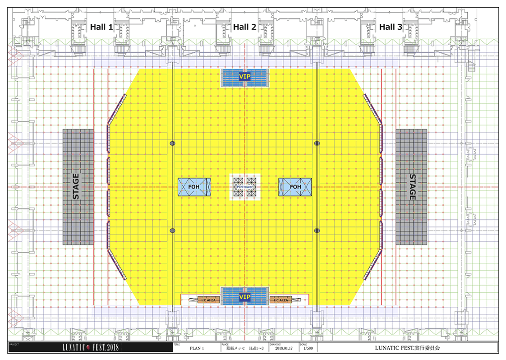
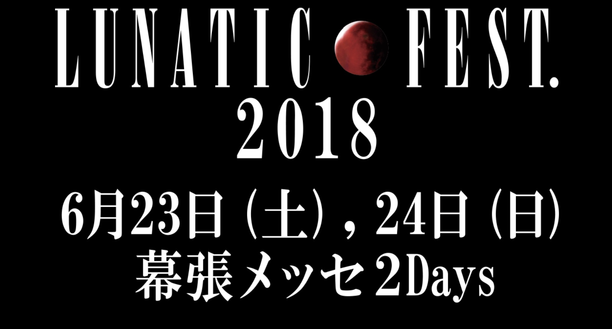

---
categories:
- LUNATIC FEST.
date: Sun, 24 Dec 2017 10:27:04 +0000
slug: post-11443
tags:
- LUNATIC FEST
- ルナフェス
title: 【LUNATIC FEST.】ルナフェス2018開催決定
---

2015年6月、LUNA SEA主催の狂気の祭典「LUNATIC FEST.」は開催された。X、BUCK-TICKを始めとするいわゆるヴィジュアル系バンドやLUNA SEA自身が認めたバンドたちが召集され、2日間の宴に華を咲かせた。

そして、昨日のLUNA SEAのLIVE後に2018年に再び開催さることが発表された模様。

<!--more-->

<h2>開催日</h2>

2018年6月23日、24日
場所は前回に引き続き幕張メッセ

話によるとすでに周辺宿泊施設は予約が取りにくい状況らしい。

<h2>2018/1/17 ステージレイアウト発表</h2>

ステージのレイアウトが発表されました。前回は3ステージあり順番に出演者が演奏するという形式でした。
今回は、2ステージ。会場のどちらにいても演奏が見られる感じでしょうか。

<h2>NEXT ACTION</h2>

2018/1/31

<h2>今後の告知スケジュール</h2>

前回の発表内容は以下の順番でした。細かな部分は割愛していますが大まかにはこんな感じです。

ステージ構成発表
アーティスト数発表
ラインアップ第1弾
ラインアップ第2弾
ラインアップ第3弾
ラインアップ第4弾
オープニングアクト発表

これになぞると、おそらく次回発表はアーティスト数もしくは参戦アーティストの発表と思われます。
また、前回はLUNA SEA自身が狂気がありダークネスと認めてバンドが招致された形だが、今回も同じような主旨なのではとぼくは予想しています。そうなると、ある程度前回参戦アーティストとかぶるのではないでしょうか。

ただし、若干わかめのバンドになるかなと思います

<h2>参戦アーティスト予想</h2>

LUNA SEA
X JAPAN
BUCK-TICK
GLAY
DIR EN GREY
PIERROT
ムック
lynch

前回オープニングアクトと騒がれたlynchさん、今回は出るか。。。

<h2>しんぺーはこう思った。</h2>

あーもしかしたら、DIR EN GREYとsukekiyo別日参戦あるかもな。。。

と言ったところで本日は以上です。
おやすみなさい。