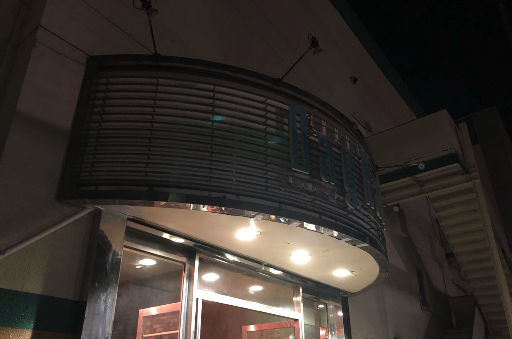

---
categories:
- sukekiyoのLIVEレポ
date: Mon, 15 Jan 2018 16:19:42 +0000
slug: post-11491
tags:
- LIVEレポ
- sukekiyo
title: 【ライブレポ】sukekiyo二〇一八年公演「嬲り地獄」2018_01_14@横浜BAY HALL
---

ぼくの2018年、新年一発目のLIVEはsukekiyoでした。会場は横浜の港の奥地にあるそれはそれはロックな場所にあるLIVEハウス、それが横浜BAY HALLでした。
<!--more-->
<h2>会場雰囲気</h2>

自分の番号過ぎたあたりに到着したのであまり会場を見る時間がありませんでしたが、かなり無骨でそれでいてクラブチックな雰囲気でした。周辺は横浜といっても近くのコンビニまでも少し歩くくらいでした。大通りが近くにあるもののタクシーを拾うのもなかなか難しそうです。LIVEが終わった直後に誰かが呼んだタクシーが来てました。寒い中歩くよりも、タクシーで最寄の駅まで行っちゃった方がいいかもしれません。

会場は入場すると階段があって、それをあがって二階でした。会場内は柱が数本立っていて、ポジション間違えると何も見えなくなります。ぼくもかなり微妙な立ち位置で、UTAさん、京しか見えませんでした。客席構造はリキッドルームに近い感じでしょうか。後ろに行くほど少しずつ高くなってる感じです。キャパは1100名くらい？で、なかなか広く感じました。
<h2>技巧と感情</h2>
寒さと歩き疲れからか、ぶっ倒れそうになりながら見ていました。今回は体を動かしていいっぽいのですが、やはり慣れません。

そんな意識が朦朧とする中で見たsukeiyoは、昨年とは明らかに違って感じました。メンバーが放つオーラというか技巧が凄くて、技術に酔いました。さらに京も感情を爆発させるかのように歌っていました。

最後の最後でメンバーがはける時も、匠は手をあげ、未架は手を叩きステージをあとにしていました。いつも頭を深々と下げ、さっと去る印象でしたが、sukekiyoというバンドとして武道館に立ったという自身を感じました。

なんとなく、このバンドで、もしかしたら武道館も夢じゃないんじゃないかとさえ思えました。ただ、ステージとして武道館を選ぶかっていうのは甚だ疑問ですが。
<h2>セトリと演出</h2>
1. 新曲
2. 新曲
3. グニャ結論。そして血眼
4. 襞謳
5. 純朴、無垢であろうが
6. マニエリスムな冷たい葬列者
7. 艶
8. 首吊り遊具
9. されど道連れ
10. 12時20分金輪際
11. 耳ゾゾ
12. 黝いヒステリア
13. 死霊のアリアナ
14. vandal
15. anima
16. 嬲り

１曲目が新曲の「こうも違うモノなのか、要するに」らしい。LIVE自体はすごく長く感じた。けど終わってみるといつも通りの時間というか90分くらいで本当に驚く。Yuchiがたまにしか見えなかったが、匠とのポジションチェンジのみならず、京ともポジションチェンジをしつつ、おそらく即興でセッションしていた。

ステージセットは全容があまり確認できなかったけれど、おそらくPATY ZOOの時と同じくブラウン管テレビが2個ずつ積み上げられており、ステージの映像が映し出されていた。あとは暗くて、見ていた場所からはほぼ見えませんでした。

ちなみに、ニコ生で放送された部分を映像で確認してみましたが、全員DUMMYをまとい、京はファーのようなふさふさのジャケットに、ベレー帽、口周りを赤口汚したメイク、額にワンポイント、カラコン。

Yuchiはいつも通り
<blockquote class="twitter-tweet" data-lang="ja">

sukekiyo「嬲り地獄」@横浜ベイホール、終了しました。今日もありがとうございました！
あー、疲れなんか吹っ飛ぶぐらい楽しかったです。
次は埼玉！まだまだ続きます。嬉しいですね。帰ってビールお化けになっときます！おやすみなさい！ <a href="https://t.co/PhiTaXjvsX">pic.twitter.com/PhiTaXjvsX</a>

— YUCHI (@yuchivalism) <a href="https://twitter.com/yuchivalism/status/952500698805018626?ref_src=twsrc%5Etfw">2018年1月14日</a></blockquote>

ちなみに途中後半一度だけ匠がぐわーっと前に出てきたところがありましたが、ドレッドヘアーを束ねていました。そして、なんだか！めちゃくちゃテンションあがった！かっこいいい！
<h2><a href="https://twitter.com/s_s_p_y">しんぺー</a>はこう思った。</h2>
単純に楽しかった。ほとんど動かなかったし、あんまり見えなかったけど純粋に楽しかった。

次はHEAVEN’S ROCKさいたま新都心。確かあの会場はせまくて長方形で、ステージまで近く見やすかったはず。次回はしっかりと目に焼き付けたい。

と言ったところで本日は以上になります。
おやすみなさい。
そして、また明日。