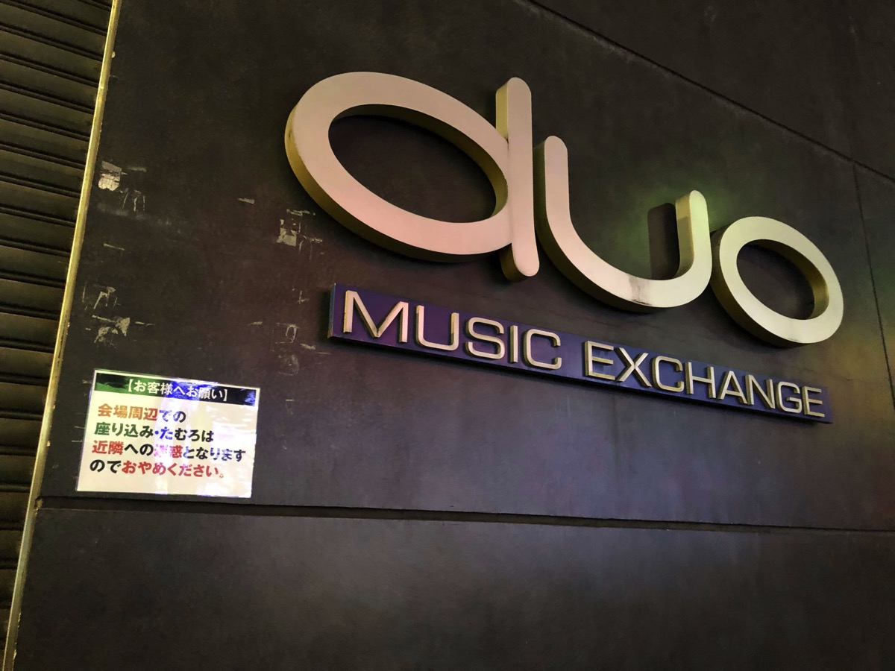

---
categories:
- sukekiyoのLIVEレポ
date: Sun, 28 Jan 2018 16:27:22 +0000
slug: post-11508
tags:
- LIVEレポ
- sukekiyo
title: 【ライブレポ】sukekiyo二〇一八年公演「嬲り地獄」-ハロウィン殺しの深闇の儀-2018_01_27@渋谷duo MUSIC EXCHANGE
---

sukekiyoのオールナイトLIVE行ってきました。渋谷に赴くのが久しぶりすぎて迷いましたw自信満々でセンター街を歩いてたら、道玄坂の方でした。DJタイムが何したらいいかわからなかったので、整番気にせずに歩いてたのでまぁいっかーという感じです。

<!--more-->

<h2>-ハロウィン殺しの深闇の儀-とは</h2>
sukekiyoのハロウィンイベントは、毎年仮装必須
とは言え注意事項は以下の様になっています。
<blockquote>お客様にとっての「仮装」でご来場ください。</blockquote>
ということで、今回はわざわざコスプレのお店いって色々と見てきて学帽を買ったのですが、結局おかしくなっちゃったので毎年恒例のガスマスクにしました。ゆうても被らないで首から下げたり腰からさげたりしてましたけど。なので、もう普通でした。
<blockquote class="twitter-tweet" data-lang="ja">

今日の仮装のテーマは、ネム擦ったふつうの人です

— しんぺー (@s_s_p_y) <a href="https://twitter.com/s_s_p_y/status/957277575553867776?ref_src=twsrc%5Etfw">2018年1月27日</a></blockquote>

あと、ハロウィンといいつつ、だんだんとずれ込んできちゃって、今回はとうとう1月になっておりますw

ちなみに深闇の儀は、たぶん「しんあん」と読むと思います。もしくはみやみ？
<h2>渋谷duo MUSIC EXCHANGE</h2>

sukekiyoでの公演は過去1回ここであったはず。ぼくはいけませんでした。
会場は渋谷道玄坂のラブホテルとかクラブとかがある怪しげな立地です。セキュリィテの人が複数いるような通りでした。

<iframe style="border: 0;" src="https://www.google.com/maps/embed?pb=!1m18!1m12!1m3!1d3241.7498631010153!2d139.69329631525827!3d35.65853398019964!2m3!1f0!2f0!3f0!3m2!1i1024!2i768!4f13.1!3m3!1m2!1s0x60188caa1731e1e7%3A0x6e62e1a6dbc95a1e!2sduo+MUSIC+EXCHANGE!5e0!3m2!1sja!2sjp!4v1517156613772" width="600" height="450" frameborder="0" allowfullscreen="allowfullscreen"></iframe>

さすが渋谷。終演後もやってるラーメン屋とかご飯食べられるところがたくさんありました。

<h2>セトリ</h2>
1. グニャ結論。そして血眼。
2. 襞謳
3. scars like velvet
4. 純朴、無垢であろうが
5. マニエリスムな冷たい葬列者
6. 新曲
7. 首吊り遊具
8. されど道連れ
9. 新曲
10. 艶
11. zephyr
12. 黝いヒステリア
13. leather field
14. 斑人間
15. 死霊のアリアナ
16. dunes
17. vandal
18. anima
19. 嬲り

いつもは16曲くらいなのに、30分くらい長くやりました。
終わった時間も告知していたよりも遅くなりました。
zephyrを久しぶりに聞いた気がします。

メンバーの衣装は、京は白いワイシャツに胸のあたりの部分に何か文字みたいな模様がプリントされていました。それにサスペンダー的な紐ブラ的な
Yuchiはスポーティな感じでした。暗くてそれ以外は不明
<h2>雑感</h2>
もはやオールが苦しい感じですわたし。はい。

それなのに、お腹が減ったけど食べるものなし、ビールで腹を満たす。弱いのに

その結果、壁に寄りかかりながら記憶ぶっ飛ぶ。。。もはやまともにLIVE見れるような感じではなくなってしまった。慣れないDJタイムも酔いが回りました。
もう絶対にLIVE前に酒なんか飲まねー

ただ、記憶が途切れる精神の隙間にsukekiyoが染み入る感じはした。
Yuchiのブログでも書かれてたけど、
<blockquote>説明しづらいんですが、時間帯のおかげか演奏中も今どこにいるかわかんない感じ。
（引用：<a href="https://ameblo.jp/yuchi-bassist/entry-12348089588.html">YUCHI OFFICIAL BLOG 「discharge!」Powered by Ameba</a>）</blockquote>
個人的に週末に椅子に座りながら背もたれに身を預けて、酒飲みながらそのまま記憶を無くすのが好きだった。そんな感じだったけど、せっかくのLIVEだったからそれはそれで残念でした。。。

あと、前後のDJタイムですが、前半は割と苦行でした。30分くらいでいい、、、後半は盛り上がった。なぜなら・・・
<h2>終演後二階席にメンバーあらわる</h2>
後半DJタイム終わってからのアンコールあるかとか期待したんですが、たぶんないだろうと踏んで出ちゃいました。
お腹が減ったので食事をしつつ、Twitter見てたらどうやら二階席にメンバーが現れて飲み始めたとのこと。
<blockquote class="instagram-media" style="background: #FFF; border: 0; border-radius: 3px; box-shadow: 0 0 1px 0 rgba(0,0,0,0.5),0 1px 10px 0 rgba(0,0,0,0.15); margin: 1px; max-width: 658px; padding: 0; width: calc(100% - 2px);" data-instgrm-captioned="" data-instgrm-permalink="https://www.instagram.com/p/Bee_t4sFZ7N/" data-instgrm-version="8">

<a style="color: #000; font-family: Arial,sans-serif; font-size: 14px; font-style: normal; font-weight: normal; line-height: 17px; text-decoration: none; word-wrap: break-word;" href="https://www.instagram.com/p/Bee_t4sFZ7N/" target="_blank" rel="noopener">深夜3:30でも開いてるラーメン屋 #飯テロ #渋谷 #ラーメン</a>

<a style="color: #c9c8cd; font-family: Arial,sans-serif; font-size: 14px; font-style: normal; font-weight: normal; line-height: 17px;" href="https://www.instagram.com/sinpeeee/" target="_blank" rel="noopener"> かいばらゆうざんしんぺー</a>さん(@sinpeeee)がシェアした投稿 - <time style="font-family: Arial,sans-serif; font-size: 14px; line-height: 17px;" datetime="2018-01-28T07:12:03+00:00"> 1月 27, 2018 at 11:12午後 PST</time>

</blockquote>

すぐに戻ると暗がりの中で小柄な影と他多数がわちゃわちゃしてました。
小柄な影は明らかに京。たぶん、「えん7FINAL」の時の打ち上げで被ってた帽子してた？？
<blockquote class="instagram-media" style="background: #FFF; border: 0; border-radius: 3px; box-shadow: 0 0 1px 0 rgba(0,0,0,0.5),0 1px 10px 0 rgba(0,0,0,0.15); margin: 1px; max-width: 658px; padding: 0; width: calc(100% - 2px);" data-instgrm-captioned="" data-instgrm-permalink="https://www.instagram.com/p/BdNQO1hhM8r/" data-instgrm-version="8">

<a style="color: #000; font-family: Arial,sans-serif; font-size: 14px; font-style: normal; font-weight: normal; line-height: 17px; text-decoration: none; word-wrap: break-word;" href="https://www.instagram.com/p/BdNQO1hhM8r/" target="_blank" rel="noopener">MUCC「えん７ FINAL」in 日本武道館 #mucc #sid #l4l</a>

<a style="color: #c9c8cd; font-family: Arial,sans-serif; font-size: 14px; font-style: normal; font-weight: normal; line-height: 17px;" href="https://www.instagram.com/oishi_masahiro/" target="_blank" rel="noopener"> 大石 征裕</a>さん(@oishi_masahiro)がシェアした投稿 - <time style="font-family: Arial,sans-serif; font-size: 14px; line-height: 17px;" datetime="2017-12-27T13:20:32+00:00">12月 27, 2017 at 5:20午前 PST</time>

</blockquote>

それにしてもDJの音楽に合わせてびよんびよーんと飛び跳ねていました。仮面ライダービルドのOPみたいにYuchiと向かい合って飛び跳ねたり。
<h2><a href="https://twitter.com/s_s_p_y">しんぺー</a>はこう思った。</h2>
次回は赤坂BLITZ
今よりも暖かくなってると嬉しいな。。。
とにかく寒すぎて帰り死ぬかと思った。始発を待つホームでフラフラでしたわw

次回オールナイトあるとしたら体調万全というか酒飲まずに臨みたいと思います。

と言ったところで本日は以上になります。
おやすみなさい。
そして、また明日。