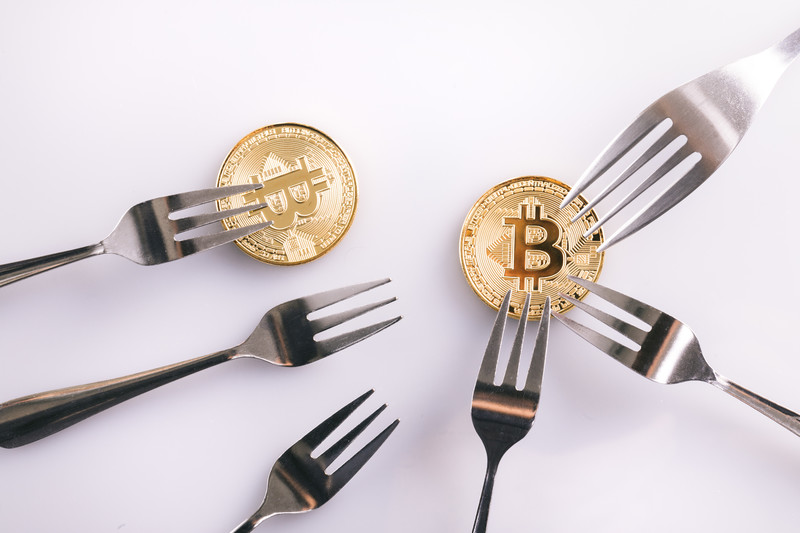

---
categories:
- コンテンツ
date: Tue, 30 Jan 2018 14:48:08 +0000
slug: post-11518
tags:
- 仮想通貨
title: Mac Book盗まれ、とりかえそうと仮想通貨はじめたらその仮想通貨も盗まれた
---

ちくしょう！！こんなことがあってたまるかぁぁあ！！こんなはずじゃ

持っていかれたぁぁあ

痛みを供わない教訓には意義がない
人は何かの犠牲なしに何も得ることはできない

&nbsp;

これからお話しするのは、年末にMacを盗まれ、補填のために仮想通貨に手を出し、その仮想通貨を盗まれた者のお話しです。

<a href="https://www.warawareotoko.com/2017/12/31/post-11451/">Macを盗まれたというのは以前書いた通りです。</a>ローンがあと18回くらい残っています。しかもボーナス月には多めに支払いが乗ってきます。手元にないのに

ぼくは、これを補填すべく、とうとう仮想通貨による投機に手を出したのです。

１ヶ月くらい前に試しに1万円でビットコインを買ってみましたらば、瞬きしたら7000円に減ってたので速攻やめたのはいい思い出

この時は3万円分でビットコイン以外のアルトコインを購入してみました。買ったのは次の通り

LISK←名前がいいw仮想通貨はリスキーだからね！
Ripple←やすかった
NEM←やすかった

安けりゃ上がるやろーと思ってたんですが、すごいですね〜毎日、いや毎時間増えていくんですね〜
寝て起きるとお金が増えているわけです。興奮しました。

まさか、こいつはマジでMacのローン返せるんじゃね？？とか思った時期がぼくにもありました。
ちょこちょこ元本を増やしたりして7万円まで増やしました。

正月明けには20万円近くにあがったりなんかしちゃって。うぉぉおおおすげーーーーーとか思っていましたわ
この時利益確定して、その後も安くなったところで買い直したりしていました。

そうこうしているうちに、ついにあの日がやってきてしまったのです。

いつも通りTwitterをみていると、ぼくの使っている取引所のコインチェックで、NEMの大量出金があったっぽいというのが流れてきました。
けっこう早い段階でこの情報が入っていました。その後マルチシグオフになってるとかそういった追加情報も入ってきて、
夕方までには、これ確実にやべーやつってのが確定していました。

この頃にはどうやらあらゆる取引がエラーになったりしていたみたいです。今思うと画面に表示されていたNEMの残高は実際はゼロだったのです。

深夜の記者会見をリアルタイムで見ていました。アホみたいな記者の質問も見ていました。

今やだだ下がりで10万円くらいになってしまったぼくのコインちゃんたち。
手元に帰ってくるのはいつなんでしょう？NEMが88円？ふざけんな！買った時より安いやんけ！NEMで返せ！
さいあく、NEMもLISKもいらない！Rippleちゃんだけは返してよ！お願い！大切な子なの！お願いよ！
返せよ！！！大切な子なんだああああ！！！

こうして、ぼくはMacを盗まれ、補填のために仮想通貨に手を出し、その仮想通貨を盗まれたのでした。

痛みを供わない教訓には意義がない
人は何かの犠牲なしに何も得ることはできない

ぼくはこの犠牲に何を得たのだろう

以下仮想通貨についてのぼくなりの説明です。興味がある方は読み進めてください。

<!--more-->

<h2>仮想通貨とは？</h2>

ブロックチェーン技術を利用して、発行•取引される通貨です。紙幣と違いインターネット上の数字としてしか存在せず物体として存在しません。また、紙幣の場合国家がその価値を保証しますが、仮想通貨は誰も保証してくれません。参加している人たちが上がると信じれば上がり、下がると思えば下がる。変動の明確な理由も裏付けもよくわかりません。

ちなみにブロックチェーン技術てなんなのーっていうのは、何冊か本読んだけど説明できるほど理解できてません。よく言われるのが銀行みたいに1箇所で全データを管理するのと違って、個人で全員のデータを閲覧できる台帳を持つってことです。なので、改ざんされない、なぜなら自分の台帳にインチキしても他の人たちは全員自分と違う内容になってしまうからみたいな。

これ聞いてもよーわからんという感じです。多分、今までの銀行とかはテスト結果が書いてある先生の手元のリスト。だからお母さんに見せる時に改ざんしたりできる。それこそ先生の方のリストを改ざんすれば実際に嘘を誠にすることもできちゃう。でブロックチェーンは卒業アルバム。自分の写真を可愛く変えたくても皆んながおんなじものを持ってるから実質改ざん不可能。。。みたいな。

<h2>仮想通貨てBitcoin以外にもあるの？</h2>
1番有名なのがBitcoin (ビットコイン)だと思います。興味がない人も名前くらいなら聞いたことがあるでしょう。この技術の根拠とされる論文を書いたとされるのがサトシナカモトという謎の人物です。国籍、人種、所在地はおろか実際に存在しているのかも不明。どうでしょう、これだけ聞いただけでゾクゾクしませんか？

また、仮想通貨にはBitcoin以外にも様々なコインが存在します。その数は数百から数千と言われています。

中には特定の団体や会社が自分たちで作ったコインなんかもあります。商店街のポイントみたいに、自分のところだけで使えるコインを発行して、「こういうことやりたい！」とか「こういう風にコインを使いたい！」とかって感じで、買う人たちはそれなら持っておこーとか考えて買うわけです。いいコインなら価値があがるし、ダメそうならあがらない。そんな感じです。本質的には株に近い感じで、発行する側も資金調達のためにやってたりもします。

今回話題になっているNEMもそういったものの１つです。
<h2>どうやって買うの？</h2>
取引所と呼ばれるところの口座開設をして売買します。
口座の開設だけなら無料です。ただ開設希望者殺到中のため本人確認に時間がかかりますので、多少なりとも興味があるならすぐに開設申請はしておいた方がいいです。なお、以下にあげるものは申請中含めてぼく自身が開設したものです。（アフィリエイトリンクありです。）

<a href="https://bitflyer.jp?bf=bhrtypip">bitflyer</a>

<a href="https://coincheck.com/ja/?c=9Sy6rRJYZp0">coincheck</a>

zaif

bitbank

DMMビットコイン

GMOコイン

bainance
<h2>そもそもNEMって何で盗まれたの？</h2>
さて、ブロックチェーン技術は改ざん不可能と上の方で書きました。それなのに何で今回盗まれちゃったの？ということろですが、それは今説明した取引所のセキュリティのせいです。

日本の場合取引所は金融庁の許可制となっています。今回話題のコインチェックは、金融庁に申請は出していたものの却下されており、今はみなし業者として事業を行なっています。

今回の事件で明るみに出ましたが、コインチェックのセキュリティ体制はかなりずさんだったようです。簡単に言うと、金庫の鍵を普通は３つくらいかけなくちゃいけないのに、１つしかかけてないみたいな感じでした。その隙をハッカーにつかれたというわけです。こういった事例は実は海外でもよく起こっていたようです。それにと関わらずセキュリティを疎かに、新規顧客を取るためのCMをバンバン流しており、今後業界全体への規制や参加者の心理に多大な影響を及ぼしたことはいうまでもありません。
<h2>で、実際儲かるの？</h2>
はい、でようやく多くの人が興味ありそうな話題ですが実際に儲かるの？という疑問にお答えします。

<strong>儲かります。</strong>ってか儲かりました。儲かってました。（過去形）

3万円ではじめ、資金追加をちょっとずつしていって7万円くらいまで自己資金を突っ込みました。

正月あたりに暴騰したので一旦利確して手元に14万くらいがありました。んでもって、また書い直したりなんだかんだして、最高20万くらいになりつつ、今は数字上10万で安定してます。

また市場が上がり調子になればきっと増えるでしょう。

※あれだよあれ。投資は自己責任ってやつだ。

<h2>今後どうなるの？</h2>
わかりませんし、あんまり興味がありません。
最初はお金増えたらいいなーと思ってましたけど、各社のコインの性質を調べれば調べるほど技術への投資という側面を強く感じるようになりました。今1番注目しているのはrippleという仮想通貨です。世界中の金融機関で導入が決定されており、今後さらに発展することを期待されています。まぁでもやっぱり、増えたらいいなぁと思いますね。今は140円くらいですが1000円くらいになったらいいな！
<h2>注意点</h2>
最後に注意事項です。
相場の乱高下がめちゃくちゃです。マジでもう意味がわかりません。瞬きしたら半額になってたりするから。だから失ってもいい金額でやるのがよいです。

今からじゃ億り人 (おくりびと。仮想通貨で億万長者になった人)とか無理。なので小金を拾っていきましょう。

次にコインの管理は取引所ではなくしっかりと手元で行うようにしましょう。取引所は銀行じゃないのでなにが起こるかわかりません。世界中のハッカーやテロリストが狙ってます。だからこそ買ったコインはハードウォレットと呼ばれる物理的なツールに移すことをおすすめします。（ただし、必ず正規店から購入しましょう。Amazonの怪しげな業者とかからは絶対に買っちゃだめです。中いじくられててコイン盗られちゃいますよ）

おすすめしますっていうか、ぼくがそうしてればよかったと痛感しています。
<h2><a href="https://twitter.com/s_s_p_y">しんぺー</a>はこう思った。</h2>
まぁなんやかんや書きましたが、あんまりショックでもないし、心配もしていません。むしろ下がっている今だからこそ買うチャンスなのに他の口座開設ができていないことに焦っています。まだまだ仮想通貨はこれからです。投機ではなく技術への投資としてこれからもしっかりと買っていき、しっかりとホールドしていきたいと思います。

最後にぼくの好きなゲーム実況者けっつん中級兵の言葉をご紹介します。

<strong>「失敗を取り戻そうとするんじゃない、失敗から学ぶんだ」</strong>

この犠牲の上にぼくは経験を得ました。
ハードウォレットを用意し、セキュリティがしっかりしてる取引所にアカウント開設しました。準備はできた。

<strong>足りないのは資金だけ。</strong>

そんな感じですわ。べんべん

と言ったところで本日は以上になります。
おやすみなさい。
そして、また明日。