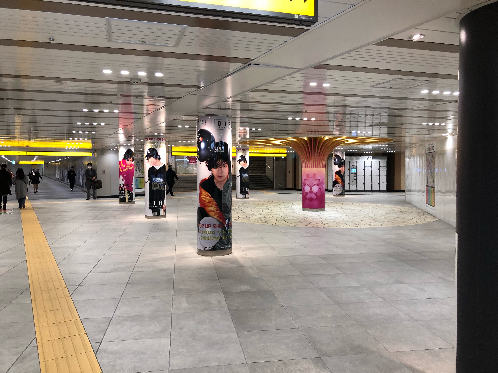
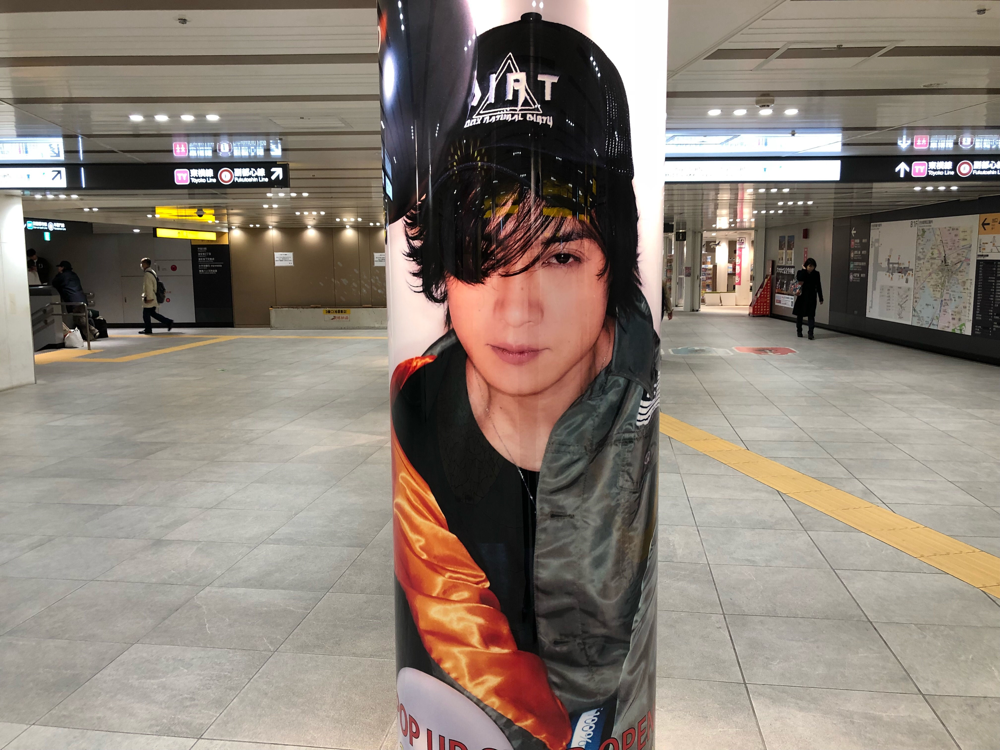
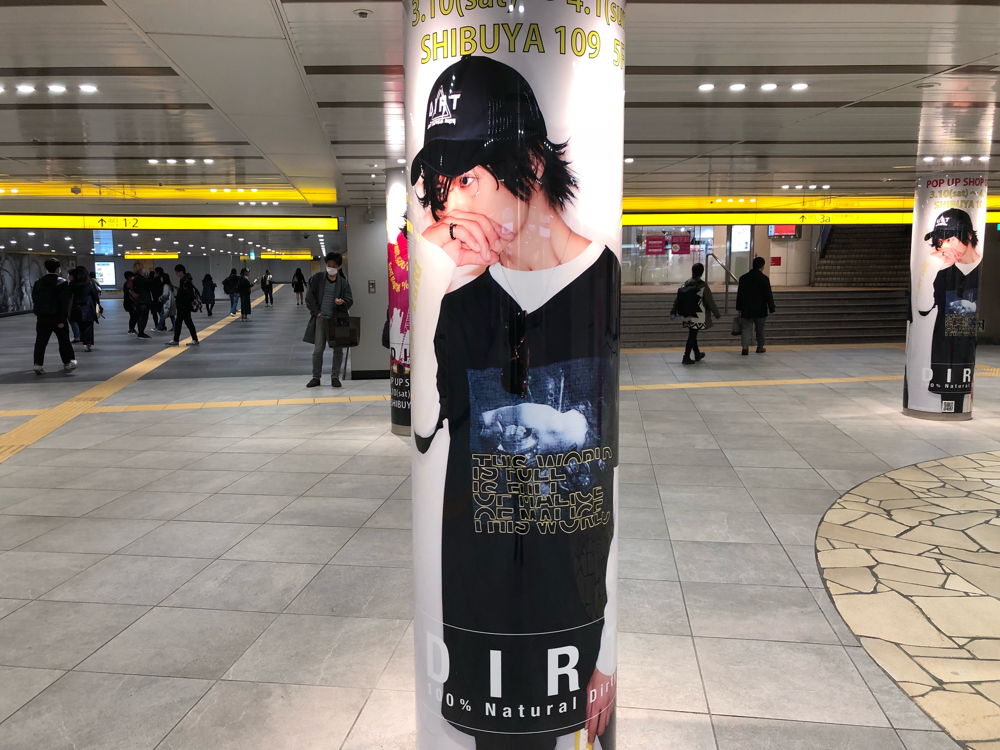
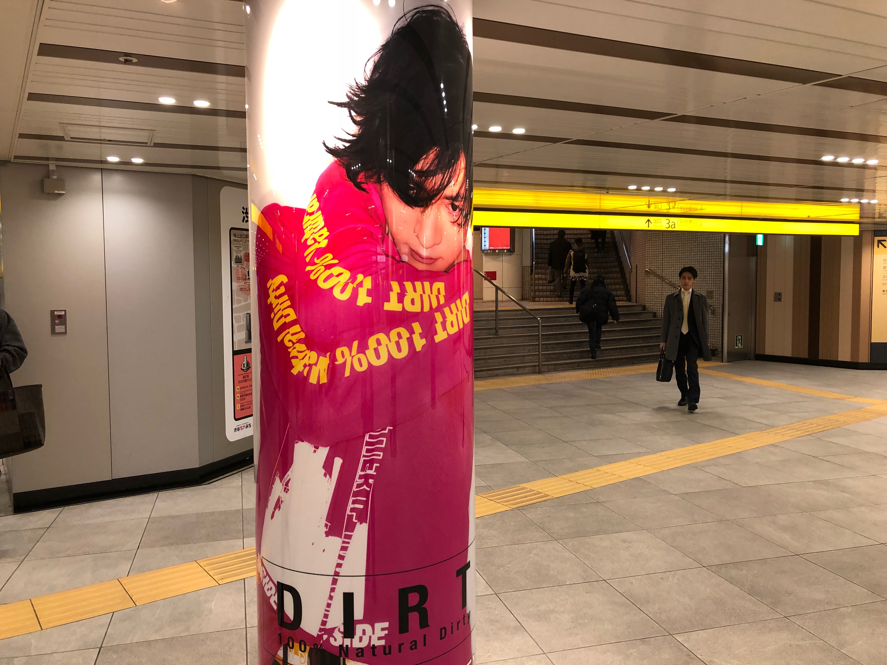
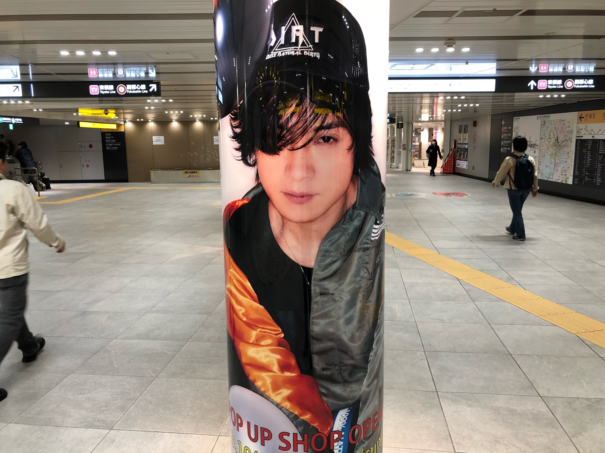

---
categories:
- DIR EN GREY
- 各メンバーの個人イベントレポなど
date: Wed, 28 Mar 2018 21:46:00 +0000
slug: post-11599
tags:
- DIR EN GREY
title: DIRTの109地下通路広告の費用調べてみた【DIR EN GREY】
---

先日ようやくDIRTのポップアップショップにいってきました。109なんて人生で1回くらいしか入ったことがない気がするので緊張したわ。でも、そこにはガングロでピカチューのカッコしたヤマンバギャルみたいな、思い描いたギャルは1人もいなかった。明るいフロアにマウジーの店独特のあの香水の香りがする(ここだけイメージ通り)だけだった。

<h2>「DIRT」とは？</h2>

DIR EN GREYのベースのイケメン筋肉マンのToshiyaがプロデュースするアパレルブランドです。

<blockquote class="twitter-video" data-lang="ja">
【INFORMATION】 2018 最新Collection  SHIBUYA109 5階POP UP SHOPではLong Ver.を公開中。 Long Ver.はPOP UP SHOPでしか見ることが出来ませんので是非足をお運びください。 ■SHIBUYA109 東京都渋谷区道玄坂2-29-1 5F 営業時間：10:00～21:00 期間：3/10(土)〜4/1(日)<a href="https://twitter.com/hashtag/DIRT?src=hash&amp;ref_src=twsrc%5Etfw">#DIRT</a> <a href="https://t.co/TXojler3Pt">pic.twitter.com/TXojler3Pt</a>
&mdash; DIRT_official (@dirt_jp) <a href="https://twitter.com/dirt_jp/status/975642682398658560?ref_src=twsrc%5Etfw">2018年3月19日</a></blockquote>

「<a href="http://dirt-jp.com/natural/">DIRT 100% Natural Dirty</a>」と「<a href="http://dirt-jp.com/dissolutive/">DIRT 100% Dissolutive Dirty</a>」の2種類のブランドがあります。

後者の「DIRT 100% Dissolutive Dirty」からは、主にコラボ系の商品がだされており、グレムリンコラボやスヌーピーコラボでベビー服から大人用のTシャツまであります。カワイイ系です。
前者の「DIRT 100% Natural Dirty」は洋服だけでなくアクセサリーや香水など様々な商品が出されています。カッコイイ系です。

<h3>109のポップアップショップ</h3>

そんなDIRTが期間限定で渋谷の109に出店しています。
5階に入っております。店内の展示スペースはToshiyaが私物を持ってきてレイアウトをしているようです。

<blockquote class="twitter-tweet" data-lang="ja">
DIRT 100% Natural Dirty SHIBUYA109店オープン致しました。 昨日より店舗奥にある展示スペースがリニューアルしております。 TOSHIYA自ら展示物の持参、レイアウトをしております。 お時間ございましたら是非店舗へお立ち寄りください。 お待ちしております!! <a href="https://t.co/dHiLX8ydEP">pic.twitter.com/dHiLX8ydEP</a>
&mdash; DIRT_official (@dirt_jp) <a href="https://twitter.com/dirt_jp/status/976272382879920128?ref_src=twsrc%5Etfw">2018年3月21日</a></blockquote>

<h3>DIRT店内</h3>

店内には過去の商品から新商品までずらっと販売されています。

※Toshiya私物コーナーの写真NGエリアもあったので掲載しません。

<h2>DIRTの地下広告について</h2>

<blockquote class="twitter-tweet" data-lang="ja">
【INFORMATION】 本日3/19(月)〜4/1(日)まで渋谷駅B1F 道玄坂方面地下通路にDIRT 100% Natural Dirty柱広告が登場!! ド迫力の柱看板を是非その目でご確認ください。 写真撮影&amp;拡散お願いします。 ※公共の場の為、ご通行の方の迷惑にならないようにご配慮ください。 <a href="https://t.co/kAmjdFAt8V">pic.twitter.com/kAmjdFAt8V</a>
&mdash; DIRT_official (@dirt_jp) <a href="https://twitter.com/dirt_jp/status/975592151072391168?ref_src=twsrc%5Etfw">2018年3月19日</a></blockquote>

109と駅の方をつなぐ地下通路の柱に広告がでてます。結構な面積なのでそれなりにお金がかかってそう！

ということで写真撮ってきた。

<h3>109地下通路の広告費用調べてみたら</h3>

で、気になったので調べて見ました。

あのスペースは「渋谷ちかみち」と呼びれる通路に隣接する「道玄坂アドサークル」のAに該当します。

1週間で掲載費用60万、制作費用50万がかかるようです。3種類以上の掲載になると2万ずつ増。

おそらくですが1ヶ月掲載なので60万×4週分+50万+2万で合計292万と思われます。

結構金かけてんなー(笑)
あの事務所の本気度が伺えます。

<h3>元は取れてるんでしょうか。。。</h3>

今回7万円以上お買いものをすると3/31のToshiyaバースデーのイベントに参加ができます。おそらく定員は120名。3分程度Toshiyaと密室で色々(多分おしゃべり)できるので、仮に枠が定員に達していれば最低でも840万は売り上げている計算になります。

7万円以下の買い物をした人も当然いるとして、ざっと1000万円くらいは売上があったとします。

出店料、スタッフ人件費、広告費用

さらには8階イベントスペース利用料もかかります。

そのため、利益率は2割とかそんくらいなんじゃね？て感じで超適当な予想をしてみました。

べんべん

<h2>しんぺーはこう思った。</h2>

最近DIR EN GREYはグッズ販売、とくにアパレル関係にはかなりの力を注いでいます。DIR EN GREY関連だけでもToshiyaのDIRT、京のDUMMYとマダラニンゲン、DIR EN GREYのDeadly Clarisとブランドが乱立しています。

個人的にはめちゃくちゃ買いづらいデザインばかりですがw ただ中でもDIRTはカワイイTシャツとかもあって男でもそこそこ買える感はあります。

これカワイイから欲しかったけど。
https://twitter.com/dirt_jp/status/976379572961685505?s=21

そろそろ普段着として着てるライブTシャツたちがボロボロになってきたので、Dirのツアーでは昔の普通のサイズ感のTシャツを出して欲しいものです。

と言ったところで本日は以上になります。おやすみなさい。