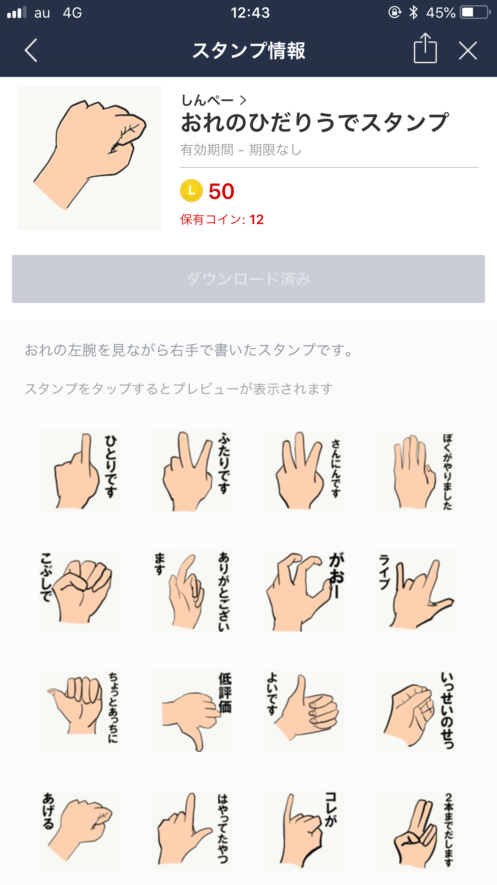
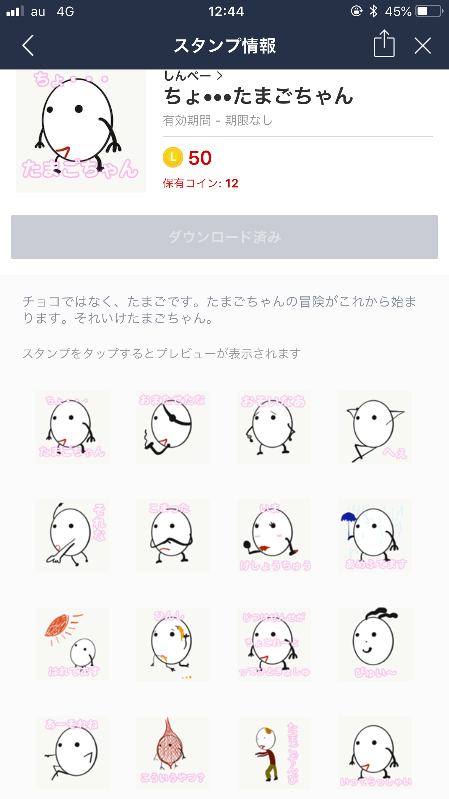
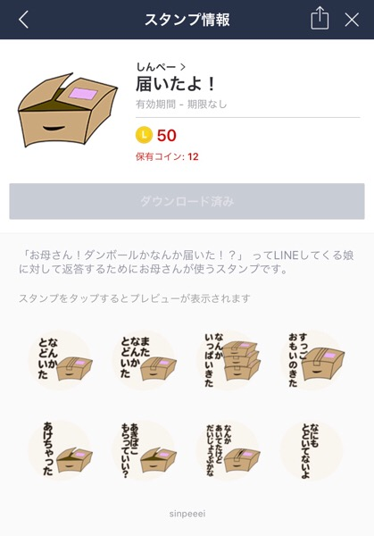

---
categories:
- ブログ
date: Mon, 02 Apr 2018 14:50:48 +0000
slug: post-11612
tags:
- 行った見た買った
title: 2018年3月の行った！見た！買った！
---

3月はなるべくブログを更新したいとかほざいてたわりに４回しか更新してないとか。恥じ入る以外にないです。忙しいとかそういうことりよりもネタがないことの方が割と深刻で、ネタがあれば何かしら書けるんですが、インプットが足りないのか心にササクレが足りないのか、テキストで表現したいことが思い浮かびませんでした。その代わり、やりたかったLINEスタンプのリリースをいたしました！６月末まで毎週リリースします！！ということで、3月の振り返りです。

<h2>新規開拓店舗</h2>

3月新たに行った飲食店はこちら

有名なカレー屋ボンディ。数年前におぎやはぎがラジオで言っててようやくいけた。美味しかったー！

<blockquote class="instagram-media" data-instgrm-captioned data-instgrm-permalink="https://www.instagram.com/p/Bgh8weRBWSu/" data-instgrm-version="8" style=" background:#FFF; border:0; border-radius:3px; box-shadow:0 0 1px 0 rgba(0,0,0,0.5),0 1px 10px 0 rgba(0,0,0,0.15); margin: 1px; max-width:658px; padding:0; width:99.375%; width:-webkit-calc(100% - 2px); width:calc(100% - 2px);">
 
 

 
 <a href="https://www.instagram.com/p/Bgh8weRBWSu/" style=" color:#000; font-family:Arial,sans-serif; font-size:14px; font-style:normal; font-weight:normal; line-height:17px; text-decoration:none; word-wrap:break-word;" target="_blank">欧風 #カレー #ボンディ のチキンカレーチーズトッピング 1630円。高いけどうまい。チキンがしっかり味付いてて、カリカリのところがうまい！！うまい！！！うまい！！</a>
 
<a href="https://www.instagram.com/sinpeeee/" style=" color:#c9c8cd; font-family:Arial,sans-serif; font-size:14px; font-style:normal; font-weight:normal; line-height:17px;" target="_blank"> かいばらゆうざん</a>さん(@sinpeeee)がシェアした投稿 - <time style=" font-family:Arial,sans-serif; font-size:14px; line-height:17px;" datetime="2018-03-20T03:46:42+00:00"> 3月 19, 2018 at 8:46午後 PDT</time>

</blockquote> 

八重洲にある焼肉屋。ランチなのにたらふく食べられる信じられない店。マジですごい。

<blockquote class="instagram-media" data-instgrm-captioned data-instgrm-permalink="https://www.instagram.com/p/BgX_DjOB4-S/" data-instgrm-version="8" style=" background:#FFF; border:0; border-radius:3px; box-shadow:0 0 1px 0 rgba(0,0,0,0.5),0 1px 10px 0 rgba(0,0,0,0.15); margin: 1px; max-width:658px; padding:0; width:99.375%; width:-webkit-calc(100% - 2px); width:calc(100% - 2px);">
 
 

 
 <a href="https://www.instagram.com/p/BgX_DjOB4-S/" style=" color:#000; font-family:Arial,sans-serif; font-size:14px; font-style:normal; font-weight:normal; line-height:17px; text-decoration:none; word-wrap:break-word;" target="_blank">暴力的なコスパの良さでした。 #八重洲 の#炭火職人 カルビ、ロース、ハラミ3種類から選べて1000円程度でたらふく肉が食べられる！！昼から#焼肉 ！！汗だくで食べて速攻出る！という感じの店！！うまい！！おすすめ！！ #ランチ #焼肉 #東京駅周辺ランチ</a>
 
<a href="https://www.instagram.com/sinpeeee/" style=" color:#c9c8cd; font-family:Arial,sans-serif; font-size:14px; font-style:normal; font-weight:normal; line-height:17px;" target="_blank"> かいばらゆうざん</a>さん(@sinpeeee)がシェアした投稿 - <time style=" font-family:Arial,sans-serif; font-size:14px; line-height:17px;" datetime="2018-03-16T06:54:23+00:00"> 3月 15, 2018 at 11:54午後 PDT</time>

</blockquote> 

品川のラーメンストリート的なところにある店朝ごはんとして食べました。
<blockquote class="instagram-media" data-instgrm-captioned data-instgrm-permalink="https://www.instagram.com/p/BgsKKaRAzLc/" data-instgrm-version="8" style=" background:#FFF; border:0; border-radius:3px; box-shadow:0 0 1px 0 rgba(0,0,0,0.5),0 1px 10px 0 rgba(0,0,0,0.15); margin: 1px; max-width:658px; padding:0; width:99.375%; width:-webkit-calc(100% - 2px); width:calc(100% - 2px);">
 
 

 
 <a href="https://www.instagram.com/p/BgsKKaRAzLc/" style=" color:#000; font-family:Arial,sans-serif; font-size:14px; font-style:normal; font-weight:normal; line-height:17px; text-decoration:none; word-wrap:break-word;" target="_blank">#せっかく 品川 に来たから朝ごはんに #ラーメン 食べた #麺スタグラム #ランチ</a>
 
<a href="https://www.instagram.com/sinpeeee/" style=" color:#c9c8cd; font-family:Arial,sans-serif; font-size:14px; font-style:normal; font-weight:normal; line-height:17px;" target="_blank"> かいばらゆうざん</a>さん(@sinpeeee)がシェアした投稿 - <time style=" font-family:Arial,sans-serif; font-size:14px; line-height:17px;" datetime="2018-03-24T02:56:15+00:00"> 3月 23, 2018 at 7:56午後 PDT</time>

</blockquote> 

<h2>面白いYoutube動画</h2>

つにバーチャルユーチューバーに心奪われた。中でもこの輝夜月(カグヤルナ)が好き。

見る抗うつ剤、ストロングゼロの具現化と言われている。

<iframe width="560" height="315" src="https://www.youtube.com/embed/VqU7nDUfwCM" frameborder="0" allow="autoplay; encrypted-media" allowfullscreen></iframe>

あとはユーチューバーではないけどSHOWROOMの東雲めぐは毎日見てます。

いまやVtuber (バーチャルユーチューバー)は1000体以上いると言われていて、なるほどぼくも美少女になりたい！と思うのでした。ちなみにですが、色々と調べた感じだとバーチャルユーチューバーやるには次の3通りの方法があるっぽいです。

unityで使った3Dモデルをoculus riftつけて、性能のいいPCでモーションキャプチャして動かす方法。これが多分1番お金かかって大変。

２つ目はAdobeのアニメーションソフトで顔をキャプチャしてアニメを動かす。これは割と安くできる。PCがあってAdobeインストールして、かわいい絵がかければオッケー。ただし、人間感が薄くなると思う。

３つ目はiPhone  Xのアニ文字を使う。これが1番手軽。絵を描く必要もないしソフトを用意する必要もなし。自由はきかないけど。

ということで、何かしらの方法で美少女になりたい！

<h3>今月のけっつん中級兵</h3>

今月のけっつんですが、なんと大阪からどこぞの田舎に引っ越したらしい。昔からの夢を実現するために。

その鍵を握っていたのがまさかのペコさん (弟子)
仕事は少なめにして今後は配信に注力する模様。

<iframe width="560" height="315" src="https://www.youtube.com/embed/XM036CveCzE" frameborder="0" allow="autoplay; encrypted-media" allowfullscreen></iframe>

その成果なのか、生放送でも新たなシステムを導入。放送中に投げ銭すると大音量でご機嫌なチューンが流れる的な。ホラーゲームやってたから、タイミング見計らって投げ銭したら死にかけてたwww

<iframe width="560" height="315" src="https://www.youtube.com/embed/1NIjKZ3s7ig?start=5273" frameborder="0" allow="autoplay; encrypted-media" allowfullscreen></iframe>

このシステムにより明らかに投げ銭が増えてる気がする。良い工夫

<h2>買って良かったもの</h2>

間違いなく「Apple Pencil」
本当に買ってよかった。なんでもっと早く買わなかったのか！遅延なし、使いやすい！

<a href="https://www.amazon.co.jp/exec/obidos/ASIN/B018MX3PNU/warawareotoko-22/" target="_blank" >Apple iPad Pro Appleペンシル/MK0C2J/A</a>
posted with <a href="http://kaereba.com" rel="nofollow" target="_blank">カエレバ</a>

 アップル 2015-10-14    

<a href="https://www.amazon.co.jp/gp/search?keywords=apple%20pencil&__mk_ja_JP=%E3%82%AB%E3%82%BF%E3%82%AB%E3%83%8A&tag=warawareotoko-22" target="_blank" >Amazon</a>

<a href="https://hb.afl.rakuten.co.jp/hgc/121ed5e1.954a9ce3.121ed5e2.9fc704ba/?pc=https%3A%2F%2Fsearch.rakuten.co.jp%2Fsearch%2Fmall%2Fapple%2520pencil%2F-%2Ff.1-p.1-s.1-sf.0-st.A-v.2%3Fx%3D0%26scid%3Daf_ich_link_urltxt%26m%3Dhttp%3A%2F%2Fm.rakuten.co.jp%2F" target="_blank" >楽天市場</a>

<a href="//ck.jp.ap.valuecommerce.com/servlet/referral?sid=3041033&pid=882528283&vc_url=http%3A%2F%2Fsearch.shopping.yahoo.co.jp%2Fsearch%3Fp%3Dapple%2520pencil&vcptn=kaereba" target="_blank" >Yahooショッピング</a>

こいつでLINEスタンプを描きまくってます。

[おれのひだりうでスタンプ]
https://line.me/S/sticker/3189147

[ちょ•••たまごちゃん]
https://line.me/S/sticker/3214742

[届いたよ！]
https://line.me/S/sticker/3220336

よかったらどうぞ。

<h3>今月の仮想通貨投資</h3>

コインチェックから盗まれたNEMの分のJPYすなわち、日本円が帰ってきました。ピーク時に比べてだいぶ安く、返却時のNEM相場に比べて高い金額の88円程度で帰ってきました。

また、そのほかの通貨も出金ができるようになりました。

すぐにハードウォレットに移しました。
ただ、これで仮想通貨やめるかっていうと、辞めませんw楽しいから。それにブロックチェーン技術はまだ始まってすらいません。これからの技術です。

ということで全体的に安い時期だからこそ買い増しをしました。目標はリップル1000枚です。あとちょっと買えば達成できます。そしたらガチホ、長期保有する所存です。

<h2>4月にやりたいこと</h2>

さて、4月にやりたいことですが、新しい季節！無理をしてでも何かやりたい！

LINEスタンプを引き続き頑張ります！DIR EN GREYのツアーも始まるのでブログも更新します！

あとは本当、アプリ制作の勉強をしたい。そしてwebページ制作の勉強もしたい。実務レベルで仕事できるくらいになりたい！

ということで４月やりたいこと
LINEスタンプ作成
WEBの勉強
アプリの勉強

あと映像何かつくります！！！

<h2><a href="https://twitter.com/s_s_p_y">しんぺー</a>はこう思った。</h2>

おかしい、まだ正月だと思っていたらもう3月と終わり。おかしい、おかしい。急いで色々こなさないとまたすぐに年末になっちゃうわ！

あと、また別途書きますが新しいiPadが発売されました。ぼくがメルカリで3回払いで購入した初代iPad Proと大体同じ、もしくはそれよりも高いスペックのようです。
買いかえたいけど、まぁ我慢だな。。。

と言ったところで本日は以上になります。 
おやすみなさい。 
そして、また明日。

<a href="https://www.amazon.co.jp/exec/obidos/ASIN/B06XYYDHYD/warawareotoko-22/" target="_blank" >Apple iPad Wi-Fi 32GB シルバー 2017年春モデル MP2G2J/A</a>
posted with <a href="http://kaereba.com" rel="nofollow" target="_blank">カエレバ</a>

 アップル     

<a href="https://www.amazon.co.jp/gp/search?keywords=ipad&__mk_ja_JP=%E3%82%AB%E3%82%BF%E3%82%AB%E3%83%8A&tag=warawareotoko-22" target="_blank" >Amazon</a>

<a href="https://hb.afl.rakuten.co.jp/hgc/121ed5e1.954a9ce3.121ed5e2.9fc704ba/?pc=https%3A%2F%2Fsearch.rakuten.co.jp%2Fsearch%2Fmall%2Fipad%2F-%2Ff.1-p.1-s.1-sf.0-st.A-v.2%3Fx%3D0%26scid%3Daf_ich_link_urltxt%26m%3Dhttp%3A%2F%2Fm.rakuten.co.jp%2F" target="_blank" >楽天市場</a>

<a href="//ck.jp.ap.valuecommerce.com/servlet/referral?sid=3041033&pid=882528283&vc_url=http%3A%2F%2Fsearch.shopping.yahoo.co.jp%2Fsearch%3Fp%3Dipad&vcptn=kaereba" target="_blank" >Yahooショッピング</a>

