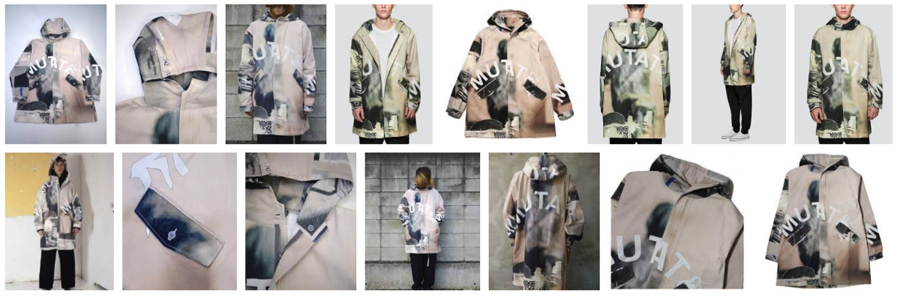
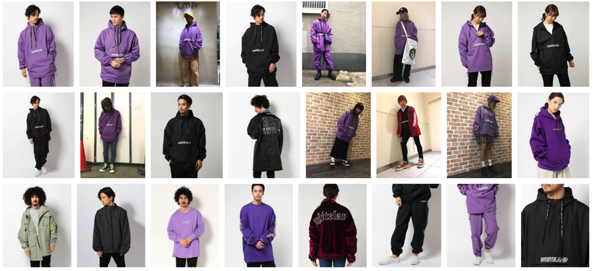
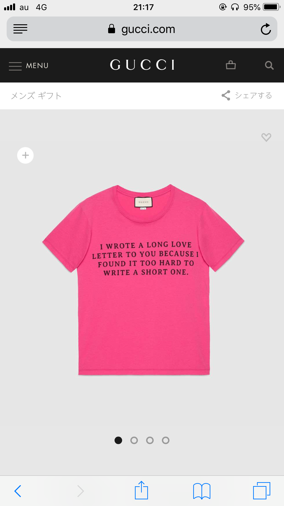

---
categories:
- DIR EN GREYのLIVEレポ
date: Wed, 18 Apr 2018 16:15:35 +0000
slug: post-11636
tags:
- DIR EN GREY
- LIVEレポ
title: 【ライブレポ】DIR EN GREY TOUR2018 真世界2018_04_18＠新木場スタジオコースト
---

実に半年ぶりのDIR EN GREYでした。この半年LIVEといってもsukekiyoさんしか行ってないので、体力的に心配でしたが終わってみると案の定何回かぶっ倒れるかな〜ってくらいの熱いLIVEでした。そして、最初から最後まで楽しくて笑顔が止まらないようなLIVEでした。本当に楽しかった。

<!--more-->

開演前の謎押しが一向に発生しないから油断していると、開演直前やっぱり来た。ドドドという地鳴りとともに、扉とは逆方向からの押し。柵があったから後ろから回って来た人たちが雪崩れ込んだみたい。
足が浮いた状態で横移動しました。ロックマンの空中ダッシュみたいな感じ。

<h2>LIVEレポ</h2>

4月16日のCLUB CITTA'のa knot限定LIVEは落選してしまい、参戦できませんでしたので今回のツアーはこの日が初めてでした。新鮮な気持ちで見たかったので、LIVEレポのツイートはあえて見ず、新曲のトレーラーも見ず、一切のネタバレをせずにこの日を迎えました。

<h3>セトリ</h3>
人間を被る
DIFFERENTSENSE
LOTUS
禍夜想
鴉
腐海
Midwife
Ranunculus
Sustain the Untruth
てふてふ
VINUSHKA
DISABLED COMPLEXES
Beautiful Dirt

EN.
新曲
霧と繭
詩踏み
REPETITION OF HATRED
THE IIID EMPIRE

「人間を被る」初めて聴いたけどこういう曲かああああああ！！！という感じです。
会報で話してた印象と少し違ってた。とにかく激しめの曲かなと思っていたら、メロディアスな部分はちゃんとあったりして、Unravelingよりもテンポが速くてノリやすくて、攻撃的で新しい幕開けにふさわしい印象でした。フルのPVが速くみたい。

ラナンキュラスに関しては、もうすでに何度も演奏されていて、すでに完成した感がある。さらにバックの映像がすっごいかっこいい。歌詩の表示の仕方が凝っててかっこいい。もう何度も口すっぱくこのブログでも書いてきましたが、歌詩表示やめろクソからの超絶クオリティアップで感動した。この音源も早く聴きたい！アルバムのラストとかに収録されそうな気がしなくもないけど、ワンチャン音源化しない可能性もありそうな気がする。

アンコール一発目の新曲は、パンクっぽいスピーディーな曲でした。映像もあいまってかなり若いw感じでしたが、でもきっとアルバムの中におさまって一連の流れで聴くとしっくりくるんだろうなという感じです。あと、こっからどうせどんどん進化していくんだろうし。

<h3>メンバー衣装</h3>

だいたいアー写通りだったと思います。

京は荊の冠はたぶんしてなかったけど、カラコンに黒いリップ、緑髪ぱっつんにメガネ。コートの下は紫のジャージ。靴下はadidas、靴はたぶんGUCCI。指先は緑じゃなかったはず。(細かいところ違うかも)
額には２つの点。あと口の中がキラキラしてた気がするので、もしかしたら矯正器具つけていたかも

ジャケットはこれらしい（twitterで特定されてたけどP.A.MというオーストラリアのアパレルブランドのHAND CRAFT DIGITAL PARKER）

中のジャージはこれらしい「WHITELAND」

アンコではピンクのGUCCIのTシャツ(LOVE LETTER Tシャツ)

Toshiyaはマントみたいなものを羽織っていました。アンコはツアーTシャツA
<blockquote class="twitter-tweet" data-lang="ja">
新木場1日目、ありがとう。  Toshiya<a href="https://t.co/OX8l7pIyG4">https://t.co/OX8l7pIyG4</a> <a href="https://t.co/LRtMCLNs5V">pic.twitter.com/LRtMCLNs5V</a>
&mdash; DIR EN GREY (@DIRENGREY_JP) <a href="https://twitter.com/DIRENGREY_JP/status/986596757734748160?ref_src=twsrc%5Etfw">2018年4月18日</a></blockquote>

Shinyaは白いワンピース(マダラニンゲンらしいけど不明)
アンコ記憶なし
<blockquote class="instagram-media" data-instgrm-captioned data-instgrm-permalink="https://www.instagram.com/p/BhwNuflHacA/" data-instgrm-version="8" style=" background:#FFF; border:0; border-radius:3px; box-shadow:0 0 1px 0 rgba(0,0,0,0.5),0 1px 10px 0 rgba(0,0,0,0.15); margin: 1px; max-width:658px; padding:0; width:99.375%; width:-webkit-calc(100% - 2px); width:calc(100% - 2px);">
 
 

 
 <a href="https://www.instagram.com/p/BhwNuflHacA/" style=" color:#000; font-family:Arial,sans-serif; font-size:14px; font-style:normal; font-weight:normal; line-height:17px; text-decoration:none; word-wrap:break-word;" target="_blank">新木場スタジオコースト2日目お疲れ様でした！ コーストの楽屋の鏡がホコリまみれだったのでグッズのタオルで拭いたらピカピカになったよ！ みんなもお掃除にはグッズのタオル使ってピカピカにしてね！ #DIRENGREY#真世界</a>
 
<a href="https://www.instagram.com/shinya_official/" style=" color:#c9c8cd; font-family:Arial,sans-serif; font-size:14px; font-style:normal; font-weight:normal; line-height:17px;" target="_blank"> Shinya/DIR EN GREY/SERAPH</a>さん(@shinya_official)がシェアした投稿 - <time style=" font-family:Arial,sans-serif; font-size:14px; line-height:17px;" datetime="2018-04-19T13:15:44+00:00">2018年 4月月19日午前6時15分PDT</time>

</blockquote> 

Dieはアー写通り？右側頭部がなかったので多分髪型もアー写のようにまとめているものと思われます。
アンコ記憶なし

薫はToshiyaよりもマント感が凄かった。Toshiyaが貴公子、タキシード仮面様ならこっちはもうなんか魔導師(剣使えるタイプ)。髪型はピンクと黒のツートンで、THE FINALの京みたいな。

<iframe width="560" height="315" src="https://www.youtube.com/embed/2X38H6Zvyr4?start=160" frameborder="0" allow="autoplay; encrypted-media" allowfullscreen></iframe>

アンコはジーズン的な袖なしの何かでした。スギちゃんと評する人が多すぎ

<h3>感想</h3>

途中何度かぶっ倒れるかと思いましたが、なんとか生きてた。久しぶりの首の膨張感、深く息を吸い込むと痛む胸。とにかく楽しかった。「人間を被る」が楽しみです。
くっそかっこえええわ。ひたすら松ぼっくりが写っていたけど、確かあれって食べられるんですよね。仙人の食べ物的な言い伝えでめちゃくちゃ栄養価が高い。そのため食べると不老不死が得られるとかなんとか。

<blockquote class="twitter-tweet" data-lang="ja">
DIR EN GREY NEW SINGLE『人間を被る』(2018.4.25 RELEASE) 30秒Teaser解禁！ <a href="https://t.co/zWunohiqfB">pic.twitter.com/zWunohiqfB</a>
&mdash; DIR EN GREY (@DIRENGREY_JP) <a href="https://twitter.com/DIRENGREY_JP/status/986080109076463616?ref_src=twsrc%5Etfw">2018年4月17日</a></blockquote>

アンコールで最後京がキツネつくってウニウニしてた。

アルバムはいつ出るんだー！秋か冬に出たとして、次のツアーは発売前の秋口とかかな？？

<h2>追加公演</h2>

ツアー初日に告知ありましたが、追加公演が2つ。a knot onlyとシングル発売記念ライブが新木場スタジオコーストにて開催されます。
初日のa knotは落ちたので次回は行きたいところ！

あとシングル発売記念LIVEはなんだか懐かしい感じですが、CD封入シリアルによる抽選制。
<blockquote class="twitter-tweet" data-lang="ja">
4月25日(水)発売の最新SINGLE『人間を被る』発売記念LIVE超最速先行受付方法は作品の封入チラシをご確認ください。 ※【通常盤】は初回プレス分のみ封入になりますので、お早目のご予約をオススメ致します。  ▼ DIR EN GREY - 『人間を被る』 30sec Teaser (CLIP)<a href="https://t.co/12ZZUjT1eC">https://t.co/12ZZUjT1eC</a> <a href="https://t.co/PbaoEgO7fH">https://t.co/PbaoEgO7fH</a>
&mdash; DIR EN GREY (@DIRENGREY_JP) <a href="https://twitter.com/DIRENGREY_JP/status/986090836311007232?ref_src=twsrc%5Etfw">2018年4月17日</a></blockquote>

<h2><a href="https://twitter.com/s_s_p_y">しんぺー</a>はこう思った。</h2>

本当にとにかく熱くて楽しいLIVEでした。
もう、本当にそれ以外の言葉が見つからない。

と言ったところで本日は以上になります。 
おやすみなさい。 