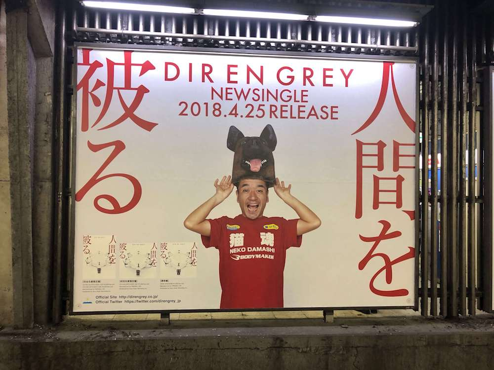
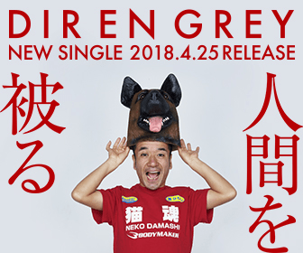

---
categories:
- DIR EN GREY
- 各メンバーの個人イベントレポなど
date: Sun, 13 May 2018 15:56:41 +0000
slug: post-11671
tags:
- DIR EN GREY
title: DIR EN GREY「人間を被る」の猫ひろしの山手線ホーム広告の費用は1ヶ月○○○万円
---

DIR EN GREYのニューシングル「人間を被る」発売以降、収録曲を通しでひたすら聴いているのですが先日のサイン会で渋谷を訪れ、山手線のホームの例の広告を目にして思い出しました。今回の広告になぜか猫ひろしが使われていることを。

一般層向けの音楽をやってるわけでもないし、だいたい猫ひろしを見てバンドの曲聴いてみよっ！って思う奴いないだろうとも思う。しかも別にテレビでバンバン流れてるわけでもないし。

そういや、前回の「詩踏み」もそうだったよな。謎の外国人使ってのCM、バンドの特色も曲の良さも何も伝わらないCM。効果はあったのか？いや、ないだらう。それなのに、なぁぜなぁぜくりかえーされるぅ

ということで、本日はDIR EN GREYの広告戦略についてご提案です。

<!--more-->

<iframe width="560" height="315" src="https://www.youtube.com/embed/zN-Zk-TdSQo" frameborder="0" allow="autoplay; encrypted-media" allowfullscreen></iframe>

<h2>山手線ホームの広告はいくらかかってるの？</h2>

あの猫ひろしの広告を山手線ホームに出すだけでおそらく100万〜300万円の間くらいと思われます。
思われますといいますのも、お品書きに具体的な金額の記載がないため、詳細が不明です。

あの広告が出ている部分は、いわゆるセットボードと呼ばれる広告と思うのですが、渋谷駅のみに出せるセットボードの値段が書いていませんでした。

書いてあるのは1ヶ月間18駅に出して1200万円という値段だけ。渋谷駅にしか出していないことを考えるとおそらく300万円くらいで切り売りされていたのではないかなーと予想します。

まぁどちらにしろ完全に無意味だろ

参考：<a href="http://www.jeki.co.jp/transit/mediaguide/lineup/index.html">http://www.jeki.co.jp/transit/mediaguide/lineup/index.html</a>

<h2>DIR EN GREYはweb広告をずっと出すべき</h2>

ただ、広告自体は出すべきだと思います。

しかしながらシングルやアルバム、武道館でのLIVEの時だけ、思い出したようにだすのではなく、定期的に出すべきです。しかも、リアルな広告ではなくてwebでの広告を出し続けるべきです。

ファン以外を取り込んだり、少しでも聴いてもらうためなら、例えば「カテゴライズ不能かつ不要な〜DIR EN GREY〜　Spotify、Amazonプライムミュージック、Google Play Musicで配信中」的な内容で配信したりすればいいんじゃないかと思う。

どうせファン以外はCD買わないわけですし、ましてや音源買わないファンがLIVEに行くかーっていうと絶対ないだろうと思う。だからとりあえずサブスクリプション系で配信して、それを聴いてもらうための広告を打つってのが、今回の広告なんかより余程効果的だと思う。

ちなみに今回もweb広告は出してるみたい。

ただしシングルに関しての広告で1ヶ月くらいしたら、きっと出なくなると思う。もし、次回も継続的に出そうとしてるならリターゲティングのタグを埋め込んで置いて、追っかけて広告を出し続けられるようにするべきだろう。あと広告からのリンク先がオフィシャルサイトのトップページなのはいかがなものか。せめて広告用の専用ランディングページ作るとかしないと、ファン以外には何も伝わらんだろ。

<h2>今考えるとDIRTのポッポアップショップと広告は猫ひろしに比べると成功してた感</h2>

以前ToshiyaのアパレルブランドであるDIRTが渋谷109にポッポアップショップを出店していました。そして期間中109の地下のアドエリアにも広告を出していました。

この広告については300万くらいかかるっぽいというのは、以前記事にしました。

参考: <a href="https://www.warawareotoko.com/2018/03/29/post-11599/">DIRTの地下通路広告の費用調べてみたら300万円くらいっぽい</a>

ただおそらくですけど、この広告はちゃんとペイしてる＝広告出しても利益は出てると勝手に思っています。しかしながら、これがファン以外の人＝Toshiyaを見ず知らずの人で広告を見た結果来店して購入したのかっていうところ、まーほぼいないでしょう。

ただ、ファン向けではなくマス(＝ファン以外)向けに広告を打ったこと、DIRTの良さ、Toshiyaのカッコよさを伝えたことは間違いじゃなかったのかなーと思います。

ということでDIR EN GREYの方は猫ひろしよりももっと効果的な広告を打ってくれよ。

<h2><a href="https://twitter.com/s_s_p_y">しんぺー</a>はこう思った。</h2>

次はきっとアルバムの発売時にこういった広告がでるんでしょう。その時はもう少しまともなのを出してほしいものです。

今回のはきっと社長〜なべやかん繋がりでのオファーな気がしてならないけど、キャッチーなのじゃなくてちゃんとしたやつをたのんます。

と言ったところで本日は以上になります。 
おやすみなさい。 
そして、また明日。

<a href="https://www.amazon.co.jp/exec/obidos/ASIN/B079NBWT12/warawareotoko-22/" target="_blank" rel="noopener noreferrer">人間を被る</a>
posted with <a href="http://kaereba.com" rel="nofollow noopener noreferrer" target="_blank">カエレバ</a>

DIR EN GREY SMM itaku (music) 2018-04-25    

<a href="https://www.amazon.co.jp/gp/search?keywords=%E4%BA%BA%E9%96%93%E3%82%92%E8%A2%AB%E3%82%8B&__mk_ja_JP=%E3%82%AB%E3%82%BF%E3%82%AB%E3%83%8A&tag=warawareotoko-22" target="_blank" rel="noopener noreferrer">Amazon</a>

<a href="https://hb.afl.rakuten.co.jp/hgc/121ed5e1.954a9ce3.121ed5e2.9fc704ba/?pc=https%3A%2F%2Fsearch.rakuten.co.jp%2Fsearch%2Fmall%2F%25E4%25BA%25BA%25E9%2596%2593%25E3%2582%2592%25E8%25A2%25AB%25E3%2582%258B%2F-%2Ff.1-p.1-s.1-sf.0-st.A-v.2%3Fx%3D0%26scid%3Daf_ich_link_urltxt%26m%3Dhttp%3A%2F%2Fm.rakuten.co.jp%2F" target="_blank" rel="noopener noreferrer">楽天市場</a>

<a href="//ck.jp.ap.valuecommerce.com/servlet/referral?sid=3041033&pid=882528283&vc_url=http%3A%2F%2Fsearch.shopping.yahoo.co.jp%2Fsearch%3Fp%3D%25E4%25BA%25BA%25E9%2596%2593%25E3%2582%2592%25E8%25A2%25AB%25E3%2582%258B&vcptn=kaereba" target="_blank" rel="noopener noreferrer">Yahooショッピング</a>

