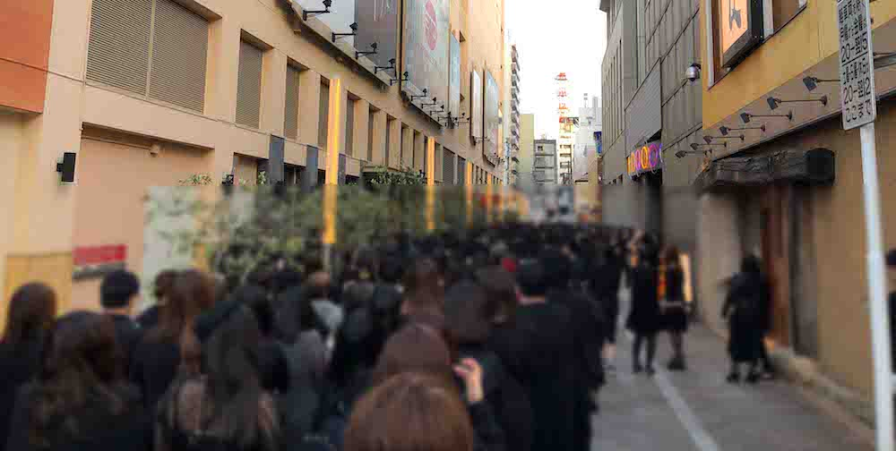

---
categories:
- sukekiyoのLIVEレポ
date: Mon, 14 May 2018 20:46:50 +0000
slug: post-11673
tags:
- LIVEレポ
- sukekiyo
title: 【ライブレポ】sukekiyo二〇一八年公演「逆襲の嬲り地獄」-漆黒の儀-2018_05_14@CLUB CITTA'
---

結論からいいますが、めちゃくちゃいいLIVEでした。

<!--more-->

さすが漆黒の儀。真っ黒

<h2>メンバー衣装</h2>
UTA、YuchiはどちらもDUMMYの白いTシャツ、未架は黒い人殺しTシャツ、匠はよく見えなかったけど濃いめのメイクにドレッドっぽい髪の毛を束ねていました。

白いTシャツはこれでしょうか
<blockquote class="twitter-tweet" data-lang="ja">

sukekiyo 二〇一八年公演「逆襲の嬲り地獄」-漆黒の儀-
♯2 Collection DMY 2018
Starts at CLUB CITTA' from 3PM, 14 May 2018

DUMMY Crew Neck Logo WHT T ¥7000 <a href="https://t.co/PRHzsxhZhT">pic.twitter.com/PRHzsxhZhT</a>

— DUMMY (@dummycollection) <a href="https://twitter.com/dummycollection/status/995837782844043264?ref_src=twsrc%5Etfw">2018年5月14日</a></blockquote>

未架さんはこれ
<blockquote class="twitter-tweet" data-lang="ja">

♯1 Collection DMY
Dummy Bloody Cruel Nun Tshirts +α
¥11000 Black <a href="https://t.co/ArAayDhXDT">pic.twitter.com/ArAayDhXDT</a>

— DUMMY (@dummycollection) <a href="https://twitter.com/dummycollection/status/946953739369246720?ref_src=twsrc%5Etfw">2017年12月30日</a></blockquote>

Yuchiはこちら
<blockquote class="twitter-tweet" data-lang="ja">

「逆襲の嬲り地獄」１日目、終了しました！
お越し頂いた皆さま、ありがとうございました！
やっぱりsukekiyoの世界観、その全てがやめられません。すごく気持ちよかった。
また明日！宜しくお願いします！

マダラニンゲンの新作着たー！！ <a href="https://t.co/pFVhiw4xE5">pic.twitter.com/pFVhiw4xE5</a>

— YUCHI (@yuchivalism) <a href="https://twitter.com/yuchivalism/status/996012016912379904?ref_src=twsrc%5Etfw">2018年5月14日</a></blockquote>

京は金髪を少し斜めに流して、カラコンにメイク。最初は赤いジャケットを羽織っていました。

入場時にメモリアルチケットが配布されましたが、雰囲気だけでいうとみんなそれと同じような衣装を着ていました。全員スポーティ
<h2>セトリと演出</h2>
<ol>
 	<li>kisses</li>
 	<li>黝いヒステリア</li>
 	<li>グニャ結論。そして血眼。</li>
 	<li>襞謳</li>
 	<li>死霊のアリアナ</li>
 	<li>nine melted fiction</li>
 	<li>艶</li>
 	<li>首吊り遊具</li>
 	<li>されど道連れ</li>
 	<li>こうも違うモノなのか、要するに</li>
 	<li>マニエリスムな冷たい葬列者</li>
 	<li>dunes</li>
 	<li>vandal</li>
 	<li>12時20分金輪際</li>
 	<li>純朴、無垢であろうが</li>
 	<li>anima</li>
 	<li>新曲</li>
 	<li>嬲り</li>
</ol>
今回は中央より下手の一冊目少し後ろにいたので、前回よりもステージ全体に目を配れました。
紗幕とバックのLEDモニターを使っての映像演出がすばらしかった。（後述）

ちなみセッションでYuchiと京がスイッチする場面でUTAも何気になにかを弄ってる初めて見た。今回から？
あと後半の方にあったセッション中に映像とセッションがいい具合にマッチしてて、さらにUTAのギターが本当にゴキゲンで、あれもっと聞いていたかった。
そこからの新曲という流れだった。

新曲に関しては、なんとなくムックを連想してしまった。それくらいの軽快さとクラブミュージックとも言い難いコンピューター感
mamaとzephyrを混ぜた様な、今後のLIVEで欠かせない曲になりそう。聞いた瞬間から鳥肌で、頭皮からビンビンに警戒して食い入る様に目を見開いて見てた。とにかくめちゃくちゃカッコええ。

この日はとにかく未架さんおドラミングがキレッキレだった印象だけど、新曲で爆発。普段やらない両手を天に掲げるドラマー特有のあのポーズやってた。

コレ↓（なんかちょっと違うけどw）

このバンドは改めてドラムとベースがしっかりとしたバンドであると思った。結成当初は京のバンドだったけど、いまやこの2人なしには成立しえない。
<h2>逆襲とはおそらく、未架の逆襲</h2>
今回も前回と同様に紗幕を使っての演出と、バックにはLEDのモニターを配置して奥行きのある映像を作って演出がされた。が、おそらく前回よりも映像のパワーアップしていた気がする。
特に良かったのは(思い出せる範囲だと)たぶん三曲目？のぐにゃ結論。(←2曲目のヒステリアだったっぽい)の演出と新曲

ぐにゃ→訂正:ヒステリアは画面いっぱいに明朝体で歌詩表示。エヴァのサブタイトルを1画面に全部表示させたかと思わせるような雰囲気。ただそれがすごい良かった。京が歌い上げた歌詩部分が赤く染まっていってめちゃくちゃかっこよかった。

新曲は冒頭で紗幕のフチが白く光りモヤモヤしてた。ステージの上下左右に長いライトつけてスモーク焚いてるのかと思ったら映像だった。それくらい自然な演出だった。

今回かなり映像が素晴らしくて空間にホログラムで投射してるのかと思いきや紗幕の映像だったり、本当に目の前に赤い糸が垂れているのかと思ったり。本当は前回これくらいのクオリティでやりたかったんだけど完成に至らず、今回完全版として演出を補完したのではと思ってしまう内容だった。

しかも、当然のごとく映像化するための演出が随所に散りばめられていた。例えば、(これは多分ですが)以前の映像作品の様に上下に帯で映像を流しつつ、中央にLIVE映像を映すあれ。あれを見越してステージを横長に映してステージ上部のLEDを多分わざと一部消してたっぽい。多分。そんな気がした。違うかもだけど。
<blockquote class="twitter-tweet" data-lang="ja">

逆襲の嬲り地獄初日、ありがとうございました!!
ちょっと映像制作で寝不足でしたが、バンド、スタッフ、そして皆様の温かさに助けられながら無事終えることができました！
また諸々ブラッシュアップしつつ明日に向えればと思います。

未架

— sukekiyo (@sukekiyo_band) <a href="https://twitter.com/sukekiyo_band/status/996028486316785664?ref_src=twsrc%5Etfw">2018年5月14日</a></blockquote>

sukekiyoのLIVE中の映像もおそらく未架さんが手がけているんだと思うけど、前回のLIVE時に間に合わず今回それを補完して完成版だったということなのではないだろうか。逆襲とはつまり未架さんの逆襲だったのかなとか思った。とにかく映像化が待たれる！ということでこの2daysが終わっても未架さんの戦いは終わらない！なんなら、ここから新たな戦いが始まるwww 頑張ってください！！
<h2><a href="https://twitter.com/s_s_p_y">しんぺー</a>はこう思った。</h2>
とにかく、素晴らしいという言葉以外なかった。この日程が発表された当時は「まぁた、スタンディングかー」とか思ったけど、今日のLIVEはスタンディングでしたか出せない雰囲気だった。

とはいえ、とはいえー！

そろそろ、そろそろ、ホールを！ホールを！あの浮遊感、呼吸すら許されない緊張感、舞台に吸収される視線と座席から落下してしまうかの様な虚脱感。それが欲しい

ただセッションからの新曲のあたりを見てても今後もまた違った「動」に寄っていきそうな感じでした。なんせ未架のドラミングが、珍しくダビンチデーモンのようだったし

改めてこのバンドはドラムとベースがいま中心にいるんだなと感じれた。結成当初は京のバンドだったけど、今この２つのパートなしには成立しなくなっている！はやく！はやく！次の音源を！！

と言ったところで本日は以上になります。
おやすみなさい。
そして、また明日。

<a href="https://www.amazon.co.jp/exec/obidos/ASIN/B00V6XU17W/warawareotoko-22/" target="_blank" >PERSUASIO // 2015.2.28 sukekiyo 2015 live ｢The Unified Field｣ -VITIUM-(初回生産限定盤) [Blu-ray]</a>
posted with <a href="http://kaereba.com" rel="nofollow" target="_blank">カエレバ</a>

sukekiyo SMD jutaku(SME)(D) 2015-06-10    

<a href="https://www.amazon.co.jp/gp/search?keywords=sukekiyo&__mk_ja_JP=%E3%82%AB%E3%82%BF%E3%82%AB%E3%83%8A&tag=warawareotoko-22" target="_blank" >Amazon</a>

<a href="https://hb.afl.rakuten.co.jp/hgc/121ed5e1.954a9ce3.121ed5e2.9fc704ba/?pc=https%3A%2F%2Fsearch.rakuten.co.jp%2Fsearch%2Fmall%2Fsukekiyo%2F-%2Ff.1-p.1-s.1-sf.0-st.A-v.2%3Fx%3D0%26scid%3Daf_ich_link_urltxt%26m%3Dhttp%3A%2F%2Fm.rakuten.co.jp%2F" target="_blank" >楽天市場</a>

<a href="//ck.jp.ap.valuecommerce.com/servlet/referral?sid=3041033&pid=882528283&vc_url=http%3A%2F%2Fsearch.shopping.yahoo.co.jp%2Fsearch%3Fp%3Dsukekiyo&vcptn=kaereba" target="_blank" >Yahooショッピング</a>

