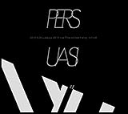

---
categories:
- 各メンバーの個人イベントレポなど
date: Sat, 19 May 2018 09:00:39 +0000
slug: post-11689
tags:
- イベントレポ
- 京
- 個展
title: 【イベントレポ】京 個展2018「〜子宮で視る脳排泄〜」＠渋谷LE DECO
---

京の写真集「失格弐」の発売を記念して今回も個展が開催されました。個展期間が終了しましたのでレポートとしてまとめたいと思います。参加できなかった方や記憶が曖昧な方に読んでいただけたら嬉しいです。（ぼく自身も多少曖昧な部分もありますが！）

<!--more-->
<h2>京の個展とは</h2>
2015年、2016年にも開催されていたDIR EN GREY/sukekiyoのボーカル京の個展。京が自身で撮影したものやsukekiyo・DIR EN GREYで撮影した写真、さらには自身で描いた絵、また詩が展示されている。毎回視覚以外からの情報もふんだんに取り入れた表現を行なっており、過去には京監修のデフューザーの香りを会場内に噴霧したり、サウンドを聴かせるようなものや、万有引力によるパフォーマンスなど様々な試みが行われた。

過去のレポートはこちら
<a href="https://www.warawareotoko.com/2015/08/23/post-8263/">【イベントレポ】京 個展2015「我葬」＠GALLERY LE DECO</a>

<a href="https://www.warawareotoko.com/2016/04/11/post-9031/">【イベントレポ】京 個展2016「我葬」@SPACE 雑遊</a>
<h2>会場に関して</h2>

過去に個展が行われた渋谷のGALLERY LE DECOが会場でした。ただ、ビル自体が新しくなっており渋谷LE DECOとして生まれ変わっていました。だいぶ綺麗になってた。

<iframe style="border: 0;" src="https://www.google.com/maps/embed?pb=!1m18!1m12!1m3!1d3241.846515157603!2d139.70296331525807!3d35.65615298020015!2m3!1f0!2f0!3f0!3m2!1i1024!2i768!4f13.1!3m3!1m2!1s0x60188b5bc20cc5af%3A0x25eb06262ee7942a!2z44Ku44Oj44Op44Oq44O844O744Or44OH44Kz!5e0!3m2!1sja!2sjp!4v1526682558211" width="600" height="450" frameborder="0" allowfullscreen="allowfullscreen"></iframe>

ビルの前で整理番号関係なく列が作られ、エレベーターで6階へ上げられました。6階が受付となっており、ここに御朱印帳にスタンプが押せるようになっていました。また、待っている間映像が流れており、LIVE映像のほかに対談映像などがありました。あとお土産も配布されました。

お土産はこちら

裏側

<h2>京とYUBISUIの対談映像</h2>
YUBISUI/指吸 知（ゆびすいとも）はイラストレーターで元DIR EN GREYのローディーをしていたそうです。アーティストのLIVEグッズのイラストを描いたりもしてるみたいです。おそらくですがラルクのKENのLINEスタンプもこの人が描いたものがありました。

サイト　<a href="http://www.yubisui.com/">http://www.yubisui.com/</a>

twitter <a href="https://twitter.com/YUBISUI">https://twitter.com/YUBISUI</a>

instagram <a href="https://www.instagram.com/yubisui/">https://www.instagram.com/yubisui/</a>

もしかしてDIR EN GREYのShinya監修のアニメーションのイラスト描いたのこの人？？
<blockquote class="instagram-media" style="background: #FFF; border: 0; border-radius: 3px; box-shadow: 0 0 1px 0 rgba(0,0,0,0.5),0 1px 10px 0 rgba(0,0,0,0.15); margin: 1px; max-width: 658px; padding: 0; width: calc(100% - 2px);" data-instgrm-captioned="" data-instgrm-permalink="https://www.instagram.com/p/BitBEZ1lEw8/" data-instgrm-version="8">

<a style="color: #000; font-family: Arial,sans-serif; font-size: 14px; font-style: normal; font-weight: normal; line-height: 17px; text-decoration: none; word-wrap: break-word;" href="https://www.instagram.com/p/BitBEZ1lEw8/" target="_blank" rel="noopener">強力磁力で遊べる^ ^ プロペラおメメ&#x1f60b; #デザフェス #ソフビ</a>

<a style="color: #c9c8cd; font-family: Arial,sans-serif; font-size: 14px; font-style: normal; font-weight: normal; line-height: 17px;" href="https://www.instagram.com/yubisui/" target="_blank" rel="noopener"> yubisui</a>さん(@yubisui)がシェアした投稿 - <time style="font-family: Arial,sans-serif; font-size: 14px; line-height: 17px;" datetime="2018-05-13T04:01:08+00:00">2018年 5月月12日午後9時01分PDT</time>

</blockquote>

映像は、このYUBISUI氏と京の対談でテーマは事前に募集した質問事項への回答でした。なお、場所はちょうどこのフロアで行われたようです。

Q、個展タイトルはどう思いついた？
A、目で見るだけでなく、脳で直接感じてほしいから

Q、テーマとイメージ
A、前回話追ってすぐとりためてたのをもう一度あつめて、すぐ進めた。イメージをつたえるのがむずかしかった。

Q、キャラクターの中で親近感あるおは？
A、ホイ。他人の物が欲しくなる、好きだけど愛情表現が苦手で欲が勝っちゃうというのがすごく人間ぽい

Q、絵本はいつから構想していて、ストーリーはどうやって？
A、ストーリーはある程度できていて、絵保温を書くときに細かく決まっていた。続編はまだないけど話の続きは何となく考えている。母（マイエル）はsukekiyoが好きで兄（ビルケ&amp;パドルケ）はDIR EN GREYが好きという設定

Q、ゼメキス家が存在していたら一緒に住みたい？
A、ペニュと住みたいけどお菓子まみれにされそう。部屋がきたないのは嫌

京：目からYUBISUIと一緒に仕事をしたいと思っていた
YUBISUI：絵を描きながら京のことを考えていて、こんなに考えたのはローディの時以来

ちなみにフロアの配置はこんな感じ

<h2>「失格弐」</h2>
受付から降りてすぐのフロアだけど、みんな物販フロアに直行でした。
黒い垂れ幕をくぐると懐中電灯をわたされます。それも古いタイプの豆電球式で照らしてもぼんやりと光の輪ができるようなもの。
それで真っ暗な部屋にかかげられている作品を照らしながら視るという流れ。

作品自体はここ2年以内くらいのものが多かったようにおもいます。いくつかはそれ以前のものもあったかもしれません。入り口付近になった今回の写真集の表紙のものが怖かった。

今回、前回までの個展であったような聴覚・嗅覚に訴えるものがあえてなかった気がします。しかも暗くした中で懐中電灯の光で情報を制限することで本当に脳に直接はいってくる感がありました。視ていると頭がずーんと重くなっていく感覚。

ちなみにフロアの配置はこんな感じ

<h2>「The Zemeckises」</h2>
どれも可愛くてそしてグロい

「The Human Mask」と書かれた絵でホイが人の皮を着ていた。DIR EN GREYの新曲「人間を被る」とつながっているのでしょうか。

しきり部分に配置された目玉が赤く光っていましたが、これも以前京が胸に描いていたソレをおもわせるものでした。
京のなかではDIR EN GREY、sukekiyoがゼメキスの世界観でつながっているのかなとおもいました。

ちなみにフロアの配置はこんな感じ

<h2>物販、マダラニンゲンのフロア</h2>
入ったところの写真は撮影OK

みんなクレジットカード払い！！！ぼくももちろんカード払い！！DIR EN GREYのチケット支払いがあるかね！！
そしてこの日はちょうど漆黒の儀だったからなのか、コラボTシャツの黒がソッコーで売り切れていました。

ガチャは一回だけひいてバッチがでてきました。秘密権がきになるところ。

ちなみにフロアの配置はこんな感じ

地下はマダラニンゲンでした。特にぼくが着れそうなものはないので、撮影OKエリアで写真だけ撮りました。

<h2><a href="https://twitter.com/s_s_p_y">しんぺー</a>はこう思った。</h2>
デフューザーまた販売してくれないかな。あの匂いで石鹸とか色々だしてほしい。

個展に関しては本当に脳に直接アクセスされるような感覚。ズーンとくる思い感覚。
写真集が楽しみです。あと絵本、こっちはちょっとグロそうな気がします。

とりあえずsukekiyo、個展ともにお疲れ様でした！

と言ったところで本日は以上になります。
おやすみなさい。
そして、また明日。

<a href="https://www.amazon.co.jp/exec/obidos/ASIN/B00V6XU17W/warawareotoko-22/" target="_blank" rel="noopener">PERSUASIO // 2015.2.28 sukekiyo 2015 live ｢The Unified Field｣ -VITIUM-(初回生産限定盤) [Blu-ray]</a>

posted with <a href="http://kaereba.com" target="_blank" rel="nofollow noopener">カエレバ</a>

sukekiyo SMD jutaku(SME)(D) 2015-06-10

<a href="https://www.amazon.co.jp/gp/search?keywords=sukekiyo&amp;__mk_ja_JP=%E3%82%AB%E3%82%BF%E3%82%AB%E3%83%8A&amp;tag=warawareotoko-22" target="_blank" rel="noopener">Amazon</a>

<a href="https://hb.afl.rakuten.co.jp/hgc/121ed5e1.954a9ce3.121ed5e2.9fc704ba/?pc=https%3A%2F%2Fsearch.rakuten.co.jp%2Fsearch%2Fmall%2Fsukekiyo%2F-%2Ff.1-p.1-s.1-sf.0-st.A-v.2%3Fx%3D0%26scid%3Daf_ich_link_urltxt%26m%3Dhttp%3A%2F%2Fm.rakuten.co.jp%2F" target="_blank" rel="noopener">楽天市場</a>

<a href="//ck.jp.ap.valuecommerce.com/servlet/referral?sid=3041033&amp;pid=882528283&amp;vc_url=http%3A%2F%2Fsearch.shopping.yahoo.co.jp%2Fsearch%3Fp%3Dsukekiyo&amp;vcptn=kaereba" target="_blank" rel="noopener">Yahooショッピング</a>

