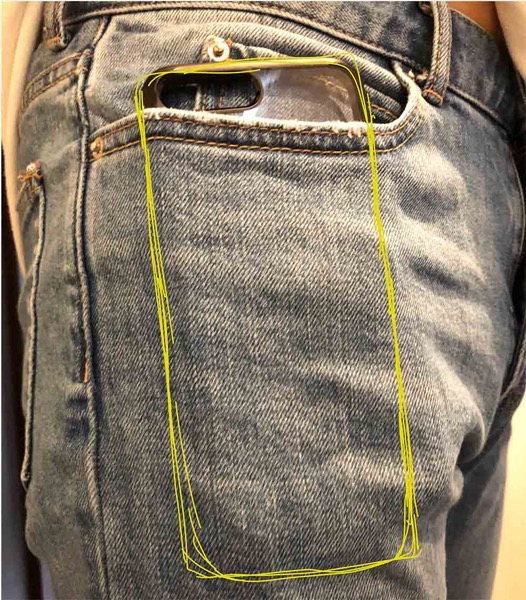
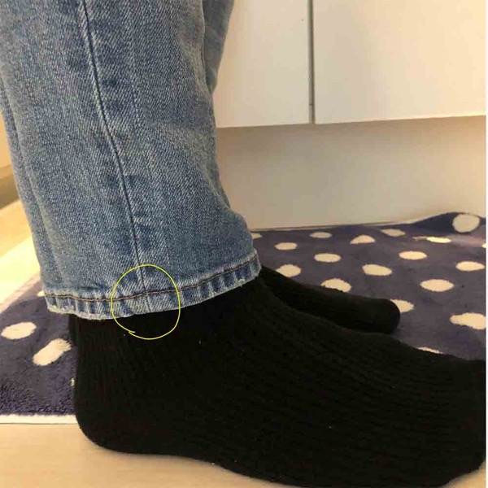

---
categories:
- レビュー
date: Mon, 16 Jul 2018 15:00:46 +0000
slug: post-11801
tags:
- ZOZO
title: ZOZOスーツで計測して注文したジーンズレビュー
---

普段着はDIR EN GREYのツアーTシャツとワークパンツ。持ってる服もツアーTシャツ数枚と数年前に買ったパンツ2本だけ。洋服に対するステ振りゼロ！洋服にまったくお金を使わなくなり早数年。久しぶりに、本当に数年ぶりに洋服を買いました。しかも、巷で話題のZOZOスーツを使ってZOZOタウンで注文しました。本日はZOZOから届いたジーンズのことを書きたいと思います。

<!--more-->
<h2>ZOZOはじめて使った</h2>
ゆくゆくはおまかせ定期便みたいなのを体験してみようと思いますが、とりあえず計測後に「とりあえずこれ買えや」みたいなノリででてきたジーンズを買ってみました。
<h3>ZOZOスーツとは</h3>
発表当初は着るだけで全身のサイズを測ってくれる最先端のガジェット！だったはずが途中から着てスマホで撮影するタイプに変わってしまいました。

とりあえずタイツっていったらスキーの時くらいしか着たことないので窒息するかと思ったわ。キッツい。フリーサイズらしいので人によってはもっと苦しいかも

ちなみに撮影風景はこちらの動画がわかりやすい。

<iframe src="https://www.youtube.com/embed/3zY7PjrFXpU" width="560" height="315" frameborder="0" allowfullscreen="allowfullscreen"></iframe>

<h3>ZOZOのジーンズレビュー</h3>
早速注文して履いて見ましたが、んー微妙。
いや、微妙ではない。ぴったり。マジでぴったり。しゃがんでも何してもちょうど良いサイズ。

ただ、個人的には太ももあたりにもっと余裕が欲しいしもう少し気持ちスソに余裕が欲しい。

一度洗濯しました。とくにそこまで縮んだ感はありませんでした。

あと、オシャレな人はポケットに携帯やらスマホやらは入れません！長財布もけっこうはみ出る。

iphone8plusを入れた状態だとこんな感じ。しゃがめません。

LIVEで着ていくにはむいてないことがよくわかります。
<h2>ZOZOスーツ計測データは他でも通用する？</h2>
サイズ感はわかった。ちゃんとぴったり計測されてる。そこでこのサイズをもとに他のサイトでも注文してみました。

ちなみに丈はこんな感じでした。ほんのちょっと短い気がする。あと2cmほしい！

<h3>ZOZOスーツの計測を元にUNIQLOで注文してみた感想</h3>
ユニクロでスーツのズボンを注文してみました。その結果！やっぱりちょっと短い！

スソにあと2cm余裕がほしい！日本も買っちゃったよ！

でも、これで次回からもう少し長めのを買えばよいということがわかりました。ちなみにZOZOではサイズ感を微調整することができます。そっちも、そっちで次回は長めにしようと思います。
<h2><a href="https://twitter.com/s_s_p_y">しんぺー</a>はこう思った。</h2>
ひっさしぶりに私服の洋服を買いました。
安いし、店いって店員に話しかけられて嫌でそのまま出て何も買えない！とかないからこっちの方がいいや。しかも返品できるし

おまかせ定期便もいずれやりたいと思います。

ただ、久しぶりに洋服買ったのでクレカの支払いが予想額を超えちゃった。

と言ったところで本日は以上になります。
おやすみなさい。
そして、また明日。