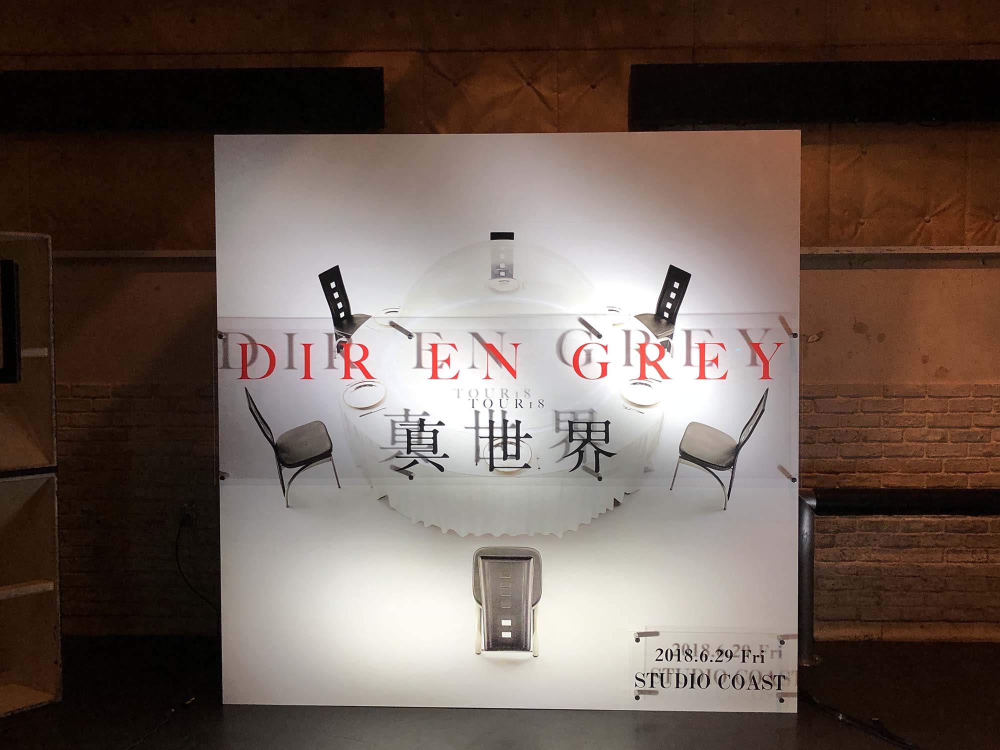
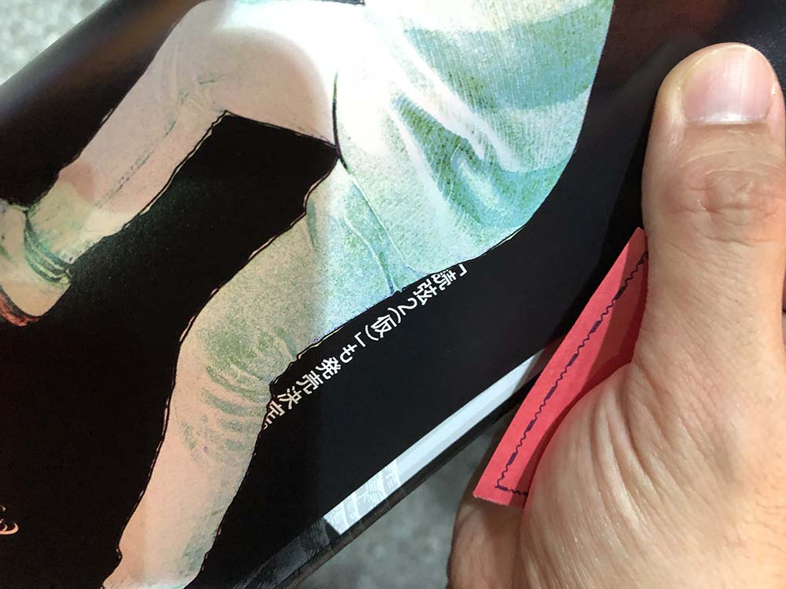

---
categories:
- DIR EN GREYのLIVEレポ
- TOUR18 真世界
date: Sat, 30 Jun 2018 04:49:28 +0000
slug: post-11824
tags:
- DIR EN GREY
- LIVEレポ
title: 【ライブレポ】DIR EN GREY TOUR2018 真世界-「a knot」only- 2018_06_29＠新木場スタジオコースト
---

追加公演行ってきました！もうほんとうLIVEを渇望してた！たのしかった！あっちゅーまに終わりました。本編終わって「え？は？もう終わりかよ！！」ってくらいあっという間に終わりました。ということで本日はLIVEレポです。

<!--more-->

<h2>LIVEレポ</h2>

とても暑い、めちゃくちゃ暑い日でした。いつもは飲み物もっていかないのですが、今日はペットボトルもっていきました。京も「あちーか？」と聞くくらい暑かったw

とにかくあっという間に終わった印象でした。前回のLIVEから個人的に少し空いていたのでもう泣きそうでしたわ。

滴る朦朧終わりのSEがいつもと違って、割とびょんびょんしていてw会場がどよめいてたw

腐海は所々しっかりと歌詩を確認しながらしっかりと歌っていました。

個人的にRanunculusはすっごい情報量を削いで、伝えたいことのみが凝縮されているのかなと思いました。アルバムに入ってなかったらどうしよう。

それ以降はもうフラフラでした。水分補給をしっかりととっておいてよかったけど、夏のLIVEは本当に気をつけないとダメですね。

<h3>セトリ</h3>
人間を被る
DIFFERENT SENCE
滴る朦朧
禍夜想
腐海
ASH
Midwife
Ranunculus
孤独に死す、故に孤独
audience KILLER ROOP
VINUSHKA
DISABLED COMPLEX
Beautiful Dirt

EN
Behind a vacant image
THE FINAL
新曲
詩踏み
THE IIID EMPIRE

<h3>衣装</h3>
ルナフェスにいってないのですが、多分京はルナフェスと同じっぽいですね。黒髪に刈り上げでエクステで、昭和のサラリーマンが酔っ払った時にネクタイを頭に巻いた時みたいな感じでした（すいません）。遠目でしたが白いシャツに黒いパンツでした。

DieとShinyaはあまり見えず。Toshiyaは王子のような出で立ちでした。黒いタイ？をしていたように見受けられました。

薫の衣装が全く思い出せない！

アンコールは全員追加公演のツアーTシャツを着ていましたが、薫のみヒョウ柄のシャツを羽織っておりました。

<h3>ステージセット</h3>

相変わらずステージ上に無駄なオブジェなどは無く、バックのモニターのみ
映像は新旧混じっていましたが、新たに作られたようなものも混じっていました。

印象に残ったのがTHE FINALの映像。丸いサークルが色々変形していく映像でしたが、ひたすら気持ち悪かった。うねうね動いたり、人の手が無数に映されたり。

<h2>ニューアルバム「The Insulated World」</h2>

アンコールが終わると人間を被るのPVが流れはじめ、何かの告知の予感
この時点で、みんな薄々感づいてたけど次の瞬間どよめいた。

ニューアルバム「The Insulated World」9月26日発売

思ってたよりも3ヶ月はやい！！！そのあとは夏のツアーの日程が表示されました。アルバムのツアーとしての位置付けだったんですかね。ということはアルバムの曲メインでやるのだろうか。

【完全生産限定盤】
3枚組(Blu-spec CD2*＋特典CD＋特典Blu-ray) SFCD-0229〜231 ￥9,000 (tax out)
3枚組(Blu-spec CD2*＋特典CD＋特典DVD) SFCD-0232〜234 ￥8,000 (tax out)
※29th SINGLE『人間を被る』【完全生産限定盤】との連動特典専用応募ハガキ封入
【初回生産限定盤】
2枚組(CD＋特典CD) SFCD-0235〜236 ￥3,400 (tax out)
【通常盤】
(CDのみ) SFCD-0237 ￥3,000 (tax out)
 
ちなみにインストアイベントも予定されているみたい。

<h2><a href="https://twitter.com/s_s_p_y">しんぺー</a>はこう思った。</h2>

まさかの年内アルバム発売に驚きました。

このペースでいくともしかして年明け武道館とかないよね？
武道館は来年夏からオリンピックに向けて1年間の改修工事に入ります。3月までのスケジュールがでていましたが、2月が空いていたのでもしかして•••

ありえる。

ただ、アルバムの発売延期もなきにしもあらずw

どちらにしろ楽しみに待ちたいと思います！

あと、読弦2そろそろでるっぽい！

と言ったところで本日は以上になります。 
おやすみなさい。 

[itemlink post_id="11829"]

[itemlink post_id="11833"]

[itemlink post_id="11832"]