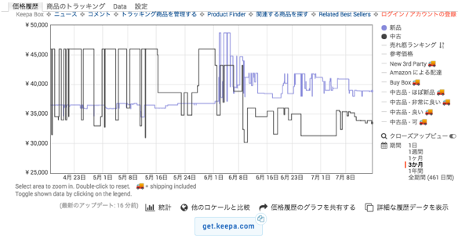

---
categories:
- ブログ
date: Fri, 13 Jul 2018 23:32:27 +0000
slug: post-11867
title: Amazonプライムデー2018に参戦するので情報まとめてみた
---

毎年節約のために指を加えていつも横目で見過ごしているAmazonのプライムデー。今年は本格的に参戦しようと思います。といいますのも、今月でMac Book Pro（盗難済み！）のローンがやっと終わるのです！今は5年以上前に購入したiMac（今見たら2010年製）を使っていて、画面にたまーにノイズが走ります。そのため、今回のセールでもしいいWindowsとか出てたなら、ゲームとかできるしそれを買ってもいいかなーとか思っているからです。

ということで、本格参戦初めてなので色々と情報をまとめてみました。

<!--more-->

<h2>Amazonプライムデーとは</h2>

Amazonのプライム会員を対象とした年に1回の大規模セールです。
過去にはPS4やニンテンドースイッチなんかも販売されました。当時はPS4もスイッチも品薄だったので一瞬で売り切れになりました。

なお、プライム会員になっていない方はこの機会にぜひ加入されることをおすすめします。初月無料なのでセールだけ参加してやめるでもいいと思います。

ただし、メリットがありすぎて入っていないと損するレベルです。

<iframe src="https://rcm-fe.amazon-adsystem.com/e/cm?o=9&p=12&l=ur1&category=primeday&banner=027G4F9SWVE2AX0FG102&f=ifr&linkID=908a7d541e2ac0b5adcfdcd73a5c30cf&t=warawareotoko-22&tracking_id=warawareotoko-22" width="300" height="250" scrolling="no" border="0" marginwidth="0" style="border:none;" frameborder="0"></iframe>

<h2>プライム会員のメリット</h2>
そもそもプライム会員ってなんぞやという説明ですが

プライム会員ならメリットたくさん

お届け日の指定が無料。一番早くて当日中に届く
プライムビデオ。海外ドラマとか見放題
プライムミュージック。音楽聴き放題
プライムフォト。クラウドに画像保存し放題。
kindleで対象の本を毎月１冊無料で読める
プライムナウ。Amazonの倉庫から直接配送で注文から１時間とか２時間でデリバリーしてくれる

他にも特典はありますが、めぼしいところはこんなところ

Amazonプライム会員の年会費は3900円、1ヶ月計算すると300円ちょっとです。どうでしょうか、圧倒的なコスパがおわかりいただけたかと思います。

<h2>セールの種類</h2>

プライムデーのセールは３種類

<h3>特選セール</h3>
プライムデーの目玉商品が数量限定で販売されます。だいたいの人がこれ狙い

<h3>数量限定タイムセール</h3>
こっちは時間限定数量限定のタイムセールです。特選セールに比べると少し劣りますが、いつもの商品が安くなることにかわりはありませんのでこちらも要チェックです。

<h3>その他のセール・特典</h3>
実は何気にこちらが要注目です。例えば値段が変わってなくてもポイントアップするような場合もあります。kindle本なんかも値段が変わってなくても５０％分のポイントバックみたいなのもあったりしますので、そういうものも見つけていくようにしましょう。

<h2>目玉商品</h2>
ラインナップとして事前発表されているもののうちいくつかピックアップしました。正直これだけだとどうしても欲しいというもの以外は微妙だと思います。ただし併せていろんな商品が安くなることもありますので、すみずみまでチェックすることが重要です。

あらかじめほしいものリストに追加しておいて、お知らせ通知をオンにしておくことでセール開始時にプッシュ通知がくるようになります。
詳細は<a href="https://www.amazon.co.jp/b/ref=s9_acss_bw_cg_PD18018_4a1_cta_w?ie=UTF8&node=5818926051&pf_rd_m=A3P5ROKL5A1OLE&pf_rd_s=merchandised-search-8&pf_rd_r=ECK6WGYB62B8N2DP67AW&pf_rd_t=101&pf_rd_p=1513157c-5199-4bb7-b28c-ec56edae44ca&pf_rd_i=4483321051#refinement_01">こちら</a>

<h3>Amazonデバイス</h3>
[itemlink post_id="11872"]
[itemlink post_id="11873"]

<h3>PC・家電・ゲーム</h3>
[itemlink post_id="11874"]
[itemlink post_id="11875"]
[itemlink post_id="11876"]

<h3>ホーム/日用品・食品</h3>
[itemlink post_id="11877"]
[itemlink post_id="11878"]

<h3>スポーツ・おもちゃ・DIY</h3>
[itemlink post_id="11879"]

<h3>服・シューズ・バッグ・腕時計</h3>
[itemlink post_id="11880"]

<h2>必勝ツール「keepa」の導入を絶対すべき！！</h2>

セールに勝つためにいくつかの下準備があります。よりお得に、そしてより賢く買い物をするために。

Amazonの買い物には絶対に必要なツールです。価格変動をグラフで知ることができます。
Chromeのアドオンとして提供されています。そのためPCでのみ使用可能となっています。

Chromeで<a href="https://chrome.google.com/webstore/detail/keepa-amazon-price-tracke/neebplgakaahbhdphmkckjjcegoiijjo">こちらのリンク</a>を開いてアドオンをインストールします。

するとこんな風に価格変動を見ることができるようになります。

セールといいつつ、実は価格がそこまで安くなってなかったり、ちょっと待てば普通にもっと安くなってたりする見せかけのセール価格が出てたりすることがたまにまります。

そんな時はこのツールを使って真実を見極めてください。

<h2><a href="https://twitter.com/s_s_p_y">しんぺー</a>はこう思った。</h2>

今回紹介しましたツール以外にも本当はAmazonクラシックカードを作ったり、ポイントアップキャンペーンにエントリーしたりとか、さらにお得に買い物をする方法はいくらでもあります。

ただ、もうセール自体が明日なのでその紹介はまた次回！！

今回ぼくも本気で買い物するつもりなので、安い性能がいいPCがあれば買いたい！！

と言ったところで本日は以上になります。 
おやすみなさい。 
そして、また明日。

<iframe src="https://rcm-fe.amazon-adsystem.com/e/cm?o=9&p=48&l=ur1&category=primeday&banner=0JG5EB0Y1M4YZD8Q03G2&f=ifr&linkID=9b8d2655a5f26fbc80daaf2ff0522158&t=warawareotoko-22&tracking_id=warawareotoko-22" width="728" height="90" scrolling="no" border="0" marginwidth="0" style="border:none;" frameborder="0"></iframe>