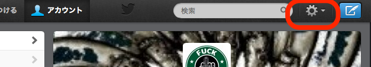
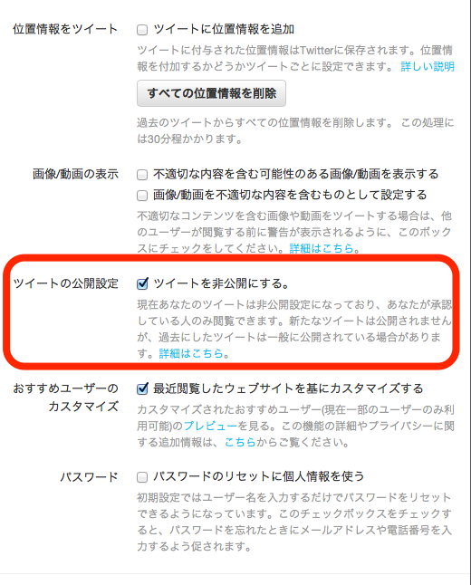

---
categories:
- ブログ
date: Tue, 16 Apr 2013 16:48:40 +0000
slug: post-1188
title: Twitterの鍵の掛け方〜自分のツイートを知らない人に見せたくない場合〜
---

どうも、社会人6年目異動8回笑われ男です。一週間ブログ100本投稿29本目です。<!--more-->
&nbsp;
&nbsp;

会社の後輩の子がTwitterをやってたんですが、たまたま発見しました。ぼくは会社のアカウントを運営している中の人なので、よく会社の名前やサービス名称で検索をかけてます。

で見つけましたのがその子でした。見てみるとどうも他の後輩の子と会話しているようですが、他の子たちはちゃんと鍵をかけてます。
でも、その子だけは鍵なしで自社名だして悪口をたれながすという、安定のバカッターって感じでした。

本当に阿呆としか言いようのない。

で本人に教えてあげたら鍵の掛け方をしらないという、本当にリテラシーのない人間が流行でツールを使うことの恐ろしさをかんじました。

その特性と自分の身をあらゆる意味で守る術を知らないということは大変危険で、周りにも迷惑になる行為なのです。

ということで一応、Twitterアカウントをフォロワー以外には見せないようにする鍵掛けの方法を紹介。

Twitterの上部画面の歯車のマークをクリック。
続いて設定をクリック 

その後は画面のようにツイートの公開設定という項目のチェックボックスにチェックをいれます。 

これだけです。これだけで、他人に見えなくなります。 わかりましたか。愚痴や悪口をつぶやくならこれをつけるベキです。
愚痴をつぶやくならリア友と繋がらず、鍵をかけて孤独に暮らせ、それも嫌なら・・・！！