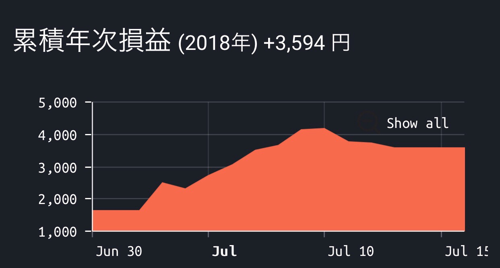

---
categories:
- ブログ
date: Sun, 05 Aug 2018 21:28:54 +0000
slug: post-11904
tags:
- 行った見た買った
title: 2018年7月の行った！見た！買った！
---

クッソ暑かった。暑ずきてなのかふらふらすることも数回ありました。そんな平成最後の7月でした。さて先月の振り返りと今月の決意を表明していきたいと思います。

<!--more-->
<h2>新規開拓店舗</h2>
近場でちゃんとした家系を見つけたー！！暑いので異様にしょっぱいものが食べたくなる日々でした。
<blockquote class="instagram-media" style="background: #FFF; border: 0; border-radius: 3px; box-shadow: 0 0 1px 0 rgba(0,0,0,0.5),0 1px 10px 0 rgba(0,0,0,0.15); margin: 1px; max-width: 540px; min-width: 326px; padding: 0; width: calc(100% - 2px);" data-instgrm-captioned="" data-instgrm-permalink="https://www.instagram.com/p/BlKCqfSHOFk/?utm_source=ig_embed" data-instgrm-version="9">

<a style="color: #000; font-family: Arial,sans-serif; font-size: 14px; font-style: normal; font-weight: normal; line-height: 17px; text-decoration: none; word-wrap: break-word;" href="https://www.instagram.com/p/BlKCqfSHOFk/?utm_source=ig_embed" target="_blank" rel="noopener">家系ラーメン食べたなる病が最近やばいので行ってきた。普通だと少し物足りないかも。次はこってりでいきたい！ #日本橋ランチ #東京駅周辺ランチ #ラーメン #飯テロ</a>

<a style="color: #c9c8cd; font-family: Arial,sans-serif; font-size: 14px; font-style: normal; font-weight: normal; line-height: 17px;" href="https://www.instagram.com/sinpeeee/?utm_source=ig_embed" target="_blank" rel="noopener"> かいばらゆうざん</a>さん(@sinpeeee)がシェアした投稿 - <time style="font-family: Arial,sans-serif; font-size: 14px; line-height: 17px;" datetime="2018-07-13T03:33:31+00:00">2018年 7月月12日午後8時33分PDT</time>

</blockquote>

チェーン店だろみたいな感じでバカにして食わず嫌いしてましたが美味しかった！！なんというか甘い！けど辛い！しっかりとした味
<blockquote class="instagram-media" style="background: #FFF; border: 0; border-radius: 3px; box-shadow: 0 0 1px 0 rgba(0,0,0,0.5),0 1px 10px 0 rgba(0,0,0,0.15); margin: 1px; max-width: 540px; min-width: 326px; padding: 0; width: calc(100% - 2px);" data-instgrm-captioned="" data-instgrm-permalink="https://www.instagram.com/p/Bl3HHcElo7D/?utm_source=ig_embed" data-instgrm-version="9">

<a style="color: #000; font-family: Arial,sans-serif; font-size: 14px; font-style: normal; font-weight: normal; line-height: 17px; text-decoration: none; word-wrap: break-word;" href="https://www.instagram.com/p/Bl3HHcElo7D/?utm_source=ig_embed" target="_blank" rel="noopener">食わず嫌いしてた日乃屋カレー 舐めてたわー美味しかったー！ずっと口の中に入れていたいくらい。甘い！ #ランチ #カレー #飯テロ #東京駅周辺ランチ #日本橋 #日本橋ランチ #もう日本橋というか神田 #日乃屋カレー</a>

<a style="color: #c9c8cd; font-family: Arial,sans-serif; font-size: 14px; font-style: normal; font-weight: normal; line-height: 17px;" href="https://www.instagram.com/sinpeeee/?utm_source=ig_embed" target="_blank" rel="noopener"> かいばらゆうざん</a>さん(@sinpeeee)がシェアした投稿 - <time style="font-family: Arial,sans-serif; font-size: 14px; line-height: 17px;" datetime="2018-07-30T15:38:14+00:00">2018年 7月月30日午前8時38分PDT</time>

</blockquote>

東京駅周辺で毎日ランチしてます。訪問店舗が100軒超えてるのでそろそろまとめたいなーと思っております。
<h2>面白いYoutube動画</h2>
この人は面白い。ほんと面白い。登録者のノビがすごい！だって面白いから！
<iframe src="https://www.youtube.com/embed/5nfqU54IY0I" width="560" height="315" frameborder="0" allowfullscreen="allowfullscreen"></iframe>

この人も始めて見つけたけど、企画がありそうでなかったアイデア。夏ということで心霊企画。1週間心霊スポットに住むといういかれた内容。怖いとか怖くないとかじゃない別の面白さがあった。
<iframe src="https://www.youtube.com/embed/FqQ6IHXrWgQ" width="560" height="315" frameborder="0" allowfullscreen="allowfullscreen"></iframe>

これは人気ユーチューバーのすしらーめんりくの動画。前から登録してましたが、内容があまりにバカすぎるのでご紹介します。
<iframe src="https://www.youtube.com/embed/iZNV1pphm2A" width="560" height="315" frameborder="0" allowfullscreen="allowfullscreen"></iframe>
<h3>今月のけっつん中級兵</h3>
色んなユーチューバーがやってるZOZOお任せ定期便の動画。やはり着るものではなく、着る人になんか色々依存すんだなぁと思った。服に着られてる感がすごい(笑)
<iframe src="https://www.youtube.com/embed/F0j5NvSdJpA" width="560" height="315" frameborder="0" allowfullscreen="allowfullscreen"></iframe>
<h2>買ってよかったもの</h2>
7月も特に何も買ってないはずなのに！気がつけばクレジットカードの請求がぁぁぁ！！！あれか！珍しくZOZOで服買ったからか！UNIQLOで服買ったからか！

ちなまにAmazonでお茶漬けの素をまとめ買いしたんですが、めちゃくちゃ便利。小腹が空いたときや食欲のない朝とかに助かる！
[itemlink post_id="11902"]
<h3>今月の仮想通貨</h3>
もう本当に仮想通貨なんて死語になっていますが、それでもしぶとく持ってます。

ただ、全く値動きしないので面白くありません。ということで、勉強を兼ねてBitcoin FXというのを始めました。

レバレッジという謎ルールにより自己資金の数倍の取引ができるのですが、これが本当に意味不明。その金は誰が出してるの？

とはいえ、上がるか下がるかに賭けるだけのただの博打なので、なんだかんだで3,000円ぐらい儲かりました。そのあとは怖くなってやめちゃいました。

好きな時に好きなことやって、好きなだけ寝て好きなLIVEに好きなだけいけるような貯金がほしいな！
<h2>7月の振り返りと8月にやりたいこと</h2>
6月に決めたやりたいことは次の３つ。どれもちゃんとやれてない。
<ul>
 	<li>3Dで何かつくる</li>
 	<li>LINEスタンプ売り上げ2000円目指す</li>
 	<li>ブログ更新する</li>
</ul>
<h3>3Dで何かつくる</h3>
blenderという3Dモデリングソフトを使って、<a href="https://twitter.com/FeelzenVr?s=17">zen</a>さんという方の<a href="https://youtu.be/7oNfgOOcKm8">「ワニでもわかるゼロからのblender」</a>を見ながらやってますが、けっこううまくいかない。難航中
<h3>LINEスタンプ売り上げ2000円目指す</h3>
結果<strong>486円</strong>

色々と出しましたが、売れているのは一個だけ
<a href="https://store.line.me/stickershop/product/3311288/ja">圧が強いメンヘラ</a>スタンプのみ

でも、これは売れるだろうなと思ったので継続してメンヘラシリーズを製作中。
<h3>制約と誓約</h3>
<strong>運動してない！</strong>まったくしてない！

<strong>コーヒーを飲まない</strong>というのを継続してるくらいで他もうなんもやってない！

いかん！少し太って着た気がするし。ZOZOのズボン以外で前から持ってた割とゆったりしてたやつがもうすぐ履けなくなりそうだし。

本当にしっかりと運動をしないと。

さて8月の誓いですが、本気を出します！！運動も！！節約も！！そしてブログも！！
とりあえず3Dモデリングでキャラデザインをするのは8月に完成させます。
<h2><a href="https://twitter.com/s_s_p_y">しんぺー</a>はこう思った。</h2>
8月にはいっても台風がきても全く気温が下がらない！
気づかずに体調が悪くなっていることが多くなってきました。

寒さで生命が脅かされるほどではない地域に住んでますが、暑さでは生命の危険があるので本当に気をつけたいです。
それでも、暑さに負けずに頑張りたい！とりあえずこれを書いている今日はLIVEありますんでいってきます。

と言ったところで本日は以上になります。
おやすみなさい。
そして、また明日。