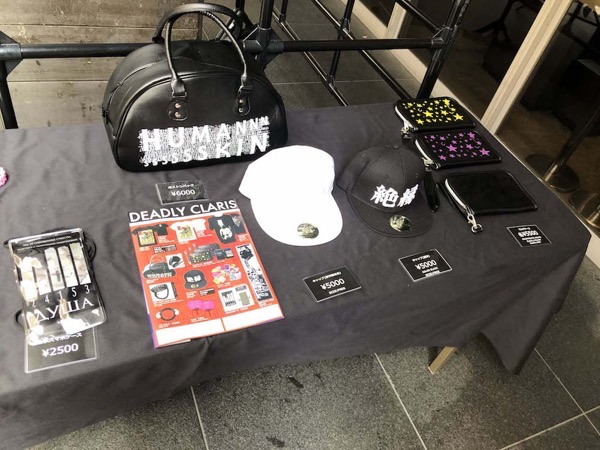

---
categories:
- DIR EN GREYのLIVEレポ
- TOUR18 WEARING HUMAN SKIN
date: Tue, 07 Aug 2018 08:53:00 +0000
slug: post-11914
tags:
- DIR EN GREY
- LIVEレポ
title: 【ライブレポ】DIR EN GREY TOUR18 WEARING HUMAN SKIN -｢a knot｣only- 2018_8_7@CLUB CITTA’
---

個人的には、6月の追加公演ぶりのDIR EN GREYでした。台風が近づいているため、小雨が降ったりやんだりで風が少し強かったもののそこまでひどくはありませんでした。おそらく2日目の方が酷いのではないでしょうか、参戦される方お気をつけください。それでは2018/8/7にCLUB CITTA’ で行われたDIR EN GREY TOUR18 WEARING HUMAN SKIN -｢a knot｣only-のLIVEレポです。

<!--more-->

この日は650番台でしたが気がつけば700番まで呼ばれており急いで中に入りました。

CITTA'は柵がちゃんと設けられており、おそらく２つほど柵があり、前方・中間・後方という形で区切られています。
いつも通り下手の方に入り、開演前の謎押しに乗って前方エリアに侵入できました。とは言え、この日の押しはそこまできつくありませんでした。個人的に休日や休前日、ツアーファイナルは押しが強い気がします。
<h2>LIVEレポ</h2>
ど下手にいましたので、上手が全く見えず。なんなら京もたまに見えるくらいでした。Dieに至っては下手にきた3回くらいしか見れず。
その分、薫とToshiyaを堪能いたしました。
<h3>グッズ</h3>
Tシャツ。この日ツアーTシャツ白と黒両方購入予定でしたが、限定カラーしか販売しておりませんでした。国フォの時にどちらか購入しようかと思います。

右端に写っているのがタオル

<h3>セトリ</h3>
詩踏み
Ash
蜷局
腐海
輪郭
新曲
新曲
Phenomenon
THE BLOSSOMING BEELZEBUB
Ranunculus
人間を被る
The inferno
The IIID EMPIRE
Beautiful Dirt

EN.
理由
新曲
THE FATAL BELIEVER
Revelation of mankind
羅刹国

冒頭の始まり方が今までにないテクノ？というかポップというか、カラフルでした。

詩踏みはじまりが、なんだか新鮮な気がしました。詩踏み終了にあわせてツアータイトルが表示されていたような気がします。

そのあとのAsh、蜷局で腐海。腐海の新バージョンは映像収録しかない旧新バージョンとうたっている人間像が変わった気がします。
旧新バージョンは弱く泣き叫んでいる感じ。それこそ京自身が自傷パフォーマンス真っ盛りだった頃なので、そうなのかもしれません。「ほら、ほら、ほら、ほらあああ」と言いながら腕を切り刻む姿が目に焼き付いています。それが新新バージョンでは、むしろさらに達観し、強く踏み出した後にそれを振り返って黄昏ている感じがします。

そのあと、一時的に会場が沸きましたが、輪郭のイントロ始まってすぐにスマンって思った。

この日に演奏された新曲はRanunculus以外だと3曲。どれもパンクっぽい曲調で疾走感があるものでした。アルバムにこの3曲が収録されるとしても、他もこういう曲調だとは考えにくいので、どういう形のアルバムとして完成されるのかきになるところです。

あとRanunculusの映像はぜひ作品化してほしいです。表示されるテキストが一瞬変わるところなど、しっかりと見たい。
<h3>ステージセット</h3>
各種アンプが置いてあるだけで、あとは証明があるだけの最近のシンプルなままでした。
<h3>衣装</h3>
薫の衣装はアー写通り。アー写では甲冑をきているのかと思いましたが、何かを羽織っているようでした。
その何かというのが、おばあちゃんちの台所の入り口にかかっているような球状のものがたくさんつながって数珠みたいになったのれんのようでした。
肩パッド部分もおそらくビーズ状で裾にいくほどビーズのれんという感じでした。

髪型はツートンで、暗くて色の判別ができませんでしたがピンクよりも薄く紫っぽい印象でした。
なお、ビーズのれんを脱ぐと下はノースリーブ
アンコールではツアーTシャツの限定カラーですそを切ってノースリーブにしてきていました。

Toshiyaは、ボタンがたくさんついた学ランのようなシルエットのジャケットを着用。アンコでは、首吊りTシャツのすそを折り、ネクタイをしていました。

京は、白いベールのみアー写通り。アー写のシルエットでフサフサしていたエクステのようなものはつけておらず、爪もなし。また下は袴のような形の黒いパンツでした。
上は、白く山伏のような服装でした。首回りに「人間を被る」のキリル文字っぽいもの。文字自体は違うものかも。

メイクは、完全に白塗り額には赤く穴があき、そこから流れる血。目には真横にピンクの蛍光色で細い線が書かれていました。
そして、顔全体には蛍光色で民族的なメイクをしていました。薄暗い中、浮かび上がるそれは少しこわかった。
THE BLOSSOMING BEELZEBUBにてカメラドアッップ演出がありましたが、以前のドクロメイクとは違った呪術的な感じがあった。ジャングルの原住民を思わせるようなメイクでした。

アンコールでは、完全にメイクをとって現れましたが、心なしかベールから見える頭の部分の青々とした剃り跡が綺麗に肌色になっている気がしました。もしかして、本編終わってからバリカン当てたのかと思うくらい。（アンコールで出てくるまでが少しながかったのはそのせい？）首吊りTシャツに、スカートといつものスキニー。

そして、後頭部付近に新しい刺青を確認。どんな絵かは見えませんでした。多分刺青だと思われますが、もしかしたら額のメイクと連動して後ろにも穴開けてるだけかも。でもそうだとしたら、前のメイクはとったのに後ろのメイクだけとりわすれたことになる。それはないか。

Shinyaは水撒きの時しか見えず。Dieも衣装覚えていません。
<h2>薫「読弦2（仮）」今秋発売予定</h2>
フライヤーによると薫が連載していた読弦の続編が発売されるそうです。
ということでおそらく<a href="https://www.warawareotoko.com/2016/01/09/post-8793/">虎の穴</a>も開催されるでしょう。また新宿がいいな。

<a href="//ck.jp.ap.valuecommerce.com/servlet/referral?sid=3041033&amp;pid=883922249&amp;vc_url=http%3A%2F%2Ftower.jp%2Fitem%2F4015894%3Fkid%3Dpafvc" target="_blank" rel="nofollow noopener noreferrer">読弦</a>
<h2>TOUR18 WEARING HUMAN SKIN 情報</h2>
2018/8/2(木) 京都府 ロームシアター京都メインホール -｢a knot｣only-
2018/8/3(金) 京都府 ロームシアター京都メインホール -｢a knot｣only-
2018/8/7(火) 神奈川県 CLUB CITTA’ -｢a knot｣only-
2018/8/8(水) 神奈川県 CLUB CITTA’ -｢a knot｣only-
2018/8/11(土) 宮城県 仙台PIT
2018/8/12(日) 宮城県 仙台PIT
2018/8/23(木) 東京都 東京国際フォーラム・ホールA
2018/8/24(金) 東京都 東京国際フォーラム・ホールA
2018/8/28(火) 福岡県 福岡市民会館
2018/8/30(木) 大阪府 なんばHatch
2018/8/31(金) 大阪府 なんばHatch
2018/9/4(火) 新潟県 新潟LOTS
2018/9/5(水) 新潟県 新潟LOTS
2018/9/14(金) 愛知県 Zepp Nagoya
2018/9/15(土) 愛知県 Zepp Nagoya

興味がある方はまだチケットはあるところもあるようなので間に合いそうです。
<a href="https://click.linksynergy.com/fs-bin/click?id=x1UgY2pYB6o&amp;offerid=292260.10000001&amp;type=3&amp;subid=0">チケットぴあ</a>
<a href="http://eplus.jp/sys/main.jsp">eplus</a>
<a href="http://l-tike.com/">ローチケ</a>
<h2>アルバム関連イベント</h2>
これかなり混乱してしまいましたがアルバムの情報もまとめておきたいと思います。
<h3>早期予約特典「トークイベント」</h3>
8月10日までに完全生産限定盤の早期予約特典で、トークイベントの参加抽選応募券がもらえます。
これに関しては、オンライン予約でも入っているようなので、アルバムに封入されているものと思われます。
<h3>インストアイベント</h3>
先日新宿のタワレコに予約に行きましたが、予約会とインストアイベントが開催されることになりました。参加券は事前に該当店舗で受け取れるみたいです。
ぼくは先日新宿に並びに行ってきました。朝9時くらいから並び12時過ぎまでかかりました。直射日光の中、倒れそうになりながら並び、そして階段に通されたのですがそこがもっと暑くて酷かった。詳細は<a href="http://direngrey.co.jp/special/insulated-world/">こちら</a>

予約会
2018年8月13日(月) 【宮城県】HMV仙台 E BeanS
2018年8月27日(月) 【福岡県】タワーレコード福岡パルコ店
2018年8月29日(水) 【京都府】タワーレコード京都店
2018年9月1日(土) 【大阪府】HMVグランフロント大阪
2018年9月6日(木) 【新潟県】タワーレコード新潟店
2018年9月9日(日) 【神奈川県】タワーレコード川崎店
2018年9月16日(日) 【愛知県】タワーレコード名古屋パルコ店

インストアイベント
2018年9月25日(火) 【東京都】タワーレコード新宿店

[itemlink post_id="11829"]

[itemlink post_id="11833"]

[itemlink post_id="11832"]
<h2><a href="https://twitter.com/s_s_p_y">しんぺー</a>はこう思った。</h2>
なんでLIVE行ってるのかというと、端的にいうと悟りを開くためです。

ふとした瞬間共感覚的に「これってあれだよな？」とか
「これってこうだったからこうだったのか！」とか
降りてることありませんか？

ぼくはそれを悟りだと思ってて、その感覚が欲しくてLIVEに通ってます。

でも、この感覚てDIR EN GREYでしか味わくて、しかも大抵はめちゃくちゃ激しくて死にそうになった時にダウナーな曲で、ふと我に帰るのを通り越した時、おとずれることがほとんど。

多分脳みその酸素量とか関係してる気がする。そういう意味ではLIVEは修行ともいえる。

次の参戦は国フォです。

と言ったところで本日は以上になります。
おやすみなさい。
そして、また明日。