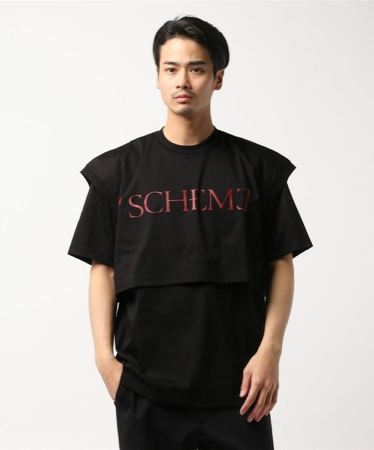

---
categories:
- DIR EN GREYのLIVEレポ
- TOUR18 WEARING HUMAN SKIN
date: Sat, 25 Aug 2018 12:00:00 +0000
slug: post-12034
tags:
- DIR EN GREY
- LIVEレポ
title: 【ライブレポ】DIR EN GREY TOUR18 WEARING HUMAN SKIN 2018_8_24@国際フォーラム
---

何度もアナウンスがあったので、きっとそうなんでしょう。今年最後の東京公演であるDIR EN GREYのTOUR18 WEARING HUMAN SKINの東京国際フォーラムホールA公演の2日目にいってきました。ぼくがなぜLIVEに通うのか、初心を思い出すような素敵なLIVEでした。

<!--more--> 

ホールというのに、開場後に長い列でぞくぞくとみなさん入場されていました。夏休み期間中ということもあり、小学生くらいの子ども連れの方もいつもより多かったように思います。最近ですとASIAN KUNG-FU GENERATIONがライブに子どもを連れてくる人にイヤーマフの貸し出しをするというのが話題になっていましたが、少し心配になりました。DIR EN GREYの場合は、それ以外にも成長に何かしらの悪影響が出ないか心配な部分がなくもないけどw

<h2>LIVEレポ</h2>
<h3>衣装</h3>
京は完全な白塗りにグールメイク。目頭にピンク色の蛍光塗料とそこから顔の横に向かってラインが引かれていた。歯には銀色の矯正器具のようなものをつけていたため、ニターッと笑うと暗闇に蛍光の怪しげな光と光る歯が見えて怖い。白いベールを被り、スキニーパンツにスカート、ヒールが高いブーツを履いていた。蛇の目のようなカラコンをつけてた。アンコールではこちらのTシャツを着て、途中で脱いでいた。久しぶり？の上半身裸に声があがってた。

20,520円

Toshiyaはボタンが沢山ついているシャツ、その下には黒のノースリーブ、アンコールでは白いノースリーブでした。

薫は黒い布。右手の方が肘からでるような感じになってた。髪の毛はこのまま
<blockquote class="twitter-tweet" data-lang="ja">
週末はDIR EN  GREY薫センセに取材。もちろん内容は9／26リリースのニューアルバム『The Insulated World』についてなんだが……ああいう状況下での取材はある意味レアというか、貴重な内容というか……。そんなインタビューは10月号（9/5）にて掲載予定です！  <a href="https://twitter.com/hashtag/DIRENGREY?src=hash&amp;ref_src=twsrc%5Etfw">#DIRENGREY</a> <a href="https://t.co/Fq3ydwWye2">pic.twitter.com/Fq3ydwWye2</a>
&mdash; 音楽と人 (@ongaku_to_hito) <a href="https://twitter.com/ongaku_to_hito/status/1031344101503856641?ref_src=twsrc%5Etfw">2018年8月20日</a></blockquote>

アンコールでは白いツアーTシャツの袖を切ってきていました。

Dieは白というか灰色と黒のパッチワーックっぽい布とショートパンツにタイツ。足が細すぎ。どうしたらそんなに細くなるの。
Shinyaは貴族のようなシャツ。

<h3>セトリ</h3>
詩踏み
咀嚼
蜷局
腐海
理由
新曲
新曲
輪郭
THE BLOSSOMING BEELZEBUB
Ranunculus
人間を被る
新曲
Ash
Revelation of Mankind

EN.
鼓動
The inferno
The IIID EMPIRE
Beautiful Dirt
羅刹国

<h3>LIVEレポ</h3>

<blockquote class="twitter-tweet">
俺はライブをする為に生きている 俺は音源に意思を込める為に生きている ただ、それだけの為に明日が存在する 今はそれだけで十分だ  誰の為に生きる？  京
&mdash; 京 (@kyo_official) <a href="https://twitter.com/kyo_official/status/1032915565826912256?ref_src=twsrc%5Etfw">August 24, 2018</a></blockquote> 

ホールだからなのか、音がいいからなのかわからないけど、ドラムで叩かれた振動がそのまま肌に響く感覚を久しぶりに感じた。
はじめてライブというものに参加した1999年9月9日のPIERROTのライブで感じたそれを思い出した。あの時は2階席の後ろの方だったにも関わらず、震える感触をかんじた。

腐海は、やっぱり新新バージョンは綺麗で大人な感じになってしまって、旧新バージョンの方が好き。というのも、当時の自分を思いだして、やっぱり自分はクソだしもっともがかないといけないと感じさせてくれる。ライブにかよい、DIR EN GREYをきく、普通な顔してまともそうに生きてるけど自分はクソで底辺だってことを忘れないように、もっと苦しんでもっともがかないといけない。何かと戦わずに共存することもできるかもしれないけれど、戦わなければいけない局面は絶対にあって、そのとき戦わなければ生き残れないと思う。

輪郭からの人間を被るまでの流れがすごいよかった。
とくにTHE BLOSSOMING BEELZEBUBは過去一番怖かった。マイクのコードをからめて子どもに見立てて、抱きかかえてた姿は本当に赤ん坊に見えた。腹をかっさばいて、未熟なまま血まみれなまま引きずりだしたように見えた。そのあと後ろに振り返り歌い出したときは、カメラから離れると目が真っ黒に見えて、近づくと蛇の目のように見えてそれもこわかった。

Ranunculusは今日MVが見られるとわかっていても、どうしてもこのライブで流れる映像も作品化してほしいと思う。あの演出あってこその曲の真意やメッセージ、聴き手の過去とのリンクがあると思う。でもライブ限定なのならばそれはそれでいいかもだけど

そのあとは人間を被る
冒頭のSEの際に流れている映像は、過去大量殺人を犯した犯人の写真が何枚も流れていたが、つまり「人間の皮を被った怪物」をあらわしていて、それとは別にRanunculusや人間を被るでも歌われている「誰が正しいのか、何が正しいのか、誰のためにいるのか」「自分のために生きろ」
ぼくが今日強く感じたなぜライブに通うのか、なぜDIR EN GREYを聴き続けるのかの根元にある「クソだった自分を忘れない」にもつながる気がする。

日常で作り上げられて、取繕われた自分は本当は違ってて、本当はもっと醜い。誰のために何かするなんてどうでもいい。

人間を被る、WEARING HUMAN SKINとはそういう意味なんだと勝手に感じた。

アンコールでは鼓動がきけた。
鼓動は個人的にDIR EN GREYで最も好きな曲で、何度か色んな記事にも書いたけど、PIERROTの表す世界観と本質的に近しいと思う。結局は希望などなく、同じように過ぎる時間は悲しさも楽しさも何も帯びていない。

その後の曲では、下手に京がいくもマイクが引っかかったかなんかで、多分ステージから落ちた？模様。マイクを通して明らかな落下音がして、下手に視線をやると京がどこにもいないし、しばらく出てこないw だいぶ間をおいてステージに現れると、スタッフからマイクを受け取り中央に急いで戻ってた。

それでも勢いは衰えずラストの羅刹国前にはマイクを胸に叩きつけての煽り。珍しく女あー！！からの煽り

羅刹国中、DieがShinyaの後ろに入りギターを掲げ弾きまくり、Toshiyaも上手で足をかけ弾く。薫は1人下手で弾いてた。

終わりに京がぴょんぴょん跳ねてShinyaの方を見てアピールするも、Shinyaは無視ひたすらひたすらひたすら叩きまくり、Dieも「おいおい」と多分口で言ってる気がした。Toshiyaも笑って腕をひろげ「どうです？お客様がた、これがうちのやもです！」と言わんばかり

今日はツアーファイナルなのかというくらいのノリで叩きまくって全曲終了

餌撒きも一通り終わり、それぞれ捌ける際に、Shinyaがおもむろにドラムセットに戻りシンバルをはずし始めた。おいおい、Shinyaさん！まさか！まさか！ホールだからってそんなもん投げる気じゃないよね！？？？と誰もが思ったかもしれない。昨日はどうだったの？昨日もはずしてたの？もし外してなくて今日はじめてなのだったら、クレーム入って即時対応したのか？？

Dieが捌け、再び暗転

Ranunculusがはじまる。心なしかライブバージョンと少し違った感じがした。

https://youtu.be/6uPeXZmfji4

スキンヘッドの今にも死にそうな京、顔には入院患者がするようなチューブを鼻につけて、手足は黒く顔は青白い。Toshiyaはステージ衣装と同じボタンがたくさんついたジャケット、薫はおそらくアー写通り。DieとShinyaは覚えていない。

映像自体が小さなミニチュアの様な感じで、光もあって全体的に温かみがあった。ただし、内容は相変わらずおぞましく、おそらく途中出産なのか死産なのか、THE BLOSSOMING BEELZEBUBで演出されたような腹を帝王切開なのかわからないけど妊婦と思われる人が最後血塗れになるようなものもあった。京がその人なのかわからなかったけど、最後の方はアー写通りの姿に。

映像が終わると拍手がおき終演。本当に今日がツアーファイナルのようだった。もしかしたら、後半は違う構成でのライブになるのかもしれない。

それはそうと、アルバムが楽しみで、また生きる理由が１つ増えたのでした。

[itemlink post_id="11829"]

[itemlink post_id="11833"]

[itemlink post_id="11832"]

<h2>TOUR18 WEARING HUMAN SKIN</h2>

<h3>ツアー日程</h3>
以下、残りの日程。この合間にアルバム関連のイベントが開かれる。興味がある方はまだチケットはあるところもあるようなので間に合いそうです。

2018/8/28(火) 福岡県 福岡市民会館
2018/8/30(木) 大阪府 なんばHatch
2018/8/31(金) 大阪府 なんばHatch
2018/9/4(火) 新潟県 新潟LOTS
2018/9/5(水) 新潟県 新潟LOTS
2018/9/14(金) 愛知県 Zepp Nagoya
2018/9/15(土) 愛知県 Zepp Nagoya

<a href="https://click.linksynergy.com/fs-bin/click?id=x1UgY2pYB6o&amp;offerid=292260.10000001&amp;type=3&amp;subid=0">チケットぴあ</a>
<a href="http://eplus.jp/sys/main.jsp">eplus</a>
<a href="http://l-tike.com/">ローチケ</a>

<h3>アルバム関連イベント日程</h3>
予約会日程
2018年8月27日(月) 【福岡県】タワーレコード福岡パルコ店
2018年8月29日(水) 【京都府】タワーレコード京都店
2018年9月1日(土) 【大阪府】HMVグランフロント大阪
2018年9月6日(木) 【新潟県】タワーレコード新潟店
2018年9月9日(日) 【神奈川県】タワーレコード川崎店
2018年9月16日(日) 【愛知県】タワーレコード名古屋パルコ店

インストアイベント
2018年9月25日(火) 【東京都】タワーレコード新宿店

<h2><a href="https://twitter.com/s_s_p_y">しんぺー</a>はこう思った。</h2>

個人的に、今回のツアーは今日でラストでした。これで年内東京公演がないと明言されているので追加のツアーはないのでしょう。

ただ幕張メッセのフェスだったり、大阪城ホールでやりますーとかはめちゃくちゃありそう。

何もなければsukekiyoツアーが今年最後のライブになりそうです。

と言ったところで本日は以上になります。 
おやすみなさい。 
そして、また明日。