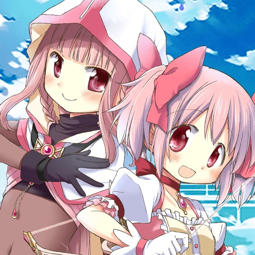

---
categories:
- アニメ
date: Tue, 11 Sep 2018 23:00:00 +0000
slug: post-12058
tags:
- アニメ
- アプリ
title: 「魔法少女まどか☆マギカ」が面白い！ゲームのアニメ化決定！オススメなので見て！
---

魔法少女まどかマギカというアニメをご存知でしょうか。萌えっぽい可愛らしい絵にハードでシリアスなストーリーのアニメです。ぼくはこのアニメが大好きです。普段ガチャがあるようなスマホアプリゲームはぜったいにやらないぼくですが、アニメの続きのつもりで「魔法少女まどかマギカ外伝マギアレコード」をしばらくやっていました。魔法少女のアニメーションも全員用意されていて、声もしっかりついていて、ストーリーもしっかりしていて楽しめるゲームでした。その「マギアレコード」が2019年にアニメ化が決まったということで、この機会にご紹介したいと思います。

<!--more--> 

<h2>魔法少女まどか☆マギカとは</h2>
魔法少女まどかマギカは、2011年に放送されていたアニメです。

願いを叶えた代償として、人間を襲う魔女と呼ばれる存在と戦う魔法少女の物語。かわいくてどこか力の抜けたデザインの登場人物とは裏腹に、ストーリーはシビアでシリアス。

誰のために戦い、何のために血を流すのか。そしてほおを伝う涙に何をおもう。

何も知らずに、萌え系のアニメだろうとタカをくくって第3話まで見ていたら衝撃が走る。

踏み入れたのは花畑でなく茨の道。そして後半オープニングのテーマ曲の意味を知るあなたも涙することでしょう。

<h2>ネタバレありのあらすじ</h2>

すっごい端折って、あらすじのみを紹介します。

登場人物は鹿目まどか、美樹さやか、巴マミ、佐倉杏子、暁美ほむら。
舞台は見滝原という街。数日後にやってくる最強の魔女「ワルプルギスの夜」により全てが破壊し尽くされる。

それを阻止するために魔法少女暁美ほむらは1人時間遡行を何度となく繰り返していた。
何回目かのループの中で、親友の鹿目まどかと共に戦うも、まどかがやられてしまう。まどかが死ぬ直前、魔女になりたくないという思いから、ほむらに介錯を頼み、過去に戻って自分が絶対に魔法少女にならないように止めてほしいと頼まれる。

その約束を秘めたほむらの何度目かの時間遡行の末に物語が始まる。

<h3>キュウべぇとソウルジェム</h3>
願いを何でも叶える代わりに、少女を魔法少女に変えるきゅうべえ。その正体は、エネルギー回収を目的とした地球外生命体。
言葉たくみに少女と契約し、魂をソウルジェムに変え魔法少女として魔女と戦わせる。戦いの果てに絶望した魔法少女のソウルジェムは破壊され、魔女になる。
その際に発生する希望と絶望の相転移をエネルギーとする。

魂をソウルジェム化すると、肉体と魂が分離する。ソウルジェムが破壊されなければ理論上死ぬことはないが、肉体と一定距離以上離れると肉体は死体のようになってしまう。また、痛覚が弱まることから魔女との戦闘には都合がいい。魔力を使うことで濁りが増すが、魔女を倒した際に手に入れられるグリーフシードで浄化することができる。濁りが一定以上たまると、ソウルジェムはグリーフシードとなり、魔法少女は魔女となる。

<h3>巴マミ</h3>

何も知らないまどかとさやかの前に現れた同じ学校の先輩。長く魔法少女として魔女と戦っていて、魔法少女になることをためらうまどか達に自分の戦う姿を見せる。
しかし、第３話で魔女に殺されてしまう。

魔法少女になるということの厳しさと敗北の現実をまどかとさやかは思い知ることになる。

<h3>美樹さやか</h3>

まどかの友達。幼馴染のボーイフレンドを助けることの対価として魔法少女となる。その後、魔法少女としての苦悩の末、魔女と成り果て死ぬ。

<h3>佐倉杏子</h3>

巴マミ亡き後に、見滝原にやってきた魔法少女。自分の欲望のために戦うも、正義の味方として戦う美樹さやかに強い反発を抱く。しかし、自身も他人のために魔法少女となった過去からどうしてもまどかやさやかを放って置けず、最後は自分の命と引き換えに魔女となったさやかもろとも死ぬ。

<h3>暁美ほむら</h3>

時間を止めることができる魔法を持った魔法少女。過去に何度となく戻り、1人孤独な戦いを繰り返していた。
何回、何年繰り返したのかはわからない。何度も何度もワルプルギスを倒すため、まどかを魔法少女にしないために繰り返す。

1人孤独に戦い続ける。

<h3>鹿目まどか</h3>

友達の死を目の当たりにし、そしてほむらが自分の親友であることを知り、自分のために孤独な戦いをしていたことを知り
そして、魔法少女となることを決める。

過去、現在、未来、すべての魔法少女が魔女となる前に消滅させることを対価に。
これにより概念となったまどかは、誰の記憶にも残らない。ほむらただ1人をのぞいては。

<h2>映画【新編】叛逆の物語</h2>

映画は全部で3本あります。総集編的なものが2つ。
全く新しい物語が1つ。

こちらは、まどかが概念となったあとの世界を描いています。ほむらが主人公で、彼女は魔女が消滅した世界で、かわりに魔獣という存在と戦っています。
そのはずでした。

しかし、物語は全く違う方向へと進み、思わぬ結末を迎えます。

	
<h2>魔法少女まどかマギカ外伝マギアレコードとは</h2>

マギアレコードとは見滝原とは違う街神浜を舞台にした魔法少女のお話を描いたスマホゲーム
神浜では、魔法少女は魔女の力を自らの意志で抽出し使いこなす。また敵は魔女だけでなく、怪異と呼ばれる別の存在とも戦わなければならない。

2017年にリリースされたマギアレコードですが、毎月様々なイベントや追加コンテンツがリリースされ、ついに１周年を迎えました。スマホ専用ゲームってぼくは普段絶対にやらないのですが、このゲームだけはリリースからダウンロードして数ヶ月続けていました。

ゲーム性云々よりも、ストーリーがしっかりとしていて、細部までしっかりと作り込まれているのでもう一つの魔法少女たちのストーリーとして十分に楽しめるものとなっています。

<h3>ストーリーと設定</h3>

主人公は環いろは
彼女には小さな妹がいるはずだった。しかし、その妹は自分の記憶の中だけで、誰にきいてもそんな子はいないと返される。妹を取り戻すために、いろは神浜の謎と戦う。
また環いろは以外にも様々な魔法少女が登場し、それぞれのオリジナルストーリーを楽しむことができる。

このゲームでは、魔女にならずに魔女の力を使うことができるドッペルという技が使用できる。協力な上級の必殺技のような扱いとなっており、それぞれのアニメーションやセリフも用意されているいて、とていも見応えがあるものとなっています。

マギアレコード 魔法少女まどかマギカ外伝

開発元:Aniplex Inc.

無料

posted with<a href="http://mama-hack.com/app-reach/" title="アプリーチ" target="_blank" rel="nofollow">アプリーチ</a>

<h3>2019年にアニメ化決定</h3>

さて、そんなマギアレコードが2019も年にアニメ化決定

https://youtu.be/8ztCD2yoJd4

とても楽しみだけど、ワンクールじゃなくてサイドストーリー含めてやってほしいなあ！

まどかマギカを見る前は、ぼくもその萌えっぽいキャラクターをなんとなく食わず嫌いしていました。でも見てみるととてつもなくシリアスで、そして感動できる内容で、見れば見るほど引き込まれていました。

まどかマギカを見たことがない方はこの機会によかったらどうぞ。登録はこちら

<a target="_blank" href="https://www.amazon.co.jp/tryprimefree?&_encoding=UTF8&tag=warawareotoko-22&linkCode=ur2&linkId=88fec11dbdddff407b45c334ecfd884e&camp=247&creative=1211">Amazonプライム会員に登録して見る</a>

<a href="//ck.jp.ap.valuecommerce.com/servlet/referral?sid=3041033&pid=885369741" target="_blank" rel="nofollow">Huluに登録して見る</a>

<a href="https://www.netflix.com/browse">Netflixに登録して見る</a>

<h2><a href="https://twitter.com/s_s_p_y">しんぺー</a>はこう思った。</h2>

ゲーム自体は途中で続かなくなってしまったのですが、それがアニメ化してくれるときいてとても嬉しいです。クリアまでやらなくてもストーリーがわかる！

と言ったところで本日は以上になります。 
おやすみなさい。 
そして、また明日。