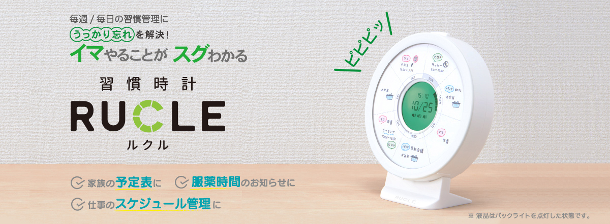
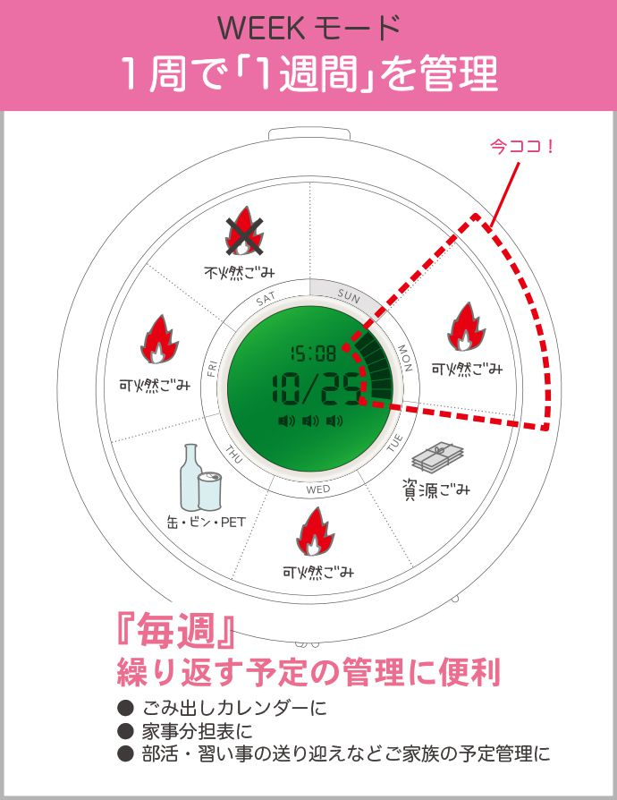
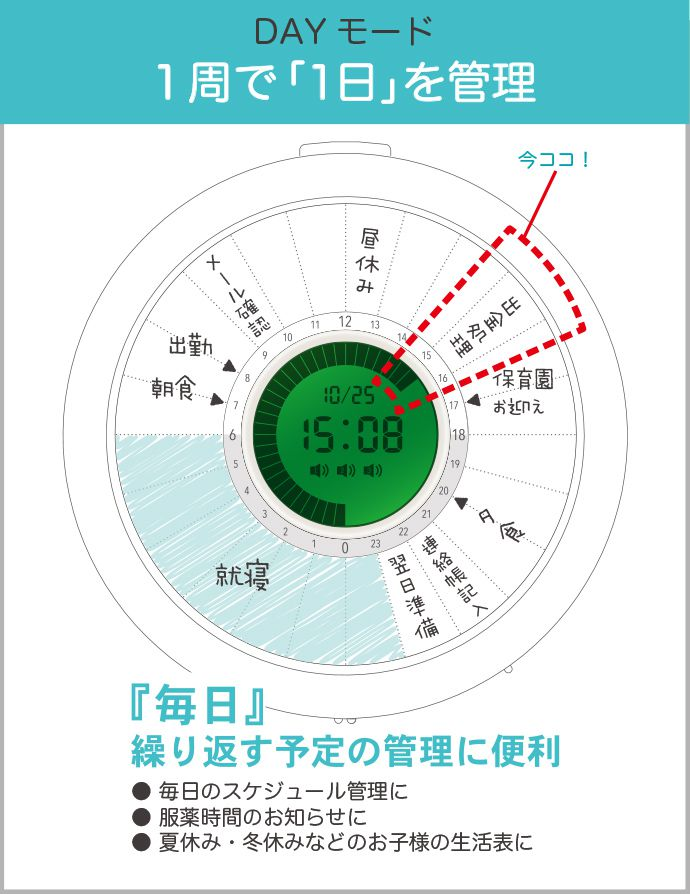

---
categories:
- レビュー
date: Thu, 13 Sep 2018 23:00:00 +0000
slug: post-12081
tags:
- ガジェット
title: キングジムから24時間で一周する「習慣時計ルクル」発売
---

あれもしたい、これもしたい、正直仕事をしている時間なんてない。行きたいライブに行き、食べたいものを食べ、好きな時に寝て起きて、ちゃんと貯金できるくらいの給料がほしい。

そうなるためには頑張らないといけない。限られた時間を有効に使って、費やした時間以上の何かを得なければ。常に死を思え、常に萌えていく時間を感じろ。

だから、ぼくは探していました。1日の流れが一目でわかる時計を。そしてやっとそれが見つかりました。24時間で1回まわるキングジムから発売する「習慣時計ルクル」です。

<!--more--> 

<h2>習慣時計ルクル</h2>

1週間で1回まわるWEEKモードと1日で1回まわるDAYモードが搭載されています。また、スケジュール台紙がはいっており、それぞれの用途に応じて書き込みができるようになっています。

WEEKモードでは、毎日のゴミ出しの曜日や習い事やスケジュール管理なんかをわかりやすく•忘れないように管理することができます。

DAYモードでは、1日のスケジュール管理をするのに向いています。0〜6時まで就寝、8〜9時で出勤などと書き込み1日のざっくりタスクやスケジュールを管理します。

<h2>手頃な24時間時計がない</h2>

24時間で1周するアナログ時計で手頃なものがあまりありませんでした。

あっても高いか、腕時計のどっちか。
デスクにおけるような、常に意識できるようなものが欲しかった！

時間を常に意識して、1日のどれくらいが経過したのかが一目でわかるようにしたかった。

Apple WatchやChromeのアドオンでそういうのがないか探しまくったけど見当たらず。それがめちゃくちゃ手頃な値段で発売！即予約しました。

[itemlink post_id="12098"]

<h2>死を思え</h2>

時間は有限。日、1日と死に近づいています。
死んだことがないのですが、多分生きているうちにやりたいと思ったことは、なるべくやっておいた方がいいように思います。

そこまで大袈裟じゃなくても、明日やろうとか思ったことができなかったり、どんどん先延ばしにしてしまうことってよくあると思います。

明日の自分は信用できない。

だったら、今日やるしかない。繰り返してゆく毎日から、作り出して行くの自分を！

<h2><a href="https://twitter.com/s_s_p_y">しんぺー</a>はこう思った。</h2>

時間を意識して、早く仕事を終わらせて、ブログ書いたり勉強したりしたい！！

と言ったところで本日は以上になります。 
おやすみなさい。 
そして、また明日。