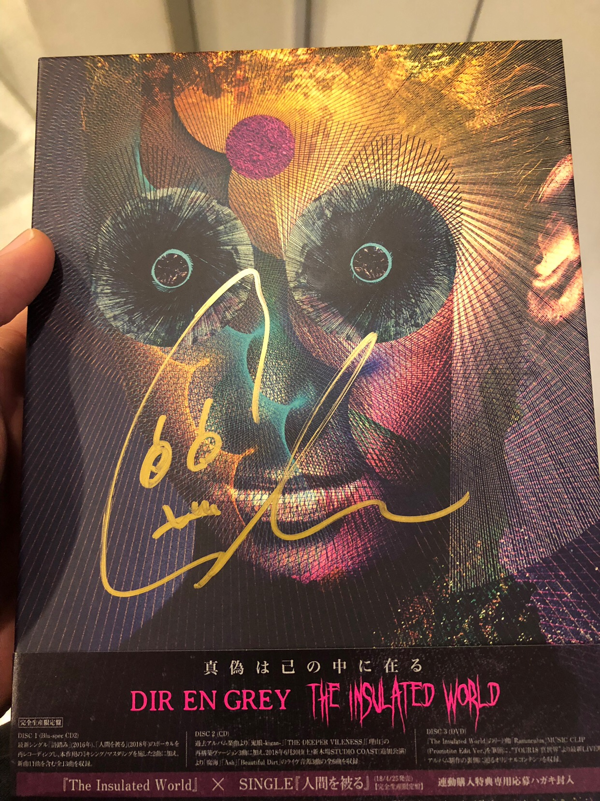

---
categories:
- DIR EN GREYのイベント
date: Tue, 25 Sep 2018 05:22:26 +0000
slug: post-12115
tags:
- DIR EN GREY
- インストアイベント
title: 【インストレポ】DIR EN GREY「The Insulated World」発売記念＠タワーレコード新宿
---

あれは真夏の暑い日だった。直射日光の中、開店までの数時間を耐えて、店内に入ったと思ったら待機スペースの階段は蒸し風呂状態。

駅のドトールで買ったアイスティーはとうに飲み干した。本当に倒れるんじゃないかと思った。

そうして死ぬ気で並んで予約したDIR EN GREYのニューアルバム「The Insulated World」がついに発売した。そして、そのインストアイベントに参加してきました。本日はそのイベントレポです。

<!--more--> 

念のために有給を取って、早めに到着。アルバムの受け取りも早めに済ませました。連休明けの平日ということもあり、定時で仕事を切り上げてだった人が一斉に来店して引き換えたようでした。

その結果、集合時間の18:30には到底間に合わず、開始時間の19:00に間に合わなかった人もいたのではないでしょうか。

ぼくが待機していた階段部分では、上の方のアナウンスしか聞こえず、引換列がどれくらいになっていたのかは伺い知ることができませんでした。

<h2>新宿第1部はShinya</h2>

19:00を過ぎると無情にもスタートを知らせるアナウンスが流れます。そして、マイクを通して紹介さ！たメンバーはShinya

悲鳴に似たどよめきが一瞬

やがて、ぼくの待っていた番号も呼ばれようやくイベントフロアに入場できました。

遠目に見るShinyaは、あきらかに現実よりもレイヤーが薄く、その存在の疑わしさったら半端なかったです。

カラコンにメイク
黒いジャケット、黒いシャツ、黒いパンツ、黒いブーツ
クロスのネックレスにキラキラひかるブレスレット

シンプルな出で立ちでした。

何を話そうか考えていましたがシンプルに
「よろしくお願いします。」
「次のツアー楽しみにしています。」
「ありがとうございました。」

その間、Shinyaはもごもご言ってたけど全く肉声が聞こえなかった(笑)それでも脳内補正されたみたいで、たぶん「ありがとうございます」的なこと言われた気がします。

そして、ペニュのタワレココラボTシャツを着てたためか、サインはこんな感じに。

<h2>第2部は京</h2>

2部は参加していないのですが、1部で高林マネージャーがちょくちょく電話をしに外してたので、おそらく後のメンバーが到着したとかそういう連絡だったのではないでしょうか。

ということで京さんだったようです。

https://twitter.com/direngrey_jp/status/1044599253501243392?s=21

<h2>アルバム関連イベント</h2>

今回のアルバム発売に伴うイベントは、シングル連動企画のライブを除いて全て終了しました。

なお各回の参加メンバーは以下の通り
サイン
【宮城県】HMV仙台 E BeanS  薫
【福岡県】タワーレコード福岡パルコ店  Toshiya
【京都府】タワーレコード京都店  Shinya
【大阪府】HMVグランフロント大阪  薫
【新潟県】タワーレコード新潟店  Die
【神奈川県】タワーレコード川崎店  Toshiya
【愛知県】タワーレコード名古屋パルコ店  京
インストアイベント
【東京都】タワーレコード新宿店  1部Shinya 2部京

話によると年内の<strong>東京公演</strong>は無いとのこと。フェスやイベントがあるかもしれませんが、来年のツアーまでは当面ライブ無しが続きます。

また、雑誌のインタビューによるとライブが続くかもということなので、アルバムをしっかりと聞き込んで備えたいと思います。

[itemlink post_id="11829"]

[itemlink post_id="11833"]

[itemlink post_id="11832"]

<h2><a href="https://twitter.com/s_s_p_y">しんぺー</a>はこう思った。</h2>

さて、これを書きながらアルバムをMacにインポートしているのですが、全く進みません。一晩かかるかも。

やはりそろそろ買い替えどきか。

それにしても、聴くまでは聴かないようにしてたのにインストの時ガンガンに店内でアルバムを流しまくっててハラハラしましたわ。

そして、これで接近してらご尊顔を拝したメンバーは残すところ京のみ。sukekiyoのサイン会などもことごとく外れているので、次回機会があれば嬉しいところです。

と言ったところで本日は以上になります。 
おやすみなさい。 
そして、また明日。