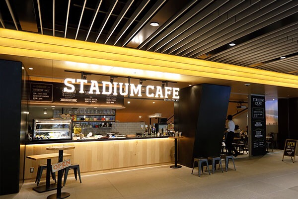
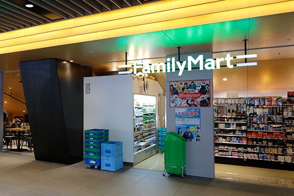

---
categories:
- sukekiyoのLIVEレポ
date: Thu, 15 Nov 2018 11:30:00 +0000
slug: post-12166
tags:
- LIVEレポ
- sukekiyo
title: 【ライブレポ】sukekiyo二〇一八年公演「マニアの詩姦 -漆黒の儀-」2018_11_6@日本青年館
---

本日も雨降りのsukekiyo日和。建て直された日本青年館からsukekiyoの新たなツアー「マニアの詩姦-漆黒の儀-」が始まります。会場限定の音源や、かつて発売されたデュフューザーの復刻などなどステージ以外にも見所が盛りだくさん。

個人的には、初めての是空席。ということで本日はsukekiyo「マニアの詩姦-漆黒の儀-」のライブレポです。

<!--more--> 

<h2>ライブレポ</h2>

二階席から見下ろすステージ、京の前にはセットリストを含め4枚のカンペが置いてありました。蛍光色の文字で書かれたそれを見ながら歌う場面もありましたが、全曲の歌詩が書かれているとは到底考えられないので「あやしい」曲だけ書き出されていたのではと思われます。

<h3>冒頭の動画について</h3>

２階からだと紗幕に映像が映っていたのがよくわからなかった。また、ところどころ場内アナウンスと被って中断されたりなどで全体をちゃんと把握することができなかった。

話題は新潟について唐突に話していたり、天気の話だったり。

京「15日に発表できれば。でも間に合わないか。」
Yuchi？「新潟いきたい」
？「新潟いつも天気わるい」
京「ブラウン管テレビ使いたい。今度のイベントで使いたかった」
？「ギターにノイズが入ってしまう」
京「二郎が好きで、DIRで新潟行ったときに二郎あるでーみたいにメンバーに煽られた。（新潟のレインボータワー？？のはなし？？）
ケンタ、マック、モス

市川クラブジオの話。よくPA宅にいるバンダナ巻いた人。ジオ立ち上げた店長？？ドキュメントに出てる（よく見てるw）

匠「リリースしたい」
京「ジャケットにデモバージョンて入れるの忘れた」

多分ここで最初に戻った模様。20分くらいの動画みたいです。

京「今日ダメージジーンズはいてるね。（匠）」
匠「秋だけど暑いので」
京「めっちゃ寒くない？」
Yuchi「そうっすね」

※国際フォーラムで流れる映像とはことなる内容のようです。確か全部違う映像にするみたいなことをどこかで言ってた気がします。

<blockquote class="twitter-tweet" data-lang="ja">
sukekiyoリハスタート致しました。 2日あるところはメニューと演出を変える予定です。 あとBGMを無くし、その間、公演が始まる前はメンバーのインタビューを流そうと思ってます。全ての会場、全て別のインタビューを流す予定です。今回が終わればもうやらない曲も結構出るのかなと思っております。  京 <a href="https://t.co/uHoCV77YKK">pic.twitter.com/uHoCV77YKK</a>
&mdash; 京 (@kyo_official) <a href="https://twitter.com/kyo_official/status/1057521875033772033?ref_src=twsrc%5Etfw">2018年10月31日</a></blockquote>

あと、アンケートとってみて毎回やってた曲が低かったりして京はちょっとショックだったらしい。
こっちは毎回やってるのに、お客さんからしたら「まぁたこの曲ぅ？だっるっぅう」って思ってたらやだなぁ。みたいな。

<blockquote class="twitter-tweet" data-lang="ja">
11月のsukekiyoは一応『ADORATIO』の最終公演なんですが、折角投票してもらったので『ADORATIO』以外の上位の曲もやりたいと考えています。しかし、全てをやるにはなかなか時間が足りないので各公演で少しずつ割り振り、少しでも喜んでもらえるよう精進いたします。  京
&mdash; sukekiyo (@sukekiyo_band) <a href="https://twitter.com/sukekiyo_band/status/1052084811332968448?ref_src=twsrc%5Etfw">2018年10月16日</a></blockquote>

<h3>セトリ</h3>
elisabeth addict(Acoustic Ver.)
グニャ結論。そして血眼。
襞嘔
zephyr
死霊のアリアナ
擬似ネクロマンサー
艶
kisses
純朴、無垢であろうが
マニエリスムな冷たい葬列者
首吊り遊具
されど道連れ
耳ゾゾ
黝いヒステリア
鵠
focus
anima
嬲り
白濁

<h3>メンバー衣装と演出</h3>

京はベレー帽、いつものスキニーパンツにシャツ•ジャケット•サスペンダーはマダラニンゲンの新作と思われる。髪の毛はピンク、口周りは赤くはみ出した感じ。

UTAは多分つなぎにジャケット、ブーツ。つなぎはオレンジ色？のように見えた。何かしらのプリントがされているようなものだった。髪の毛はストレートで丸みのあるシルエット。

匠はドレッド？詳細は見えず。
Yuchiはライダースに腰あたりにUTAのつなぎと同じ様なガラ、もしくは色の布をつけていた。
未架は髪の毛がわりと遊んでた。短くなってた。服はおそらくマダラニンゲンのもの。

セットは全体的にいつも通りの満載感があるものの、若干整理されてるような気がした。

常時紗幕が降りており、ラストの白濁まで上がることはなかった。ステージのバックにはモニターが3台。そこにあらゆる映像が映し出される。またメンバー5人の個人カメラもあり、それぞれのメンバーが映し出されていた。若干Yuchiの映像だけラグがあるように感じた。

なお、開演のブザー後には東宝ならぬ京宝のクレジットで、モノクロの昭和時代劇の様な映像が流れ今回のツアー概要の説明(になってるのかは不明)がなされた。

<h3>是空席</h3>
初めて是空席だったんですが、2階席の最前で久しぶりにステージの全体感を堪能できました。
なお、お土産はグラスでした。

なお、2階からは開演前の動画がかなり見づらく最初投影されていることすら気がつきませんでした。

<h3>脳みそをハックされる感覚</h3>

視覚聴覚から入ってきて脳みそをハッキングされてるような感覚。見えてる、聞こえてるんだけど見えなくて何を見ているのかすら、わからないような錯覚。聴こえていたはずなのに気がつくと違うところに意識がもっていかれる感覚。

これを待ってた。sukekiyoホール公演の醍醐味はここにあると思う。意識が朦朧とするのとも違う。意識が消失する。

ライブ自体は起承転結がしっかりした映画を見ているような印象だった。とにかく１つ１つの曲を歌い上げきるようなライブだった。

ずっと詩姦とはどういう意味なのか？を考えていた。ADORATIOの集大成として、それを過去のものとして先に進むために、既に死んだものとしてそれをさらにイジる。だからシカバネヲカンスルなのかと思いました。ADORATIOを大々的に讃える形で終わらせるのであれば、マニアの礼拝などになっていてもおかしくなかったのではなど考えてしまいます。

だから、冒頭インタビューで「早く次の曲をリリースしたい」や京がTwitterで「今回のツアーを最後に演奏しなくなる曲もあるかも」など発言していたのかななど考えたりしてしまいます。

<h2>グッズ</h2>

グッズ販売は15時からでした。目玉は会場限定音源。そしてマダラニンゲンの新作も発表されました。

また、待ち望んだルームディフューザー、の詰め替えが発売されました。また、同じ香りで服に付けられるタイプのミストも発売されました。

ぼくはこちらを購入しました。もっとでかく、そして毎回販売してほしい！

<h3>会場限定音源作品「kisses」</h3>
やっとTシャツとの抱き合わせ販売じゃなくなったのは個人的に歓喜。数がかなり限られているようで人数分はなさそうでした。購入にはチケットが必要で、購入済みの印をつけられます。

<h3>マダラニンゲン新作</h3>
個人的には着れない系のものばかりなのでスルー。
https://twitter.com/_madaraningen/status/1059305056116236288?s=21
なお、京はこのサスペンダーしてました。

<h3>デュフューザー</h3>
前回との違いは香りの拡散のための木の方が普通のになってました。

https://twitter.com/kyo_official/status/1059694806178258945?s=21

以前は付属の木が放射状にひろがっていました。
https://twitter.com/kyo_official/status/720806648629989377?s=21

香りは多分一緒のファブリックミスト
ほのかに桃のような香りがします。

<h2>日本青年館</h2>

以前の記憶がほとんどありませんが、建て直された日本青年館は今時の施設として生まれ変わっておりました。おそらく音響はかなり良いのではないでしょうか。ベースの音が響いてくる感じ。Twitterを見ていると音圧がすごかったという印象を持つ方が目立ちました。

<h3>内部施設</h3>
カフェとコンビニが入っていて時間を潰すのも問題なさそうです。

が、入場および待機列の導線に問題がありそうです。階段も二階の通路も狭く、混み合いました。

<h3>会場内部</h3>
椅子はふかふか過ぎず、長く座っていても腰や尻が痛くならず快適でした。音響もかなりよかったです。

なお二階席最前の席の人が前かがみになるとステージが見えづらくなってしまうようでした。

なおキャパシティは1249席(1階811席、車椅子4席、2階434席)

<a href="https://seinenkan-hall.com/hall#">各座席の見え方はこちらから。</a>

動画も公開されてました。
https://youtu.be/yH70ZSIwMy4

<h3>アクセス</h3>
大江戸線方面からくると、何もありません。オリンピックに向けて工事がひたすら行われており、人通りもすくないです。

外苑前からは人通りが多く、飲食店やこんびにもあり、なんならスタバなどのカフェもたくさんあります。こちらの方がいいでしょう。

<h2><a href="https://twitter.com/s_s_p_y">しんぺー</a>はこう思った。</h2>

sukekiyoのライブはある意味DIR EN GREYよりも疲れる。体は動かしていないし、なんなら視覚も聴覚も機能してないような感じすらする。

見てるのに見えていない。なんの曲だったかわからないけど、映像がふっと突然変わってすごい怖くなった。見ていたと思った映像を自分の脳みそが認識してなくて、実は見えていなかった、見ていなかったという事実に恐怖した。

個人的には全体感を見るに徹したのでまだまだ没入感はあげられそうだった。

より、恐怖を感じに次回国際フォーラムに行きたいと思います。

と言ったところで本日は以上になります。 
おやすみなさい。 
そして、また明日。