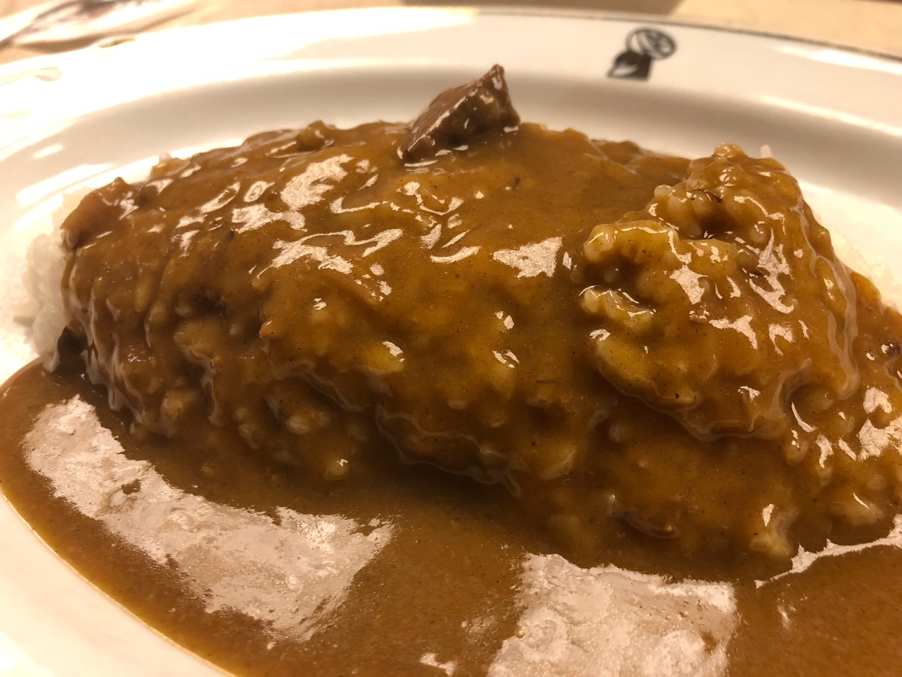

---
categories:
- sukekiyoのLIVEレポ
date: Sat, 17 Nov 2018 11:00:00 +0000
slug: post-12182
tags:
- LIVEレポ
- sukekiyo
title: 【ライブレポ】sukekiyo二〇一八年公演「マニアの詩姦 -漆黒の儀-」2018_11_15@国際フォーラムホールC
---

これで終わりsukekiyoのADORATIOツアー「マニアの詩姦 -漆黒の儀-」

激しく儚く、メタル歌謡のような曲たちに彩られ一瞬の極彩に色づく生き地獄。sukekiyoの描く耽美な世界のレポートです。

<!--more--> 

<h2>ライブレポ</h2>

今までのsukekiyoのライブは、繰り広げられる演出にのめり込み、泥沼のようなその世界観に翻弄されてきた。

しかし、その歌詩の世界に今日ほど入れた日があっただろうか。

DIR EN GREYとは異なりか弱く儚い激情に焼かれる女性の姿、それはなんとなくわかっていた。ただ、ここまで身が焼かれる様な想いが描かれていたことに始めて気がついた。

<h3>冒頭の動画について</h3>
今回のツアーでは毎回開場から開演までメンバーの会話シーンの映像が流された。

印象的だったエピソードは「スタッフの話」と「食べ物の話」

まずレコーディングスタッフのとある人の言動に腹が立っているという話。もっと仕切ってほしいという流れから、志村けん？のモノマネをすぐにするということや、割と悪口(笑)というかイジリが連発。

喋りかけると毎回、「なんですか？」と聞き返され、黙っていると話し始めるから絶対に聞こえてる。あれすっごいストレス(京)

なんですか？って言った後に一呼吸おいてから、まじめに喋り出す。(匠？)

食べ物の話。DIR EN GREYの海外ツアーでホテルにピザを運んでもらったら切れてなかった。しかも何回か。その度にちぎって食べたから、最後冷たくなってた。(京)

やっぱり日本のおもてなしはすごいですね。海外はハーフアンドハーフとかないんでしょうね。(匠？)

有楽町と東京駅の間くらいにあるカレー屋によくいく。俺カレーの中でインディアンカレー一番好き。カレーとパスタしかなくて、いつもカレー頼む。失敗したら怖いからパスタ頼めない。(京)

<h3>セトリ</h3>

https://twitter.com/sukekiyo_band/status/1063043504778047488?s=20

<h3>メンバー衣装と演出</h3>

今回はあまり見えなかった。おそらく京は初日と同じ格好で全身マダラニンゲン。他のメンバーはよく見えず。

なお、冒頭の映像は映画泥棒のようにライブ中のマナーについてのと、マダラニンゲンの宣伝、そして今回のツアー共通の昭和時代劇のような動画。

時代劇動画は、初日に見たものと少し違っているような気がしました。

<h3>次回公演情報</h3>

来年2/18、2/19の2日間ライブがありす。

また、開演前動画でちらっと言ってましたがレコーディングも始まるようです。もしかしたら、来年のライブにはアルバム発表などあるかもしれません。

https://twitter.com/sukekiyo_band/status/1063060171125977088?s=20

<h2>感想</h2>

死霊のアリアナまでは、夢うつつ。現実の世界観の境界をゆらゆら。

斑人間のYuchiのベースで覚醒。やはりぼくにとってIMMORTALISこそ青春ということに気がついた。そこからのmamaまでの流れは、心を洗われるかのようだった。カタルシス、目を細めておぼろげに見る舞台に生きてることへの感謝やら、自分にも天命のようなものがあるんじゃね？とか本当に感じました。

そして、「ただ、まだ、私」の映像のラストがかっこよすぎて鳥肌がたった。

歌詩や映像、ライブの仕様

それら全てを何か理論に基づいて構築されているわけじゃないと思うけど、それらを京が考えてメンバーと表現してスタッフ共々ライブを作り上げて、全てが合致して今日があると思うと信じられない。

ひたすら鳥肌がたつ。前後するが、このあたりから目の前を妙齢の女性の姿がチラつく。当然そんなわけないんだけど、sukekiyoで歌われる歌詩の中の女性が具体化しだすような感じで、唐突に歌詩への理解がぼくの中で始まりました。

明らかに見返りも、何もありえない、希望が皆無の状況。でもそこから抜け出せない。いつも一瞬だけ極彩に色づく地獄にいる。そんな感じ

このままsukekiyoの世界観入ったら、女友達に「がんばれ」と応援する立場で肩をたたく妄想から抜け出せなくなって、自分も泣くみたいなそういう妄想から抜け出せなくなる。なお、この時自分も女性化している。

そういう意味ではsukekiyoは女子力たかまるライブだわ。

愛した横顔
見上げる瞳は貴方の物

どうしたらこんな歌詩を男が書けるのか。

<h3>今までで一番歌詩の世界観に入り込めた</h3>

sukekiyoで描かれるのは激情と愛憎に翻弄される女性だと思ってた。でも、それは理解が正しくないかもと感じた。

「白濁」の歌詩を聴いていると、自己否定と消滅願望と実際は愛したい目の前の全てをってのを記号化して、条件変えて具体化したのがsukekiyoなんじゃないのかなと思えた。

要はDIR EN GREYの京もsukekiyoの京も歌っていることは本質的には変わらない。

<h3>国際フォーラムは青年館に比べると古い</h3>

やはりなんだかんだで、20年以上前に建てられた施設だけに、青年館と比べるとだいぶ古い印象でした。

深く沈む座席は、二時間の公演には耐えられないくらいお尻が痛くなりました。そして翌日腰にもきた。

あと音が悪い気がする。青年館がだいぶ良かったのに比べると高音が耳に刺さるくらいに感じたし、ベースの音が割と丸かった感じがする。施設側のせいではないかもだけど

<h3>インディアンカレー</h3>

開演前動画で京が言っていたカレー屋に寄って帰りました。前から知ってて何回か言ったことがある店だったのですぐわかりました。

パスタとカレーがあって、パスタはあんまりらしいのでぼくもカレーしか食べたことありません。

割と汗かくくらいには辛いので卵かなんかをトッピングした方がいいでしょう。

<h2><a href="https://twitter.com/s_s_p_y">しんぺー</a>はこう思った。</h2>

とてつもなくいいライブでした。
まだまだ足りない。本当に足りない。

https://twitter.com/sukekiyo_band/status/1063060171125977088?s=21

次のsukekiyoの世界観も楽しみで仕方ない。

と言ったところで本日は以上になります。 
おやすみなさい。 
そして、また明日。