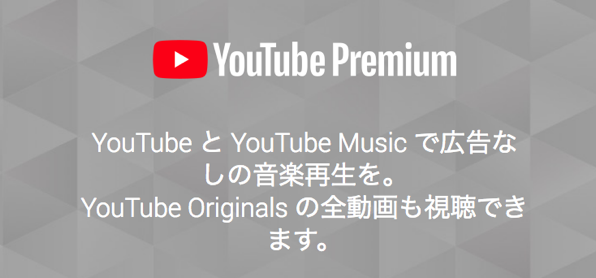

---
categories:
- youtube
date: Wed, 21 Nov 2018 12:45:00 +0000
slug: post-12190
tags:
- youtube
title: Youtube Premiumでできること。Play Musicユーザーなら即加入すべし
---

ようやく待ってたサービスがはじまりました。YouTubeの有料プランであるYoutube Premium。

結論から言うと<strong>Androidの人は普通にそんなこと前からできるよ</strong>って人がほとんどだと思います。

iPhoneでは認められた方法でそれらの機能を使うことができませんでした。
ぼく自身は、待ち焦がれておりまして、本日はそのメリットと登録に向いている人とそうでない人についての違いを明確にして、解説したいと思います。

<!--more-->
<h2>YouTube Premiumでできること</h2>

できることは6個あります。これらの機能が全部ついて<strong>月額1,180円</strong>です。
<ul>
 	<li>バックグラウンド再生</li>
 	<li>オフライン再生</li>
 	<li>広告なし</li>
 	<li>YouTube Originals</li>
 	<li>YouTube Music</li>
</ul>
それでは、それぞれ機能を紹介していきます。
<h3>バックグラウンド再生</h3>
最高。ラジオ感覚で使えます。

今までは他のアプリに切り替えると同時に再生もストップしました。また、ブラウザでYouTubeを開いてから再生させると言う方法もあるにはありましたが、アップデートのたびにそういった抜け穴は閉じられてきていました。
<h3>オフライン再生</h3>
これを待っていました。家のWiFiでダウンロードすれば通信容量が減らないし、低いプランに変更して節約できるかもと期待しておりました。

予想は的中、これで通信制限をきにするきとなく見ることができるようになりました。

ただ、ダウンロードが自動でできないため、お気に入りのチャンネルの動画をすぐにみることができません。ダウンロードの予約とかできるようになると一気に使い勝手がよくなりそう。
また、端末に保存したオフラインの動画にはコメントをつけることができません。
<h3>広告なし</h3>
この機能自体は個人的にどうでもいいかなと思っていたのですが、思った以上に動画がすぐに再生されて驚きました。
途中で広告が挟まれることもないので、集中してみることができます。

また、広告が入らなくてもクリエーターにちゃんとお金は落ちてるらしいです。

あと個人的には、たまに面白い広告があったりするのでそういうのが見れなくなるのは若干寂しい気がしないでもない。
<h3>YouTube originals</h3>
人気ユーチューバーが作った有料会員向け動画が見られるというものです。

正直全くいらない。素人のドラマ的なものとかあんまり興味なし。まぁ人気ユーチューバーのファンにとっては良いのでしょうが。

蛇足ですが、おそらくワタナベマホトがUUUMに所属したのもこの流れなのではと思ったり。そのうちOriginals限定でライブ映像とか公開しそう。
<h3>YouTube music</h3>
YouTube上のミュージックビデオを聴ける音楽アプリです。
動画の有無が選べて再生ができます。

ただ、個人的には使い物にならないと感じました。DIR EN GREY出てこないし、歌ってみた系まじってるし、自分の音楽データを預けられないし。

Google Play musicの代替にはなりませんでした。

YouTube Music

開発元:Google LLC

無料

posted with<a title="アプリーチ" href="http://mama-hack.com/app-reach/" target="_blank" rel="nofollow noopener">アプリーチ</a>

<h2>月額料金1,180円は高い？</h2>
これで月額1,180円です。
ふつうにこれだけで、この金額は高いと思われるでしょう。
(なおファミリープラン600円、最大6名まで追加)

ただし、ぼくは即加入しました。というのも、普段Google Play Musicの有料プランを利用しており、月額980円(安い時に申し込んだので永年780円)支払っていました。
<h3>Google Play Music有料版を使ってる人は即加入して良い</h3>
YouTube Premiumに加入すると、このGoogle Play Musicも自動でついてきます。ホームページに書かれていないのでわかりにくいですが。

Google Play Musicは自分の持ってる音楽データをクラウド上にアップすることで、ストリーミング再生をすることができます。ぼくは手持ちの曲はiTunesに入れるのと同時にクラウドにもあげています。そのため、iPhoneに入れていない曲でも外で聴くことができます。

なので、ぼくはすぐに加入しましたし、割高だとは一切思いませんでした。

<a href="https://play.google.com/store/music?hl=ja"> Google Play Music</a>
<h2><a href="https://twitter.com/s_s_p_y">しんぺー</a>はこう思った。</h2>
オフライン機能運用がとにかく難しい。お気に入りのユーチューバーの動画はリアルタイムでみたいし、なんならコメント欄も読みたい。でもオフライン再生じゃそれができない。

本格運用するなら定額のポケットWiFiか、テザリングできる格安Androidか。

まだまだ通信量最適化の旅は続きそうです。

と言ったところで本日は以上になります。
おやすみなさい。
そして、また明日。