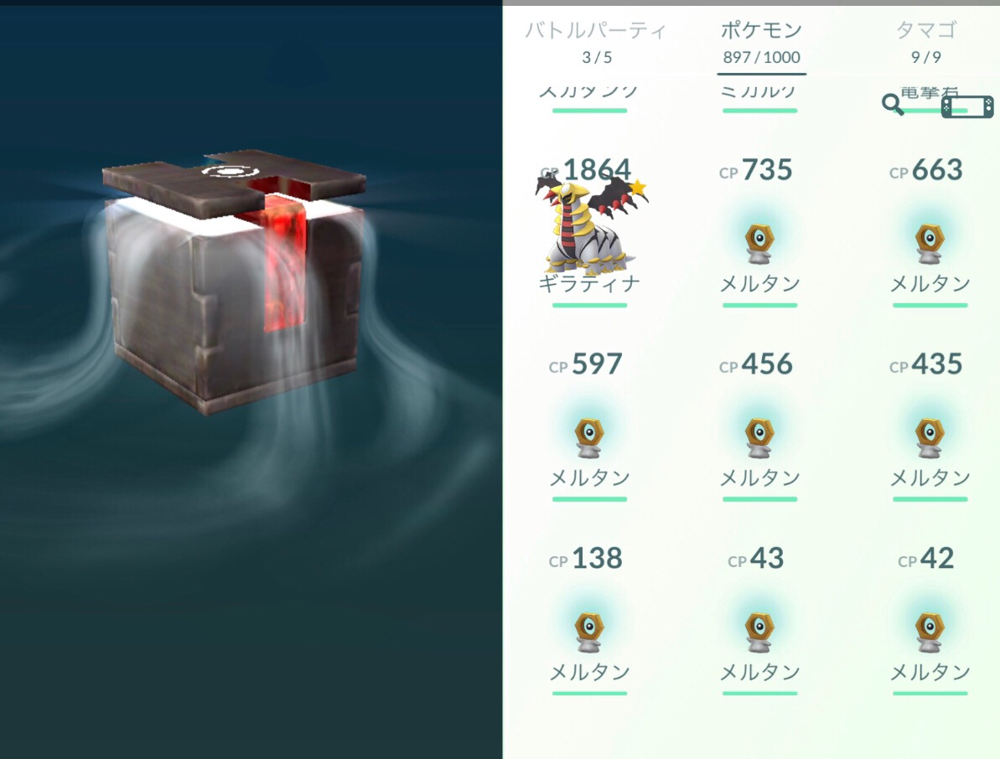
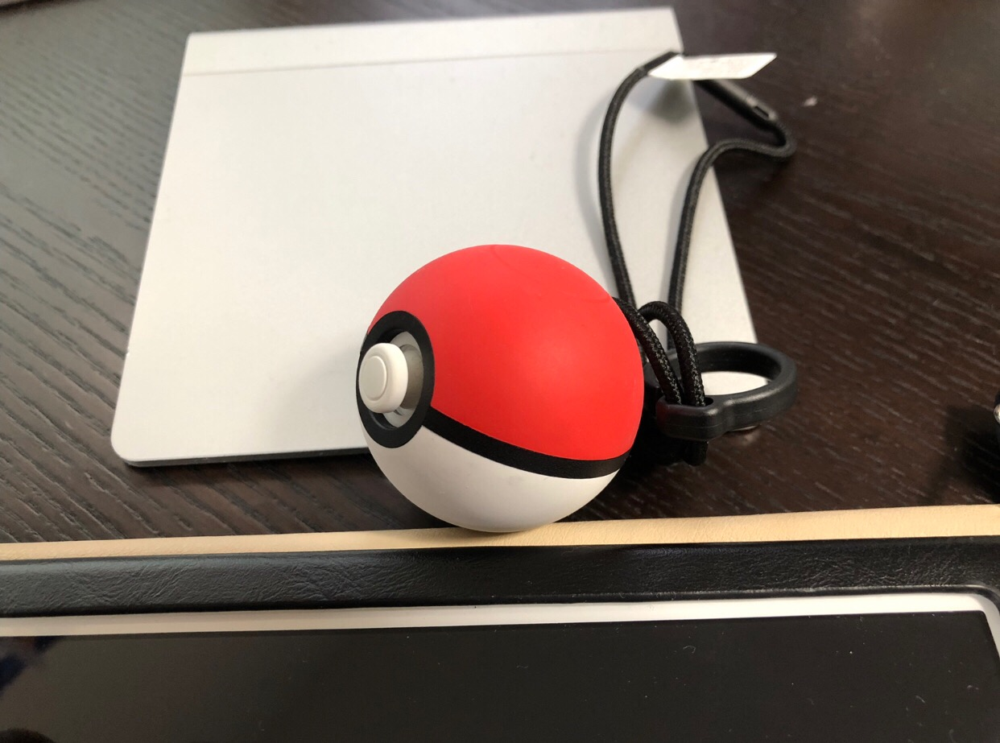
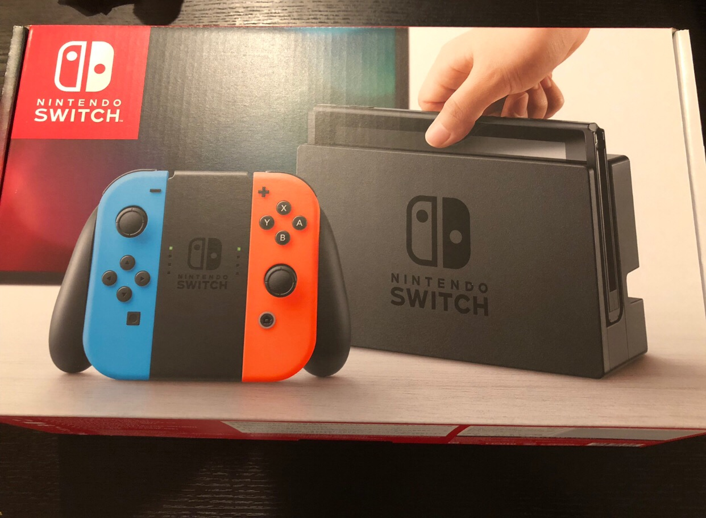
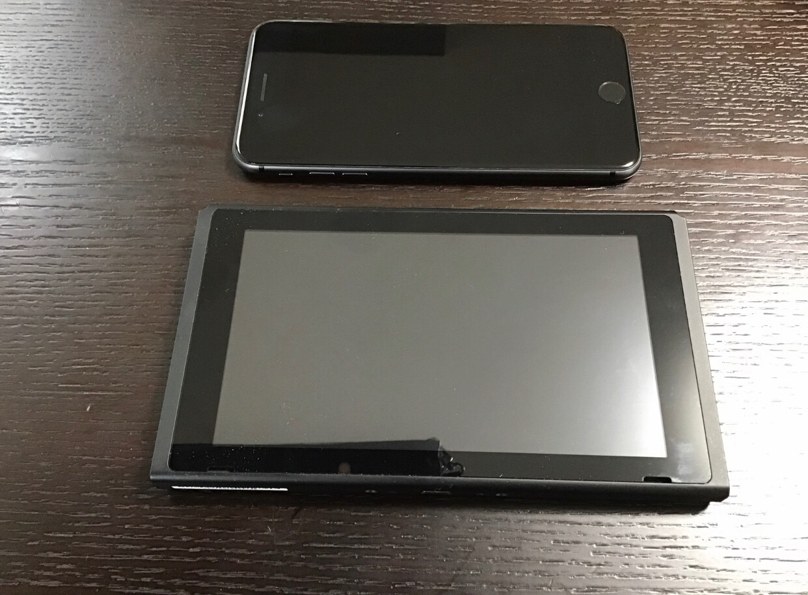
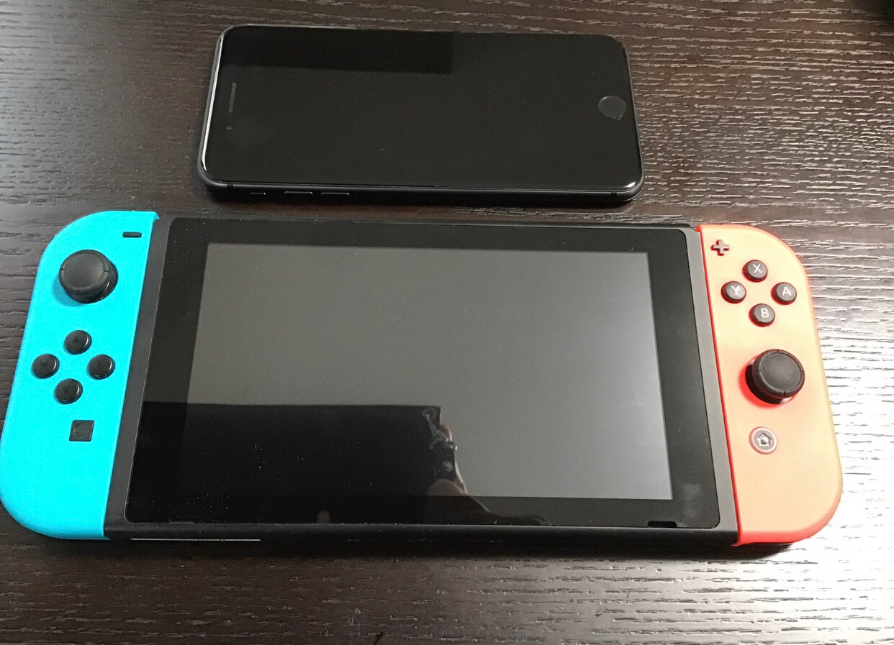

---
categories:
- ポケモン
date: Mon, 10 Dec 2018 03:00:00 +0000
slug: post-12208
tags:
- ポケモン
- ポケモンGO
title: ポケモンGOと連携可能なのでスイッチとレッツゴーピカチュウにリアル課金した
---

ニンテンドースイッチで初段ポケモンの頃に出たイエローのリメイクである「レッツゴーピカチュウ（イーブイ）」が発売されました。

ポケモンGOと連携できるらしいと聞いて本体購入してない段階で予約。スイッチ本体はAmazonのプライムナウでソフト発売に配送してもらいました。

ということで本当はスイッチとポケモン最新作「レッツゴーピカチュウ」のレビューです。

<!--more--> 

<h2>ポケモンレッツゴーピカチュウ</h2>

結論から言うと楽しい！今までは草むらを歩いていると野生のポケモンが出てきて戦闘になりましたが、今回はポケモンが視認できます。
戦闘したくなければ避ければいい。またエンカウントしても手持ちのポケモンを出して戦闘するということにはなりません。

ポケモンGOのようにモンスターボールを投げて捕獲します。こんな感じ
<iframe width="560" height="315" src="https://www.youtube.com/embed/q9xb-DCHXUM?start=45" frameborder="0" allow="accelerometer; autoplay; encrypted-media; gyroscope; picture-in-picture" allowfullscreen></iframe>

この投擲アクションもリアルで、本当にちゃんと投げないと届かないし外れます。
後述の専用コントローラーもクオリティが高くてめちゃくちゃリアルです。

<h3>他のポケモンとの違い</h3>
ニンテンドーDSとかで最新のポケモンをやってた人からするとヌルいゲームかもしれません。
<ul>
<li>ポケモンに持ち物を持たせることができない</li>
<li>たまごによる厳選がでない</li>
<li>とくせいもありません</li>
<li>てんきの変化なし</li>
</ul>

<strong>初代あたりをやってた人、ポケモンGOからはじめてピカブイをやってみようと思った人向けのゲーム</strong>ですね。

ポケモンって厳選に厳選を重ねた優性遺伝のポケモン同士を戦わせる大人の智略ゲームです。
ポケモンGOみたいにボタン連打してるだけでは済まないのです。<strong>ガチ勢は本当にガチなので、こわいゲーム</strong>なのです。

<h3>感想「とても楽しい！」</h3>
ただ、<strong>初代やっててポケモンGOやってるようなぼくにはとっても楽しいゲーム</strong>です。サンムーンこそやったことあるものの、やはり<strong>これくらいの感じがちょうどよい</strong>です。

野生のポケモンが目に見えるので戦いたくない時は、回避できるし、戦闘するにしてもモンスターボールを投げるだけでいい。とにかく作業的な要素があまり感じられないのがよいです。

<h3>ポケモンGOとの連携できる</h3>

ストーリーをある程度進めるとポケモンGOで取ったポケモンを連れてくることができます。ただし、一方通行でポケモンGO→ピカブイで、逆はできません。

また、ポケモンを送信するとポケモンGOで「<strong>ふしぎなはこ</strong>」というアイテムが手に入ります。これを使用するとポケモンGOオリジナル伝説ポケモン「<strong>メルタン</strong>」が30分でるようになります。おこうみたいな使い方です。

ちなみに、「メルタン」はポケモンGO単独でも過酷なリサーチミッションの後に1匹だけ入手できます。が、進化に400個アメが必要であり、アメ1個のために20km歩く必要があります。

ということで「メルタン」のためには、レッツゴーピカチュウが必要となるのです。

<h3>専用コントローラー「モンスターボールPLUS」</h3>

専用のモンスターボールタイプのコントローラーのクオリティがかなり高く、購入するなら絶対にこれも買った方がいい。本当にモンスターボール投げてるような感じで、重さもまさにこんな感じだろうという絶妙なサイズ。

このモンスターボールにポケモンを転送することで、ポケモンGOでも画面を見ずにポケストップを回したりできるようになります。中に入れたポケモンは経験値を得られたりもします。

<h2>ニンテンドースイッチ</h2>

Amazonのプライムナウで購入しました。販売価格は普通にAmazonで購入するのと変わらない値段でした。
配達員の方が、以前Twitterで話題になったピザの配達員のような感じで持って来たのでわらった。ってかダンボールとかじゃなくて、パッケージむき出して配送されるんですね。表面がちょっとざらついてたから、棚の上で埃かぶってたのかな。

<blockquote class="twitter-tweet" data-lang="ja">
雨で暇だったからいつでもピザ頼んだ気分になれるキット作った <a href="https://t.co/VDdHMonbaf">pic.twitter.com/VDdHMonbaf</a>
&mdash; 妖薙 (@Yo__na) <a href="https://twitter.com/Yo__na/status/1023172019112701952?ref_src=twsrc%5Etfw">2018年7月28日</a></blockquote>

関連でこの動画が面白い
<iframe width="560" height="315" src="https://www.youtube.com/embed/-SRBdAFYeC0" frameborder="0" allow="accelerometer; autoplay; encrypted-media; gyroscope; picture-in-picture" allowfullscreen></iframe>

<h3>想像以上に小さい</h3>
箱をあけてびっくり。コントローラーを装着していない状態だとiPhone8plusとあまりかわらない大きさ。

コントローラーをつけるとそこそこの大きさです。昔のプレイステーションポータブルを思い出す。あれよりも大きい気がするけど。

<h3>コントローラーが折れそうで怖い</h3>
コントローラーをつけた状態で片手持ちすると、なんか折れそうで怖い。なんならちょっとグラグラするしw
取り外しできる前提なのでしょうがないのだろう。

<h3>レトロゲームできない</h3>
ポケモン以外に期待してたのが、スーパーファミコンソフトとかやりたいなーと思っていました。
ただし、購入してみてわかったことなのですが、バーチャルコンソールには対応してないっぽい。戦略的なものなのかわかりませんが、スーファミソフトやりたかったらニンテンドーDSとかじゃないとダメみたい。

MOTHER2とか風来のシレンとかやりたかったー。

スイッチ単体でできるとしたらファミコンのマリオくらいでした。
これはこれで、久しぶりにやったら最初のクリボーで死んだから老いとは怖いものです。

<h2><a href="https://twitter.com/s_s_p_y">しんぺー</a>はこう思った。</h2>
今回はあくまで、ポケモンGOに対するリアル課金です。そろそろポケモンGOにも対人戦の機能が導入されるらしいので、リアルに街なかで目があって、テクテク歩いて来てバトル〜ってことが起きそうですwww

とりあえずメルメタルに進化できたら、高く売れるうちに本体ごとメルカリに出さねば！予定していなかった出費で、なおかつ色々買いすぎてしまったのでボーナス想定以上に残らない・・・来年貯金できるようになんとかしないと！！！

に、してもポケモンの対戦ってやっぱり面白い！個人的にはミュウツーとか伝説とか使いたくないし、なんなら皆んな判で押したように同じ強うポケモン使うのもいやなんだけど、使わないと対戦勝てないし。そこが悩みどころです。ハマりたいんだけど、ハマりきれない部分でもある。

もしかしたら、そのうちDS買ってポケモン買って対戦のためにやっちゃうかもしれないけれども・・・

まーでも、来年は大好きなゲーム「METRO」の続編でるし、それ用に購入した（まだ届いてない）Mac miniを設定しなければいけないし、やはり無駄にお金を使ってる余裕はない！！本気で金を貯めるぞ！！

と言ったところで本日は以上になります。 
おやすみなさい。 
そして、また明日。