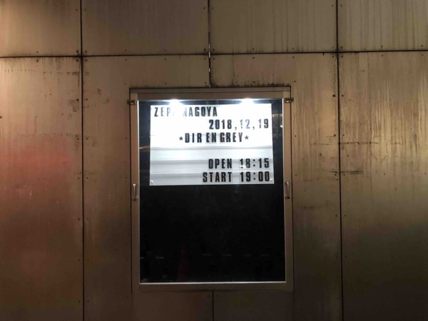
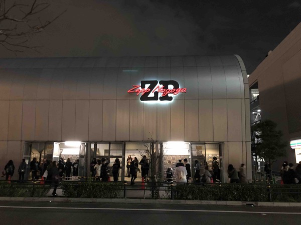
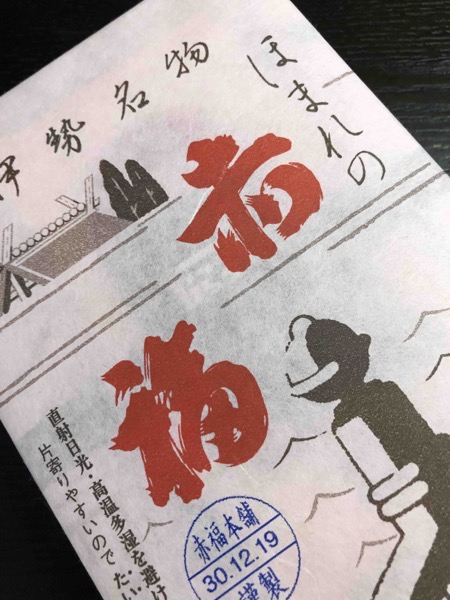
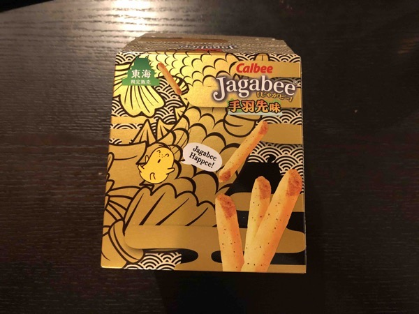

---
categories:
- DIR EN GREYのLIVEレポ
- TOUR18 FOLLOWERS
date: Sun, 23 Dec 2018 00:35:00 +0000
slug: post-12222
tags:
- DIR EN GREY
- LIVEレポ
title: 【ライブレポ】DIR EN GREY TOUR18「FOLLOWERS」-a knot＆online限定-2018_12_19@Zepp Nagoya
---

だいたい関東というか東京周辺しかライブに行かないぼくですが、今回は年内ラスト、かつファンクラブ限定ツアー、さらにこれを逃すと次が3ヶ月先のツアー「The Insulated World」なので遠征することにしました！初Zepp Nagoyaでした！
(free-wii slumは今のところ行かない予定)

久しぶりのDIR EN GREYのライブということもあって、体がついてこれませんでした。終わってみると体中痛いし、喉も首も痛い！でもぼくにとって今年最後のライブだったので行けてよかったー！

ということで本日はDIR EN GREYのライブレポです。

<!--more-->
<h2>LIVEレポ</h2>

年内参戦できるのがこの日だけだったにも関わらず、体力がついていかず、気持ちも入りこめきれなかった。ただ、それでも久しぶりに見るDIR EN GREYは楽しかった。セトリもファンラクブ「a knot」会員限定ライブならではの選曲でよかった。

このあたりで練られたものが、来年の春ツアーに持ち込まれるのだろうと思う。谿壑のライブ終盤にもってくるようなRanunculusからTHE FINALまでの流れが、中盤に持ってこられていたりして全曲に対してフラットな雰囲気で演奏されたように思います。要はライブ全体の盛り上がりとかよりも、ファンクラブ限定ライブをとにかく楽しもう、そして年内最後そしてツアー前に身内でアルバム曲お披露目会って感じの位置付けなのかなと思いました。
<h3>メンバー衣装</h3>
※ほぼ記憶なし

いつも通りShinyaとDieがあまり見えず。Shinyaは多分いつも通りの白いお召し物。Dieはくすんだ様な色のゆったりとした布をひらめかせていた気がします。

Toshiyaは、社交ダンス部の内村光良よろしくのゆったり目のシャツに、サラサラヘアーを分けてました。

薫は紫かピンクの髪のツートンで、割と眺めでサラサラヘアーでした。短くはしないのかな。

京は髪の毛は薄い紫っぽい短髪で目の周りも黒。全身黒い服で、ロングのスカートで上も割と厚着でした。首には黒いチョーカー
<h3>セトリ</h3>
谿壑の欲
人間を被る
軽蔑と始まり
鬼眼
Mr.NEWSMAN
GARBAGE
Ranunculus
理由
Ash
THE FINAL
ROTTING ROOT
Values of Madness
Devote My Life
Chain repulsion
詩踏み

Followers
ZOMBOID
THE DEEPER VILENESS
LIE BURIED WITH A VENGEANCE
朔

本編ではメンバーもすぐにはけたし、アンコ終わりも割とすぐにいなくなったので、これはダブルアンコあるか！？と思ったらそんなことはなかった(笑)
<h3>LIVEレポ</h3>
さすがファンクラブ限定というラインナップのセットリスト
しかしながら自分の体力がついていけなかった。そこが心残り。

ただ最新アルバム収録曲達は、ライブで初めて聴くはずなのに他の曲との親和性が高く感じました。

次回春ツアーは全身全霊で臨みたいと思います。
<h2>Zepp Nagoya</h2>
【スタンディング時】計：1,864人
1階 1,600人 (スタンディング)
2階 192人 (座席)、2階 72人 (スタンディング)

【椅子使用時】計：741人
1階 549人 (椅子)、2階 192人 (座席)
※その他、座席とフロアーの組み合わせにより変動。

ロッカーは建物の外と中に1,000個ほどあるみたいです。
<h3>アクセス</h3>
名古屋駅から徒歩で行ける。大通り歩いていけばよいので迷うことはないでしょう。徒歩10分くらいです。
電車でも行けるっぽいけど、時間的にあまりかわらなさそう。
<iframe style="border: 0;" src="https://www.google.com/maps/embed?pb=!1m18!1m12!1m3!1d3261.7316792617535!2d136.8825113152447!3d35.163311980318255!2m3!1f0!2f0!3f0!3m2!1i1024!2i768!4f13.1!3m3!1m2!1s0x6003772013375053%3A0xe15edf97c3c77d3d!2sZepp+Nagoya!5e0!3m2!1sja!2sjp!4v1545522068482" width="600" height="450" frameborder="0" allowfullscreen="allowfullscreen"></iframe>
<h3>周辺環境</h3>
ライブ会場周辺はすっごい綺麗。時間を潰す商業施設は、飲食店もカフェもあるしお台場みたいにどこに入っても観光客で溢れてて入れないとかない。とにかく最高の環境です。

&nbsp;
<h2>名古屋</h2>
初めてZepp Nagoyaというか、名古屋駅降りたの初めてでしたわ。
駅周辺は栄まくってて繁華な雰囲気、飲食店も多数。ロッカーもたくさんあって、ユニクロも近くにあってとても良い環境でした。

新幹線も大阪とかに比べると近いし、今後平日でも普通に来れることがわかったので参戦の選択肢に入れようかと思います。
<h3>東京名古屋間の新幹線交通費</h3>
東京からだとのぞみ指定席で10,690円でした。
多分東京からなら自由席でも問題なく座れるんでしょうが、指定席でしか新幹線乗ったことがない。ってか遠征しない芸人のため新幹線乗った多分4回目くらい？なのでよくわからん。

ちなみに帰りは好奇心からグリーン車なるものに乗ってみました。鉄道系YouTuberスーツ氏の影響です。
14,480円でした。

行きの普通席はかなり狭かったのですが、それに比べるとグリーン車はとても広くフカフカな椅子でした。椅子をちょっと倒しても後ろの人の迷惑にはならなさそうでした。大阪とかそれくらいの距離に日帰りで行くとかだったら乗る価値はあるんじゃないかなと思いました。
<h3>名古屋のお土産</h3>
なお、なごやのお土産に関して人に聞いたら「赤福」や手羽先系のじゃがりこがおすすめと言われたので、購入しました。

赤福は好きなので自分で消費するつもりでしたが、けっこうボリュームがある上に、なまものなので1人で食べ尽くすのはシンドイです。これを書いている時点でまだ2つくらいしか食べたられておりません。

<h2><a href="https://twitter.com/s_s_p_y">しんぺー</a>はこう思った。</h2>
前述の通り遠征しないかつ、年末で行けるか微妙だったので迷っておりました。
が、次のLIVEが3ヶ月も先なのはちょっと耐えられそうになかったのと、アルバムの世界観をどうしても早く体感したかったので思い切ってみました。

でも正解。Zepp Nagoyaとてもいい場所でした。

それとZeppってどこもバーが多いのねってのがわかった。
あとは次のツアーを全力で臨むためにも体力づくりに励みたいと思います。

なおぼくの今年のLIVEもこれで終わりです。
今年は12回ほどだった様です。

<a href="https://www.warawareotoko.com/2018/01/16/post-11491/">【ライブレポ】sukekiyo二〇一八年公演「嬲り地獄」2018/01/14@横浜BAY HALL</a>
<a href="https://www.warawareotoko.com/2018/01/21/post-11500/">【ライブレポ】sukekiyo二〇一八年公演「嬲り地獄」2018/01/19@HEAVEN'S ROCK さいたま新都心</a>
<a href="https://www.warawareotoko.com/2018/01/29/post-11508/">【ライブレポ】sukekiyo二〇一八年公演「嬲り地獄」-ハロウィン殺しの深闇の儀-2018/01/27@渋谷duo MUSIC EXCHANGE</a>
<a href="https://www.warawareotoko.com/2018/02/16/post-11556/">【ライブレポ】sukekiyo 二〇一八年公演「嬲り地獄」-漆黒の儀-@マイナビ赤坂BLITZ</a>
<a href="https://www.warawareotoko.com/2018/04/19/post-11636/">【ライブレポ】DIR EN GREY TOUR2018 真世界2018/04/18＠新木場スタジオコースト</a>
<a href="https://www.warawareotoko.com/2018/05/15/post-11673/">【ライブレポ】sukekiyo二〇一八年公演「逆襲の嬲り地獄」-漆黒の儀-2018/05/14@CLUB CITTA'</a>
<a href="https://www.warawareotoko.com/2018/06/30/post-11824/">【ライブレポ】DIR EN GREY TOUR2018 真世界-「a knot」only- 2018/06/29＠新木場スタジオコースト</a>
<a href="https://www.warawareotoko.com/2018/08/07/post-11914/">【ライブレポ】DIR EN GREY TOUR18 WEARING HUMAN SKIN -｢a knot｣only- 2018/8/7@CLUB CITTA’</a>
<a href="https://www.warawareotoko.com/2018/08/25/post-12034/">【ライブレポ】DIR EN GREY TOUR18 WEARING HUMAN SKIN 2018/8/24@国際フォーラム</a>
<a href="https://www.warawareotoko.com/2018/11/15/post-12166/">【ライブレポ】sukekiyo二〇一八年公演「マニアの詩姦 -漆黒の儀-」2018/11/6@日本青年館</a>
<a href="https://www.warawareotoko.com/2018/11/17/post-12182/">【ライブレポ】sukekiyo二〇一八年公演「マニアの詩姦 -漆黒の儀-」2018/11/15@国際フォーラムホールC</a>
【ライブレポ】DIR EN GREY TOUR18 FOLLOWERS -a knot＆online限定-2018/12/19@Zepp Nagoya

そういやDIR EN GREY
アルバムが今くらいに発売になって、きっとそれまではライブなんてほとんどないんだろうなーとか思って頃がありましたよね〜

来年も頑張るぞ！！

と言ったところで本日は以上になります。
おやすみなさい。

<iframe style="width: 100%; max-width: 660px; overflow: hidden; background: transparent;" src="https://embed.music.apple.com/jp/album/the-insulated-world-radio-edit-ver/1436680435" height="450" frameborder="0" sandbox="allow-forms allow-popups allow-same-origin allow-scripts allow-storage-access-by-user-activation allow-top-navigation-by-user-activation"></iframe>

[itemlink post_id="12239"]