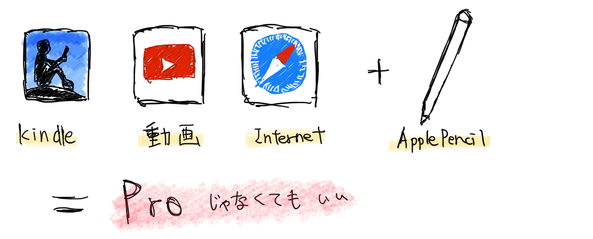

---
categories:
- iPad
date: Fri, 04 Jan 2019 12:00:37 +0000
slug: post-12274
tags:
- iPad
title: 一般人にPro必要なし！素人は無印iPadでじゅうぶん
---

さんざにってますが2017年12月ほぼフルカスタマイズをしたMac Book Proを盗まれました。その後、メルカリにて中古でiPad Proを購入して自宅で利用しておりました。しかしながら気がついたのです、何かのプロではないぼくに、Proと冠するものは必要ないと。

今日はそういう話。

<!--more--> 

<h2>そもそもプロじゃない素人にProは必要なかった</h2>
やることといったら動画視聴、ネット、kindleくらい。あとはブログ書くくらい。

動画編集、プログラミング、画像加工。したいなーという希望はあっても、ぜんぜんしないんだから、ぜったいにProは必要ない。

仕事で使うわけじゃないだから必要ない！！

それに気がついてしまったぼくは無印iPadをビックカメラで購入しました。

多分多くの人にとっては<strong>Proは必要ない</strong>と思います。

<h3>Proが必要ない人「動画視聴、ネット、Kindle」</h3>

iPadやMacを買ってやることが、「動画視聴、ネット、Kindle」だけって人はPro必要ありません。

Apple Pencilを使いたいって人も、今の無印iPadなら対応していますのでそれもProを買う理由にはなりません。

家に帰ってMacやiPadでやることをよくよく考えてみてください。
ぼくは特に平日ですとMacに触ることがほとんどありません。全てiPadで済みます。

で、iPadでやってることはというとYoutubeを見るかKindle本読むか、たまにネットで調べものするくらい。

MacBook Proも必要なければiPad Proも必要ない。

ぼくにはiPadがあれば十分だし、それに<strong>Proと名のつくMacも必要ない</strong>ことがよくわかります。

<h3>無印iPadでも使えるApple Pencil</h3>
iPad Pro第一世代から無印iPadに買い替えた一番の決定だはApple Pencilが使えることでした。
ただし、一番気にしたのはその遅延について。

Youtube上で比較動画を探して片っ端からみました。

無印はProに比べるとやはりApple Pencilで絵を描くときなど若干遅延があります。その原因はディスプレイの材質にあります。

<h2>それでもProが必要な時がある。ゲームをする時だ•••？</h2>

もし、それでもProと名のつくものが必要になるとすれば、それはきっとゲームをする時
でも、だからと言って高スペックのMacをゲーム用に購入するのは間違ってる。

<strong>ゲームはWindowsでするものだから、ゲームのためならゲーミングPCを別で買う方がきっといいでしょう。</strong>

[itemlink post_id="12277"]

ただし、ぼくは敢えてMac miniを買いました。
いずれゲームをやりたいとは思っています。あと動画編集やプログラミング、画像加工もやりたい。

でも、今は必要ない。

必要になった段階で拡張するから。だから拡張できるように安いMac＝Mac miniにしました。
モニターもキーボードもついてない。ストレージも最低の128GB

今はこれで十分。

だからやっぱり、<strong>今のぼくにProは必要ない。</strong>

[itemlink post_id="12237"]

<h2><a href="https://twitter.com/s_s_p_y">しんぺー</a>はこう思った。</h2>

多分Macは2年ごとに買い替えるのがもっとも正しい運用だと思う。最新のスペック（主にプロセッサ）を最安で手に入れるには、下取りに出して買うが賢い。

ただ、ぼくはこれ10年使う覚悟で買いましたがwww
ヒカキンは仕事で使うものなら一番高いものを買うって言ってたけど、ぼく仕事で使わないしwいいのいいのぼくはこれでw

<iframe width="560" height="315" src="https://www.youtube.com/embed/5rVcO7RCaus" frameborder="0" allow="accelerometer; autoplay; encrypted-media; gyroscope; picture-in-picture" allowfullscreen></iframe>

ようやくそういう心境になれました。シムシティやってても、序盤で人口が少ないのに警察署とか病院とかたくさん立ててしまうという。身のために合わないインフラ整備をしてしまう。

ということでぼくも色んなものを買ってきてようやく色々わかってきました。
こんな感じで賢い買い物を続けていきたいと思います。

といったところで本日は以上です。
おやすみなさい。