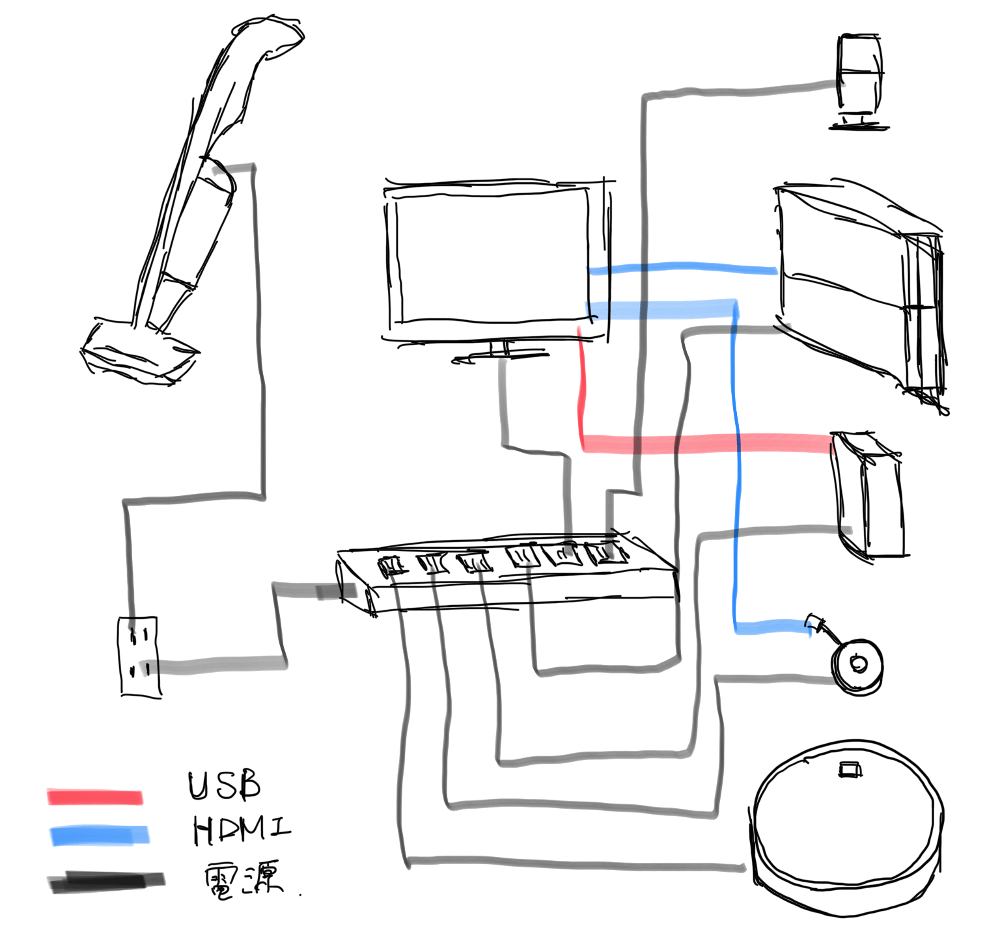
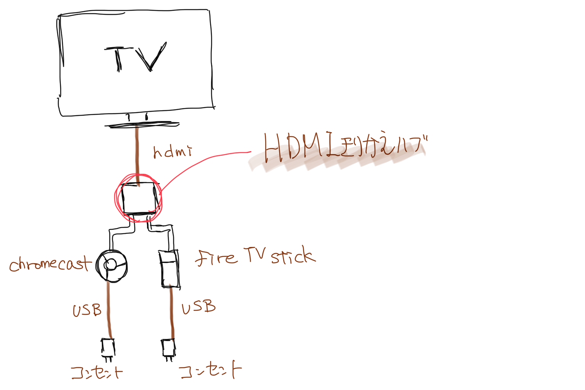

---
categories:
- レビュー
date: Sat, 05 Jan 2019 12:00:00 +0000
slug: post-12285
tags:
- Chromecast
- Fire TV Stick
- Google Home
title: HDMIを切り替えてChromecastとFire TV Stickを併用する方法
---

年末に大掃除がてらテレビの周辺環境を整備しました。

ホコリかぶってぐちゃぐちゃの配線周りも整理。ふとテレビの後ろに落ちているあるガジェットを見つけました。

AmazonのFire TV Stickです。

GoogleとAmazonが喧嘩してようつべが見れなくなり、Google Homeで音声で動画を呼び出せる様になってから全く使わなくなって忘れ去ってしまったものでした。

ただ、この正月休み中はプライムビデオを見る機会があったりして、いっちょこいつをちゃんと使えるようにしてやるかーと思ったので、そのことについて書きたいと思います。

<!--more--> 

<h2>現在のテレビ周辺環境</h2>

ぐちゃぐちゃのテレビ周辺の配線状況を整理するとこんな感じです。
ぼくの家で火事が起きるとしたらここが火元なんじゃないかってくらいコンセントが密集しています。

そのうち掃除機関係だけは別のところに移した方がいいかもです。今回はここにさらにもう一つガジェットを追加する感じですw

<h2>ChromecastとFire TV stickの併用したい</h2>
そもそも、ChromecastとFire TV Stickとは同じようなガジェットです。

どちらでもYoutubeが見れますし（昔はGoogleとAmazonが喧嘩してFire TVでYoutube見れなくなった）、Netflixも見れます。

それぞれの違う点も説明します。

<h3>Chromecastとは</h3>
[itemlink post_id="12292"]
Google製のガジェットです。かんたんに言うと、<strong>同じWiFiにつながっているスマホやPCで見ているYoutubeやNetflixなどをテレビに写せるガジェット</strong>です。

単体では操作ができず、<strong>テレビに動画を写すにはスマホやPCが必要</strong>です。

あと、<strong>Google Homeで音声操作</strong>が可能です。

「OK Google！瀬戸弘司の最新の動画を流して」ですぐに瀬戸弘司の最新の動画がテレビに流れます。

「OK Google！猫の動画を見せて」などもできます。

「OK Google！DIR EN GREYのRanunculusの動画を流して」も大丈夫

<h3>Fire TV Stickとは</h3>
[itemlink post_id="12293"]
Amazon製のガジェットです。単体でテレビリモコンで操作ができます。動画もこれだけで見ることができます。

<strong>Amazonのプライムビデオも見ることができます。</strong>ただし、Amazon Echoでの音声操作はできません。

<h3>HDMI入力が足りないのでHDMIの切替が必要</h3>
Chromecastは音声操作ができる。

AmazonのFire TV Stickはプライムビデオが見れる。

この二つを併用するためにこいうことがしたい。

で、これを叶えてくれるのがHDMIを分配して切り替えてくれる装置です。
家にあったのはこれ。やっとつかえる。

[itemlink post_id="12289"]

これ、いちいち切り替えスイッチを押しにいかないといけないのがめんどくさいです。もう少し高いやつだとリモコンで切り替えできるようなのも売ってます。

[itemlink post_id="12291"]

でも、ちゃんとやりたいように併用もできたので満足です。

<h2><a href="https://twitter.com/s_s_p_y">しんぺー</a>はこう思った。</h2>

昔買ったけど使ってないガジェットで利用できるものはどんどん利用していきたいと思います。今回使っていない2つのガジェットを有効利用することができました！うれしい！

なるべく新しく買い足さずにお金をかけずに欲求を満たせるとまた違った満足度がありますな。Mac miniの環境整備も使ってない外付けHDDとモニターを利用したので3万くらい浮いてるし、使ってないBluetoothスピーカーもあるし！！これも良い！！

まだ眠ってるガジェットが家にあるかもなので、また探索したいと思います。

といったところで本日は以上です。
おやすみなさい。