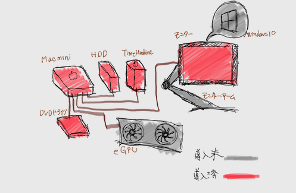

---
categories:
- Mac
date: Sun, 06 Jan 2019 12:00:00 +0000
slug: post-12299
tags:
- apple
- mac
title: 家電量販店でカスタマイズMacが買える！ポイントも貯まるしApple Storeよりお得
---

本当は家に帰った後ってからPCに触ることもあまりなくて、iPadで事足りることくらいしかしないから、買うのはまだ先でいいかなーとか思っていました。

が、年末のPayPay祭りが勃発して買う物が決まってるなら買わないと損という状況に陥ったので、いよいよ意を決してMacの購入に踏み切りました。

今回ぼくが購入したのはMac miniの2018年モデルです。本日はそのレビュー含めて、なんでMac miniを購入したのかについてご紹介したいと思います。

<!--more--> 

<h2>今回Mac購入で実現したかったこと</h2>
今回のMac購入にあたって条件は2つ

<strong>予算20万円以内</strong>

<strong>ゲーミングPCもできればほしい</strong>

これらをクリアするにあたってさんざん悩みました。

<h3>予算20万以内</h3>
ってか、できればお金使いたくなかった。貯金というかお金を残して起きたかったのが本音。

というのも、2016年にほぼほぼフルカスタマイズのMacBook Proを購入しています。そして2017年末にローンの支払いを半年以上残して盗難されました。

そこからは2010年購入にiMacを使っていました。
今のところやってることと言ったら、「動画視聴」「ネット」「ブログ書き」と処理能力がほぼ必要がないようなものばかり。何不自由ありませんでした。

なので、このままでもいいかなーとか思っていました。
ただし、さすがに9年前のMacとなるとどこにどんなトラブルが起こるかわからないのと、iTunesの起動やらデータの読み込みやらがおっそいおっそい。

なるべくお金を使わずにMacの乗り換えができたらなーと思っていました。

<h3>ゲーミングPCもできればほしい</h3>
PCゲームもやりたいなーとか最近思っていて、とくに2019年2月にでるMETROシリーズ最新作「METRO EXODUS」なんかもPCでプレイしたいとか思っていました。

そうなると割と性能がいいWindows PCを購入しないといけません。ってかゲームをやろうと思うと結構いい値段のPCを買わないとダメ。

だいたい15万円以上とか

完全にWindowsに乗り換えるつもりはなかったので、そうなるとMacとの同時購入はいきなり予算オーバーとなってしまいます。

[itemlink post_id="12301"]

<h2>決断。最安Mac miniの購入</h2>

この2つをクリアするために思いついたことは、「最安のMacであるMac miniを購入し、環境整備をしてやがてゲーミングPC化する」

これがぼくが考えついたやりたいMac環境です。

[caption id="attachment_12258" align="aligncenter" width="497"] mac miniの環境[/caption]
<h3>拡張する将来を見越して少しカスタマイズ</h3>
やがてゲーミングPC化するために、今からやっておかないといけないこと。
それはメモリの増設とプロセッサの強化というカスタマイズです。

最新のMac miniでもメモリ増設はできるらしいのですが、Appleにお願いするか、業者にお願いするか、自分でやるかなのですがどれもめんどくさそう。

プロセッサの強化。これはもうやり方が全くわかりません。できるかどうかもよくわからない。

なので、最初からカスタマイズして購入することにしました。

こちらがスペック。「METRO EXODUS」の推奨環境に多少合わせました。
プロセッサ　3.2 GHz Intel Core i7
メモリ　16 GB 2667 MHz DDR4
ストレージ　128GB
グラフィックス　Intel UHD Graphics 630 1536 MB

プロセッサとメモリの強化により89,800円→144,800円となりました。

グラフィックスだけはどうしようもないので、外付けのグラフィックカードeGPUというものを購入するつもりです。ゲームするにはこれがないと話になりません。

ただし、今は予算的にまだ購入するつもりはないのでそのうち・・・

<h3>カスタマイズMacはApple Store以外でも買える</h3>
決断の最後の背中を押してくれたのはPayPayでした。

ヤマダ電機とかの家電量販店でも使える！

そしてMacのカスタマイズは実は家電量販店でもできる！

ということでヤマダ電機で買いました。PayPayでのキャッシュバックも20％あるので、実質Mac miniを3万円引きで購入できたことになります。

ただし！家電量販店でのMacカスタマイズには注意が必要

<strong>納期不明、ポイント減額もしくは付かない</strong>

納期がいつになるかわからないと言われましたが、実際は2、3週間ほどで着ました。ポイントも本来の還元率からだいぶ減って2％くらいだったかと思います。

本来であればヤマダ電機は10％還元。クレカ払いで8％還元となっています。

<h2>PayPayの戦果</h2>

支出
Mac mini 156,384円

収入
PayPayキャッシュバック（予定額）　31,276円
クレカポイント（Amazon） 1,563p
ヤマダ電機ポイント　4,344p
さらにiMacをメルカリで3万円以下くらいで売りました。

ということでメルカリの手数料とか送料とかあるけど65,000円くらいになります。

実質Mac miniのカスタマイズを90,000円ほどで手にれられたことになります！！

いやったー！

<h2><a href="https://twitter.com/s_s_p_y">しんぺー</a>はこう思った。</h2>

いやーiMacもちゃんと処分できたし、何よりそれなりの値がついたのでさすがMac！！というところです。

次はeGPUの購入を考えないといけないんですが、これがまた高い。10万円以上は考えておかないといけません。

多分次のボーナス以降いかなー。だんだんと環境構築していく予定です！

といったところで本日は以上です。
おやすみなさい。

[itemlink post_id="12237"]