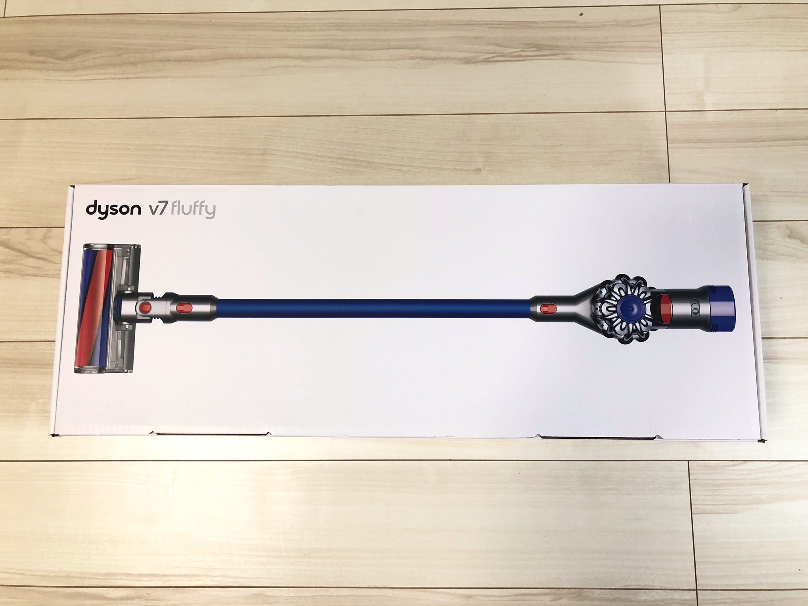
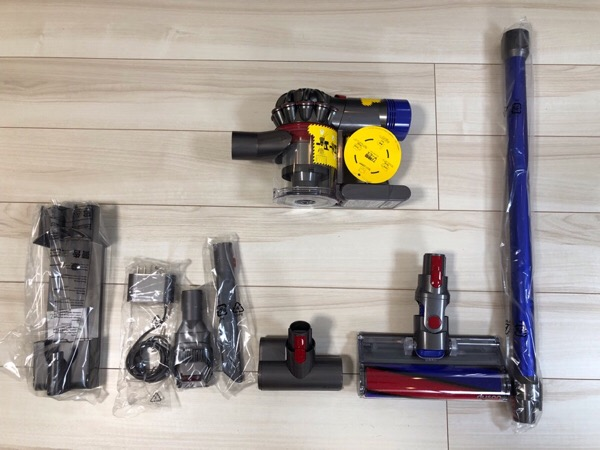

---
categories:
- レビュー
date: Sun, 13 Jan 2019 01:00:00 +0000
slug: post-12333
title: 【レビュー】初めてのダイソン！生活の質が上がってマジで最高！
---

年末のPayPay祭りのキャッシュバックが付与されました。しかしながら巷では、取り消しされる事象が相次いでいるそうです。

おそらく、ポイント目当てで購入後にキャンセルした人や家族のクレジットカードを使った人とかだと思います。そもそもクレカの規約違反だったり、PayPayの規約に違反してたりに該当するものでしょう。

ぼくはそんなことありませんでしたが、元金は一刻も早く抜いておけってウシジマくんが言ってたような気がするので、ソッコー使いに行きました。

で、何を買ったかっていうと「ダイソン（dyson v7 fluffy）」
ということで本日は、初めて買ったダイソンの開封レビューでございます。

<!--more-->
<h2>結論。ダイソンマジで最高</h2>

今回ぼくが購入したのは「dyson v7 fluffy」です。
ヤマダ電機でPayPayのキャッシュバックを使って購入。

開封後早速使ってみる。

結論。最アンド高。

ちなみに付属品はこんな感じでした。

<h3>ヘッドが生きているかのよう</h3>
ヘッドの動きがヌルヌル。生きているかのよう。

今まで使っていた掃除機がこれ。コードレスで、自走するかのような吸い付き具合はあるんだけど、ヘッドが大きくて壁際のゴミが取りにくい。

しかし、ダイソンは隅っこのゴミまで取りこぼしなく吸い込んでくれます。
<h3>軽い</h3>
だいぶ軽い。本体が手元にあるので持った時は重く感じますが、掃除を始めてみるとこの比重で全く問題なし。

軽く感じます。

今まで使ってた掃除機と比較しても重量自体軽かった。
<h3>電源もちは悪い</h3>
ただし、バッテリーの持ちが心配。がっつり掃除機をするとなるとちょっと心配です。

スペック上は強モードで6分、通常モードで30分
6分というのはあまりに短い。
<h3>若干うるさいかも</h3>
あんまり気になりませんが、うるさいと言えばうるさいかも。
でも掃除機ってこんなもんだろとは思う。マンションとかで夜中使うと場合によっては近所迷惑かも。従来の掃除機よりも高音がなってる感じがするので、その辺でうるさく感じるのかもです。

排出音自体はあんまりかわらないかなという印象。
<h2>なんで「dyson v7 fluffy」を買ったのか</h2>
で、なんでこの旧モデルを購入したかというといくつか理由があります。
<h3>本当はv10を買おうと思ってたけど止められた</h3>
昼休みにさっそく買いに行こうと思って意気揚々と席を立つやいなや、両サイドの同僚からやめた方がいいと言われましたw

1人は2年くらい使ってたらバッテリーが壊れたとのこと。バッテリーが内蔵式なので、本体交換となり数万円かかるといわれたらしい。だから設備投資としては安くないから買わないほうがいいよということらしい。

も1人からは、モデルによる優位性ほとんど変わらないから高い最新式じゃなくて旧モデルで十分と言われました。

ちなみお店の人にもモデル差異はあまりないため、v7を勧められました。
<h3>dysonから普通の掃除機に乗り換えた人の話</h3>
また、ダイソンの吸引力って別にそこまでじゃないよという意見もありました。

コードレスのため、内蔵バッテリーとなっており、その関係でか期待するようなパワーが得られないのかもしれません。

その人はダイソンから普通の掃除機に買い替えたとのこと。この辺は個人差な上に使って見ないとわからない部分ではありますが。
<h2><a href="https://twitter.com/s_s_p_y">しんぺー</a>はこう思った。</h2>
長期的に使ってみると、どうなるかはわかりませんが、今は大満足です。
生活の質が上がったことに間違い無いでしょう。

2019年最初の買い物大正解でした!

と言ったところで本日は以上です。
おやすみなさい。

[itemlink post_id="12335"]