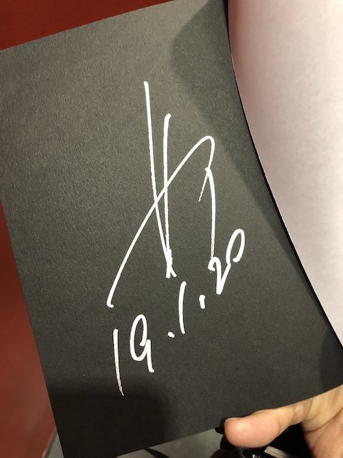
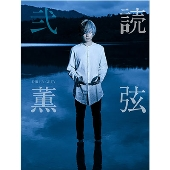

---
categories:
- 各メンバーの個人イベントレポなど
date: Sun, 20 Jan 2019 14:56:49 +0000
slug: post-12374
tags:
- DIR EN GREY
title: 【イベントレポ】DIR EN GREY「薫の読弦弐」発売記念トーク&サイン会@タワーレコード渋谷B1F CUTUP STUDIO
---

DIR EN GREYのギターの薫の「音楽と人」誌上の連載の単行本2作目を記念してタワーレコード渋谷にてトーク&サイン会が行われました。

個人的には、先日行われたフェス(DIR EN GREYの事務所主催のフェス「Free-WiLL SLUM」)には参戦しなかったので、今日が DIR EN GREY初めでした。

ということで今回は「薫の読弦弐」発売記念イベントのレポートです。

<!--more-->
<h2>「薫の読弦 弐」</h2>
DIR EN GREYのギターの薫が「音楽と人」という音楽誌にて毎月連載していたコーナーが「薫の読弦」です。

連載期間は2012年5月号から2018年1月号まで。連載開始当時はボーカルの京が喉を壊してバンドが活動休止中だった時期。

最初は半年という約束でスタートしたらしいのですご、気がつくと6年近く連載されていたことになります。

今回はその後半と書下ろし数本が収録された単行本第2弾となります。
<h2>トークイベント&amp;サイン会</h2>
渋谷のタワレコ地下一階のイベントスペースにて行われました。

人数はおそらく400名くらいと思われます。音楽と人の樋口靖幸氏とのトークイベント30分くらいの後にサイン会という流れでした。
<h3>トークイベント</h3>
登場した薫先生のいでたちは、ツートンの髪の毛から真っ黒のゆるいパーマ。ヒゲもなくてつるっつる。一番後ろ付近でも見て取れるくらいのつるっつる感。

上下黒いお召し物。腰にも何らかの布をまいていたみたい。靴はすこし茶色で白いソールのもの。本の写真で履いてたやつかな？

下手に薫、上手に「音楽と人」の樋口さん
薫を呼び込む前に髪の毛の話をしようと思ったらしいが、さすが薫先生。びっくりさせたいからととめたらしい。
<h4>トークについて</h4>
樋口氏
DIR EN GREYはみんなトークが上手い。アルバム発売のトークイベントで3人担当したけど、みんなインタビューよりもトークの方が上手い。特にドラムの人とか。
薫先生はどっちが得意？

薫
インタビューは説明もあるから、しゃべること決まってる。距離が近いのは恥ずかしい。そういえば、今日の日を選んだのはわざとですか？

樋口氏は今日がメジャーデビューの日だとは知らなかった模様。偶然とのこと。

薫
家で探してたら出てきたDATテープ持ってきたんすよ。ヒルズオブアプカリプスって書いてある。（アクロの丘）

樋口氏
もらってっていい？

薫
ダメです。
<h4>ロケについて</h4>
樋口氏
ロケの時につかったいろんなアイテムについて。あーゆー風になるんだと

薫
ただ行くだけじゃ嫌で、面白いかなと思って何でもよかった。

到着早々にブルーシート敷いて自らペンキやらスプレーで色を塗ったりしたらしい。

ロケの場所は長渕剛がライブやった場所付近で最初の写真を撮影。
その後移動して撮影

ガラスをもって座ってる写真の時はしたにダンゴムシがたくさんいて気持ち悪かった。

樋口氏
言ってくれたら殺虫剤撒きましたのに

薫
それでいっぱい出てきたら嫌じゃないですか

さらに湖に移動
到着が早すぎて30分くらいみんなで水切りしてたらしい。薫は車の中から眺めてた。その後裸足になって水に入り撮影。足が痛かったとのこと。

終わると樋口さんが食べたがってたほうとうを食べに。けっこう量があったそうで薫は全部食べきれず。

樋口さんはこれが2018年2番目に嬉しかったことだそうです。

1番は読弦のインタビューで言った新宿の焼肉屋「長春館」
ただ、生ビールが管の掃除がちゃんとできてなかったのか、臭かった。
<h4>バンド以外の創作活動について</h4>
樋口氏
自分のクリエイティブに没頭する時間はどうでしたか？

薫
バンドは5人だけど1人はなんでもあり。だけど自分ができないことはできない。その辺がおもしろい。
気にするけど、素人なんで大目に見てくださーいという感じだけど、手にとってくれた人が何か感じ取ってくれたら

樋口氏
距離感をつめたいけど、近寄りがたいバンド
けど、良い様に（薫が）距離を縮めてくれる。
だから焼肉が1番の思い出になる

薫
昔はあんまりファンにも中身を見せないようにしてた。けどDIR EN GREYを20年やってイメージが強いから、逆にこういう人たちが作ってるんだってのを見せる様にした方がいいかなと。
<h4>今後の活動</h4>
樋口氏
今後の予定は？決めてくれたらこっちもやりやすい

薫
きめても、できない

樋口氏
今、連載も穴埋めでへんな人がやってる。（薫の後にメリーのガラが受け継ぎ「独言」としてやってる）

薫
まーでも雑誌はほかにもあるからねー

樋口氏
MASSIVEだけはやめてください。くやしい

薫
でも、隔月だから（あっちの方が楽）

この辺でもうお開きムード。ただし立ち上がって、春ツアーの話を少し
ちょうど昨日メンバーとどういう曲やるかとか話した。ある人が出してきた曲が「おお」という感じだった。
<h3>サイン会</h3>
おそらく一番年上が80歳くらいの女性で一番年下が4歳くらい女の子でした。
ちなみに小さいな男の子が本を渡した時に薫先生は「おっ」と声出して「ありがとう」っておっきい声で言ってました。身を乗り出してらっしゃいました。

ぼくは、今日がDIR初めだったので「あけましておめでとうございます。今年もよろしくお願いします。」と言いました。

なんて返されたか、多分。何か言われたけど忘れた。

薫の目を見たのと階段降りる時に見た樋口さんの目しかもう覚えていない。

<blockquote class="twitter-tweet" data-lang="ja">

【<a href="https://twitter.com/hashtag/%E3%82%BF%E3%83%AF%E6%B8%8B%E3%82%A4%E3%83%99%E3%83%B3%E3%83%88?src=hash&amp;ref_src=twsrc%5Etfw">#タワ渋イベント</a>】DIR EN GREY 薫 『読弦 弐』 出版記念トーク＆サイン会
終了いたしました！サイン会では一人ひとり丁寧に対応されている姿が印象的でした&#x2728;ありがとうございました！(岩)<a href="https://twitter.com/hashtag/DIRENGREY?src=hash&amp;ref_src=twsrc%5Etfw">#DIRENGREY</a> <a href="https://t.co/wYljZfTB6p">pic.twitter.com/wYljZfTB6p</a>

— タワーレコード渋谷店 (@TOWER_Shibuya) <a href="https://twitter.com/TOWER_Shibuya/status/1086942479000059904?ref_src=twsrc%5Etfw">2019年1月20日</a></blockquote>

<h2><a href="https://twitter.com/s_s_p_y">しんぺー</a>はこう思った。</h2>
今年最初のDIRの日
メジャーデビューの日

リーダーもちゃんと覚えてて、しっかりとサインにも一人一人書いてたみたいです。

春のツアーの前に個展が楽しみだわ！！あと「読弦弐」はタワレコでしか販売しておりませんのでお買い求めは店頭もしくは通販で。

<a href="//ck.jp.ap.valuecommerce.com/servlet/referral?sid=3041033&amp;pid=885617420&amp;vc_url=https%3A%2F%2Ftower.jp%2Fitem%2F4837915%2FDIR-EN-GREY%25E8%2596%25AB-%25E3%2580%258C%25E8%25AA%25AD%25E5%25BC%25A6-%25E5%25BC%2590%25E3%2580%258D%25EF%25BC%259C%25E3%2582%25BF%25E3%2583%25AF%25E3%2583%25BC%25E3%2583%25AC%25E3%2582%25B3%25E3%2583%25BC%25E3%2583%2589%25E9%2599%2590%25E5%25AE%259A%25EF%25BC%259E%3Fkid%3Dpafvc" target="_blank" rel="nofollow noopener noreferrer">価格￥2,916</a>

と言ったところで本日は以上になります。
おやすみなさい。